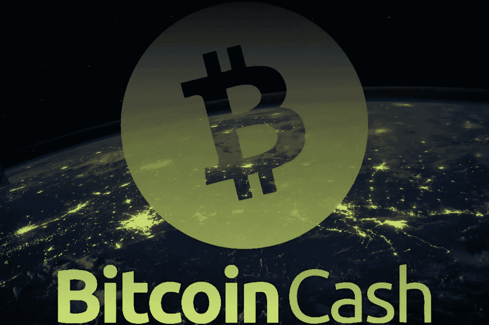
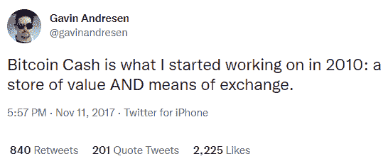
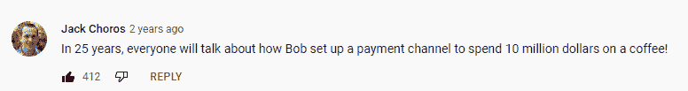
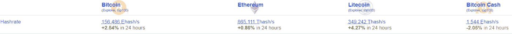

# 比特币现金的采用将提升现代数字经济

> 原文：<https://medium.com/coinmonks/adoption-of-bitcoin-cash-will-elevate-the-modern-digital-economy-3bd94847648b?source=collection_archive---------5----------------------->

*Source:* [*Unsplash*](https://unsplash.com/photos/Q1p7bh3SHj8)*, (modified)*

抛开猜测不谈，在未来的数字经济和元宇宙中，数字货币要被广泛采用，哪些特征是必要的？

早在 80 年代，甚至在互联网和移动电话迅速发展之前，Cypherpunks 就设想了一种数字货币，但他们不断面临集中化和重复支出的问题。

1998 年[戴伟](https://en.wikipedia.org/wiki/Wei_Dai)提出“ [b-money](https://web.archive.org/web/20180328204908/http://www.weidai.com/bmoney.txt) ”、[尼克萨博](https://en.wikipedia.org/wiki/Nick_Szabo)”[比特金](https://en.bitcoinwiki.org/wiki/Nick_Szabo)。

十年后，中本聪宣布将比特币列入密码学家名单，将这两个概念中的各种元素与各种密码技术结合在一起。

**比特币，一种“P2P 电子现金”**，于 2009 年被释放到大规模扩张的互联网空间，旨在成为一种主导的交易方式。a 目前具有所有权的加密证明、无中介、无控制方等功能，直接由运行软件的 CPU 生成。

然而，从一开始，一名密码学家(化名为[詹姆斯·a·唐纳德](https://bitcointalk.org/index.php?topic=628344.0))就指出，比特币肯定会遇到规模问题。这是一个真实的人还是聪背后的团队，这并不重要。

2010 年，在 Satoshi 放弃比特币项目的几个月前，发生了一件重要的事，这件事改变了比特币历史的进程，或好或坏。Satoshi 更改了代码，并引入了 1MB 块的临时限制，以应对网络上可能出现的低价值交易垃圾邮件。

# 区块大小辩论的重要性

这是事情开始变得复杂的时候，因为 Satoshi 引入的这个块大小限制是持续多年的**块大小辩论**(阅读更多: [source1](/@johnblocke/a-brief-and-incomplete-history-of-censorship-in-r-bitcoin-c85a290fe43) 、 [source2](https://www.reddit.com/r/Bitcoincash/comments/8lozww/how_bitcoin_btc_was_hijacked_and_why_bitcoin_cash/) 、 [source3](https://www.youtube.com/watch?v=UYHFrf5ci_g) )的主要原因，并以比特币社区分裂并遵循两条不同的道路而结束:BTC 和比特币现金。

两者都具有从 2009 年 genesis block 开始的相同历史，但自 2017 年 8 月以来遵循不同的逻辑和路径。

比特币现金将限制提高到 8MB(块大小:今天的 32MB)，而块流的解决方案是链上无变化，而是第二层发展，如闪电网络和液体。使用 LN，用户必须打开频道，将 BTC“转移”到闪电网络，并使用这些 LN-BTC 进行支付。

一个复杂的方法和怪异的决定，仅仅是在成功管理比特币现金的链上进行扩展。

此外，区块链拥堵时的闪电网络在成本上同样要求很高，因为打开和关闭频道需要 BTC 费用。这些是链上交易，在 2021 年 5 月，当 BTC 区块链的费用再次达到 50 美元时，多个 LN 用户表达了他们的担忧。

[*Source*](https://www.youtube.com/watch?v=rrr_zPmEiME)

闪电网络在设计上是有缺陷的，因为为了对抗 BTC 区块链收费，用户将不得不选择退出打开/关闭频道，而是使用要求信任的集中金融中心(中介)，控制资金，可以应政府的请求扣押资金，可以阻止交易，并将所有私人信息出售或传递给其他第三方和政府。

自 2015 年以来，人们对闪电网络集中化的担忧不仅仅是理论。关键是成为我们钱的主人，不要相信那些在与银行业相似的监管体系下运作的金融中心。

闪电网络只是用另一个邪恶取代了一个邪恶。同时，解决方案很简单，增加块大小，并在链上扩展。然而，现在为时已晚，BTC 最高纲领主义者的议程并不支持我们经常观察到的任何此类讨论。

# 花旗集团相信高效快捷的区块链的潜力

> “我们相信区块链和数字资产的潜力，包括效率、即时处理、细分、可编程性和透明性的好处。”
> 
> *来源:* [*【彭博*](https://www.bloomberg.com/news/articles/2021-11-22/citi-to-hire-100-in-digital-assets-push-under-puneet-singhvi)*(11 月 23 日)。*

这句话是花旗集团高管 Puneet Singhvi 在宣布成立数字货币部门时说的，该部门计划雇用 100 名员工，旨在进一步分析和研究加密货币领域。

这里的关键词是**效率**、**即时处理**、**可编程**、**透明**。

这看起来像描述比特币现金，因为区块链网络的其余大部分无法在不牺牲其他基本要素的情况下高效扩展和即时处理交易。

区块链是一个公共账本，所以透明是大多数网络的属性，关于可编程性的最后一部分可能指的是区块链网络提供的开源和无许可环境，尽管这一部分需要关于其含义的进一步细节。不过，银行在声明中避免使用不必要的术语。

无力应对超过数千用户的流量增长的区块链不可能成为任何金融未来的一部分。现代数字经济需要高效、即时的网络。它还要求去中心化，因为这种方法是由数字经济的用户来控制资金，而不是依靠中介(理解:[一个不信任和去中心化的元宇宙是主要目标](https://read.cash/@Pantera/a-trustless-and-decentralized-metaverse-is-the-main-objective-7f54b51e))。

# 真正的问题是

计算速度时，比较总是很重要的。然而，对于加密货币，比较不仅仅是速度。网络的安全性**足够的哈希速率**和**选区的分散化**(采矿、开发、交换等)。)和高速低费同样重要。

BTC 的开发是在 Blockstream 的控制之下，block stream 是一个推动其私有二层议程的私有实体。

另一个例子是 Solana(以前的 IOTA ),它提供了一个速度极快、费用低廉的网络，但是它是大规模集中的。Solana 的开发人员简单地关闭网络来修复错误，它保持离线 17 个小时。这与几年前 IOTA 发生的事情类似。

许多其他提供高速和去中心化的网络证明它们是不安全的，51%的攻击是通过租用的 hashpower 实现的，攻击者只需花费几百美元。([来源](https://dci.mit.edu/51-attacks))

如今，比特币现金的哈希值为 1.5 艾哈希，超过了莱特币和以太坊的总和(尽管 ETH 目前已部分转向 PoS，并计划完全取消 PoW)。

比特币现金**有第二好的哈希表**，而且通常，开采比 BTC 更有利可图。

Source: [Bitinfocharts](https://bitinfocharts.com/)

比特币现金的难度是根据一种叫做紧急难度调整(简称 EDA)的机制进行调整的，矿工们经常在 BTC 和 BCH 之间移动，以实现盈利最大化。

比特币现金是一个安全、分散和高效的网络，为电子商务提供了完美的网络，可以将现代数字经济提升到最大潜力。

当公众必须做出选择的时候，世界会决定哪种加密货币更适合自己的需求？

(考虑到安全性、分散化等因素。恒定且处于相似水平):

在不远的数字未来和元宇宙，公众将选择使用什么？

*   **a)一种加密货币，收费 50-200 美元，交易需要几个小时？**

或者

*   一家提供即时交易，费用少于一分钱的公司？

这是我遇到过的最简单的万亿问题，也是我支持并不断投资比特币现金的主要原因。

Writing at the following websites: ● [ReadCash](https://read.cash/@Pantera) ● [NoiseCash](https://noise.cash/u/Pantera99) ● [Medium](/@panterabch) ● [Hive](https://hive.blog/@pantera1) ● [Steemit](https://steemit.com/@pantera1) ●[Vocal](https://vocal.media/authors/pantera) ● [Minds](https://www.minds.com/pantera99/) ● [Twitter](https://twitter.com/Panterabch) ● [LinkedIn](https://www.linkedin.com/in/panterabch/) ● [email](https://read.cash/@Pantera/localcryptos-p2p-exchange-is-now-offering-bitcoin-cash-trading-06637230#bad-link)

**备注:**

> ***免责声明*** *:本内容发布的所有材料均用于娱乐和教育目的，并符合合理使用准则。无意侵犯版权。如果您是或代表本文所用材料的版权所有者，并且对所述材料的使用有异议，请发送* [*电子邮件*](https://read.cash/@Pantera/cryptouknowns-battlegrounds-the-crypto-battle-royal-part-i-0ca762da#bad-link) *。这篇文章或我发表的任何文章都不是金融建议，但包含与投资研究相关的信息。*

***支持内容创作者。***

如果你喜欢这个故事，就订阅吧！

*原发布于*[*https://read . cash*](https://read.cash/@Pantera/adoption-of-bitcoin-cash-will-elevate-the-modern-digital-economy-39a1a6c7)*。*

> 加入 Coinmonks [电报频道](https://t.me/coincodecap)和 [Youtube 频道](https://www.youtube.com/c/coinmonks/videos)了解加密交易和投资

## 另外，阅读

*   [网格交易机器人](https://blog.coincodecap.com/grid-trading) | [Cryptohopper 审查](/coinmonks/cryptohopper-review-a388ff5bae88) | [Bexplus 审查](https://blog.coincodecap.com/bexplus-review)
*   [7 个最佳零费用密码交易平台](https://blog.coincodecap.com/zero-fee-crypto-exchanges)
*   [去中心化交易所](https://blog.coincodecap.com/what-are-decentralized-exchanges) | [比特恩斯 FIP](https://blog.coincodecap.com/bitbns-fip) | [Pionex 评论](https://blog.coincodecap.com/pionex-review-exchange-with-crypto-trading-bot)
*   [用信用卡购买密码的 10 个最佳地点](https://blog.coincodecap.com/buy-crypto-with-credit-card)
*   [最好的卡达诺钱包](https://blog.coincodecap.com/best-cardano-wallets) | [Bingbon 副本交易](https://blog.coincodecap.com/bingbon-copy-trading)
*   [尤霍德勒 vs 科恩洛 vs 霍德诺特](/coinmonks/youhodler-vs-coinloan-vs-hodlnaut-b1050acde55a) | [Cryptohopper vs 哈斯博特](https://blog.coincodecap.com/cryptohopper-vs-haasbot)
*   [顶级付费加密货币和区块链课程](https://blog.coincodecap.com/blockchain-courses)
*   [MXC 交易所评论](/coinmonks/mxc-exchange-review-3af0ec1cba8c) | [Pionex vs 币安](https://blog.coincodecap.com/pionex-vs-binance) | [Pionex 套利机器人](https://blog.coincodecap.com/pionex-arbitrage-bot)
*   [如何在印度购买比特币？](/coinmonks/buy-bitcoin-in-india-feb50ddfef94) | [瓦济克斯审查](/coinmonks/wazirx-review-5c811b074f5b)
*   [印度的加密交易所](/coinmonks/bitcoin-exchange-in-india-7f1fe79715c9) | [比特币储蓄账户](/coinmonks/bitcoin-savings-account-e65b13f92451)
*   [币安收费](/coinmonks/binance-fees-8588ec17965) | [僵尸加密审查](/coinmonks/botcrypto-review-2021-build-your-own-trading-bot-coincodecap-6b8332d736c7) | [热点审查](/coinmonks/hotbit-review-cd5bec41dafb)
*   [我的密码交易经验](/coinmonks/my-experience-with-crypto-copy-trading-d6feb2ce3ac5) | [AAX 交易所评论](/coinmonks/aax-exchange-review-2021-67c5ea09330c)
*   [Bybit 融资融券交易](/coinmonks/bybit-margin-trading-e5071676244e) | [币安融资融券交易](/coinmonks/binance-margin-trading-c9eb5e9d2116) | [Overbit 审核](/coinmonks/overbit-review-9446ed4f2188)
*   [有哪些交易信号？](https://blog.coincodecap.com/trading-signal) | [Bitstamp vs 比特币基地](https://blog.coincodecap.com/bitstamp-coinbase)
*   [ProfitFarmers 回顾](https://blog.coincodecap.com/profitfarmers-review) | [如何使用 Cornix Trading Bot](https://blog.coincodecap.com/cornix-trading-bot)
*   [如何匿名购买比特币](https://blog.coincodecap.com/buy-bitcoin-anonymously) | [比特币现金钱包](https://blog.coincodecap.com/bitcoin-cash-wallets)
*   [币安 vs FTX](https://blog.coincodecap.com/binance-vs-ftx) | [最佳(索尔)索拉纳钱包](https://blog.coincodecap.com/solana-wallets)
*   [如何在 Uniswap 上交换加密？](https://blog.coincodecap.com/swap-crypto-on-uniswap) | [A-Ads 评论](https://blog.coincodecap.com/a-ads-review)