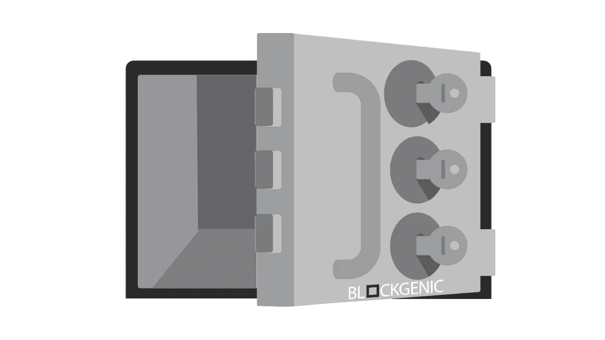
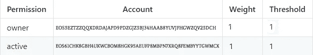
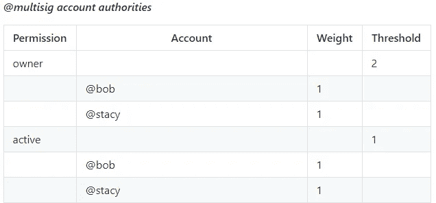
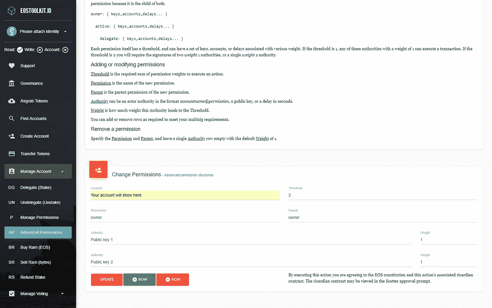
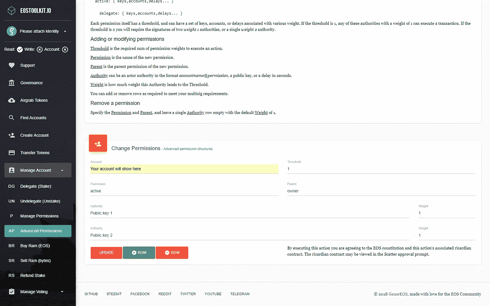
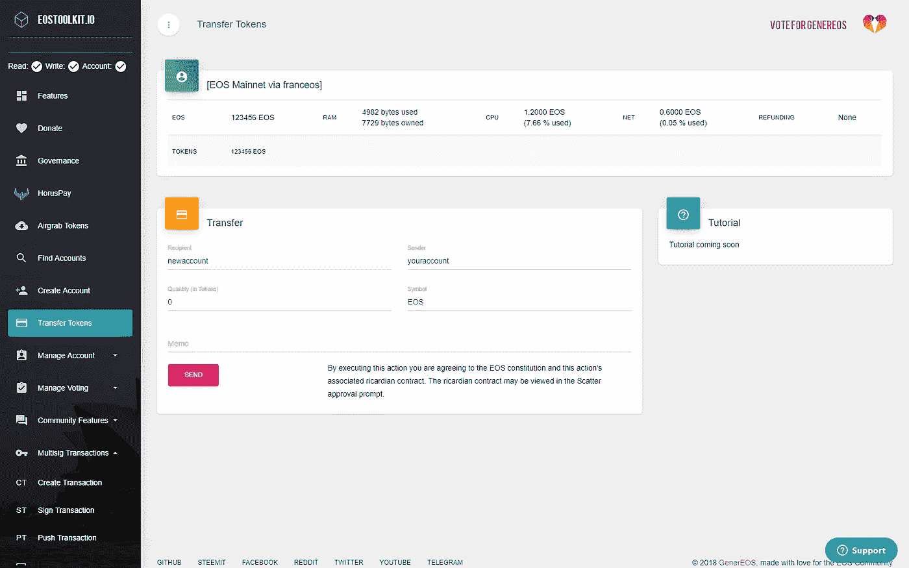
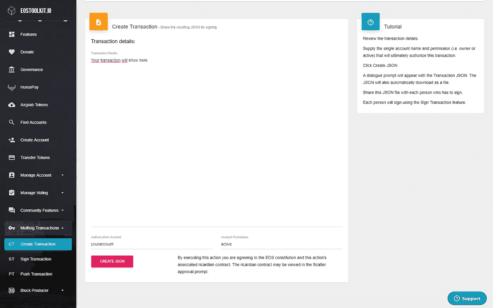
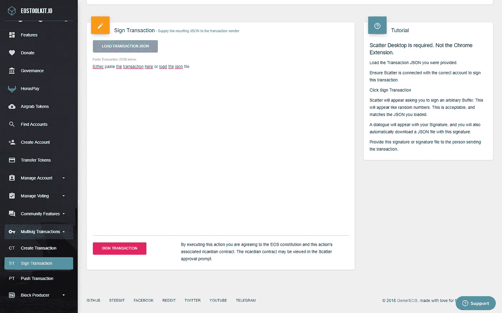
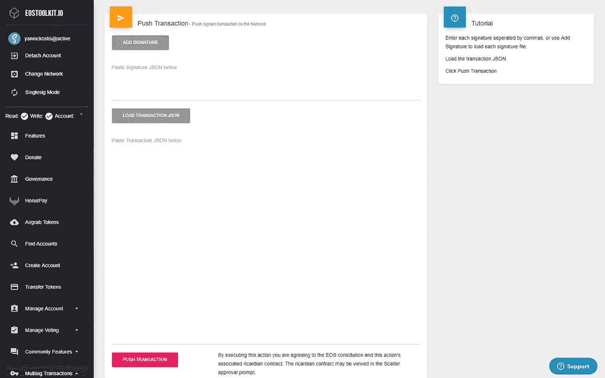

# 高级 EOS 多重签名教程

> 原文：<https://medium.com/coinmonks/advanced-eos-multisignature-tutorial-bf4da94f8360?source=collection_archive---------2----------------------->

多重签名账户，保护公共基金的最佳方式之一，毫无疑问，是一个非常有前途的 EOS 特性。您可能已经了解了基础知识，但是您实际上如何用不同的密钥签署交易，以及您如何自己建立一个多签名帐户呢？

# EOS 账户的基本设置

默认情况下，一个 EOS 账户有两个权限，*活动*和*所有者*。

*活动*权限用于转账、制作人投票等高级账户变更。

*所有者*权限象征着账户的所有权。只有少数事务需要此权限，但最值得注意的是对所有者权限进行任何类型的更改的操作。一般建议业主冷藏保存，不与任何人共用。*所有者*权限可用于恢复另一个可能已被破坏的权限。

默认情况下，*活动*和*所有者*的键的权重都是 1，而*活动*和*所有者*权限的默认阈值都是 1。这意味着执行任何需要*所有者*许可的动作只需要*所有者*密钥的一个签名。这同样适用于*活动*许可。执行任何需要*激活*许可的动作只需要一个来自*激活*键的签名。

这就是默认 EOS 帐户的设置方式。

# 多重签名帐户的工作原理

Taken from the [EOSIO Wiki](https://github.com/EOSIO/eos/wiki/Accounts%20%26%20Permissions)

在上图中，你可以看到一个多签名账户的可能设置。在本例中,*所有者*权限的阈值为 2，有 2 个密钥，权重均为 1。这意味着需要两个密钥的签名来执行任何需要*所有者*许可的动作。

*活动*权限的阈值为 1，有 2 个密钥，权重均为 1。这意味着执行任何需要*激活*许可的动作只需要 2 个密钥中任何一个的 1 个签名。

# 如何自己创建多签名账户

假设以上有意义，我们现在将解释如何使用 [EOSToolkit](https://eostoolkit.io/account/advanced) 自己建立一个多签名账户。我们将像上面解释的多签名帐户一样设置帐户。

首先，你必须下载一个浏览器扩展*。你可以在这里得到散点。按照说明如何设置您的分散帐户并登录到您的分散扩展(一步一步的指示遵循[本指南](https://helpdesk.eostoolkit.io/hc/en-us/articles/360009426951-How-do-I-set-up-and-attach-the-Scatter-Chrome-extension-to-EOSToolKit-))。之后，进入工具包，连接您现有的 EOS 帐户。关于如何将你的账户连接到 Scatter 的更多详细说明，请访问 Blockgenic 和 Genereos 的新服务台[。](https://helpdesk.eostoolkit.io/hc/en-us/articles/360009426951-How-do-I-set-up-and-attach-a-Scatter-account-to-EOSToolKit-)

*分散 chrome 扩展不再是推荐的工具，这是目前的分散桌面。有关如何安装 Scatter desktop 的说明，请遵循本指南。

*Don’t forget to add ‘@permission’ behind the public keys, change the permission to the actual permission (active, owner, etc)

连接您的 Scatter 帐户后，您可以访问[“高级权限”选项卡](https://eostoolkit.io/account/advanced)。我们将从更改帐户的*所有者*权限开始。使用正确的信息和密钥填写空白，然后单击更新。如果需要，还可以添加更多的关键点，并更改关键点的阈值和权重。

*Don’t forget to add ‘@permission’ behind the public keys, change the permission to the actual permission (active, owner, etc)

更新*所有者*权限后，您可以更新*活动*权限。使用正确的信息和密钥填写空白，然后单击更新。就像拥有*所有者*权限一样，如果你愿意，你也可以添加更多的键并改变阈值和键的权重。

# 签名和创建多重签名交易记录

一旦您建立了多重签名帐户，您就可以开始学习如何创建多重签名交易，以及如何对其进行签名。为此，请转到 [EOSToolkit](http://EOSToolkit.io/home) 。

首先，您必须使用控制多签名钱包的一个帐户登录。完成此操作后，检查是否选择了工具箱左上角的“multisig mode”。如果不是这种情况，请单击“单信号模式”切换到“多信号模式”。

现在，您可以前往“转移代币”并开始生成您的交易。为此，请填写必要的信息，然后单击发送。

检查交易并点击“创建 json”。

现在你可以开始签署交易。为此，请转到“签署交易”并加载 json 文件，或者将其粘贴到框中。然后点击“签署交易”并用您的第一个帐户签署。下载 json 文件并小心保存，以后会用到。

在您用您的第一个帐户(拥有*活动*权限)签署交易后，切换到拥有此权限的第二个或第三个帐户，并以与第一个帐户相同的方式签署交易。也保存这个 json 文件。

现在您可以检查是否可以将事务推送到网络。为此，检查使用*活动*权限所需的阈值。如果您已经达到使用*活动*权限(转让 EOS 所需的权限)的阈值，您可以进入下一步，如果没有，请使用不同的帐户签署交易，直到达到阈值。

如果您已经执行了上述所有步骤，您可以转到“推送交易”。添加所有需要的签名并加载初始交易的 json 文件，然后单击“push transaction”执行交易。

您现在已经发送了您的第一笔 EOS 多重签名交易，祝贺您！

## 我们的社交

[网站](http://blockgenic.io)
[推特](https://twitter.com/blockgenic)
[Youtube](https://www.youtube.com/channel/UCXTaehuAs3UWKnMVnT71MMQ)
[Meetup](https://www.meetup.com/nl-NL/Seattle-EOS/)
[Steem](https://steemit.com/@block21)

*作者为* [*作者为【亚尼克】作者为*](https://www.linkedin.com/in/yannick-slenter/) *作者为* [*作者为*](https://blockgenic.website/)

> [直接在您的收件箱中获得最佳软件交易](https://coincodecap.com/?utm_source=coinmonks)

