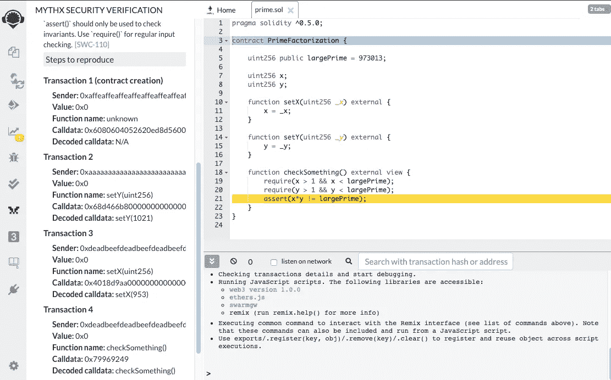
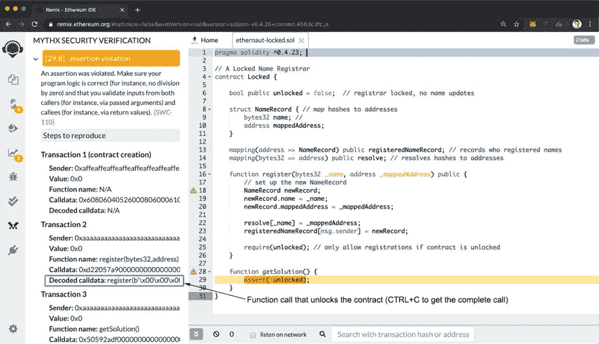
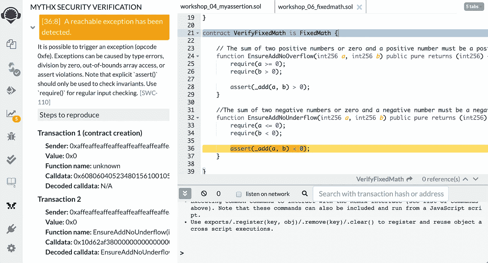
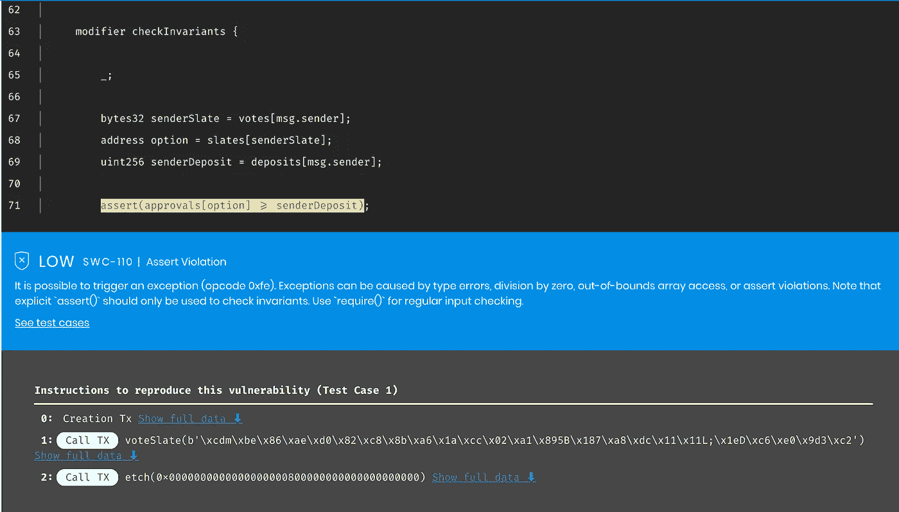

# Remix 中的高级智能合约安全验证

> 原文：<https://medium.com/coinmonks/advanced-smart-contract-security-verification-in-remix-9630b43695e5?source=collection_archive---------2----------------------->

*[*Remix*](https://remix.ethereum.org)*开发环境通过*[*MythX*](/coinmonks/advanced-smart-contract-security-verification-in-remix-9630b43695e5)*插件为用户提供了一种便捷而强大的检查智能合约正确性的方式。在本文中，我将解释基础知识，并提供几个例子，包括现实世界中智能合约的安全性测试。**

**

*智能契约是不可变的(或者至少[假设如此](/consensys-diligence/upgradeability-is-a-bug-dba0203152ce)，在将契约部署到 mainnet 之前确保程序的正确性*是绝对必要的。安全审计和全面的测试套件有助于确保代码没有错误。当谈到自动化测试时，编写全面的单元测试是一个很好的开始，但是这样的测试不能确保代码在所有的 T21 环境下都能正确运行。这就是诸如符号分析和输入模糊化等程序分析技术可以提供额外信心的地方。**

*使用 [Remix](https://remix.ethereum.org/) 中的“MythX”标签，你可以使用灰盒模糊和符号分析来检查代码中的*断言*。换句话说，MythX security analyzer 会全力以赴，打破您对代码的假设，并提醒您注意意外的错误。*

*让我们从一个基本的例子开始来说明这是如何工作的。通过在代码中添加断言，你*断言*当到达特定的程序位置时，某个表达式*总是*评估为“真”。考虑以下代码:*

```
*pragma solidity ^0.5.0;contract Primality {

    uint256 public largePrime = 973013;

    uint256 x;
    uint256 y;

    function setX(uint256 _x) external {
        x = _x;
    }

    function setY(uint256 _y) external {
        y = _y;
    }

    function checkSomething() external view {
        require(x > 1 && x < largePrime);
        require(y > 1 && y < largePrime);
        assert(x*y != largePrime);
    }
}*
```

*在`checkSomething()`中，我们断言`uint256 largePrime`是质数(即它只能被 1 和它自己整除)。我们将此表述为:*

*   **不存在大于 1 小于 largePrime 且其乘积与 largePrime 的值匹配的数字对 x，y。**

*可以用 MythX 来检验上述论断是否正确。它使用两种方法:尝试许多可能的输入来确定异常是否可以被触发([模糊化](/consensys-diligence/finding-vulnerabilities-in-smart-contracts-175c56affe2))，并使用 SMT 解算器检查到达失败状态的执行路径是否可行([符号分析](/@joran.honig/introduction-to-mythril-classic-and-symbolic-execution-ef59339f259b))。*

*[打开 Remix](https://docs.mythx.io/en/latest/tools/remix/index.html) 中的 MythX 选项卡，将上述代码复制/粘贴到一个新文件中，然后单击“分析”按钮。几分钟后，结果应该显示在“报告”选项卡中，包括一个标题为“断言违规”的问题。*

*您可以通过单击问题标题来突出显示受影响的代码行。单击标题左边的箭头会显示更详细的描述，最重要的是，MythX 找到的例子违反了我们的断言。*

**

*在这种情况下，第 21 行显示了触发断言冲突的函数调用序列:*

1.  **合同创建**
2.  **塞提(953)**
3.  **setX(1021)**
4.  **checkSomething()**

*为了验证 MythX 提供的例子是正确的，您可以将契约部署到 JavaScript VM，并以触发异常的相同顺序执行函数调用。*

*要使用 MythX，您不需要确切地知道它是如何工作的，但是有一些关于分析服务的事实需要了解:*

*   *从构造函数设置的初始状态开始，MythX 探索事务序列(调用函数 *setY()* ，然后是函数 *setX()* 等等)。*
*   *在上面的例子中，MythX 分解了一个数字。这对于非常大的数量来说是行不通的。可用于解决复杂数学和逻辑问题的计算机取决于使用哪种[分析模式](https://blog.mythx.io/features/mythx-full-mode-security-analysis-explained/)。*
*   *MythX 为它检测到的每个断言违规生成两个示例，但是可能存在其他情况，所以您应该在应用修复后重新运行 MythX。*

## *编写正确性检查*

*断言语句可以用来发现微妙的漏洞。一个很好的方法就是在智能合同战争游戏中作弊。大多数可靠性黑客挑战定义了玩家需要达到的特定目标。如果您将代码复制/粘贴到 MythX 中，并断言目标的否定，这将激励 MythX 找到挑战的解决方案。*

*为了证明这一点，我们将使用 MythX 解决以太战士战争游戏的[第 17 关。该挑战的目标是通过将布尔状态变量设置为*真*来解锁“注册商”智能合同。简单地看一下代码，没有显示出任何实现这一点的明显方法(除非你在审计 Solidity 代码方面有点经验)。](https://ethernaut.openzeppelin.com/level/0xe83cf387ddfd13a2db5493d014ba5b328589fb5f)*

```
*pragma solidity ^0.4.23;// A Locked Name Registrar
contract Locked { bool public unlocked = false;  // registrar locked, no name updates

    struct NameRecord { // map hashes to addresses
        bytes32 name; // 
        address mappedAddress;
    } mapping(address => NameRecord) public registeredNameRecord; //    records who registered names 
    mapping(bytes32 => address) public resolve; // resolves hashes to addresses

    function register(bytes32 _name, address _mappedAddress) public {
        // set up the new NameRecord
        NameRecord newRecord;
        newRecord.name = _name;
        newRecord.mappedAddress = _mappedAddress; resolve[_name] = _mappedAddress;
        registeredNameRecord[msg.sender] = newRecord; require(unlocked); // only allow registrations if contract is unlocked
    }
}*
```

*从安全审计员的角度考虑这一挑战，安全审计员希望确保一旦部署，合同将永远锁定。审计员可以断言如下:*

*   **布尔变量“解锁”的值必须始终为假。**

*我们可以通过向断言`unlocked == false`的契约添加一个新函数来轻松检查这一点。将质询代码复制到 Remix 中，并将以下函数添加到合同类中:*

```
*function getSolution() public {
    assert(!unlocked);
}*
```

*做一个快速的 MythX 分析。分析完成后，您应该会在报告选项卡中看到一个标题为“断言违规”的问题。展开问题，找到 MythX 产生的例子(transaction 2 中的“decoded calldata”)。*

**

*函数参数相当长，会在右边被截断。将整行复制到文本编辑器中进行查看。通过对输出进行一些重新格式化，您可以在 Remix 中运行示例，并验证`unlocked`确实被设置为`true`:*

```
*register(0x0000000000000000000000000000000000000000000000000000000000000006,0x0000000000000000000000000000000000000000)*
```

*为什么会这样？原来，函数`register` [将用户提供的值写入指向存储的未初始化结构](https://swcregistry.io/docs/SWC-109)。这导致对存储槽 0 的写入，该存储槽恰好包含我们想要更改的布尔值(在 Remix JavaScript VM 中重放该操作以验证解决方案)。*

*值得注意的是，断言违规可能有各种根本原因，包括整数溢出和下溢、写入意外的内存位置、忘记修饰符等等。只要有*某种*方法来打破断言，MythX 就有可能找到它并显示实现它的步骤。*

*[](https://mythx.io/?utm_source=content&utm_medium=medium)*

## *函数前置条件和后置条件*

*前面的例子展示了检查一种特定类型的属性的断言，这种属性被称为*契约不变量*(下面将详细介绍)。除了检查全局不变量的有效性，通常还需要检查特定函数的行为，在这种情况下会使用函数前置条件和后置条件。*

*在最近与 [ConsenSys Diligence](https://diligence.consensys.net) 对 [0x](https://0x.org) 智能合约进行安全审计期间，我们测试了一个对定点有符号整数实施算术运算的库。在其他事情中，我们希望确保算术函数不会上溢和下溢。*

*下面是`_add()`函数的[原始版本](https://github.com/0xProject/0x-monorepo/blob/ac75053f697bbadb1d748ded31ad3946c4d47e1a/contracts/staking/contracts/src/libs/LibFixedMath.sol)，它接受两个有符号整数参数并返回和，据说在溢出时恢复。*

```
*contract FixedMath {/// [@dev](http://twitter.com/dev) Adds two numbers, reverting on overflow.
    function _add(int256 a, int256 b) public pure returns (int256 c) {
        c = a + b;
        if (c > 0 && a < 0 && b < 0) {
            revert();
        }
        if (c < 0 && a > 0 && b > 0) {
            revert();
        }
    }    
}*
```

*很难看出这个函数是否真的捕捉到了所有可能的溢出和下溢，所以这是用 MythX“欺骗”的一个很好的选择。我们可以定义以下两个属性:*

*   **和 a ≥ 0，b > 0 必须总是正数；**
*   **a≤0，b < 0 之和必须永远是负数。**

*为了不触及原始契约，我们创建了一个从我们的 *FixedMath* 继承的包装契约，并覆盖目标函数来插入检查。上述属性被转换成如下断言:*

```
*contract VerifyFixedMath is FixedMath { // The sum of two positive numbers or zero and a positive number must be a positive number function EnsureAddNoOverflow(int256 a, int256 b) public pure returns (int256) {

        // Preconditions require(a >= 0);
        require(b > 0); // Postcondition assert(_add(a, b) > 0);
    } // The sum of two negative numbers or zero and a negative number must be a negative number function EnsureAddNoUnderflow(int256 a, int256 b) public pure returns (int256) { // Preconditions require(a <= 0);
        require(b < 0); // Postcondition assert(_add(a, b) < 0);
    }}*
```

*运行一个快速的 MythX 检查发现了一种整数下溢的情况:*

**

*同样，为了查看函数参数，将解码后的调用数据从 MythX 选项卡复制到文本编辑器中。您应该得到以下内容:*

```
*EnsureAddNoUnderflow(-57896044618658097711785492504343953926634992332820282019728792003956564819968, -57896044618658097711785492504343953926634992332820282019728792003956564819968)*
```

*事实证明，将最小的负数与其自身相加会导致下溢，结果为零(该问题在审计过程中得到了修复)。*

## *契约不变量*

*契约(或全局)不变量是应该始终成立的断言。例如，您可能希望确保:*

*   **“所有者”状态变量的值从不改变；**
*   **总令牌供应是恒定的(在不可铸造的令牌中)；**
*   **ERC 20 代币的所有余额总和始终与总供应量相匹配。**

*对简单不变量的检查可以挖掘出非常有趣和反直觉的错误。OpenZeppelin 的 Vera Bogdanich Espina 的一篇文章包含了一个很好的例子。这篇文章讨论了自动验证器如何发现 MakerDAO 契约中的一个关键漏洞。*

*这个错误本身并不简单，如果你想完全理解发生了什么，我推荐你阅读 [OpenZeppelin 的详细文章](https://blog.openzeppelin.com/technical-description-of-makerdao-governance-critical-vulnerability-facce6bf5d5e/)。简而言之，该漏洞允许攻击者从他们选择的提案中删除投票，并无限期锁定其他用户的 MKR 令牌。在她的博客文章中，Vera 提供了一个易受攻击合同的简化版本:*

```
*contract SimpleDSChief {
    mapping(bytes32=>address) public slates;
    mapping(address=>bytes32) public votes;
    mapping(address=>uint256) public approvals;
    mapping(address=>uint256) public deposits;function lock(uint wad) public {
        deposits[msg.sender] = add(deposits[msg.sender], wad);
        addWeight(wad, votes[msg.sender]);
    }function free(uint wad) public {
        deposits[msg.sender] = sub(deposits[msg.sender], wad);
        subWeight(wad, votes[msg.sender]);
    }function voteYays(address yay) public returns (bytes32){
        bytes32 slate = etch(yay);
        voteSlate(slate); return slate;
    }function etch(address yay) public returns (bytes32 slate) {
        bytes32 hash = keccak256(abi.encodePacked(yay)); slates[hash] = yay; return hash;
    }

    function voteSlate(bytes32 slate) public {
        uint weight = deposits[msg.sender];
        subWeight(weight, votes[msg.sender]);
        votes[msg.sender] = slate;
        addWeight(weight, votes[msg.sender]);
    }function addWeight(uint weight, bytes32 slate) internal {
        address yay = slates[slate];
        approvals[yay] = add(approvals[yay], weight);
    }function subWeight(uint weight, bytes32 slate) internal {
        address yay = slates[slate];
        approvals[yay] = sub(approvals[yay], weight);
    }function add(uint x, uint y) internal pure returns (uint z) {
        require((z = x + y) >= x);
    }function sub(uint x, uint y) internal pure returns (uint z) {
        require((z = x - y) <= x);
    }
}*
```

*我们希望 MythX 在这里回答的问题是，合同是否总是确保用户的投票被计算在内。为此，我们定义了 Vera 建议的全局不变量:*

*   **用户投票的期权总批准权重必须至少等于该用户的保证金。**

*我们再次创建一个包装器契约，并将断言放入一个修饰符中，然后该修饰符应用于所有公共函数。通过这种方式，我们可以确保不变量始终适用于非回复状态转换。*

```
*contract VerifySimpleDSChief is SimpleDSChief {modifier checkInvariants { _; bytes32 senderSlate = votes[msg.sender];
        address option = slates[senderSlate];
        uint256 senderDeposit = deposits[msg.sender];

        assert(approvals[option] >= senderDeposit);
    }

    function lockForActor(address addr, uint amount) internal {
        deposits[addr] = amount;
        addWeight(amount, votes[addr]);
    }

    constructor() public checkInvariants {

        // set up the initial state with some deposits

        lockForActor(msg.sender, 1);
        lockForActor(0xDeaDbeefdEAdbeefdEadbEEFdeadbeEFdEaDbeeF, 1);
        lockForActor(0xaAaAaAaaAaAaAaaAaAAAAAAAAaaaAaAaAaaAaaAa, 1);
    }function voteYays(address yay) public checkInvariants returns (bytes32) {
        return super.voteYays(yay);
    }function etch(address yay) public checkInvariants returns (bytes32 slate) {
        return super.etch(yay);
    }

    function voteSlate(bytes32 slate) public checkInvariants {
        super.voteSlate(slate);
    }

    function lock(uint wad) public checkInvariants {
        super.lock(wad);
    }

    function free(uint wad) public checkInvariants {
        super.free(wad);
    }
}*
```

*这一次，如果我们用 MythX 检查这一点，我们将遇到“快速”分析预设的限制:当您检查契约不变量时，总会有假阴性的残余风险，因为 fuzzer 和 symbolic analyser 都将一些存储变量建模为具体值，并且只能研究有限数量的事务。在“快速”分析模式下，工具的时间预算为 120 秒，这对于探索长事务序列来说是不够的。更多的计算时间意味着“更深入”的分析和更小的剩余风险(无耻的插一句:这就是为什么审计员和安全意识强的开发人员应该注册我们令人敬畏的订阅计划😀).*

*处理一个“完整的”分析大约需要 30 分钟。当您从 Remix 请求一个完整的分析时，您将获得一个到 MythX 仪表板的链接，在那里您可以跟踪分析的进度并查看结果。在 SimpleDSChief 的情况下，分析发现我们的不变量的一个可能的反例:*

**

*本质上，这个例子显示了一个用户取消他们自己的投票权重。*

1.  *用户调用`voteSlate(bytes32)`，为还没有被蚀刻的石板投票(即`slates[hash]`保存零地址)；*
2.  *在先前调用中投票的石板现在通过调用`etch(addr)`来蚀刻，其中`keccak256(addr)`等于先前调用中传递的散列；*
3.  *`slates[votes[msg.sender]]`现在指向一个不同的(非零)地址。`approvals[slates[votes[msg.sender]]] == 0`导致断言失败。*

*这里的关键观察是检查一个简单的不变量(“用户的投票必须总是被计算在内”)暴露了一个奇怪的异常情况，这个情况很容易被人忽略。在实践中，定义和检查一组完整的不变量提供了更大的信心，即没有遗漏任何边缘情况。*

# *TL；速度三角形定位法(dead reckoning)*

*MythX 将模糊化、符号分析和静态检查集成到一个易于使用的界面中，应该成为每个 Solidity 开发人员和审计人员工具箱的一部分。通过检查全局和功能性安全属性，您可以发现细微的错误，并对代码的正确运行更有信心:*

*   *通过向函数添加前置条件和后置条件，可以验证函数是否总是按预期运行；*
*   *契约不变量允许您确保某些条件在执行过程中始终成立。*

*查看[文档](https://docs.mythx.io/en/latest/tools/index.html)以获得关于为 Remix、Truffle、VS 代码和其他环境设置 MythX 的说明。在 [MythX 仪表盘](https://dashboard.mythx.io/#/)上注册一个免费账户。*你可以在这里* *阅读 MythX 评论* [*。*](https://coincodecap.com/product/mythx-8)*

# *您可能还喜欢:*

*   *[使用 MythX 检测一般性错误](/consensys-diligence/detecting-the-top-4-critical-smart-contract-vulnerabilities-with-mythx-9c568d7db7a6)*
*   *[使用 AssertionFailed 事件检查自定义属性](/consensys-diligence/checking-custom-correctness-properties-of-smart-contracts-using-mythx-25cbac5d7852)*
*   *[牛逼的 MythX 工具](https://github.com/b-mueller/awesome-mythx-smart-contract-security-tools)*

> *[直接在您的收件箱中获得最佳软件交易](https://coincodecap.com/?utm_source=coinmonks)*

*[](https://coincodecap.com/?utm_source=coinmonks)**[](https://coincodecap.com)*