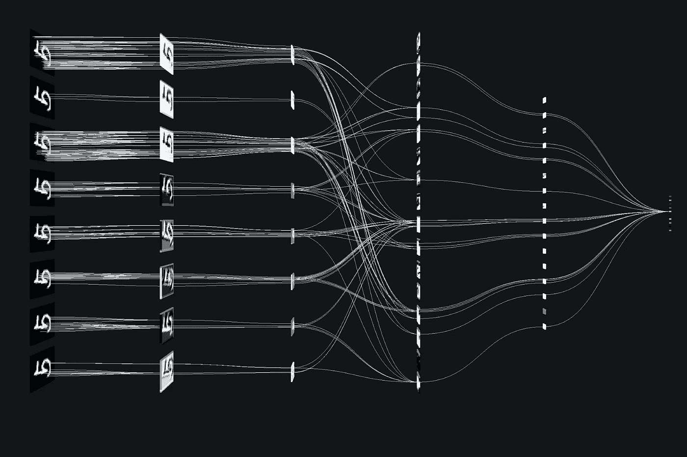

# 深度学习的进展 1:卷积神经网络和主要操作介绍

> 原文：<https://medium.com/coinmonks/advancements-of-convolutional-neural-networks-part-1-introduction-and-main-operations-5d12f35b28d4?source=collection_archive---------3----------------------->

Convolutional neural network illustration. [Source](https://terencebroad.com/)

今天，人工智能中的机器学习技术已经成为现代技术的一个关键方面。深度学习是人工智能中已经建立的主要机器学习技术，在各种应用程序中的决策和问题解决方面显示出有希望的结果。本文特别感兴趣的是深度学习的主要架构之一，卷积神经网络(CNN)及其最近的进展。

CNN 是一种受动物视觉感知系统启发的人工神经网络，主要用于解决计算机视觉问题。他们在基于视觉的识别任务、理解和推理方面表现出色。先驱数学家 Yann LeCun 介绍了现代 CNN 的基本结构，Alex Krizhevsky 在 2012 年提出了第一个成功的 CNN 架构 AlexNet。基本 CNN 架构包括多个处理层，这些处理层能够直接从原始输入开始学习特征表示。每一层的这些学习到的表示被用于开发多层次的抽象，允许 CNN 成功地应用于各种任务。然而，由于当时缺乏大的训练数据和计算能力，深度 CNN 无法在更复杂的问题上表现良好。但随着 GPU 等高性能计算硬件的发展，以及互联网带来的大量数据的可用性，现在这是一个快速发展的领域。

AlexNet 的影响使 CNN 成为一个非常活跃的研究领域，许多研究人员开始对开发 CNN 感兴趣。因此，在过去的十年里，人们在提高性能、新架构、优化技术、数据处理和各种应用方面做了大量的研究工作。本研究简要回顾了中枢神经网络的最新进展和发展。随着时间的推移，CNN 架构有了许多变化，但是架构的基本框架仍然是相似的。深度 CNN 的概念带有多个隐藏层，具有更多的处理能力。每一个输入都经过一系列隐藏层的处理。一般的多层体系结构是三种类型的交替数据处理层的序列:卷积层、池层和全连接层。CNN 的典型顺序是交替分层的卷积层和汇集层，接着是全连接层和输出层，输出层也称为网络末端的 softmax 层，它是最终的全连接层。以下章节简要讨论了 CNN 的主要操作组件。

Figure 2: How a multilayer Convolutional neural network works

**卷积层** 卷积层负责从输入中进行特征学习，并在每个级别开发抽象。基本特征学习是通过将滤波器核与输入卷积来完成的。根据卷积捕获输入图的局部区域，称为局部感受野，因此它捕获整个输入区域。这些滤波器核具有称为权重的可学习参数，在训练阶段使用称为反向传播的过程对这些参数进行系统调整。该过程通过将输入要素从一个抽象级别转换到下一个抽象级别，根据每个卷积层的过滤器数量生成输出要素图，然后这些要素图成为下一层的输入。

Figure 2: How a convolution layer works

权重共享的概念被称为在卷积层上共享相同的权重。这也减少了要训练的参数数量。但它限制了不同不变性的学习，如尺度不变性和旋转不变性。平铺卷积[1]是通过在同一卷积层中插入许多独立的滤波器来学习不同的特征映射来解决这个问题的一种有针对性的解决方案。该方法涉及参数 k，即图块大小，并通过改变 k 来改变权重分配的程度。如果 k 是 1，则每个特定地图中的过滤器单元共享相同的权重，这使得传统的 CNN。拼接 CNNs 具有表示复杂不变性和需要训练的参数较少的优点。具有扩张滤波器核的卷积被称为扩张卷积。扩张卷积[2]用于通过使用称为扩张因子的超参数对不同范围的输入简单应用相同的卷积滤波器来增加感受野面积。这种增加的本地视图有助于捕获更多信息，并以指数方式扩展网络的全局视图。网络[3]中网络的思想是用称为微网络的小规模神经网络代替卷积滤波器。这里使用简单的多层感知器作为微网络。卷积层及其微网络层从相应的局部感受野中提取特征。这使得主网络能够提取更丰富的特征表示。

**激活函数** CNN 中的每一个卷积层都跟随着一个激活函数，该激活函数将非线性引入输出。没有非线性激活，网络将仅仅是从输入到输出的一堆线性变换。实践中有 3 种主要类型的激活函数:sigmoid、双曲正切和校正线性单位(ReLU)。然而，最近 ReLU[4]变得更受欢迎，因为它们受到最小值的限制，并且它使网络较少受到梯度流减少的影响。基本 ReLU 是一个分段线性函数，它将输入的负部分删减为零，保留正部分。它还比 sigmoid 和 tangent 激活计算得更快，同时为网络提供了更好的稀疏性。最重要的是，ReLU 激活函数较少遭受消失梯度的问题，并且变得反向传播友好。已经引入了 ReLU 的几种变体。在某些情况下，当单元不工作时，ReLU 具有零梯度的缺点。在初始级别，这可能导致基于梯度的优化不更新它们的权重，因为单元不活动并且可能保持不活动。此外，恒定的零梯度会减慢整个训练过程。引入泄漏 ReLU[5]是为了通过包含无效单元的负部分来防止这种情况，因此它们不会变为零，但保留了小非零梯度的余量。然后，参数 ReLU[6]通过引入可学习的参数而不是负包含部分的预定义参数，旨在对泄漏 ReLU 进行扩展。泄漏 ReLU 的另一种变体被称为随机化 ReLU[7]，它在训练中从均匀分布中随机采样负部分的参数，但使用固定值进行测试。由 Clevert 等人引入的指数线性单元(ELU)[8]，用于实现更快的学习和更高的分类精度。ELU 使用饱和函数作为负部分，其功能被定义为如果单元被去激活，它将减少单元的变化。

Figure 3: Variations of ReLU activation function

**汇集层**
汇集层负责通过减少特征图的空间维度以及卷积层之间的连接数量来降低计算成本。根据池的功能，该过程会保留从输入要素映射到输出的重要信息，同时降低维度。它还通过提供对噪声和小失真的鲁棒性来帮助实现特征的平移不变性。典型的池功能是最大池和平均池。最大池返回跨每个要素地图的本地捕获池窗口中的最大值。平均池计算每个本地池窗口中的值，并作为跨要素地图的输出返回。与最大池相比，平均池不会忽略特征图中的任何值，而是考虑局部窗口中的所有值并进行平均。

Figure 4: Max pooling and average pooling

除了主要的两种方法外，混合统筹[9]是由于等人提出的。顾名思义，混合统筹是最大统筹和平均统筹的结合。池化函数包含最大池化、平均池化和附加参数，以在两种方法之间权衡操作。受辍学的启发，随机池[10]根据多项式分布从特征图中随机选取值。该方法确保非最大值也被识别。此外，频谱汇集[11]方法通过在频域中裁剪特征图来遵循汇集过程。频域转换通过离散傅立叶变换来执行。一旦裁剪完成，就逆变换回空间域。

本文简要讨论了 CNN 主要业务的最新进展。下一篇文章将讨论塑造了当前艺术状态的最有影响力的 CNN 架构。

**参考文献**

[1] J. Ngiam，Z. Chen，D. Chia，P. W. Koh，Q. V. Le，A. Y. Ng，平铺卷积神经网络，载于:神经信息处理系统(NIPS)进展会议录，2010 年，第 1279-1287 页。
[2] F. Yu，V. Koltun，基于扩张卷积的多尺度上下文聚合，载于:学习表征国际会议论文集()，2016。
[3] M .林，q .陈，s .严，网络中的网络，载于:学习表征国际会议论文集，2014。
[4] V. Nair，G. E. Hinton，校正线性单元改进受限玻尔兹曼机器，载于:机器学习国际会议论文集(ICML)，2010 年，第 807–814 页。
[5] A. L. Maas，A. Y. Hannun，A. Y. Ng，整流器非线性改善神经网络声学模型，载于:机器学习国际会议论文集(ICML)，第 30 卷，2013 年。【6】k . He，X. Zhang，S. Ren，J. Sun，深入研究整流器:在 imagenet 分类上超越人类水平的性能，载于:计算机视觉国际会议论文集(ICCV)，2015 年，第 1026–1034 页。
[7] B .徐，n .王，t .陈，m .李，卷积网络中校正激活的实证评估，载于:机器学习国际会议()研讨会论文集，2015。
[8] D.-A. Clevert，T. Unterthiner，S. Hochreiter，利用指数线性单元(elus)进行快速准确的深度网络学习，载于:学习表征国际会议论文集(ICLR)，2016 年。
【9】g . e . hint on，N. Srivastava，A. Krizhevsky，I. Sutskever，R. R. Salakhutdinov，通过防止特征检测器的共同适应来改进神经网络，CoRR abs/1207.0580。
[10] M. D .泽勒，r .弗格斯，深度卷积神经网络正则化的随机池，载于:学习表征国际会议论文集(ICLR)，2013 年。
【11】o . Rippel，J. Snoek，R. P. Adams，卷积神经网络的谱表示，载于:神经信息处理系统进展会议录(NIPS)，2015 年，第 2449–2457 页。