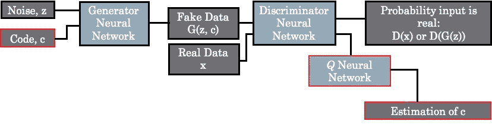

# 深度学习的进步 3:生成对抗网络(GANs)。

> 原文：<https://medium.com/coinmonks/advancements-of-deep-learning-3-generative-adversarial-networks-gans-9d67010d656a?source=collection_archive---------2----------------------->

GAN generated images. sources: fake face images

## 没有数学的简短讨论…

它不需要解释深度学习如何影响现代科技世界的研究和产业。卷积神经网络是领先的基于视觉的深度学习类架构之一。我们已经讨论了第一部分的[中的基本操作和第二部分](/coinmonks/advancements-of-convolutional-neural-networks-part-1-introduction-and-main-operations-5d12f35b28d4)的[中有影响的网络架构。今天我们讨论深度学习的另一项重大改进，**生成对抗网络**或 **GANs** 。](/coinmonks/advancements-of-convolutional-neural-networks-part-2-influential-network-architectures-261c502ce6bd)

生成对抗网络(GANs)的概念是由 Ian Goodfellow 在 2014 年首次提出的，其基本思想是生成新数据。本质上，GANs 不需要标记数据来学习，这意味着它们属于无监督学习。在过去的几年里，GANs 和他们最近的进展在计算机视觉方面取得了巨大的进步，例如生成高质量的图像、从文本生成图像、改变图像的特征(如人脸)等等。让我们首先简要讨论一下 GANs 是如何工作的，然后讨论一下具有显著发展的 GANs 的演变。此外，我们不期望讨论这些 GANs 架构背后的复杂数学，而是概述它们如何工作以及它们是什么。

## [生成性对抗网络](https://arxiv.org/abs/1406.2661) (2014)

Figure 1: An illustration of generative adversarial networks

基本 GAN 架构由两个独立的模型组成，即发生器和鉴别器。生成器创建假数据，鉴别器区分真数据和假数据。人们也可以说，发电机试图愚弄鉴别器。通常，这两个模型可以是卷积神经网络或递归神经网络，或者在某些情况下可能是自动编码器。为了便于理解架构，上面的图 1 描述了一个 GAN 的基本网络架构。在训练阶段，生成器学习如何更好地生成可以欺骗鉴别器的数据，而鉴别器学习如何辨别输入数据的真假。由于这两个模型都是使用深度神经网络实现的，因此这两个网络的参数被同时调整，并且它们都随着时间的推移而变得更好。此外，来自 GAN 输出的反馈用于通过反向传播算法训练发生器和鉴别器。鉴别器的输出是输入为实数的概率。概率越高，输入越有可能来自真实数据，而概率越小，则意味着生成器生成的数据是假的。当鉴别器不能区分真假时，概率输出将是 0.5，这给出了最优解。此外，主要基于两个神经网络的基本 GAN 架构的损失函数彼此竞争，这两个神经网络关于它们的参数和输入是可微分的。然而，即使在最基本的 GANs 形式下也有很多要讨论的，并且根据他们的理解和要求，人们可以在媒体本身和互联网上找到大量的文献。

Figure 2: A classification of GAN models. [source](https://ieeexplore.ieee.org/document/8576508/)

在深入研究 GAN 架构的发展之前，让我们先来看看 GAN 模型在目标功能、结构和条件方面的分类，如图 2 所示。这些 GAN 模型试图处理和解决原始 GAN 架构中出现的问题，例如不稳定训练、梯度消失和不稳定训练。此外，这些开发的 GAN 配方和发展已经解决了不同的领域、尺寸和应用。现在让我们简单讨论几个著名的 GAN 模型，看看这个领域是如何扩展的。

## [条件生成对抗网络](https://arxiv.org/pdf/1411.1784.pdf):CGAN(2014 年末)

Figure 3: Typical CGAN architecture

就像之前提到的甘员工无监督学习方法论。然而，当数据集复杂或过大时，GANs 经常面临控制生成的图像的问题。为了减轻这种情况，通过为生成器引入约束或预定义目标，提出了有条件的 GANs。这也可以作为图像生成器的有条件生成来引入。条件约束的引入在一定程度上将 GAN 的学习从无监督转变为有监督。这些条件输入可以是指导生成器的期望结果的描述性分类标签或图像特征。作为一个优势，添加条件有助于更快的收敛，但同时，必须满足真实数据集的更多要求，如标记或标记的数据。CGANs 的引入对于许多应用和进一步的开发已经变得非常有用。

## [深度卷积生成对抗网络](https://arxiv.org/pdf/1511.06434.pdf) : DCGAN (2015)

Figure 4: The typical architecture DCGAN. [source](https://arxiv.org/pdf/1902.01824v1.pdf)

顾名思义，深度卷积神经网络正在 GANs 中使用，并取得了圆满成功。这里的关键思想是将深度 CNN 与 GAN 架构相结合，并开发深度卷积生成对抗网络(DCGANs)。帮助 DCGAN 性能良好的主要改进之一是在鉴别器中引入了步长卷积，并用分数步长卷积替换了生成器的池层。由于 GANs 中的 CNN 被要求执行与 CNN 过去所做的相反的操作，因此步长和分数步长卷积都将信息损失最小化。这在特征提取期间是有利的，并且还有助于保持数据的完整性。另一个主要的改进是使用批量归一化来解决渐变消失的问题，方法是修复不良的初始化，并分别为每个图层引入渐变。此外，中枢神经网络的不同激活功能也有助于树突状细胞的良好表现。因此，也可以引入 DCGANs 作为 GANs 的结构改进。这种架构上的改进已经允许克服诸如不稳定性、快速收敛和内部协变量偏移等问题。在 DCGAN 发展的基础上，还提出了许多进一步的改进。

## [信息办](https://arxiv.org/abs/1606.03657) (2016)

Figure 5: Basic InfoGAN architecture

InfoGAN 与 CGANs 非常相似。由于 CGANs 中的生成器有一个条件输入，因此 InfoGANs 的生成器也提供了由两个部分组成的输入。来自数据集的标签，就像 CGANs 中的标签，或者从附加鉴别器输出中提取的噪声向量和潜在特征向量。这种信息提取通常通过另一个神经网络来完成。鉴别器的最后一层是该特定神经网络的输入，并提供具有最大化互信息的潜在特征的统计估计。InfoGAN 的成本函数是通过用一个附加函数减去一般 GAN 成本函数而得到的，该附加函数包含关于如果我们知道鉴频器的输出，我们知道多少关于鉴频器输入的互信息。在互信息函数为零的情况下，意味着生成的数据和估计的潜在特征完全不相关。此外，正则化项也被添加到 InfoGAN 损失函数中的该互信息函数，该损失函数是表示生成的数据中的潜在特征的可能性。

## [文字-2-图像](https://arxiv.org/pdf/1605.05396.pdf) (2016)

Figure 6: text-2-image convolutional GAN architecture. Text encoding input is used by both generator and discriminator. [source](http://proceedings.mlr.press/v48/reed16.pdf)

顾名思义，文本-2-图像或生成对立的文本到图像合成，能够基于给定的文本描述生成逼真且有意义的图像。例如，对于描述花的颜色和花瓣形状的给定文本输入，系统将生成与文本输入所描述的完全一样的花的图像。与常规 GANs 相比，它不是向生成器输入随机噪声，而是输入描述性文本。根据原始论文，文本输入首先被转换成 256 维的文本嵌入，然后通过从正态分布的潜在空间采样与 100 维的噪声向量连接。生成器将接受连接的向量，并生成与文本描述一致的图像。鉴别器将被提供比常规 GAN 情况下更多的图像，即图像对和文本嵌入。鉴别器也将提供不止一个输出。它会像往常一样识别给定图像是真的还是假的。除此之外，它还将预测给定图像与原始文本描述的匹配程度。为了正确地训练鉴别器，输入一组不同的对，即图像和文本描述，它们是真实图像、文本、错误图像、伪造或生成的图像的组合。此外，在训练过程中，生成器中的目标值也会相应地进行设置。例如，真实图像和文本组合对让系统学习图像和文本如何对齐。相反，错误的图像-文本组合解释了与前一种情况相反的情况，并且目标被设置为零以标记它没有对齐。此外，假图像和文本的组合将再次将目标设置为零，因此鉴别器将能够区分真实图像和生成的假图像。主要论文通过从给定的详细文本描述中主要生成鸟和花的图像来展示该模型的能力。

## [瓦瑟斯坦生成对抗网络](http://proceedings.mlr.press/v70/arjovsky17a.html) : WGAN (2017)

在典型的 GAN 中，生成器首先对从低维随机分布中采样的向量进行编码，并在通过基本神经网络时生成高维数据。这有时导致在训练 GANs 时梯度消失，因为它试图在高维空间中构成低维空间。这可能导致输入数据分布和生成数据分布之间的重叠概率变得非常小或接近零。结果，生成的分布和真实分布之间的相似性可能变为零，因此梯度可能消失。为了解决这个问题，脸书人工智能研究所(FAIR)引入了 Wasserstein 生成对抗网络(WGAN)。他们采用了 Wasserstein 距离，这是一种真实数据和生成数据之间距离的度量。这个所谓的 Wasserstein 距离可用于测量两个分布之间的距离，即使它们不重叠，也有助于解决梯度消失问题。作者已经展示了 WGAN 如何提供改进的学习稳定性、最小化的模式崩溃以及有意义的学习曲线。后来(2017 年)推出了进一步的发展，即带梯度惩罚的 WGAN(WGAN-GP)。在 WGAN-GPs 中，用 t-lip schitz 约束方法代替了 WGAN 的权重剪枝。强烈建议阅读原始论文，以全面了解这两个概念。

## 基于能源的 GAN: EBGAN (2017)

Figure 7: Illustration of the discriminator of an EBGAN

正如我们之前所讨论的，鉴别器的目标是击败发生器，概率成本函数用于估计常规 GANs 中的损失。这种基于能量的 GANs (EBGANs)更像是一种基于能量的 GANs 表示。在原始的 GANs 中，鉴别器被设计成类似于分类器，但是 EBGAN 使用自动编码器，并且使用重建误差，即输入和重建之间的均方误差，作为其损失函数，而不是概率。该自动编码器通过编码器从鉴频器的输入数据中提取潜在特征，并利用解码器部分对其进行重构，如图 7 所示。当训练鉴别器时，成本函数被赋予两个要实现的目标。保持来自真实数据的自动编码器的重构成本较低，并且如果生成数据的重构误差下降到预定阈值以下，则惩罚鉴别器。更好的训练稳定性和增强的鲁棒性可以被认为是 EBGANs 的优点，这有助于在相当大的程度上摆脱 GANs 的手动调节。

## [CycleGAN](https://arxiv.org/abs/1703.10593) (2017)

Figure 8: Images generated using CycleGANs. [source](https://arxiv.org/pdf/1703.10593.pdf)

CycleGAN 的关键思想可以表示为图像从一个域到另一个域的转换，或者换句话说，跨域变换。基本的工作原理不过是对受某些风格影响或与之相似的图像的简单重建。CycleGAN 的结构由两个发生器和两个鉴别器组成。第一生成器将原始图像映射到目标或相似域，第二生成器将那些目标域映射到原始图像域。这两个领域是需要学习在它们之间转换的领域，这是一个两步转换。每个发生器都有自己相应的鉴别器，主要用于区分真实图像和合成图像。这两种鉴别器都有助于基于最小平方损失来提高生成的图像质量，并且通常它完全使用 CNN，每次查看图像的一个片，并输出该片是真实的概率(PatchGANs)。此外，来自 CycleGANS 的生成器通常具有编码器-变换器-解码器架构，而编码器部分具有卷积层，变换器部分具有残差块，解码器部分具有转置卷积。就目标函数而言，有两个主要部分，即对抗性损失和循环一致性损失。此外，CycleGANs 具有记住生成图像的历史以训练鉴别器的能力。然而，这可能导致生成器和鉴别器过度拟合和模式崩溃(由于贪婪优化的循环)。CycleGANs 在图像领域的可能应用将是新的绘画风格的发展或转换、风景图像的季节变化、2D 绘画到 3D 图像的转换等等。

## [CapsGAN](https://arxiv.org/pdf/1806.03968.pdf) (2018)

CapsGAN 是由多伦多大学的两名研究人员通过合并两种并发算法即 GANs 和[胶囊网络](https://arxiv.org/pdf/1710.09829.pdf)提出的一种新的模型架构。此外，基准 GAN 架构是 DCGAN。这里的想法是在 3D 域中生成具有高度几何变换的图像，并且作者声称与传统的基于深度 CNN 的方法相比，这些 CapsGANs 对几何变换更鲁棒。一个主要的架构变化是 DCGAN 的鉴别器被一个使用动态路由的胶囊网络所取代。然而，发生器遵循典型的 DCGAN 框架和 2D 转置卷积网络。此外，二元交叉熵损失函数有助于 CapsGAN 模型稳定收敛而不出现模式崩溃。

## [斯泰尔甘](https://arxiv.org/pdf/1812.04948.pdf) (2018)

Figure 9: StyleGAN Generator. [source](https://arxiv.org/pdf/1812.04948.pdf)

StyleGANs 能够生成非常高分辨率的图像，这些图像主要集中在人脸图像上。该架构由大量完全连接的层组成，从低分辨率到高分辨率逐渐在连续层上生成图像。常规 GANs 记住来自训练数据的图像，并且在生成新图像时添加随机噪声。然而，StyleGANs 也从生成的图像中学习特征，并能够生成根本不存在的新图像(高分辨率人脸图像)。在 StyleGAN 发生器或基于样式的发生器中，发生器的输入噪声或潜在空间向量通过执行映射变换的一系列完全连接的层，这部分称为映射网络。如上所述，这些层负责产生从较低分辨率到较高分辨率的图像。此外，产生的图像然后通过位于基于风格的生成器的后面部分的连续合成网络，这也被称为风格。这种风格包含主要属性，如姿势、颜色和其他重要特征。合成网络从学习到的常数卷积层开始，来自映射网络的风格被馈入网络的多个级别。自适应实例归一化用于归一化每个层，并且噪声也被引入以创建随机变化，例如纹理和颜色变化。StyleGANs 的结果非常惊人，因为它能够生成各种各样的真实图像，尤其是在人脸图像领域。

已经非常简要地讨论了几种广泛流行的 GAN 模型开发，它们在架构、能力和应用领域方面塑造了 GAN。令人惊讶的是，GANs 可以做什么，以及它如何用于大量的应用。此外，如果你看看学术界，你会发现到目前为止已经开发了许多 GAN 模型(查看[GAN 动物园](https://github.com/hindupuravinash/the-gan-zoo)),更多的开发尚未到来，这些开发解决了许多未探索的维度。因此，强烈建议浏览更多的细节和文献，尤其是相关的研究论文，以了解这些令人惊叹的系统是如何工作的，以及如果您感兴趣，如何将它们用于适当的应用程序。但是，我们有责任了解 GANs 的影响，并在道德上使用这些概念。另一篇文章再见，感谢阅读。