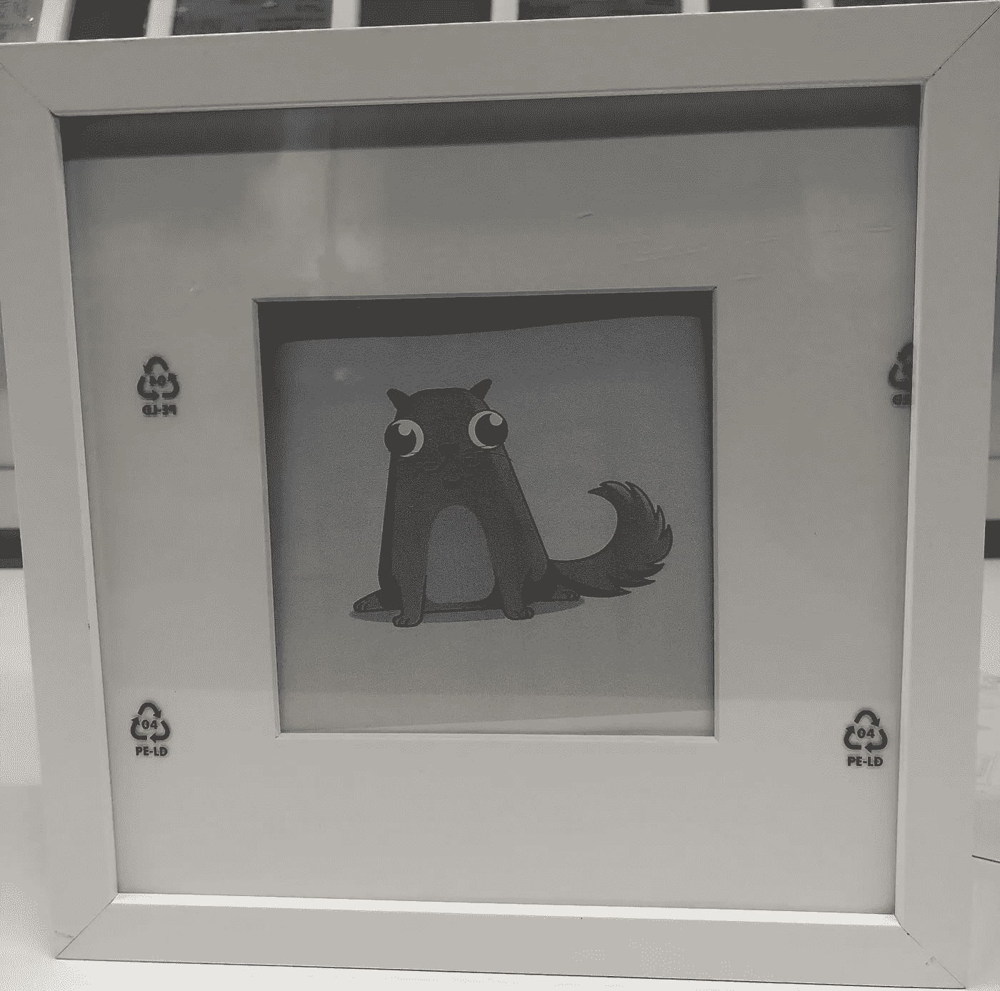

# 艺术冒险

> 原文：<https://medium.com/coinmonks/adventures-in-art-1b068ab0ebed?source=collection_archive---------0----------------------->

展示 NFT 收藏品

## 背景

来自 [Flex Dapps](https://flexdapps.com/) 的 Alexander Ramsey 正在讨论如何在 [Web3 Melbourne](https://web3.melbourne/) weekly hack 上展示 NFT 的收藏品(包括艺术标签)。亚历克斯谈到了他在 DevCon 上看到的一个使用 iPads 的展览。完全归功于亚历克斯的想法，导致了下面的冒险。

我有少量的 NFT 收藏品，包括一些数码艺术品，我通常的展示方式是把它们放在信托钱包里炫耀。

Collectibles in Trust Wallet

我一直在想如何更好地展示它们，包括如何展示我最喜欢的作品。

 [## 罕见的收藏艺术-穿越血脑屏障

### 10 月 14 日晚上 9:40 25%///8 pleH wodniW sdleihS skramkooB yrotsiH weiV tidE eliF evarB @

superrare.co](https://superrare.co/artwork/crossing-the-blood-brain-barrier-797)  [## 看看我收集的令人毛骨悚然的怪人

### 我们的第一个由艺术家在达达上制作的限量版数字艺术收藏。开始收集吧！

dada.nyc](https://dada.nyc/artgallery/92) 

## 权利

NFT 收藏品通常给予代币标识符的所有权，并且可以在代币被拥有时给予相关联的艺术品和元数据的有限权利。我的假设是，这不包括物理版本，仅限于数字显示。

## 数字显示

在你只有权利的地方展示数字艺术，而代币是拥有的，这意味着最好有一个连接的显示器，以确保你仍然拥有该物品。

在家里，我可以把电脑连接到电视上，或者在 iPad 上播放节目。在一个画廊里展示多件作品有点难度。

iPads 和平板电脑需要电源和 WiFi，每个艺术品都有一个电源插座不太可行。同样对于低成本的收藏品来说，展示的成本比艺术品更有价值。

我需要的是一个不需要电源或可以靠电池运行的显示器，这让我想到了电子墨水(想想 Kindle)。可以周期性地(例如每周)更新显示，并且如果代币所有权改变，则可以用声明其不再被拥有的消息来替换该艺术品。

梦想是高质量、全彩色的电子墨水高级彩色电子纸(ACeP)显示器。[灰度博物馆的展品](https://blog.eink.com/anchorage-museum-exhibit/)看起来也相当惊人。这可能是高价值数字艺术的一个选择，但现在不在这次冒险的范围之内。

 [## 安克雷奇博物馆展览

### 艺术模仿生活。媒介就是信息。大自然本来就很美。结合这三个想法和结果…

blog.eink.com](https://blog.eink.com/anchorage-museum-exhibit/) 

下一层是小型灰度显示器。我[徒劳地寻找现成的选择。下一个想法是一个旧的电子书阅读器。(我确定我在某个地方有一个坏掉的 Kindle，但我找不到它，而且我没有以我想要的价格在易贝拍卖会上成功)。再往前就是](https://the-digital-reader.com/2016/10/20/pixer-6-digital-picture-frame-300-ppi-carta-e-ink-screen/)[造一个](https://www.instructables.com/id/E-Paper-Picture-Frame/)。

除了展示，我还想要一个艺术品标签(我不知道这是否有一个特定的术语。).理想情况下，艺术品标签也将被连接。我开始考虑把帽子作为一种选择。

## 物理拷贝的权利

直到我看到 Abbey Titcomb 在推特上发了一条关于她送给姑姑的圣诞礼物的微博，我才真正意识到获得实体拷贝的权利是可能的。这改变了游戏规则。

幼虫实验室的 John Watkinson 证实，当你拥有这个密码朋克时，你有权制作实体复制品。

我接触了我拥有收藏品的项目，看看作为代币所有者我有什么权利。

[Dapper Labs(CryptoKitties)NFT 许可证允许个人非商业使用和商业化价值高达 100，000 美元的商品。](https://www.niftylicense.org/)

[Gitcoin](https://gitcoin.co) 确认我拥有实体印刷品的权利，同时我也拥有这些荣誉。

## 实体印刷艺术品标签

现在实体印刷是一种选择。我希望观众能够确认令牌仍然被拥有。想法是艺术品标签可以连接到区块链，并显示所有权状态(当不再拥有时，会发出警告)。

虽然我喜欢互联艺术品标签的想法，但更简单的解决方案是为用户提供一个网站，以检查艺术品的所有者，最好是艺术品的当前位置，并能够报告任何可疑或欺诈性的副本。

网站上带有 QR 码的艺术品标签，包括令牌标识符和合同就足够了。

## 概念证明

我的大多数收藏品都是方形的，所以我想要一个方形的框架(我真的很喜欢 Abbey 的隐朋克印花)。我还想要一些深度，这样我就可以把它们放在架子上，而不用挂在墙上。

我带着我的一只 CryptoKitties 猫的黑白打印件去了宜家，最终选择了一个[黑色 RIBBA 小相框(7.99 澳元)](https://www.ikea.com/au/en/catalog/products/80378404/)。

我看了看[如何在墨尔本制作高质量的印刷品](https://www.colourfactory.com.au/fine-art-print-services-melbourne/limited-edition-giclee-printing/)，不过为了验证概念，我将 SVG 图片粘贴到 Word 中(每张 A4 纸两张)，转换成 PDF 格式，然后[在 Office Works 的彩色打印机上打印，价格为 0.65 澳元](https://www.officeworks.com.au/print/print-and-copy/instore-services/print-and-copy-self-serve)，然后用剪刀剪下来。它们不会持续很长时间，但应该足以证明概念。

对于一个检查所有权的网站，我选择了 OpenSea，因为它显示了所有者、艺术品和历史。虽然更深入的轨道，我想专门为艺术品展示定制网站(包括允许观众购买或提供)。

我模拟了艺术品标签(在此之前的阅读[它们应该如何完成会有所帮助)。理想情况下，它们会被印在画布上或被裱在木块上。为了节省时间，我将 Word 文档保存为 PDF，然后将 PDF 保存为图像，在 Kmart 打印为](https://thepracticalartworld.com/2014/06/18/examples-of-artwork-labels/) [4x6 的照片(即时价格为 0.20 澳元)](https://www.kmart.com.au/webapp/wcs/stores/servlet/ContentTemplateFullWidthView?storeId=10701&urlLangId=-1&urlRequestType=Base&langId=-1&catalogId=10102&ename=Photo_Centre_7)，在那里它们呈现蓝色(哎呀，应该打印在纸上)，再次尝试不使用 kiosk 软件更改为黑白，并粘贴在[丙烯酸相框(6.00 澳元)](https://www.kmart.com.au/product/acrylic-photo-block---4in.-x-6in.-(10cm-x-15cm),-clear/1370963)中。二维码的位置使手机扫描变得困难，这也是另一个教训。

## 成品

我对成品很满意。提高艺术品印刷的质量，并有一个更好的艺术品标签将改善整体印象。

## 结论

任何拥有实体印刷品所有权的 NFT 收藏品都应该可以使用这种方法。(一定要和 NFT 的创作者核实一下)

我计划得到一些高质量的印刷品，并创建一个自定义网站，也看看礼物/所有权转让的选择。

仍然会有没有这种权利的数字艺术，但是使用电子墨水的纯数字解决方案是可能的。

我的待办事项中还包括创建我自己的 NFT 收藏品。([我已经是莫肯](https://mokens.io/moken/3))。

## 关于我

我对去中心化和在移动设备上使用的好处充满热情。

你可以在网上的 Peepeth 找到我，也可以在墨尔本周刊的 Web3 上找到我。