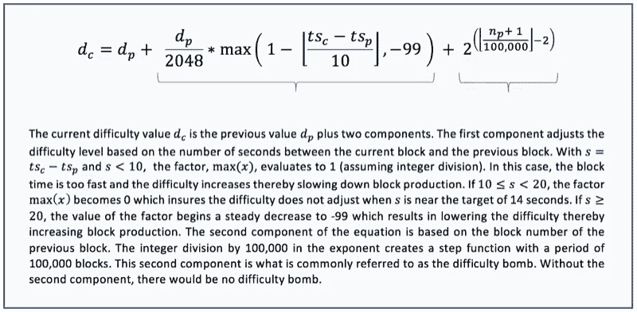
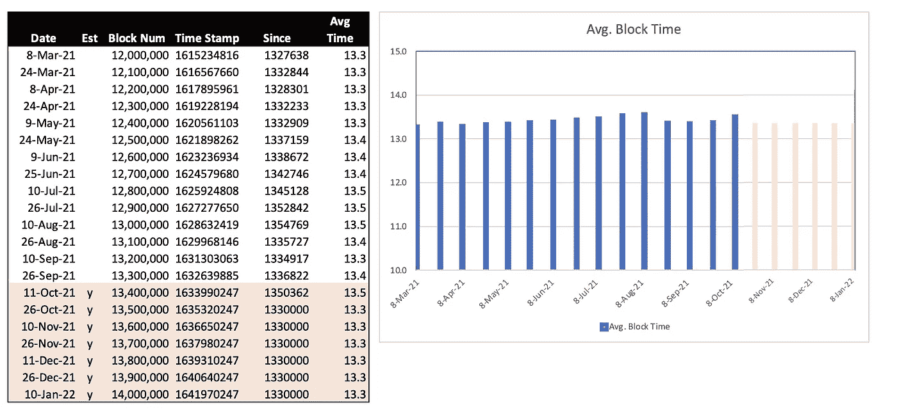
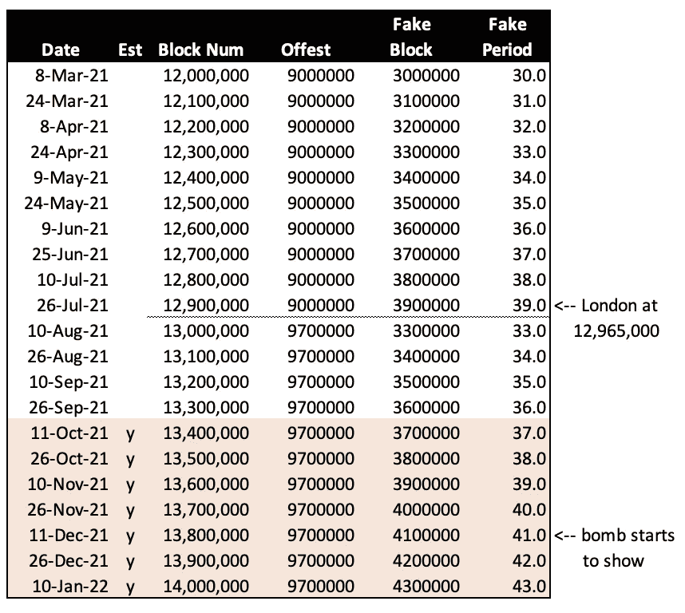
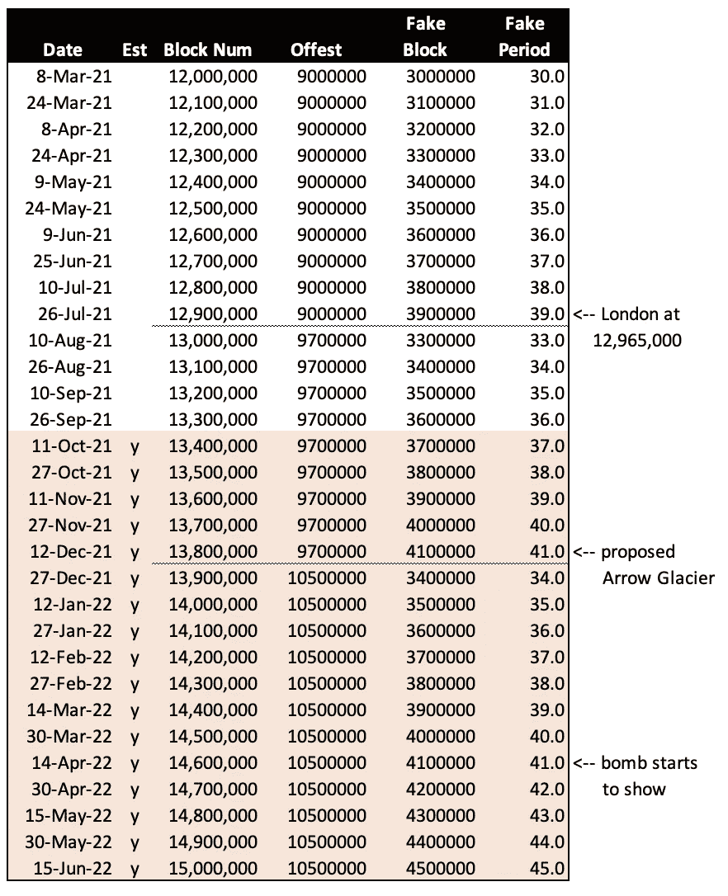
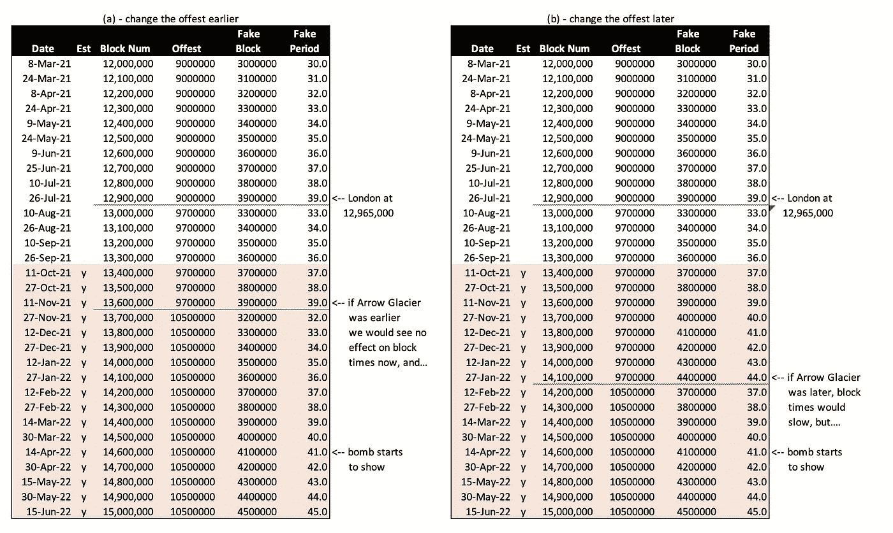
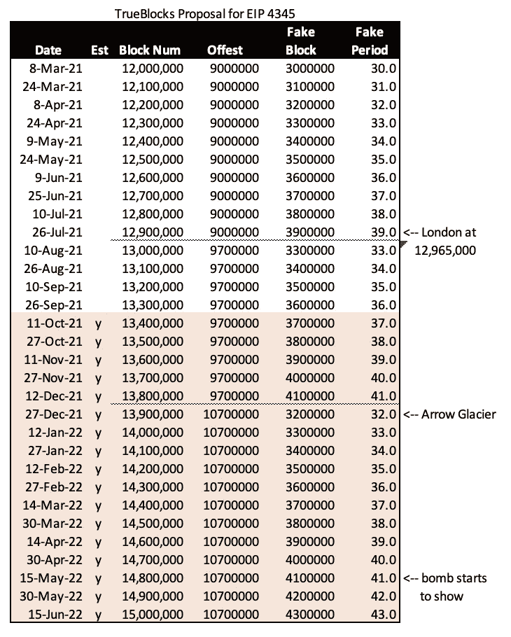

# 难度轰炸历险记

> 原文：<https://medium.com/coinmonks/adventures-in-difficulty-bombing-837890476630?source=collection_archive---------0----------------------->

预测阿罗冰川未来的一次演习

本文是预测 [EIP 4345](https://eips.ethereum.org/EIPS/eip-4345) 影响的练习。EIP 将难度炸弹设定在 2021 年 12 月的一个未定时间点。我们的目标是看看我们能否帮助确定何时以及多远设置炸弹，这样我们就可以预计它会在 2022 年 5 月再次爆炸。

## 一些准备工作

我以前写过很多关于这个主题的文章:

1.  一篇关于难度计算的文章叫做[这不是难](https://trueblocks.io/blog/its-not-that-difficult/)，
2.  一篇关于扩散难度炸弹的文章叫做[一种扩散难度炸弹的方法](https://trueblocks.io/blog/a-method-to-diffuse-the-ethereum-difficulty-bomb/)，
3.  还有一些其他的，比较老的文章[这里](https://trueblocks.io/blog/is-the-ice-age-affecting-block-production/)和[这里](https://trueblocks.io/blog/ethereum-block-production-continues-to-slide/)。

难度计算由第一篇文章中解释的两部分组成:`Part A`(对于`**adjustment**`)和`Part B`(对于`**bomb**`)。

`**adjustment**`或`Part A`是每个区块的调整，使区块时间保持在 13.5 秒左右。这部分工作得很好，在没有炸弹的情况下，可以保持封锁时间不变。我们对`Part A`不感兴趣。

`**bomb**`或`Path B`是每 100，000 个块加倍一次的阶跃函数。在它开始“爆炸”之前，它几乎不会被注意到，一旦它开始爆炸，它就会迅速爆炸(正如`**2^n**`往往会做的那样)。我们对炸弹感兴趣。

`**bomb**`的值仅取决于`**fake_period**`(在上述等式的第二部分中称为`**n_sub_p**`)。`**fake_period**`仅依赖于`**fake_block**`其仅依赖于当前块，以下称为`**real_block**`和`**offset**`。

## 一个警告

我只是一个人。我利用公开可用的数据和我自己日益疲惫的头脑写了这篇文章。我在这里所说的显然是开放讨论的，但我不承担任何责任。谨慎使用以下内容，并以怀疑的态度对待我所说的一切。

## 实际数据与理论数据

我是工程师，不是数学家，因此我对实际数据比对数学预测更感兴趣。在下文中，我将预测数据将如何变化。我的预测是基于方程式，但它只是一个简单、直接的 Excel 电子表格。

我的讨论基于三个简单的观察:

1.  `Part A`运行完美，平均生成 13.3 秒的块。
2.  `Part B`(`**bomb**`)也能完美工作；独立于`Part A`，仅增加阻塞次数。
3.  如果我们忽略炸弹，我们的预测将是保守的。

换句话说，如果我们做出的预测忽略了`**bomb**`的影响，我们的预测将是“早期的”如果我们错了，这就留下了额外的喘息空间。

第一个电子表格获取当前块(编写时为 13，391，127)并将其向前扩展每个块 13.3 秒，直到块 14，000，000:

更仔细地看，我们看到自 block 12，000，000 以来，平均 block 时间一直在增加(尽管在 8 月和 9 月有所减少)。当然，随着**炸弹**爆炸，平均格挡次数增加得更快。

同样，为了保守起见，我们选择了 13.3 秒来估计未来的块，请记住，我们忽略了`**bomb**`。当`**bomb**`开始显示时，平均阻塞时间增加，因此该估计产生的日期早于实际发生的日期。(换句话说，block 14，000，000 将“不早于”2022 年 1 月 10 日发生。)

## 何时开叉

我们需要考虑的第一个问题是，“我们应该什么时候分叉？”

在我看来，这个决定只取决于`**fake_period**`。问题是，“我们应该在 13，700，050，13，800，050 或 13，900，050 块分叉？”(此处添加“50”可确保不会出现一个接一个的错误——我将把这个问题留给读者自己解决——计算是使用大于`>`还是大于或等于`≥`？)

下一个电子表格显示了`**fake_block**`的计算。

这里我们估计了每个`**real_block**`发生的时间，并减去`**offset**`(即先前分叉的倒退)得到`**fake_block**`，通过简单的除法得到`**fake_period**`。

`**Fake_period**`是我们感兴趣的，因为`**bomb**`完全取决于那个值。根据以前的工作(见上面的文章)，我们相信当`**fake_period**`达到 41–42 时`**bomb**`开始显示，但不是更早。换句话说，`Part B`围绕`**fake_period**` 41 开始支配`Part A`。

我就不解释为什么上一段说“但不是更早”了。可以说，`**bomb**`只增加了阻挡时间，在没有`**bomb**`的情况下，`Part A`保持阻挡时间在 13.3 秒左右。换句话说，平均阻塞时间保持在 13.3 秒以上，如果低于 13.3 秒，`Part A`会对其进行调整，使其恢复正常——更简洁地说——`Part A`会起作用。

鉴于以上情况，我建议我们在 挡位 1380 万后随时叉 ***。也就是 12 月中旬左右。我会瞄准一个特定的区块，而不是一个日期，比如 1385 万。“痛点”(也就是明显变慢的阻塞时间)将在 1 月中旬左右开始，所以有一些出错的空间。***

## 我们应该抵消多少

我们需要考虑的另一个问题是，“我们应该`**offset**`多少块？

上面说过，`**offset**`决定`**fake_block**`，T1 决定`**fake_period**`，决定`**bomb**`。所以，接下来，我们将关注`**offset**`，看看我们能学到什么。

## EIP 的建议值 4354

首先，我们来看看 EIP 的建议值`**offset**`。同样，我们将生成一个简单的电子表格，假设平均阻塞时间为 13.3 秒。此外，我们将忽略`**bomb**`，因为`**bomb**`只能增加阻塞时间，因此会将计算转移到未来。箭头冰川`**ork_block**`(下一个硬叉的名字)我们用 13800050，`**offset**`用 10500000。

这似乎是说，如果我们后退 10，500，000 个块(建议值)，块开始变慢的最早时间将是 4 月中旬(`**fake_period**` 41)。到五月中旬，街区将开始明显放缓。

我们之前达到的最高值`**fake_period**`就在拜占庭之前，我们达到了`**fake_period**` 43。当时的减速相当明显——在几秒钟的范围内。

## 加快或推迟叉子的日期

作为一个简短的转移，我有兴趣看看如果我们(a)早一点进行硬分叉或者(b)晚一点进行硬分叉会发生什么。

下一个电子表格显示了估计的结果——我发现这有点令人惊讶——它似乎对下一个硬分叉没有影响。不过，经过进一步思考，这是有道理的。唯一决定`**fake_period**`的值是`**offset**`。如果我们要延迟，除了分叉前的减速块时间之外，分叉更早或更晚对下一枚*炸弹*爆炸的时间没有影响(即 4 月/5 月的那枚)。

你可以从上面的图表中看出，如果我们使用 10，500，000 块的`**offset**`，早一点或晚一点进行箭头冰川硬分叉对*下一个炸弹*何时开始产生影响没有影响。

**结论:**我们可以在任何舒服的时候做箭头冰川硬叉。

## 我们应该抵消多少？

下一个问题的答案是，“我们应该把`**offset**`往回开多远？”，看你想在 5 月核心 dev 上推多大力度。如果你想要一个很大的推力——以至于全世界都在抱怨缓慢的阻塞——使用一个较小的数字。如果你想要一个轻推——就像“我们最好尽快做点什么，但是我们还有时间”——使用一个更大的数字。

如果你用 10，500，00 买`**offset**`，你可能会产生一个很大的推力。你可以期待在四月下旬看到明显更慢的块(大约一秒)。但是，`**bomb**`的问题是，一旦它开始爆炸，它就会爆炸。

“明显”变成“相当明显”，再变成“关注”，然后是“神圣的狗屎”，然后是“什么他妈的”，以四到六周的方式。诚然，每 10 万块`**period**`需要更长的处理时间(因为`**bomb**`翻倍，块时间增加越来越快)，但一旦爆炸来了，就来得很快。见上面提到的关于拜占庭炸弹的文章。炸弹开始得很慢，但后来真的爆炸了。

在这个最终的电子表格中，我将建议我们使用 10，700，000 的`**offset**`。我还建议我们在 13，800，050 街区后分岔口。这留下了一些喘息的空间，并将对下一次爆炸的估计推迟到 5 月中旬，这也是保守的，但也是现实的。

**结论:**设置大于 10，500，000 的偏移量。

## 摘要

1.  决定你想对核心开发人员施加多大的压力。如果你想用力，把`**offset**`设置为 10，500，000。如果您想给自己留有喘息的空间，请将偏移设置为 10，700，000。折中一下。
2.  关于链“何时”分叉的决定对下一个 `**bomb**`的*没有影响(也就是对五月弹没有影响)。延缓或加快阿罗冰川硬分叉的唯一效果就是多长时间的格挡时间会在分叉*之前得到*。这是因为只有`**offset**`影响`**fake_period**`，只有`**fake_period**`影响`**bomb**`。*

## 支持我们的工作

TrueBlocks 完全由我们自己的个人基金和一些赠款自筹资金，如以太基金会(2018 年)、Consensys (2019 年)、Moloch DAO (2021 年)和最近的 Filecoin/IPFS (2021 年)。

如果你喜欢这篇文章，或者你只是想支持我们的工作，请访问我们的 git coin grant[https://gitcoin.co/grants/184/trueblocks](https://gitcoin.co/grants/184/trueblocks)。捐赠给下一轮比赛。我们得到了额外的好处，那就是更多的匹配资助。即使很少的量也会有很大的影响。

如果您愿意，可以随时将任何令牌发送到我们的公共以太坊地址，地址为 **trueblocks.eth** 或 0x f 503017d 7 BAF 7 FBC 0 fff 7492 b 751025 c6a 78179 b。

> 加入 Coinmonks [电报频道](https://t.me/coincodecap)和 [Youtube 频道](https://www.youtube.com/c/coinmonks/videos)了解加密交易和投资

## 另外，阅读

*   [CoinLoan 评论](https://blog.coincodecap.com/coinloan-review) | [YouHodler 评论](/coinmonks/youhodler-4-easy-ways-to-make-money-98969b9689f2) | [BlockFi 评论](https://blog.coincodecap.com/blockfi-review)
*   [CoinFLEX 评论](https://blog.coincodecap.com/coinflex-review) | [AEX 交易所评论](https://blog.coincodecap.com/aex-exchange-review) | [UPbit 评论](https://blog.coincodecap.com/upbit-review)
*   [折叠 App 审核](https://blog.coincodecap.com/fold-app-review) | [Kucoin 交易机器人](/coinmonks/kucoin-trading-bot-automate-your-trades-8cf0ca2138e0) | [Probit 审核](https://blog.coincodecap.com/probit-review)
*   [如何匿名购买比特币](https://blog.coincodecap.com/buy-bitcoin-anonymously) | [比特币现金钱包](https://blog.coincodecap.com/bitcoin-cash-wallets)
*   [币安 vs FTX](https://blog.coincodecap.com/binance-vs-ftx) | [最佳(SOL)索拉纳钱包](https://blog.coincodecap.com/solana-wallets) | [喜美元点评](https://blog.coincodecap.com/hi-dollar-review)