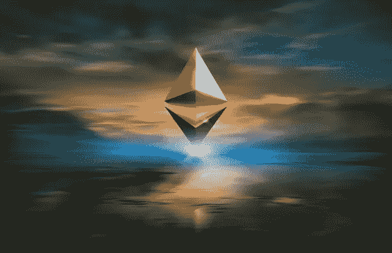

# 在一次成功的网络更新后，以太网达到了 4400 美元的新高

> 原文：<https://medium.com/coinmonks/after-a-successful-network-update-ether-reaches-a-new-high-of-4-400-fa0236466d24?source=collection_archive---------13----------------------->

After a major network update by Altair, Ether hit a record high of $4,402 on Friday.

答在一次成功的网络升级后，以太网创下了超过 4400 美元的新纪录，为 ETH 2.0 铺平了道路。

在 Altair 进行了一次重大的网络更新后，Ether 在周五创下了 4402 美元的历史新高。

在比特币价格达到近 66000 美元的历史最高水平几天后，比特币价格上涨。

高盛前高管劳尔·保罗自称:

> "比不负责任的龙还长"

以太坊区块链的本地加密货币以太周五创下新高，在一次重要的网络更新上线后超过 4400 美元。

根据 CoinDesk 的统计，这种数字货币飙升了 7%之多，达到 4402.13 美元，使其一个月的涨幅达到约 55%。

2018 年到目前为止，乙醚的价格已经上涨了 490%。按市值计算，它是第二大加密货币，价值约为 5150 亿美元。

在比特币于 10 月 20 日创下 66，974 美元的历史新高几天后，该网络升级为可扩展的利益相关共识架构。

以太坊 2.0，通常被称为 Eth2，在 10 月 27 日随着 Altair 的发布有了重大更新。

信标链机制是以太坊从工作证明网络向利益证明网络转变的核心，它被描述为第一次 mainnet 更新。

一种节能 PoS 网络被吹捧为比传统电力网络更快、更安全、更环保的网络。

以太坊工程师 Tim Beiko 告诉美国消费者新闻与商业频道 Make It，测试信标链是否工作的 Altair 更新证明了这一举措是可行的。

因此，他预测明年(Eth2)的过渡将会更加平稳。2022 年，区块链以太坊将经历一次重大转变。

虽然[比特币](https://asedeyhotnaija.com/has-the-luster-worn-off-gold/)和[doge coin 基于以太坊的竞争对手柴犬](https://sammaiyaki.medium.com/shiba-inu-coin-price-continues-to-rise-49b4989b1b25)最近主导了加密领域，但加密的支持者一直在等待以太爆发出创纪录的高点。

随着 ETH 2.0 的成功完成，Ether 达到了近 4400 美元的历史新高。

上周五，前高盛高管劳尔·帕尔(Raoul Pal)透露，他“不仅仅是不计后果地做多 ETH”，称他的加密投资组合包括 70%的 ETH 和 5%的比特币。

> “特别是在过去一个季度 Dapp(去中心化应用)领域发生的一切，以及流入 NFTs 和 DeFi 的 ETH 数量，”

Dragos Dunica 是 DeFi insight 平台 DappRadar 的联合创始人，据 Dragos 称，目前 ETH 的举措远比其他加密资产有趣。

他接着说:

> “作为领先的智能合约平台，以太坊的价格直接受到在最活跃的 DeFi、NFTs 和游戏类别中 Dapps 的不断采用的影响，”

> 加入 Coinmonks [电报频道](https://t.me/coincodecap)和 [Youtube 频道](https://www.youtube.com/c/coinmonks/videos)了解加密交易和投资

## 也阅读

 [## 最佳加密交易所| 2021 年十大加密货币交易所

### 编辑描述

blog.coincodecap.com](https://blog.coincodecap.com/crypto-exchange)  [## 2021 年 10 大最佳加密贷款平台| CoinCodeCap

### 编辑描述

blog.coincodecap.com](https://blog.coincodecap.com/crypto-lending)  [## 2021 年最佳免费加密交易机器人

### 2021 年币安、比特币基地、库币和其他密码交易所的最佳密码交易机器人。四进制，位间隙…

medium.com](/coinmonks/crypto-trading-bot-c2ffce8acb2a)  [## 最佳 4 个加密交易信号电报通道

### 这是乏味的找到正确的加密交易信号提供商。因此，在本文中，我们将讨论最好的…

medium.com](/coinmonks/best-crypto-signals-telegram-5785cdbc4b2b)