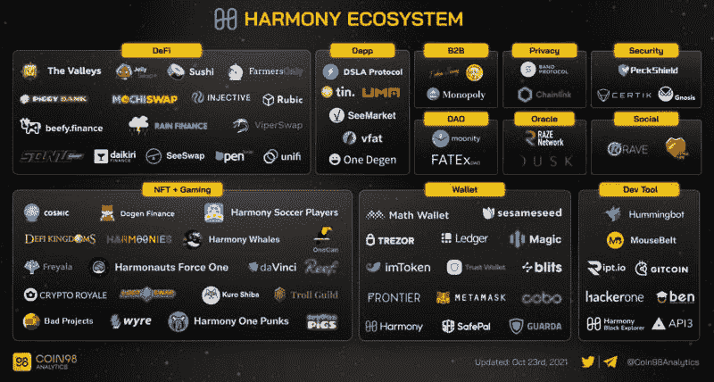
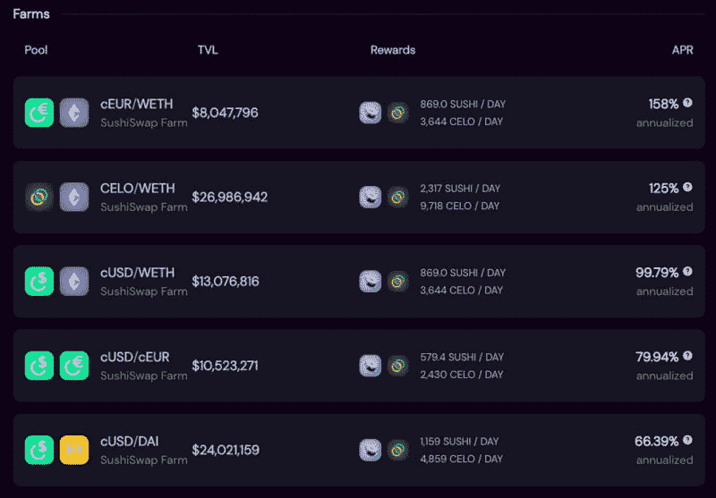
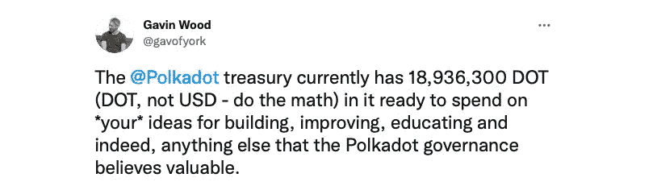
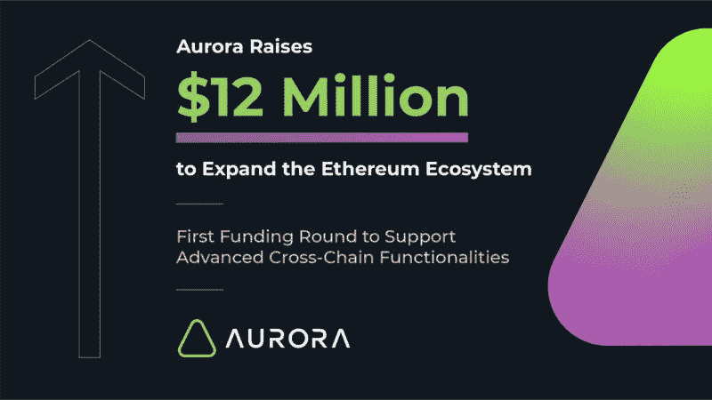

# 继 Avalanche 和 Fantom 之后，还有哪些公链生态正在腾飞？

> 原文：<https://medium.com/coinmonks/after-avalanche-and-fantom-what-other-public-chain-ecology-is-taking-off-4a7b43ba7a54?source=collection_archive---------2----------------------->

回顾过去一段时间的行业焦点，新公链的集体爆发无疑是最值得关注的趋势之一。

从 Solana 到 Avalanche，再到 Fantom 和 Terra，一个又一个以太坊外部公链在二级市场实现了价格突破，也迎来了生态层面的蓬勃发展，带动了一轮新的公链及其附属项目的崛起。

不过，虽然这轮行情相当强势，但由于来的太快，除了少部分提前完成布局的前瞻者，绝大多数投资者可能并没有吃到多少红利。

如果多链并存、互联互通的世界真的是未来的趋势，那么新公链的故事显然不会到此结束。环顾公链赛道，除了上面提到的明星选手，也有一些项目整体实力并不逊色，只是生态建设的步伐慢了半步。在本文中，我们将盘点其中的一些优质代表，简单梳理一下他们近期的重点动作和生态版图的现状。

结合雪崩、Fantom 等生态爆炸路径。，本文在选择公链代表时会优先考虑“生态激励资金”、“龙头项目旗帜效应”、“跨链便利”三个因素，所以现有的部分可能会省略。某知名名人公链，近期动作相对较少。

需要说明的一点是，本文不构成投资建议。只是基于目前公链轨道上重大项目的建设节奏来谈一些主观看法。读者们，请不要忘记 DYOR(自己做研究)。

> 订阅 [**Coinmonks Youtube 频道**](https://www.youtube.com/c/coinmonks/videos) 获取每日加密新闻。

# 和谐

Harmony 是一个专注于状态分片的高性能公共链。

Harmony 的分片技术结合了其独有的 EPoS 抵押机制和基于 VDF 的随机数算法，可以同时兼顾去中心化和安全性。同时，Harmony 的网络层优化实现了最佳的跨分片路由和快速块传播。

之所以说和谐是第一个，是因为生态的现状与之前几次生态爆发的路径高度契合:

**从“生态激励基金”来看，9 月 10 日，和谐正式宣布未来 4 年提供价值超过 3 亿美元的国库资金支持生态建设；**

**从“龙头项目旗帜效应”来看，Sushiswap 和 Curve 已经在 Harmony 上部署，上个月通过了引入 Aave 的提案。Harmony 打算通过巨额财政激励吸引 Aave 入住；**

**从“跨链便利”的角度来看，除了官方桥之外，Harmony 已经推出了与 Anyswap 的集成部署，但目前支持的币种有限。**

关于生态应用的进展，除了上面提到的 Sushiswap 和 Curve，目前在和谐生态中还有流动性更大的大型应用，包括 Defi Kingdoms、ViperSwap 等等。从产品功能来看，这些项目属于 DEX 细分赛道。借贷细分赛道还有一定的市场空白。随着 Aave 和其他类似项目的启动，这种情况有望得到改善。

# 塞洛

Celo 是我作为用户非常喜欢的一个新兴公链。Celo 与其他公链最大的区别在于其主打的“去中心化移动支付”概念。其中一个重要部分是在移动设备上实现和推广 DeFi 应用。

8 月底，Celo 正式宣布了“DeFi for the People”计划，计划提供超过 1 亿美元的资金，用于宣传、资助和激励措施，以促进生态系统的建设。在该计划的首批合作伙伴中，我们可以看到 Aave、Curve、Sushiswap、0x、UMA 等众多领先的 DeFi 应用。

10 月 14 日，SushiSwap 依靠该计划在 Celo 上推出 1260 万美元的流动性挖掘奖励。目前稳定的货币对(cUSD/DAI)收入可观。截止 10 月 23 日晚，年化数据有了。高达 60%+。

stablecoin 对的开采收益如此之高，在一定程度上也与 Celo 生态系统缺乏丰富的跨链桥梁有关。目前，Celo 还没有连接到主流的跨链桥，如 Anyswap、cBridge 和 xPollinate。唯一的替代方案是光学(有 Celo 官方背景)、Mobius 和其他更小的桥。

从生态学的角度来看，Celo 生态系统中比较主流的应用基本上都被选入了“DeFi for the People”计划。除了上面提到的龙头项目，还包括老牌的非破坏性彩票项目 PoolTogether，以及 Ubeswap、Moola Market 等生态原生项目。

# Polkadot 及其附属智能合约平台(如 Moonbeam)

如果治理提案#118 能够顺利通过社区公投，Polkadot mainnet 将于 2021 年 11 月 11 日正式启动 parachain slot 拍卖，这也意味着生态系统中期待已久的项目将获得主网的使用权。互联网的契机，正式拉开了 Polkadot 主网生态建设的序幕。

由于 Polkadot 独特的区块链建筑，其生态建设节奏与其他公链完全不同。上面提到的一些因素并不是很适合 Polkadot 目前的状态，但考虑到这个天网项目的深厚背景，其接下来的动向和趋势还是值得市场关注的。

值得一提的是，10 月 17 日，加文·伍德(Gavin Wood)在推特上表示，Polkadot 目前持有 18，936，300 dot(注意是 DOT，不是美元，价格可以自己计算)准备用于社区的建设，改善，教育的理念，以及 Polkadot 认为有价值的任何东西。这句话被很多人理解为波尔卡多特对巨大外部生态诱因的回应。

在生态层面，波尔卡多特生态中最优质的项目列表可以直接参考之前拍过草间弥生先锋网 parachain 槽的项目，如 Acala、Moonbeam、Astar、Bifrost、Phala 等。

这里我要强调一下 Moonbeam，它的先锋网络 Moonriver 已经作为第二个并行链接进入了草间弥生网络。作为一个完全兼容 EVM 并支持 Solidity 语言的智能合约平台，外部生态项目可以轻松地将其应用程序迁移到 Moonbeam。在之前公布的将集成到 Moonbeam 的项目列表中，可以看到 Sushiswap、Balancer 等很多已经建立的项目。

从某种意义上来说，Moonbeam 本身比 Polkadot 更像大家传统认知中的公链。这也符合最近的共识，即 Polkadot 越来越像第 0 层中继协议。

# 近的

号称拥有最优雅分片技术的 NEAR，也是公链赛道上不可忽视的新星之一。

单从二级市场来看，说 NEAR 还在上涨势头可能不太合适，毕竟它的代币涨了这么多。但从生态数据来看，无论是整体锁定规模还是头部应用，目前的近生态表现与雪崩相比仍有一定差距。

像上面提到的其他公共链一样，NEAR 最近宣布了巨大的生态激励措施。10 月 21 日，专注于投资 NEAR 生态系统的研发机构 Proximity Labs 宣布，将在未来四年内拨款 4000 万 NEAR tokens(价值超过 3 亿美元)，用于支持基于 NEAR 开发的项目、机构和个人。据悉，Curve、Sushiswap、Dodo 等知名项目以及 Ref、Burrow、Onomy 等原生项目均与 NEAR 达成合作，将成为这一激励计划的早期受益者。

与其他生态系统相比，NEAR 最有潜力的杀手锏是其以太坊扩张计划——极光。除了目前最主流的资产跨链，极光还将探索更高维度的数据跨链，希望提供给以太坊社区的用户和用户。开发者提供简单、直接和无缝的体验。

上周，极光刚刚完成了 1200 万美元的首轮融资，潘迪拉资本、蜻蜓资本等知名机构参与了投资，这可能会加速极光自身的发展以及整个 NEAR 生态系统的建设步伐。

# 阿尔格兰德

与其他公链不同的是，阿尔格兰德选择了一条“向外生长”的道路，即基于其丰富的学术和传统行业资源，链接区块链和传统世界，推动主流采用区块链技术，最终构建一条能够服务于实体商业世界的金融公链。

虽然发展路线存在差异，但上一节提出的三个要素同样适用于阿尔格朗的发展现状。9 月 10 日，阿尔格兰德基金会宣布启动 Viridis DeFi 基金，该基金将提供 1.5 亿阿尔戈斯(总价值超过 3 亿美元)，以促进阿尔格兰德连锁 DeFi 生态系统的成长。该基金的第一个行动是推出两个价值 500 万美元的 SupaGrants，旨在激励社区建立 oracles 和跨链桥服务。

Algorand 最近的另一个重要事件是其虚拟机 AVM 的发布。根据 algrand 首席产品官 Paul Riegel 的描述，AVM 可以提高 algrand 的智能合约性能，也将使新人开发者更容易在 algrand 链上开发程序。

在生态层面，Algorand 的应用系统与其他公链还是有显著区别的。第一，多基于原生项目，如 Yieldly、Tinyman、Algodex 等。，第二，会有一些与主流金融市场相关的项目，比如 SIAE。、维斯塔股权等。

# 公链大战远未结束

由于篇幅限制，本文无法涵盖赛道上的所有选手。它只是对个人目前感兴趣的项目的主观评论。

自区块链概念诞生以来，公链一直是最具挑战性和价值的赛道之一。在 DeFi、NFT 等应用层爆发的今天，公链的地位正在快速上升，赛道内的竞争也迎来了新的高潮。

再看行业，从以太坊，公链之王终于有了第二层的帮助，到专注互联网计算机概念的 DFINITY，再到激活智能合约的 Cardano，最轻的公链 Mina，还有“重启”的 EOS，趋势都是向上的。汤，群雄逐鹿。这场公链的“战争”结束还为时过早。

## 也阅读

 [## 最佳加密交易所| 2021 年十大加密货币交易所

### ICON _ PLACEHOLDEREstimated 预计阅读时间:28 分钟加密货币交易所的加密交易需要知识…

blog.coincodecap.com](https://blog.coincodecap.com/crypto-exchange)  [## 2021 年 10 大最佳加密贷款平台| CoinCodeCap

### 当谈到加密货币贷款时，大量因素等同于良好的收入状况。此外，借款的一部分…

blog.coincodecap.com](https://blog.coincodecap.com/crypto-lending)  [## 2021 年最佳免费加密交易机器人

### 2021 年币安、比特币基地、库币和其他密码交易所的最佳密码交易机器人。四进制，位间隙…

medium.com](/coinmonks/crypto-trading-bot-c2ffce8acb2a)  [## 最佳 4 个加密交易信号电报通道

### 这是乏味的找到正确的加密交易信号提供商。因此，在本文中，我们将讨论最好的…

medium.com](/coinmonks/best-crypto-signals-telegram-5785cdbc4b2b)  [## BlockFi 评论 2021:利弊和利率| CoinCodeCap

### 今天，我们提出了一个全面的 BlockFi 评论，这是一个成立于 2017 年的加密贷款平台，拥有其…

blog.coincodecap.com](https://blog.coincodecap.com/blockfi-review)  [## 如何在印度购买比特币？2021 年购买比特币的 7 款最佳应用[手机版]

### 如何使用移动应用程序购买比特币印度

medium.com](/coinmonks/buy-bitcoin-in-india-feb50ddfef94)  [## 加密税务软件——五大最佳比特币税务计算器[2021]

### 不管你是刚接触加密还是已经在这个领域呆了一段时间，你都需要交税。

medium.com](/coinmonks/best-crypto-tax-tool-for-my-money-72d4b430816b)