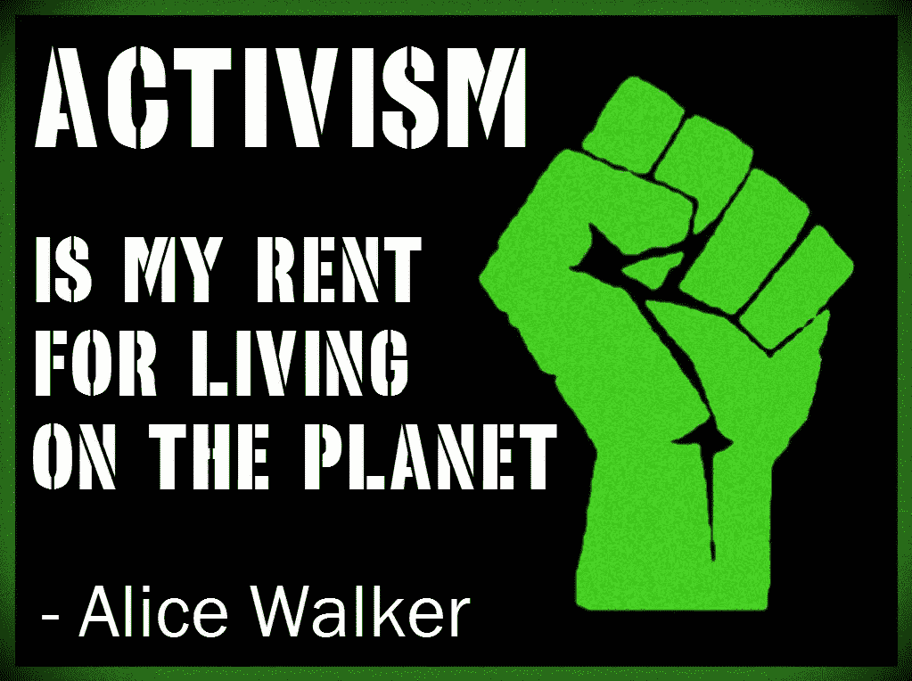

# 协议、区块链和社区第 1 部分:作为基础的共享价值观

> 原文：<https://medium.com/coinmonks/agreements-blockchain-and-community-part-1-shared-values-as-a-foundation-5719da348295?source=collection_archive---------13----------------------->

Follow me on [Twitter](https://twitter.com/theofficemystic) for updates to this series!

**语言。**最初的想法是简化 ***协议*** 和 ***人*** 需要理解的术语和 ***体现*** 以便与*一起工作。*

***沟通。**真实地表达我们对彼此感官的感知，这超越了单纯的文字，一旦交付，如果不被反驳，可能意味着合同。*

> ****说我们想说的，做我们想说的，做我们想做的。****

*我开始缩小《燃烧的人》的 10 个原则、蜂鸟社区的 19 个共同创造者协议、部落融合网络的 12 个核心价值观以及无数其他在集体、合作、共同激励的合作中友好相处的词语列表。*

*原则、协议、价值观。*

*计数和堆叠；对我来说简单的是三法则。于是就有了梦想生成:社区行动主义的再生教育。*

*与我生活、工作和建设的社区分享这些让我的梦想成真，我是指字面上的**！这里有建筑、食物森林，还有很多手绘的标志，还有配套的在线文档。***

***结构——物理的和虚拟的，由泥土和空气构成。***

******

***[The Village ABC’s: Building Blocks for Community](https://spark.adobe.com/page/n9hAn3rAxLjWr/) (a work in progress of my live teaching presentations)***

***意识、界限和同意似乎真的囊括了就无形结构达成一致的所有要素，我们可以在这种无形结构中很好地合作..整齐的三个一组。***

***一旦种下种子，它很快就生根、发芽、开花；然后再次结籽，种子乘风飞翔，飞过大地。***

******

***The Village Hour with DaniBelle. On Lucid Vibe Radio beginning 8/8/18!***

***一切似乎都可以归结为这三件事之一。直到，他们扩大了..到三套三个。***

*   ***欢迎来到这个圈子！**敏捷、简洁&简洁*****
*   ***为人的本质:**意识，界限&同意*****
*   ***社会责任行动主义:**盟友，边界&文化*****

> ***村 ABC 的增长，然后增长分开，不得不“分叉”。***

******

***Image leveraged from this article: [https://www.influencive.com/7-predictions-blockchain-technology-2018/](https://www.influencive.com/7-predictions-blockchain-technology-2018/)***

*****那么这和区块链有什么关系呢？*****

***我个人在社区建设工作中关注的三个词是人、地方和项目。项目将一个地方的人(物理的和/或虚拟的)的力量联合起来，为一个集体的意图而合作。***

***虽然我喜欢坚持三点，但我也喜欢用这三点来说明一点。人们放置他们的项目的目的是——我们都分享的一件事..我们的家园，地球..这个星球。***

******

> ***我们人民是有力量的，我们团结起来就更有力量。我们放大传递的信息以便更好地传播。***

***明智地使用我们的力量需要在明智的使用上达成一致。这需要团队合作，作为一个社区——无论我们是合作生活、工作、玩耍、梦想、庆祝还是创造..某物..一起。***

***为了做好这一点，我们需要就影响整体的个人选择达成某种形式的共识。从我的所见、所闻和经历来看，大多数问题总是可以通过改进某一个方面来解决。***

******

***Image lifted from: [https://engineering.leeds.ac.uk/courses/PG/G235/communications-and-signal-processing](https://engineering.leeds.ac.uk/courses/PG/G235/communications-and-signal-processing)***

*****沟通**。***

***在我曾经参与的每个团队或圈子中，都存在着一种无处不在的需求，那就是让所有与所陈述(或要求)的内容有利害关系、有利益关系的人都能清楚地听到自己的声音。***

******

***People are multicellular organisms, and communities are networks of people.. we are all engaged in [intercellular communications](https://www.slideshare.net/Raghusolanki001/cellular-communication-in-multicellular-organisms), cell signalling, as part of simply being LIVING beings.***

***并接受..某物(一个信号？)..反过来，这表明信息已经被第一次听到，然后要么被接受，要么被修改，以便在追求一致的过程中进一步审查。这是一次对话——一次持续的对话或小组讨论，清晰的交流中经常缺少的是交流的记录。***

> ***区块链增加了交易所协议的两个基本要素——透明度和问责制。***
> 
> ***这是一项颠覆性的技术..正如..人们。***

***它正在破坏的是当前系统嵌入其结构中的秘密的或健忘的、不清楚的和/或不/有意模糊的实践。***

***为了研究区块链，特别是以太坊，我来到了 [MyCrypto](https://medium.com/u/19919043dcef?source=post_page-----5719da348295--------------------------------) 。来自[的泰勒·莫纳汉](https://medium.com/u/544d2eb94cf?source=post_page-----5719da348295--------------------------------)的这个演讲确实打动了我，主要是因为它抓住了 ***的一个中心主题:我们在做什么以及为什么要做*** ..我们这些人，一起做事，实现我们的共同目标，让世界变得更美好。***

*** [## 去中心化的未来是人

### 这是我最近在 2018 麻省理工学院比特币博览会上做的一个演讲。它已被修改，以适应更广泛的在线…

medium.com](/mycrypto/the-decentralized-future-is-people-49c566a88d66) 

以下是泰勒的一些语录和图片，它们引起了我的共鸣和灵感，我希望你能从中受到启发，阅读完整的故事:

> 区块链将会彻底改变今天许多已建立的系统。它将打破边界，推翻中央集权的寻租者。

> 我们——人民——将共同把这一理想转变为现实。

> 我们需要找到我们正在做的事情的目的。关于比特币、以太坊或区块链的一些东西引起了你的兴趣，激发了你的灵感，驱使你去做*一些事情，*即使这些事情只是在阅读这篇文章。"

> “一旦你受到启发，一旦你掉进这个兔子洞，你需要分享、协作、合作和一起工作。”

[MyCrypto](https://mycrypto.com/account) is one of the tools I’ve selected for ‘getting into the blockchain’.

“建设这个未来需要作家、教育家、艺术家和分享者，就像需要编码员和工程师一样。建立一个生态系统需要各种类型的人，做各种各样的事情。”

“尽管我们喜欢谈论所有这些花哨的技术，思考产品、代码和区块链，但我们不能忘记，归根结底，**去中心化的未来是人**。

> 我们需要像你这样的人，像我这样的人，我们所有人一起努力。我们需要我妈妈或者你的教授以及介于两者之间的任何人。…我们需要**那些对一切事物都有完美类比的人**来帮助向这个领域介绍新人。"

“Accept that. Shift your thinking.” ~[Taylor Monahan](https://twitter.com/tayvano_)

“经常有人走过来告诉我‘我做不到……’或者‘我对区块链了解不多……’

去他妈的。如果你正在读这篇文章，与世界上 99%甚至不知道区块链是什么的人相比，你是一个专家。”

耶！！

绝对改变了我的想法，也重新安排了我的一些优先事项。

**让我们回到协议——原则和价值观。**

这些是 [Status](https://medium.com/u/fbf3ec9c4a40?source=post_page-----5719da348295--------------------------------) 的值，今年夏天的 [Blockternship](/giveth/the-social-coding-blockternship-daca7b642de4) (区块链社交编码实习)的联合发起人之一:

 [## 巴塞尔原则

### 在巴塞尔安全信息会议期间，我们花了一些时间讨论现状原则——我们重视的东西……

discuse . status . im](https://discuss.status.im/t/principles-from-basel/175) 

人们需要这种共同价值观和原则的基础来指导我们的工作，并本着一种基本的信念有效地合作，即我们为了相同的目的而在一起…或者至少，我们同意在接受这些规定条款的基础上运作。

当我们在过去和未来之间架起桥梁的时候，我们也需要其他的东西。

> I’***I’我打算去那里，这里用“JOB”这个词。***

我们都有自己的工作。我们在工作，我们在努力为建筑建造一个稳定的基础，我们在建造建筑，我们经常在“边上”做这些..作为一个独立于我们的“逐个工作”的激情项目。

> *人们如何通过区块链开始了解这些新的透明和问责工具，以及生活中正在发生的所有其他事情？*

I don’t recommend [this route](http://connietuttle.com/blog/pick-one-thing/) — it’s not for everyone. Yet, mwhahaha.

嗯，我不能完全告诉你，我能告诉你的是**挑选一些东西。**

选择一个你真正关心并想支持的人、一个地方或一个项目。

现在，我选择了整个该死的星球，放弃了我自己的房子和汽车..一段时间内。

我是我生命中的改变，我全职做我想做的事情。

我可以告诉你的另一件事，也将在这个系列中继续谈论，就是在这个领域有很多工作，适合各种各样的人，做各种各样的事情。

> 这里有你的位置，你只需要做一点点工作来发现你想要创造什么，以及你现在的技能如何为已经在那里寻找你的项目团队做出贡献。
> 
> 然后，确保这是一个很好的匹配你的未来的学习路径，发展你想体现的新技能。

我推荐阅读来自 [Ceri Power](https://medium.com/u/5f1cbea507f5?source=post_page-----5719da348295--------------------------------) 的这个关于在分权组织中工作的故事。

 [## 在分权组织中工作的高潮和低谷

### 在这篇博文中，我们将深入探究分散贡献的好、坏和丑陋之处。

博客.状态. im](https://blog.status.im/the-highs-and-lows-of-working-in-a-decentralized-organization-60e508f83342) 

正如她早先所说的:

> 分散式组织鼓励无权限参与(组织内外的任何人都可以通过贡献自己的技能参与进来)

> “这需要对自主、隐私、个人自由和开源的核心价值观有很大的信心。
> 
> 一个巨大的挑战是，只有少数类似的社区在做这件事，所以对于许多刚进入这个世界的贡献者来说，这可能是一个非常新的领域。很难改变思维模式，开始以社区而不是公司的方式思考(对于我们这些来自更传统背景的人来说！)"

我非常认同这一点，因为我来自企业信息技术的传统背景。

下面列出的实体目前正在进行“Blockternship”合作，其中一些也有职位空缺——请查看。

# 社会编码者的时间敏感通知！

Hop over to [Yalor Tackson](https://medium.com/u/33144025168f?source=post_page-----5719da348295--------------------------------)’s [post](/giveth/the-social-coding-blockternship-daca7b642de4) for full details!

# 如何进入

**#1** 前往【https://github.com/blockternship】T2 看一看`[起飞](https://github.com/Blockternship/take-off)回购的所有细节，然后当你准备好开始自己的项目时，前往[`项目`](https://github.com/Blockternship/projects)回购并在 8 月 7 日前提交和[发布](https://github.com/Blockternship/projects/issues/new?title=Your%20Amazing%20Ethereum%20Idea!!!&body=Tell%20us%20what%20your%20project%20is%20all%20about%20?) **。**

## [给予](https://giveth.io/)

> 在 Giveth，我们相信社区改变世界的力量，这就是我们创建 [Giveth DApp](https://beta.giveth.io/) 的原因，它可以使用以太坊区块链实现真正透明的捐赠跟踪。我们都是关于分散治理的实验，我们强烈支持“开源”作为一种生活方式。我们所有的软件都被认为是给以太坊社区的礼物，这是这次黑客马拉松的灵感来源。

## [阿拉贡](https://aragon.org/)

> Aragon 是一个项目，旨在建立分散的组织，并使他们的治理。我们已经发布了我们最初的 [Aragon 核心客户端](http://app.aragon.one)，装载了一些启动应用程序，以激发您对未来组织如何使用去中心化工具来管理自己和邀请参与的想象。

 [## 加入阿拉贡一号

### 阿拉贡一号在做什么，我们目前招聘的职位和我们的社区推荐计划

博客.阿拉贡. one](https://blog.aragon.one/join-aragon-one-18ba965c0c0c) 

## [虫群城市](https://thisis.swarm.city/)

> 我们在虫群城充满热情地为以太坊建立一个界面，它非常友好，我们的妈妈可以使用它。虫群城市的用户可以交流，互相交换价值，并作为好演员赢得声誉，而不会被区块链技术的细枝末节所迷惑。事实上，他们甚至几乎不知道区块链参与其中，这鼓励了收养。

此外，这些人给区块链初学者提供了很棒的资源:

 [## 什么是区块链技术？初学者的循序渐进指南

### 区块链是一个不可否认的巧妙发明——一个人或一群人的智慧结晶

blockgeeks.com](https://blockgeeks.com/guides/what-is-blockchain-technology/) 

Thanks for sharing the planet — meet me at [Riot](https://giveth.io/join/) to join the Giveth Galaxy!

您可以有多个目标。

先挑一个目标。***