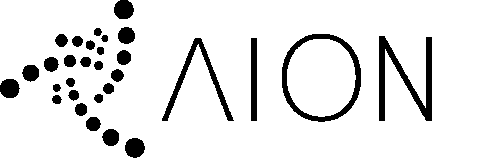

# 前部缺血性视神经病

> 原文：<https://medium.com/coinmonks/aion-33e01538dadf?source=collection_archive---------0----------------------->

## 对 IOTA 来说意味着什么？

这是一篇描述 IOTA AION 好处的短文。IOTA 基金会通过[生态系统发展基金](https://blog.iota.org/the-5th-cohort-of-iota-ecosystem-development-fund-grantees-5cbf05227525#ac6a)资助的选择性永久节点解决方案。

## 简而言之:是什么？

IOTA 及其独特 Tangle 技术允许理论上无限量的交易。这很好，但对于当前的设置，这也意味着理论上无限的存储需求。

这就是 AION 的用武之地，它允许有选择地永久存储混乱的部分，并删减其余部分，同时在数学上保持一致。为了获得所有的技术细节，我会给你看我在第五届荷兰 IOTA 会议上做的[演讲](https://www.youtube.com/watch?v=giatJB-j2pE&t=1962s)。

我在这里真正想谈的是，它对所有有兴趣使用 IOTA 或基于 IOTA 进行开发的人来说意味着什么:

## 开发人员可以托管他们自己的数据

看起来很简单，对吗？但是现在，如果您正在使用 IOTA 进行开发，并且不希望您的概念证明的数据总是从不可变的分类帐中删除，那么您将不得不托管所有的数据并禁用快照。有了 AION，您将能够拍摄快照并保留仅与您的应用程序相关的数据。值得一提的是，这在恒定时间内有效。这意味着每秒交易量的变化不会影响您的个人存储需求。

## 托管自己的 IOTA 节点的直接动机

当前的激励主机 your own nade 类似于您的节点运行 AION 时的情况。您希望保持数据的活力。但不同的是，随着时间的推移，托管所有数据将变得越来越困难。产生了能让你访问数据的服务。实质上集中了缠结的存储。有了 AION，您可以运行一个相对较轻的节点，从而参与共识，同时保持数据与您的应用程序“实时”相关。从而创建了运行 IOTA 节点的直接激励，而没有创建几个大型集中式存储集线器并保持 IOTA 免费的威胁。

## 数据变得可以传输

[AION 描述需要存储什么的独特方式也引入了一种有效地从其他节点传递您想要的数据的方式。允许您将 Tangle 的某个子集从一个节点推到另一个节点。创建对重要数据(如数字身份)进行数据复制的能力。或者只是为了备用。这也导致了:](/coinmonks/tangle-pathway-58fb13e19eff)

## 运营节点的财务激励

*需要注意的是，这不是 AION 项目的一部分！但它将允许其他人在此基础上扩展并创造商业模式。*

因为我们现在可以很容易地描述混乱的部分，并且保存数据的要求是已知的，所以我们可以开始要求别人托管数据。这打开了廉价的 Tangle 主机市场的潜力，同时保持自己做的可能性！

## 自主数据

自描述、个人所有和可转让的事务集创造了更加独特的东西。我个人对此非常兴奋，这就是自主数据的概念。这似乎是一个时髦的概念，但它实际上是所有自我主权解决方案的基础。因为如果你不能描述什么数据是“你的”,不能在其他人托管的节点/数据库中识别它，因此不能将它拉到你控制的系统中，那么你在此基础上建立的所有其他东西都不具备自我主权的概念。

以自我主权身份为例，这个许多人都同意的概念在正确实施时是革命性的，但最终只是数据。特定格式的数据，但数据仍然存在。位和字节(是和尝试)。

现在想象一下，你的雇主声称你很优秀，并签署了你是项目 X、Y、z 的一部分的事实。他们拥有这些关于你的声明，但现在公司破产了…数据去哪里了？你失去了关于你的主张吗？通常情况下，这正是所发生的事情，因为检查这些声明的地方消失了，但有了自我主权数据的概念(以及 AION 如何实现这一点)，你现在可以“拉”出与你相关的数据，并自己托管，而不会失去所述声明的完整性！这一切都是通过使用标准 IOTA 协议实现的，这意味着没有人知道是否有人正在使用数据或将数据移动到自托管系统。

> 选择退出应用程序的能力创造了真正的功能竞争。

因此，自主数据创建了“退出”应用程序和数据的选项，并转移到另一个前端/接口。想象一下，把你的 youtube 数据加载到 dtube，或者把你的 facebook 数据加载到 minds.com。应用程序开发人员需要倾听用户的意愿，或者其他人的意愿。只有这样，真正的功能竞争才能最终存在。

想了解更多关于 AION 的信息，请随时联系我:

 [## Olaf van Wijk -开源开发者- IOTA | LinkedIn

### 查看 Olaf van Wijk 在世界上最大的职业社区 LinkedIn 上的个人资料。奥拉夫有 6 个工作列在他们的…

www.linkedin.com](https://www.linkedin.com/in/ovanwijk/)  [## 奥拉夫·范维克

### 来自 Olaf van Wijk (@ovanwijk)的最新推文:“事务锁定和(时间扭曲的)路径查找正在进入# IOTA

twitter.com](https://twitter.com/ovanwijk) 

或者奥拉夫·范·韦克#1273 关于不和。

> [在您的收件箱中直接获得最佳软件交易](https://coincodecap.com/?utm_source=coinmonks)

