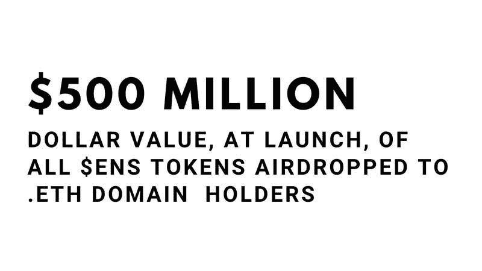
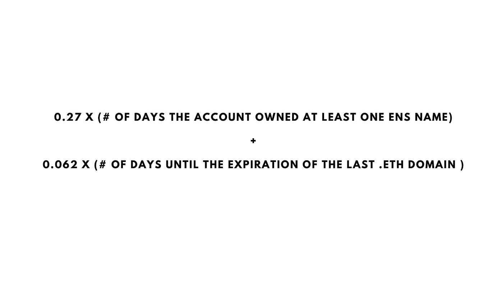
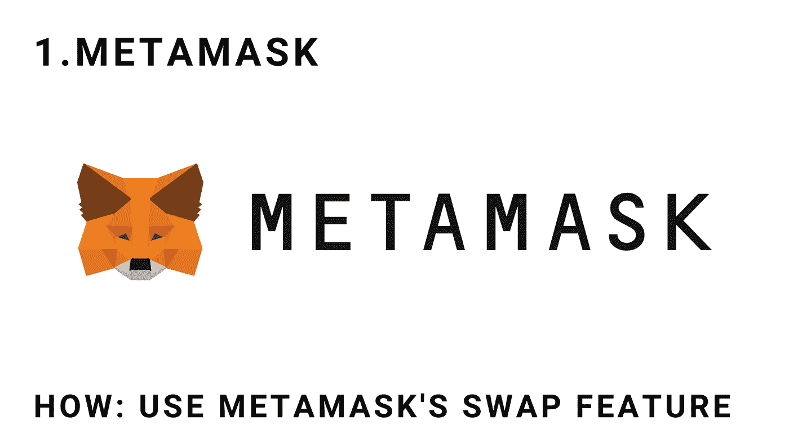
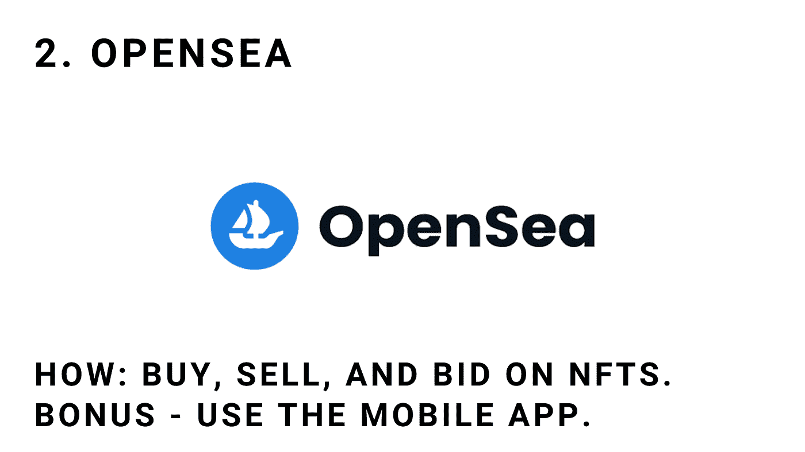
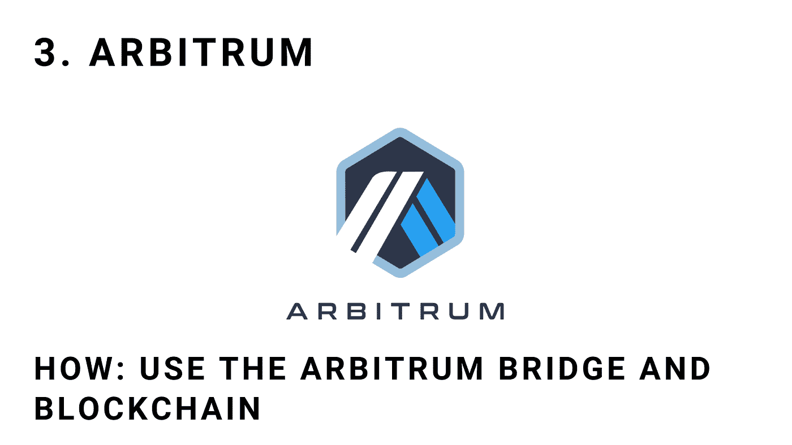
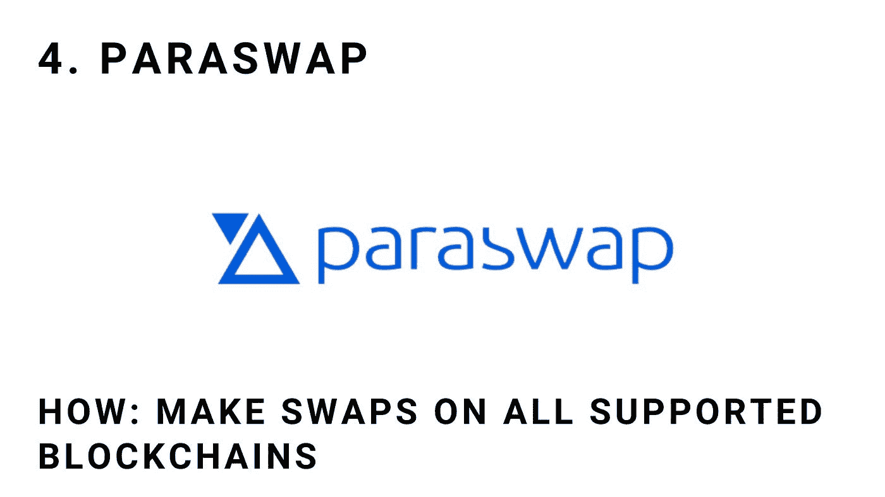
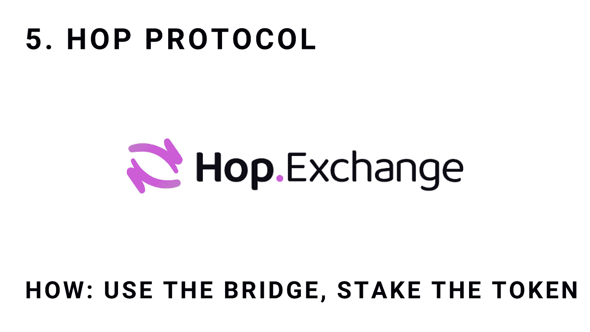

# 空投 101:你的免费加密指南(不，真的)

> 原文：<https://medium.com/coinmonks/airdrops-101-your-guide-to-free-crypto-no-really-8d605a5340a5?source=collection_archive---------2----------------------->

# 我只把一小部分内容放在媒体上。如果你想获得所有加密实用主义新闻更新、投资公告和 altcoin 报告的全部信息，请在此免费注册简讯。

5 亿美元的闲钱？听起来好得难以置信。

如果你在过去一周密切关注 altcoin 新闻，你可能会看到一些关于一个名为$ENS 的新令牌的讨论。高级版本:以太坊，在其存在的早期，创建了一个名为 ENS(以太坊名称服务)的服务，并最终推出了一个代表该服务所有权的令牌。

这个想法是创建一个去中心化的域名和管理机构。com，。org，还有。net 由一个名为 ICANN 的集中组织管理。eth names 的目标是创建一个去中心化的、基于区块链的服务(DAO，即数字自治组织)来执行相同的功能。

​

**空投的是什么？**

但是要创建一个道，你需要成员，而且成员越多越好。因此，当 ENS 推出代表 DAO 成员资格的令牌时，他们决定以某种方式将它公平且免费地分配给已经是利益相关者的人:在本例中，是那些已经注册的人。eth 域名。

注册一个名字很简单，而且在过去很便宜，尽管最近高昂的汽油费意味着现在注册一个. eth 域名至少要花 100 美元。但是这种早期采用和小投资现在得到了回报。eth 域名持有者可以申请空投。

​

**空投的规模有多大？**

假设你注册了一个单身。2021 年 10 月 15 日 eth 名称，只是出于好奇，注册了最小时间段:一年。

​

这个实验进入了。在撰写本文时，eth 域名已经为你赢得了大约 27 个 ENS 令牌，价值 2241 美元——这是最低的。在许多情况下，早期注册 ENS 名称的帐户可以获得超过 10，000 美元的收入。这不仅限于几个人，它发送到超过 137，000 个地址，总共分发了大约 5 亿美元(尽管自推出以来代币已经上涨了约 3 倍)。

我先说坏消息:你错过了。airdrop 现已关闭，如果您还没有注册. eth 名称，那就太不走运了

好消息是什么？这些空投一直都在发生。其他空投现在价值数千美元:Ribbon Finance 向早期用户空投了 20 万美元的代币，dYdX 空投价值 5 万美元。这是非常真实的钱，虽然数额通常很低，但它们有时可以改变生活。

​

**为什么空投会存在于加密货币中？**

大多数基于加密和区块链的项目都会发行一个代币，因为经济上讲得通:投资者和创始人需要得到报酬。至于他们是否会空投该令牌是另一回事，但是理解为什么会出现这些令牌分发对于理解哪些协议可能会空投是很重要的:

*   分散治理:想要分散的加密协议可能会通过空投分发令牌，因为这是奖励早期采用者的民主和平等的方式。
*   **Bootstrap Liquidity:** 向流动性农民提供激励，戏弄空投，将资金、流动性和早期采用者吸引到一个平台。
*   **大肆宣传:**本周早些时候，$ENS 代币是一个巨大的新闻故事，甚至传到了主流媒体。代币价格爆炸。
*   **建立社区:**当某人获得免费代币时，他会突然在游戏中围绕特定项目拥有皮肤。这就是为什么我们经常看到 NFTs 空投给现有的 NFT 车主。

注意:令牌不会均匀分布在所有用户中。不同的协议希望在他们的平台上鼓励不同的行为，并防止游戏系统，因此当你试图获得空投资格时，你必须有策略。

​

**今天，我将讨论五个有可能在不久的将来向用户空投令牌的加密组织，以及你必须做些什么才能符合条件:**

​

**什么是 Metamask:** MetaMask 是一个基于以太坊的软件加密钱包，旨在与在线 Web3 应用程序集成。它集成了币安智能链、Avalanche 和以太坊 L2 扩展解决方案。

**谣言:**在大多数行业观察者看来，MetaMask 令牌下降几乎是确定无疑的。这个钱包来自区块链科技公司 ConsenSys，该公司由以太坊的联合创始人之一 Joseph Lubin 创立。他甚至在 Twitter 上暗示了元掩码令牌(可能是 Mask)。

**原因:** Joseph Lubin 是一个非常隐秘的创始人，MetaMask 可能是最重要的 Web3 产品。ConsenSys 正在寻求分散产品的事实意味着令牌更有可能用于 MetaMask，令牌的民主化将意味着可能的空投。

**如何实现:**大多数投机者表示，代币的分配将取决于用户对 MetaMask 内部“交换”功能的利用程度，该功能允许用户直接在钱包内交换代币。

​

**什么是 OpenSea:** OpenSea 是世界上最大的 NFT 交易平台，建立在以太坊之上。

谣言:关于 OpenSea token 的发布，只有一些谣言，没有得到证实，但是许多业内人士推测这只是时间问题。

**原因:**随着比特币基地、FTX 和非以太坊竞争对手推出与 OpenSea 竞争的平台，创建一个真正社区所有的 NFT 交易所可能是 OpenSea 保持其在该领域立足点的一种非凡方式。

**如何进行:**没有办法确切知道空投物资将如何分配，但在 NFTs 上进行买卖和竞标可能会让你获得途径。也有可能——下载和使用 OpenSea 移动应用程序的奖励。

​

**什么是 Arbitrum:** Arbitrum 是一个以太坊第二层扩展解决方案，可以在远离主网的地方以低廉的价格结算交易。

**谣言:**围绕 Arbitrum 用代币去中心化有很重的谣言。该团队尚未证实，但这是最大的以太坊无令牌扩展解决方案之一。

**原因:** Arbitrum 因其扩展解决方案的安全性受到了一些批评，该解决方案对验证器给予了更高程度的信任，以实现更高的速度和效率。但这也带来了一些担忧。Arbitrum 可能会分散管理，以此作为品牌推广的一项举措。

**如何做:** Arbitrum 确实提供了两种产品:一种桥梁和一种区块链。谁也说不准他们会如何分配代币，所以同时玩桥牌和区块链，以最大限度地提高资格。

​

****

**什么是 ParaSwap:** Paraswap 是一个 DEX 聚合器，这意味着它可以比较不同交易所的价格，并允许您在直接交换代币时获得最佳交易。

**谣言:**虽然创始人否认了近期空投的计划，但它几次暗示有代币，链上分析师已经找到了其 ERC20 代币的合同。

**为什么:**大部分 DEXes 都有代币，投资人/创始人会需要退出。如果不分配给用户，它真的是分散的吗？

**如何:**在支持的区块链上通过 Paraswap 进行直接代币互换:以太坊、币安智能链、雪崩、多边形。

​

**什么是跳交换:**跳协议(hop.exchange)允许用户跨网络交换 L2 令牌。例如，您可以从多边形网络向 Arbitrum 交换令牌。

**谣言:**创始人转发了一个空投谣言，引起了人们对一个还没有协议的令牌发射的怀疑。不是确认，但是很有可能。

**原因:**目前，Hop 在瑞士是一个法人实体，但它是受 DAO 管辖的。因此，在某个时候，一个令牌几乎肯定会被释放，至于令牌是否会被空投，我们只能拭目以待。

**方式:**这种空投可能是最复杂的收集方式:最简单的方法就是使用桥梁来回移动资产。你也可以入股或提供流动性(两者都比互换稍微复杂一点)。

​

**收尾**

恭喜你，你找到了一个免费的钱故障。这不是免费的——空投是有成本的。获取这种潜在收益的成本并不是很大的金融风险，也不是通过波动来维持。

**空投的成本是获取信息。**那些寻求知识、从事研究、参与秘密社区的人最有可能受益。那些不做跑腿工作的人很可能会错过。

和往常一样，密码世界颠覆了传统的所有权和资本模式，那些有准备的、渴望的、能承受风险的人将脱颖而出。寻找空投不是运气，这是一个非常真实的方式来赚取有意义的免费密码。

恭喜，祝空投狩猎愉快。

[**点击这里**](https://cryptopragmatist.com/sign-up-medium/) **每周从 Crypto Pragmatist 获取内容，绝对免费。**

> 加入 Coinmonks [电报频道](https://t.me/coincodecap)和 [Youtube 频道](https://www.youtube.com/c/coinmonks/videos)了解加密交易和投资

## 也阅读

 [## 最佳加密交易所| 2021 年十大加密货币交易所

### 编辑描述

blog.coincodecap.com](https://blog.coincodecap.com/crypto-exchange)  [## 2021 年 10 大最佳加密贷款平台| CoinCodeCap

### 编辑描述

blog.coincodecap.com](https://blog.coincodecap.com/crypto-lending)  [## 2021 年最佳免费加密交易机器人

### 2021 年币安、比特币基地、库币和其他密码交易所的最佳密码交易机器人。四进制，位间隙…

medium.com](/coinmonks/crypto-trading-bot-c2ffce8acb2a)  [## 最佳 4 个加密交易信号电报通道

### 这是乏味的找到正确的加密交易信号提供商。因此，在本文中，我们将讨论最好的…

medium.com](/coinmonks/best-crypto-signals-telegram-5785cdbc4b2b)  [## BlockFi 评论 2021:利弊和利率| CoinCodeCap

### 编辑描述

blog.coincodecap.com](https://blog.coincodecap.com/blockfi-review)  [## 如何在印度购买比特币？2021 年购买比特币的 7 款最佳应用[手机版]

### 如何使用移动应用程序购买比特币印度

medium.com](/coinmonks/buy-bitcoin-in-india-feb50ddfef94)  [## 加密税务软件——五大最佳比特币税务计算器[2021]

### 不管你是刚接触加密还是已经在这个领域呆了一段时间，你都需要交税。

medium.com](/coinmonks/best-crypto-tax-tool-for-my-money-72d4b430816b)  [## 存储比特币的最佳加密硬件钱包[2021] | CoinCodeCap

### 编辑描述

blog.coincodecap.com](https://blog.coincodecap.com/best-hardware-wallet-bitcoin)  [## Pionex 评论 2021 |免费加密交易机器人和交换

### Pionex 是为交易自动化提供工具的后起之秀。Pionex 上提供了 9 个加密交易机器人…

medium.com](/coinmonks/pionex-review-exchange-with-crypto-trading-bot-1e459d0191ea)