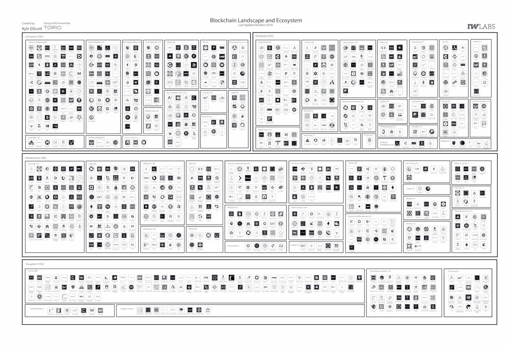

# 航空公司发行首张基于区块链的机票/沃尔玛、雀巢、家乐福/DApp 首次批准应用支付

> 原文：<https://medium.com/coinmonks/airline-issues-first-blockchain-based-tickets-walmart-canada-nestle-carrefour-first-apply-8676f3b3a082?source=collection_archive---------1----------------------->

Photo by [Paul Gilmore](https://unsplash.com/@paulgilmore_?utm_source=unsplash&utm_medium=referral&utm_content=creditCopyText) on [Unsplash](https://unsplash.com/?utm_source=unsplash&utm_medium=referral&utm_content=creditCopyText)

2019 年 11 月 20 日

*让我们直接进入本周的版本，宣布*德国航空公司**哈恩航空**发行首张区块链机票*。在更多的头条新闻中，我们了解到沃尔玛正在加拿大推出一个基于区块链的货运和支付系统。* *也在本周* ***雀巢*** *和* ***家乐福*** *将他们的区块链追踪力度延伸到婴儿奶粉上。****The Block G*enesis****发布了一份关于数字资产、加密货币、区块链世界最新【2019 年 10 月】的 200+页的强烈推荐报告。**

**在 DApps 的版图中，我们说的是* ***甲骨文网络，以太 2.0********草间弥生。*** *加* ***勇者*** *v1.0 推出，****arc block****升级了其 DApp 平台，我们看到了第一个 Apple Pay 获批的 DApp。我们甚至在大量的研究(* [*Q3 2019 区块链格局*](https://www.topionetworks.com/events/5d79268b78e00230faba6f77) *) &书籍(关于* [*数字资产*](https://www.scribd.com/document/430637579/Current-Market-Overview-of-Digital-Assets)*&*[*企业区块链*](https://www.amazon.com/dp/B07Z3LJCHW/ref=cm_sw_r_tw_dp_U_x_C6iSDbACJJN2Z) *)以及对风险投资的见解(新基金！！)、基础设施、DApps、比特币、经济学、交易所和 Stablecoins。为了了解更多信息，让你跟上时代的步伐，这里有一张本周业内热门新闻的快照。****

## *📈[苏黎世的银行家为技术人员和比特币初创公司让路](https://www.bloomberg.com/news/articles/2019-11-18/zurich-s-bankers-make-way-for-techies-and-bitcoin-startups)*

*在苏黎士的主要街道班霍夫大街上，一座曾经是私人银行所在地的建筑已经变成了区块链的发展中心。它吸引了像谷歌和脸书这样的大公司，以及一大群密码公司。附近的楚格因其比特币和区块链公司的集中而被称为“加密谷”，其中一些活动已经开始蔓延到苏黎世，截至 2018 年底，苏黎世已有 114 家金融科技公司，高于一年前的 88 家……[阅读更多信息](https://www.bloomberg.com/news/articles/2019-11-18/zurich-s-bankers-make-way-for-techies-and-bitcoin-startups)*

## *📖[德国航空公司哈恩航空发行首张区块链机票](https://www.reuters.com/article/us-blockchain-airlines-hahn-air-idUSKBN1XS1TC)*

*德国航空公司哈恩航空(Hahn Air)与开源旅游分销平台 [Winding Tree](https://windingtree.com/) 合作，通过后者的区块链技术发行机票。该平台允许航空公司列出库存，管理预订请求，并在预订过程完成后接收付款。顾客可以使用现金、信用卡或加密货币——乙醚或缠绕树的令牌，Lif… [阅读更多](https://www.reuters.com/article/us-blockchain-airlines-hahn-air-idUSKBN1XS1TC)*

## *📖[沃尔玛加拿大推出基于区块链的货运和支付系统](https://cointelegraph.com/news/walmart-canada-rolls-out-blockchain-based-freight-and-payment-system)*

*零售公司沃尔玛(Walmart Canada)推出了一个基于区块链的自动化网络，用于货物跟踪和支付管理，该网络是与 DLT 实验室合作开发的。新系统使用分布式分类帐技术来跟踪交付、验证交易，并在沃尔玛加拿大公司及其承运商之间自动进行支付和对账，这些承运商每年向加拿大各地的 400 多家零售店交付库存。根据沃尔玛加拿大物流和供应链高级副总裁 John Bayliss 的声明，他提到这一全新的动态互动区块链技术平台在沃尔玛加拿大和我们所有承运商合作伙伴之间创造了完全透明……[阅读更多信息](https://cointelegraph.com/news/walmart-canada-rolls-out-blockchain-based-freight-and-payment-system)*

## *📖[脸书的 Libra 代码无视监管僵局继续前行](https://techcrunch.com/2019/11/15/libra-code/)*

*Libra Association 在一篇帖子中宣布，其技术基础设施完全忽略了对其加密货币的激烈监管反弹。处理交易的天秤座节点现在由[比特币基地](https://medium.com/u/b9034df3e57a?source=post_page-----8676f3b3a082--------------------------------)、【优步】、[野牛踪迹](https://medium.com/u/e9a232ffaa7b?source=post_page-----8676f3b3a082--------------------------------)、伊利亚特、 [Xapo](https://medium.com/u/75cfb7e7d720?source=post_page-----8676f3b3a082--------------------------------) 、[安克雷奇](https://medium.com/u/6d1871dd1b61?source=post_page-----8676f3b3a082--------------------------------)和脸书的 Calibra 运营。另外六个节点正在建立中，另外还有八个由缺乏技术团队的成员建立，这意味着所有 21 个成员都有正在运行或正在工作中的节点……[阅读更多信息](https://techcrunch.com/2019/11/15/libra-code/)*

## *📖[币安爆炸性崛起的内幕](https://decrypt.co/11327/the-inside-story-of-binance-explosive-rise-to-power)*

*这篇文章讲述了[币安](https://medium.com/u/57600910a883?source=post_page-----8676f3b3a082--------------------------------)如何逃离中国，乘着比特币牛市，一年赚了 5 亿美元，并计划进行货币革命……[阅读更多](https://decrypt.co/11327/the-inside-story-of-binance-explosive-rise-to-power)*

## *📖[中国绿茶溯源平台获得批准公章](https://cointelegraph.com/news/chinese-vechain-tea-traceability-platform-gets-official-seal-of-approval)*

*一个由 VeChain 驱动的茶叶追溯平台已经得到了双江县政府的官方认可。茶砖从原材料到消费者的整个生命周期将被记录在[vechainhor](https://www.vechain.org/)区块链上，顾客可以通过智能手机扫描二维码或 NFC 标签来查看……[了解更多信息](https://cointelegraph.com/news/chinese-vechain-tea-traceability-platform-gets-official-seal-of-approval)*

## *📖[雀巢、家乐福将区块链追踪延伸至婴儿奶粉](https://www.coindesk.com/nestle-carrefour-extend-blockchain-tracking-effort-to-baby-milk)*

*雀巢和家乐福正在使用 IBM 的区块链食品信托平台来跟踪有机婴儿奶制品“从乳品到货架”区块链平台将追踪 GUIGOZ Bio range 2 和 3 婴儿奶粉，为消费者提供更多关于牛奶来源的信息和产品检测的透明度… [阅读更多](https://www.coindesk.com/nestle-carrefour-extend-blockchain-tracking-effort-to-baby-milk)*

> **👉立即注册领取 2019 年第三季度* [*区块链基础设施景观*](https://www.topionetworks.com/events/5d79268b78e00230faba6f77) *版**

## *📖[中央银行计划劫持我们的区块链生态系统](/beyondhype/the-central-banks-plan-to-hijack-our-blockchain-ecosystem-68d1ae666de8)*

*由于加密货币的兴起，银行业在过去几年受到了重大干扰的威胁。政府和银行监管机构正在努力遏制比特币等虚拟货币的创造和使用。它们在数字领域变得非常流行和有用，从而威胁到对政府发行货币的需求。他们未经许可，分散… [阅读更多](https://cointelegraph.com/news/study-chinese-blockchain-spending-to-exceed-2b-by-2023)和更多[基诺蒂·埃德温](https://medium.com/u/26f7202b445f?source=post_page-----8676f3b3a082--------------------------------)*

# *本周阅读的研究:*

# *本周的更多内容:*

*📖[以太坊 2.0(宁静号)](/swlh/a-comprehensive-view-of-ethereum-2-0-serenity-5865ad8b7c62)综合图作者[谢尼克斯](https://medium.com/u/6cd9a35b6109?source=post_page-----8676f3b3a082--------------------------------)*

*📖 [SingularityNET 的分散式人工智能市场与贝宝](https://blog.singularitynet.io/singularitynets-decentralized-ai-marketplace-integrates-with-paypal-39e5091e2f8f)通过 [Ben Goertzel](https://medium.com/u/592d3ced6bce?source=post_page-----8676f3b3a082--------------------------------) 整合*

*📖[一个可行的分散式 Oracle 网络的七项要求](/@The_Crypto_Oracle/the-seven-requirements-for-a-viable-decentralized-oracle-network-e634710ea11f)作者[加密 Oracle](https://medium.com/u/f6d6f2b4a1ff?source=post_page-----8676f3b3a082--------------------------------)*

*📖[为什么俄罗斯密码公司隐藏他们的身份](https://decrypt.co/11652/why-russian-crypto-companies-hide-their-identity)*

*📖[弗朗西斯科·克雷莫纳](/simply-vc/why-the-world-needs-oasis-network-2a5141d2d4da)[用绿洲网络](https://medium.com/u/689bf820155e?source=post_page-----8676f3b3a082--------------------------------)分散网络基础设施*

*📖[通过](/shapeshift-stories/breaking-down-tokenomics-65838ed06e47)[变形](https://medium.com/u/5ee4b8323e7a?source=post_page-----8676f3b3a082--------------------------------)分解记号组学*

*💰[加密挑战总结](/equilibrium-eosdt/crypto-defiance-wrap-up-8426c4d5e151)由[平衡 _EOSDT](https://medium.com/u/5db4a8782ba2?source=post_page-----8676f3b3a082--------------------------------)*

*💰 [ConsenSys](https://medium.com/u/6c7078bf7b01?source=post_page-----8676f3b3a082--------------------------------) [CSO 寻求为新的区块链投资基金募集 5000 万美元](https://cointelegraph.com/news/consensys-cso-seeks-to-raise-50m-for-new-blockchain-investment-fund)*

*💰[马克尔道的迁移:你需要知道的一切](/mycrypto/makerdaos-migration-everything-you-need-to-know-c10e04a97fb2)作者 [MyCrypto](https://medium.com/u/19919043dcef?source=post_page-----8676f3b3a082--------------------------------)*

*📖[当前数字资产市场概述](https://www.scribd.com/document/430637579/Current-Market-Overview-of-Digital-Assets)作者[大卫·内奇](https://medium.com/u/b23d2fb9948a?source=post_page-----b48e000a0f21----------------------)*

# *分散式应用程序手表*

## *📖[如何衡量您的应用程序是否准备就绪](/@storjproject/how-to-measure-whether-your-application-is-ready-for-prime-time-637907cc011c)*

*当我们着手建立一种新型的云存储时，我们知道这将是一个挑战。我们需要从一开始就确保最高级别的性能、可靠性和弹性。说到数据丢失，人们是不会原谅的。(惊喜！)为了衡量我们的分散式云存储解决方案是否满足了客户的需求，是否具有我们可以大力支持的性能和耐用性，我们创建了一系列可以衡量的指标，这些指标对我们的平台、我们的公司和我们的开发人员社区非常重要……[阅读更多信息](/@storjproject/how-to-measure-whether-your-application-is-ready-for-prime-time-637907cc011c)并查看更多来自 [Storj Labs](https://medium.com/u/31bb19d6e641?source=post_page-----8676f3b3a082--------------------------------)*

## *📖[这个基于区块链的社交媒体网络是第一个 Apple Pay 批准的 DApp](https://cointelegraph.com/news/this-blockchain-based-social-media-network-is-the-first-apple-pay-approved-dapp)*

*在 2019 年的 [BlockShow](https://medium.com/u/882988ecaef8?source=post_page-----8676f3b3a082--------------------------------) Asia 上，Pepo 创始人兼首席执行官[杰森·戈德堡](https://medium.com/u/e1698c392e7a?source=post_page-----8676f3b3a082--------------------------------)推出了一款拥有 15，000 名用户和超过 45，000 次点对点交易的新产品，该产品名为 [Pepo](https://pepo.com/) ，旨在改变人们为加密社区创建内容的方式。产品 Pepo 是大约四年的研究和倾听密码社区的结果。该应用可在苹果和安卓设备上下载，它的行为就像一个内置加密钱包的社交媒体网络……[阅读更多](https://cointelegraph.com/news/this-blockchain-based-social-media-network-is-the-first-apple-pay-approved-dapp)*

## *📖 [ArcBlock 升级了 dApp 友好型和企业友好型区块链平台 1.0](https://www.cryptonewsz.com/arcblock-upgraded-its-dapp-friendly-and-enterprise-friendly-blockchain-platform-1-0/52046/)*

*[ArcBlock](https://medium.com/u/24f0ce349daf?source=post_page-----8676f3b3a082--------------------------------) 宣布发布其 ArcBlock 区块链平台 1.0，即更新后的区块链平台。ArcBlock 平台使任何人都可以在几分钟内启动自主定制的区块链，利用可扩展的跨链开放协议，多个区块链可以相互连接和通信，形成区块链网络……[阅读更多信息](https://www.forbes.com/sites/lukefitzpatrick/2019/11/01/samsung-galaxy-s10-users-can-now-access-tron-dapps/)*

## *📖[看一看由](/tokendaily/a-look-at-the-kadena-network-launch-c956ea30e07a)[穆罕默德·福达](https://medium.com/u/71db1014568a?source=post_page-----8676f3b3a082--------------------------------)发起的嘉手纳网络发布会*

*Kadena 是一个致力于通过使用几个并行链来解决功率可扩展性的项目，这些并行链一起工作以形成一个统一的编织链。在 2019 年 11 月的第一周，Kadena 团队决定以有限功能模式悄悄向公众推出该项目的 mainnet。… [阅读更多信息](/tokendaily/a-look-at-the-kadena-network-launch-c956ea30e07a)*

## *📖[勇敢 1.0 终于来了，但它能在浏览器的战争中脱颖而出吗？](https://cryptobriefing.com/brave-here-stand-out-war-browsers/)*

*隐私优先公司 [Brave](https://brave.com/) 终于推出了基于谷歌开源 Chromium 项目的网络浏览器 1.0 版本，该项目目前处于测试阶段。开源浏览器声称彻底改变了用户与出版商和广告商的互动方式，同时还提供了 3-6 倍的速度和更安全的浏览体验……[阅读更多](https://cryptobriefing.com/brave-here-stand-out-war-browsers/)*

*📖[宣布蜂巢 Dapp 店](/clc-group/announcing-the-honeycomb-dapp-store-9815ba42d4a2)由[Heikki vnttinen](https://medium.com/u/40cc21fcf541?source=post_page-----8676f3b3a082--------------------------------)*

*📖[由](/@alfredoantonio.decandia/erc721-token-record-on-ethereum-the-cryptonomist-ac4c7cef6a88) [Flexa](https://medium.com/u/b170d306deb0?source=post_page-----8676f3b3a082--------------------------------) 宣布 Flexa 产能*

*📖[以太坊上的 ERC721 令牌记录——密码学家](/@alfredoantonio.decandia/erc721-token-record-on-ethereum-the-cryptonomist-ac4c7cef6a88)作者[阿尔弗雷多·德·坎迪亚](https://medium.com/u/3e308ecfb31e?source=post_page-----8676f3b3a082--------------------------------)*

# *📺收听:*

*本周我将深入探讨[区块链的未来如何](https://www.youtube.com/watch?v=tMeu3qredbI)？来自 Block.one 的 Brendan 与美国消费者新闻与商业频道的 Brian Sullivan 坐下来讨论一些当今企业提出的大问题。区块链对企业有什么影响？为什么政府准备好了区块链？我们能从 90 年代的技术泡沫中学到什么*

> **👉下载最新* [*区块链用于基础设施景观*](https://www.topionetworks.com/events/5d79268b78e00230faba6f77) *Q3 2019 版**

**

*Q3 2019 Edition of the Blockchain for Infrastructure & Ecosystem Landscape*

*不想等到下周，[现在就订阅](http://click1.m.readwritelabs.com/xsdqkbbrgsdtqkmntpjlstcnkytvpvphsnhsqlvbrhhd_yfqbfcmslnskglmckvqv.html?source=post_page---------------------------)📥有关区块链、DApps 等的实时行业见解！*

> *[在您的收件箱中直接获得最佳软件交易](https://coincodecap.com/?utm_source=coinmonks)*

****