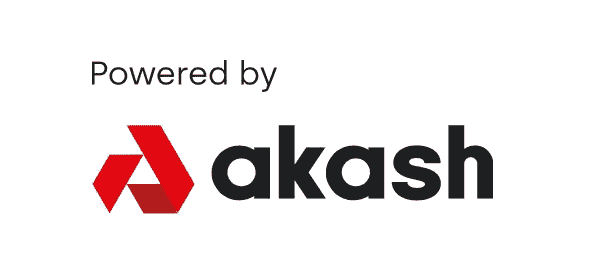

# 阿卡什:分散的云

> 原文：<https://medium.com/coinmonks/akash-the-decentralized-cloud-fdfce345895c?source=collection_archive---------5----------------------->

我们已经远离了运行个人专用机器来托管您的网站或应用程序的时代。今天，大多数人和企业使用 AWS 或 GCP 作为运行自己的服务器和数据中心的替代品。亚马逊网络服务、谷歌云项目和微软 Azure 是目前排名前三的云计算提供商，它们进行颠覆的时机已经成熟。如果 AWS、GCP 和 Azure 是我们云计算行业的“酒店”,那么 Akash 就是 Web 3.0 的 AirBnB。Akash 允许任何人以自己选择的价格出租他们闲置的计算能力。有了 Akash，用户可以利用他们的旧电脑和/或在他们通常关闭或闲置的时间里使用他们当前的电脑来创造被动收入。这种计算机能力的众包是一个有可能改变我们与互联网互动方式的想法。在任何给定的时间，都可能有数百万台机器未被使用，这些机器可以用来驱动 Akash 网络。就像维基百科利用人类的认知盈余来建设和维护他们的网站；阿卡什使用计算机认知盈余在万维网上托管网站和应用程序。

Akash 的使命是通过利用最新的区块链技术提供一个无许可的、独立的、开放的云计算服务。对于开发者来说，Akash 是一种快速、高效、最重要的廉价方式来部署他们的网站或应用程序。在本文发表时，Akash 正在运行的分散式云计算服务比 AWS 便宜 41%，比 GCP 便宜 59%，比 Azure 便宜 46%。通过依靠由节点、验证者、委托者、提供者和租户组成的区块链治理系统，Akash 能够以如此大的折扣提供他们的服务。然而，对于最终用户来说，无论他们访问的网站是由 AWS 还是 Akash 托管的，产品都是一样的。Akash 网络的最终用户可能甚至没有意识到他们正在参与区块链协议，更重要的是，他们没有必要了解区块链技术是 Akash 生态系统的一部分。这就是 web 3.0 的实现方式；区块链留在后台，伟大的用户界面显示在前台。使 Akash 成为云计算 AirBnB 的是它对当前浪费或未使用的计算能力的利用和民主化。Akash 推出的前 112 天有 100 个活动部署，仅 26 天后，这个数字就翻了一番，达到 200 个。目前在 Akash 网络上大约有 500 个活跃的部署，并且这个数字还在继续稳步增长。

## **阿卡什背后是谁？**

Akash 由首席执行官 Greg Osuri 和首席技术官 Adam Bozanich 创建。南方共同市场和博扎尼奇在科技领域都有着令人印象深刻的历史。Osuri 是 AngelHack 的创始人，angel hack 创建了 hackathon.io，并负责在全球范围内运行分布式 hackathon。博扎尼奇共同创立了 Sprouts Tech，这是一家面向企业的软件开发公司。Osuri 和 Bozanich 也是超频实验室的共同创始人，该实验室开发工具、基础设施和协议，以使互联网的基本要素开放、分散和安全。超频实验室似乎让他们两人直接创建了 Akash。阿卡什已经从 Wakem Capital Management、Chainlayer 和 Outpost Capital 等公司筹集了风险投资。

## **科技**

Akash 于 2020 年 9 月 25 日推出了 mainnet 1.0，目的是赋予$AKT token 经济价值，并允许进行标桩和治理。最初的部分发布也是为了确保协议的稳定性和安全性。阿卡什随后在 2021 年 3 月 7 日推出了具备完全云计算能力的 mainnet 2.0。Akash 是一个利害关系证明区块链协议，这意味着所有进程都由节点、验证者、委托者、提供者和租户控制，并且所有系统都保持安全，因为如果任何人不诚实地行事，他们的$AKT 股份都有可能被烧毁。Akash 使用 Cosmos SDK(软件开发工具包)构建，与目前部署在 Cosmos 上的 255 个应用程序和服务具有根深蒂固的互操作性。宇宙区块链的治理令牌是$ATOM。$ATOM 目前的市值约为 110 亿美元。Cosmos 专门从事 IBC(区块链内部通信)，允许区块链之间的资产和数据无缝传输。Akash 的本地 IBC 和 Tendermint 共识协议的使用使其在其他区块链协议中脱颖而出。为了理解为什么我们必须仔细研究 Akash 背后的协议

**验证者**是为获得区块链和最终确定新区块的权利而投入$AKT 的节点，因此从新区块创建中收取一部分费用。要运行节点或验证器，必须将$AKT 下注不少于 30 天，并可选择下注超过 1 年的任何金额。

**下注者**根据下注的代币数量、锁定时间长度以及系统中下注的代币总数获得相应奖励。这提供了适应熊市和价格压力波动的供应流入。

**委托人**借给验证人$AKT 以获得一部分块奖励。这通常是由定期投资者在代币。

**提供商**将他们的计算能力出售给租户，并且还必须根据这些销售额，按照他们的小时收入分成一部分 AKT。

**租户**使用反向拍卖方法以公平的市场价格从提供商那里购买计算能力。这意味着请求云计算空间的单个租户设定他们的要求，服务提供商对租赁进行投标。这使得租户可以完全控制谁在托管他们的数据，以及他们为此支付多少费用。

Akash 网络最令人兴奋和创新的方面是它能够让租户以多种加密货币进行支付。租赁费用以$AKT 计价，但可以使用任何白名单令牌结算。提供商将令牌列入白名单，并设置与$AKT 相关的期望汇率。通过使用新货币共识协议，这一汇率保持合理。Tendermint 共识协议允许所有验证者通过对令牌汇率进行投票并使用加权媒介计算这些投票来达成共识。加权平均值的使用消除了异常值，因此不容易被滥用。使用 Tendermint 共识协议消除了对 oracle 的需要，Oracle 会降低交易速度并容易被滥用。该系统保护提供商和租户免受$AKT 令牌价格波动的影响，这反过来允许更多的采用，因为消除了用户和提供商的风险。

## **为什么是阿卡什？**

自 2021 年 3 月 7 日其全功能 mainnet 上线以来，Akash 已显示出巨大的增长。Akash 使用多令牌经济激励系统来赢得众包计算，这在该领域是革命性的。虽然每个交互都使用$AKT 令牌，但并不是每个与 Akash 生态系统交互的人都需要使用$AKT。随着 Akash 的增长，这已经并将继续加速采用，这将反过来提高每 AKT 美元的价格。Akash 使用反向拍卖方法来确保最终用户可以通过最便宜的途径访问 Akash 的网络服务。Akash 以远低于竞争对手的价格提供越来越有价值的服务，同时提供一致的服务质量。云基础设施目前是一个价值 324 亿美元的行业，预计到 2022 年将达到 2100 亿美元。很容易看到 Akash 成为 Web 3.0 的主要贡献者，并占据云计算市场的大部分份额。

## **我们为什么投资？**

阿卡什网络很容易符合我们的投资主题。这个团队得到了高度认可，并得到了精明投资者的支持。他们使用 Cosmos SDK 部署的事实意味着 Akash 已经是一个庞大且不断扩展的生态系统的一部分。这份白皮书给人留下了深刻的印象，并且经过了彻底的审查。用户可以用他们选择的任何密码购买云计算，这对于 Akash 网络的未来采用是一个巨大的优势。Web 3.0 的发展非常有趣，我们相信 Akash 有潜力成为这个领域的巨大贡献者。AKT 的市值仍在 2 亿美元左右。如果我们考虑到不断增长的生态系统和 Akash 网络的潜在用例，很容易想象$AKT 很快就会进入数十亿市值的类别。

## 现在怎么办？

现在，我们关注采用、增长和其他关键绩效指标。目前，我们认为$AKT 被低估，因此长期持有。我们认为$AKT 有强大的潜力达到其目前市值的 10 倍或更多，从而导致$AKT 代币价格的大幅上涨。只会创造出 3.89 亿美元的 AKT。这种低供应量应该意味着随着 AKT 美元市值的上升，价格将大幅上涨。阿卡什已经显示出稳定和快速的采用。Akash 最近宣布了与氦的合作伙伴关系，并携手将氦验证器迁移到 Akash 网络上。只要阿卡什网络和宇宙中心继续扩张，我们相信$AKT 代币将会增值。

*作者 David Coryat，Istari Capital LP 的加密专家和分析师。*

【https://www.istari.io/ 

*此内容仅供参考，您不应将任何此类信息或其他材料理解为法律、税务、投资、财务或其他建议。本报告中的任何内容均不构成 Istari 或任何第三方服务提供商在该司法管辖区或任何其他司法管辖区购买或出售任何证券或其他金融工具的邀约、建议、认可或要约，根据该司法管辖区的证券法，此类邀约或要约是非法的。请注意，Istari Capital LP 投资于本文讨论的项目或与本文相关的项目。*

加入 Coinmonks [电报频道](https://t.me/coincodecap)和 [Youtube 频道](https://www.youtube.com/channel/UCbyDhTbOiKh2iUMKBi4-4Zg)了解加密交易和投资

## 另外，阅读

*   [尤霍德勒 vs 考尼洛 vs 霍德诺特](/coinmonks/youhodler-vs-coinloan-vs-hodlnaut-b1050acde55a) | [Cryptohopper vs 哈斯博特](https://blog.coincodecap.com/cryptohopper-vs-haasbot)
*   [币安 vs 北海巨妖](https://blog.coincodecap.com/binance-vs-kraken) | [美元成本平均交易机器人](https://blog.coincodecap.com/pionex-dca-bot)
*   [新加坡十大最佳加密交易所](https://blog.coincodecap.com/crypto-exchange-in-singapore) | [购买 AXS](https://blog.coincodecap.com/buy-axs-token)
*   [投资印度的最佳加密软件](https://blog.coincodecap.com/best-crypto-to-invest-in-india-in-2021) | [HitBTC 评论](/coinmonks/hitbtc-review-c5143c5d53c2)
*   [加拿大最好的加密交易机器人](https://blog.coincodecap.com/5-best-crypto-trading-bots-in-canada) | [赌注加密](https://blog.coincodecap.com/staking-crypto)
*   [如何在印度购买比特币？](/coinmonks/buy-bitcoin-in-india-feb50ddfef94) | [瓦济克斯评论](/coinmonks/wazirx-review-5c811b074f5b)
*   [比特币主根](https://blog.coincodecap.com/bitcoin-taproot) | [Bitso 点评](https://blog.coincodecap.com/bitso-review) | [排名前 6 的比特币信用卡](/coinmonks/bitcoin-credit-card-bc8ab6f377c6)
*   [最佳免费加密信号](https://blog.coincodecap.com/free-crypto-signals) | [YoBit 评论](/coinmonks/yobit-review-175464162c62) | [Bitbns 评论](/coinmonks/bitbns-review-38256a07e161)
*   [OKEx 评论](/coinmonks/okex-review-6b369304110f) | [Kucoin 交易机器人](/coinmonks/kucoin-trading-bot-automate-your-trades-8cf0ca2138e0) | [期货交易机器人](/coinmonks/futures-trading-bots-5a282ccee3f5)
*   [AscendEx Staking](https://blog.coincodecap.com/ascendex-staking)|[Bot Ocean Review](https://blog.coincodecap.com/bot-ocean-review)|[最佳比特币钱包](https://blog.coincodecap.com/bitcoin-wallets-india)
*   [霍比审核](https://blog.coincodecap.com/huobi-review) | [OKEx 保证金交易](https://blog.coincodecap.com/okex-margin-trading) | [期货交易](https://blog.coincodecap.com/futures-trading)
*   [Godex.io 审核](/coinmonks/godex-io-review-7366086519fb) | [邀请审核](/coinmonks/invity-review-70f3030c0502) | [BitForex 审核](https://blog.coincodecap.com/bitforex-review)
*   [Crypto.com 费用](/coinmonks/binance-fees-8588ec17965) | [僵尸加密审查](/coinmonks/botcrypto-review-2021-build-your-own-trading-bot-coincodecap-6b8332d736c7) | [替代品](https://blog.coincodecap.com/crypto-com-alternatives)
*   [有哪些交易信号？](https://blog.coincodecap.com/trading-signal) | [Bitstamp vs 比特币基地](https://blog.coincodecap.com/bitstamp-coinbase) | [买索拉纳](https://blog.coincodecap.com/buy-solana)
*   [ProfitFarmers 回顾](https://blog.coincodecap.com/profitfarmers-review) | [如何使用 Cornix Trading Bot](https://blog.coincodecap.com/cornix-trading-bot)
*   [MXC 交易所评论](/coinmonks/mxc-exchange-review-3af0ec1cba8c) | [Pionex vs 币安](https://blog.coincodecap.com/pionex-vs-binance) | [Pionex 套利机器人](https://blog.coincodecap.com/pionex-arbitrage-bot)
*   [我的密码交易经验](/coinmonks/my-experience-with-crypto-copy-trading-d6feb2ce3ac5) | [比特币基地评论](/coinmonks/coinbase-review-6ef4e0f56064)
*   [CoinFLEX 评论](https://blog.coincodecap.com/coinflex-review) | [AEX 交易所评论](https://blog.coincodecap.com/aex-exchange-review) | [UPbit 评论](https://blog.coincodecap.com/upbit-review)
*   [AscendEx 保证金交易](https://blog.coincodecap.com/ascendex-margin-trading) | [Bitfinex 赌注](https://blog.coincodecap.com/bitfinex-staking) | [bitFlyer 评论](https://blog.coincodecap.com/bitflyer-review)
*   [麻雀交换评论](https://blog.coincodecap.com/sparrow-exchange-review) | [纳什交换评论](https://blog.coincodecap.com/nash-exchange-review)
*   [加密货币储蓄账户](/coinmonks/cryptocurrency-savings-accounts-be3bc0feffbf) | [加密交易机器人](https://blog.coincodecap.com/best-crypto-trading-bots)
*   [BigONE 交易所评论](/coinmonks/bigone-exchange-review-64705d85a1d4) | [CEX。IO 审查](https://blog.coincodecap.com/cex-io-review) | [交换区审查](/coinmonks/swapzone-review-crypto-exchange-data-aggregator-e0ad78e55ed7)
*   [最佳比特币保证金交易](/coinmonks/bitcoin-margin-trading-exchange-bcbfcbf7b8e3) | [比特币保证金交易](https://blog.coincodecap.com/bityard-margin-trading)