# 使用 AWS Lambda 开发 Alexa 自定义技能以控制物联网设备

> 原文：<https://medium.com/coinmonks/alexa-custom-skill-with-aws-lambda-to-control-iot-device-68f37beac3fb?source=collection_archive---------0----------------------->


Figure 1 : Amazon Echo Dot

如果你在家里或办公室有任何智能物联网设备，并尝试用 Alexa 控制它们，你可能会想它到底是如何工作的。在本指南中，您将了解如何使用 AWS Lambda 构建自定义 Alexa 技能来控制您的智能设备。你将能够通过 Alexa 打开/关闭特定的灯。

虽然这些小工具毫无疑问很受欢迎，但最近关于人工智能语音助手的报告表明，一旦好奇心消失，人们就看不到它们有多大价值。亚马逊开放 Alexa 添加定制技能的能力是我们见过的语音生态系统的最大进步之一。亚马逊 Alexa 是由亚马逊创建的虚拟助手，它能够进行语音交互，制作待办事项列表，播放音乐，设置闹钟，播放有声读物，流媒体播客，并提供交通，体育，气候和其他实时信息，如新闻。Amazon 为 Alexa 提供了两种不同的方式来与您的自定义逻辑接口。它要么作为 AWS Lambda 函数执行，要么要求你拥有自己的 web 服务器。这两种方法都需要大量的引导和代码来实现最简单的 Alexa 技能。

更重要的是，作为一名开发人员，Alexa 开辟了一条非凡的道路，以建立定制能力，并将语音转换为机器命令，我们可以执行许多任务，如控制物联网设备。这篇文章专注于构建 Alexa 自定义技能的有序实现，将它与 AWS Lambda 功能相结合，并向物联网设备发送命令。在这里，我建立了一个清晰的 Alexa 技能工具包教程，你可能会真正发现有价值的自定义技能。

**用例**

在这个示例应用程序中，我们试图控制连接到 NodeMCU 控制器的 3 盏灯(红色、绿色和橙色 led)。在这篇文章中，我们不关注如何对 NodeMCU 模块进行编程，NodeMCU 模块连接到一个状态服务器，在那里它可以获得其引脚状态并相应地更新 GPIO 值。

**方案设计**

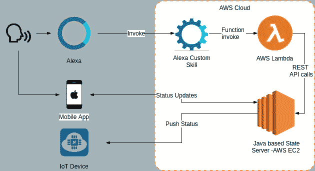

Figure 2 : Solution Design

在这篇文章中，我们将重点关注如何调用 Alexa 自定义技能以及与 AWS Lambda 函数的集成。

**打造自定义 Alexa 技能**

首先你需要登录你的[亚马逊开发者门户](https://developer.amazon.com/)。如果您没有帐户，可以免费创建一个。导航到 Alexa →您的 Alexa 控制台→技能

您可以使用“创建技能”按钮来创建新技能。您需要输入技能名称并选择首选语言。选择“自定义”选项卡并创建技能。

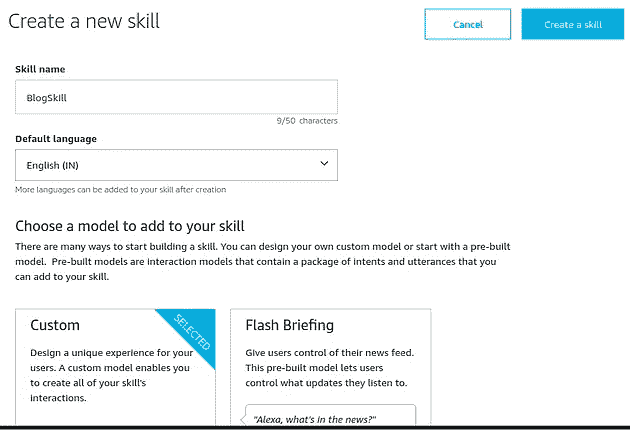

Figure 3 : Create Skill

然后，您将被导航到技能页面。

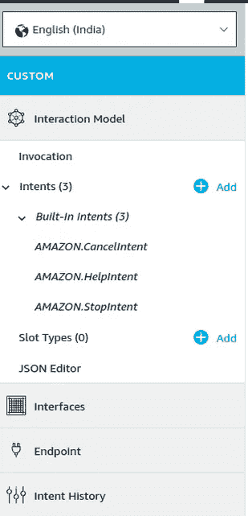

Figure 4 : Skill options

一个 Alexa 自定义技能包含以下主要特征。

**调用:**这是用户应该提供的命令，以便启动自定义技能。

**意图:**意图是你应该在技能范围内提供的触发不同事件的单独命令。

**Slots :** Slots 可以被标识为参数，在这里你可以传递不同的值。

终点:你应该整合新技能的地方。有两个选项，分别是 ARN 和 HTTPS。在本教程中，我们将使用自动气象站 are 选项。

默认情况下，您可以看到已经创建了 3 个意向，如 AMAZON。亚马逊 CencelIntent。让我们创建一个新的自定义意图。

**调用**

导航到调用选项卡，您可以在技能调用名称部分提供启动自定义技能所需的命令。

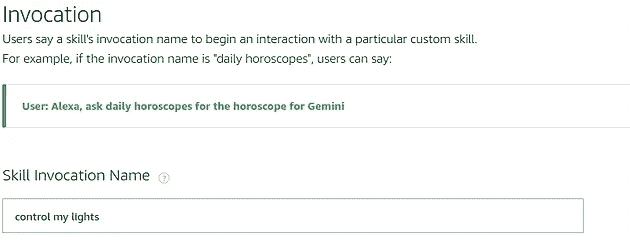

Figure 5 : Invocation

**创建新意图**

您可以使用“添加意图”按钮创建新的意图。


Figure 6 : Create new Intent

您需要为您的意图取一个合适的名称，并创建自定义意图。接下来，我们需要为此目的提供示例话语。话语代表用户为实现这一意图而提供的实际语音命令。例如，我们可以指定“打开红灯”。

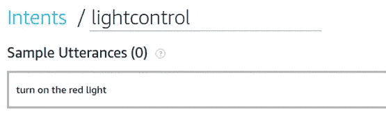

Figure 7 : Utterances

但是如果我们继续这样下去，我们将面临一个小问题。因为我们有 3 盏灯，所以我们需要维护 6 种状态。我们需要创建 6 个不同的意图来控制我们的 3 盏灯。这是低效且难以维护的。我们可以使用插槽来解决这个问题，并将灯光状态和灯光颜色作为参数传递给我们的意图。

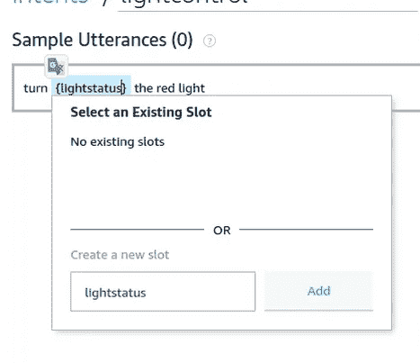

Figure 8 : Create new slot

在话语部分，您可以在花括号中指定所需的位置。在这个实例中，该工具会要求您使用 lightstatus 创建一个新的插槽。我们还需要给浅色添加一个槽。

现在你可以看到技能工具为我们的话语增加了两个位置，如上图所示。接下来，我们需要为新创建的插槽选择插槽类型。您可以从插槽类型下拉列表中选择 Amazon 内置插槽类型。对于浅色插槽，我可以使用亚马逊。颜色类型。但是 lightstatus 插槽没有预定义的插槽类型。因此，我们需要为此创建自定义插槽类型。

您可以使用“添加”按钮在“插槽类型”部分创建自定义插槽类型。

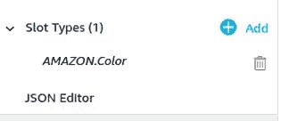

Figure 9 : Create custom slot type

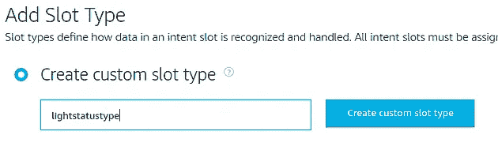

Figure 10 : Custom slots

然后，我们可以返回目的，为 lightstatus 插槽选择新创建的插槽类型。

现在我们完成了我们的意图，使用这一个意图，我们可以在我们的光中控制所有的状态。

下一步，我们需要建立 lambda 函数，需要与这项技能相结合。

**开发 Lambda 函数**

首先，您需要登录到 [AWS 控制台。如果您没有帐户，可以免费创建。](https://aws.amazon.com/)

在 AWS 服务搜索栏中搜索“Lambda”。您可以使用“创建函数”按钮创建函数。

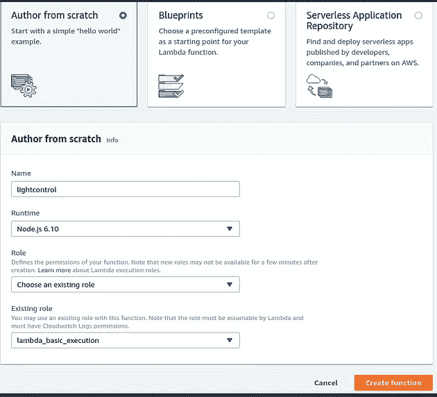

Figure 11 : Crete AWS Lambda function

我正在使用 NodeJs 的作者从零开始选项。如果没有现有角色，请选择创建自定义角色或从模板创建新角色。AWS 将为您创建一个默认角色。

这将创建 index.js 默认文件，并为您提供一个默认的 js 代码。

首先我要创建如下的助手函数。

```
// These are the helper functions 
**function** buildSpeechletResponse(title, output, repromptText, shouldEndSession) {
    **return** {
        outputSpeech: {
            type: 'PlainText',
            text: output,
        },
        card: {
            type: 'Simple',
            title: `SessionSpeechlet - ${title}`,
            content: `SessionSpeechlet - ${output}`,
        },
        reprompt: {
            outputSpeech: {
                type: 'PlainText',
                text: repromptText,
            },
        },
        shouldEndSession,
    };
}
**function** buildResponse(sessionAttributes, speechletResponse) {
    **return** {
        version: '1.0',
        sessionAttributes,
        response: speechletResponse,
    };
}
```

这些助手功能建立了语音响应，需要在执行一些命令时传递回 Alexa 自定义技能。

接下来是支持会话开始和技能启动的功能。

```
**function** onSessionStarted(sessionStartedRequest, session) {
    console.log(`onSessionStarted requestId=${sessionStartedRequest.requestId}, sessionId=${session.sessionId}`);
}

**function** onLaunch(launchRequest, session, callback) {
    console.log(`onLaunch requestId=${launchRequest.requestId}, sessionId=${session.sessionId}`);
// Dispatch to your skill's launch.
    getWelcomeResponse(callback);
}

**function** getWelcomeResponse(callback) {
    **const** sessionAttributes = {};
    **const** cardTitle = 'Welcome';
    **const** speechOutput = 'Welcome to the light demo ' ;

    **const** repromptText = 'You can say: what switch to control ' ;
    **const** shouldEndSession = **false**;
callback(sessionAttributes,
        buildSpeechletResponse(cardTitle, speechOutput, repromptText, shouldEndSession));
}
```

在这里，您可以指定欢迎信息和重新提示信息，如果用户没有给任何语音输入。回调函数使用我们之前构建的助手函数。一旦用户使用正确的调用短语调用技能，lambda 就会为定制技能的当前实例创建一个会话。

接下来，我们需要在 SessionEnded 事件上指定会话结束请求，如下所示。

```
**function** handleSessionEndRequest(callback) {
    **const** cardTitle = 'Session Ended';
    **const** speechOutput = 'Thank you for using light control , have a great day!';
    **const** shouldEndSession = **true**;
callback({}, buildSpeechletResponse(cardTitle, speechOutput, **null**, shouldEndSession));
}

**function** onSessionEnded(sessionEndedRequest, session) {
    console.log(`onSessionEnded requestId=${sessionEndedRequest.requestId}, sessionId=${session.sessionId}`);
    // Add cleanup logic here
}
```

最重要的功能是意图处理器。这就是我们将 Alexa 自定义技能的意图映射到 Lambda 函数中的地方。

```
**function** onIntent(intentRequest, session, callback) {
    console.log(`onIntent requestId=${intentRequest.requestId}, sessionId=${session.sessionId}`);
**const** intent = intentRequest.intent;
    **const** intentName = intentRequest.intent.name;
// Dispatch to your skill's intent handlers
    **if** (intentName === 'AMAZON.HelpIntent') {
        getWelcomeResponse(callback);
    } **else** **if** (intentName === 'AMAZON.StopIntent') {
        handleSessionEndRequest(callback);
    } **else** **if** (intentName === 'lightcontrol') {
        **var** color = intent.slots.color.value;
        **var** lightstatus = intent.slots.lightstatus.value;
        lights(callback,color,lightstatus);
    }
}
```

你可以看到我们正在处理我们在自定义技能中创建的光控意图。我们使用 intent.slots 属性检索插槽值，并将它们分配给局部变量。

接下来，我们需要构建 lights 函数，我们将在这里与我们的物联网服务器进行交互，如下所示。

```
**function** lights(callback,color,lightstatus) {

   **var** _switch = "";
   **var** _status = "";

   **if**(color == "red")
        _switch = "V1";
   **else** **if**(color == "green")
        _switch = "V2";
   **else** **if**(color == "orange")
        _switch = "V0";
   **else**
        _switch = "error";

    **if**(lightstatus == "on")
        _status = "1";
    **else** **if**(lightstatus == "off")
        _status = "0";

   **var** endpoint = "http://<myip>:8080/<myport>/update/"+_switch+"?value="+_status;
            **var** status ="offline";
            **var** body = "";
            http.get(endpoint, (response) => {
              console.log("Got response: " + response.statusCode)
              response.on('data', (chunk) => { body += chunk })
              response.on('end', () => {
              })
            });

    **const** sessionAttributes = {};

    //Get card title from data
    **const** cardTitle = 'device status';

    //Get output from data
    **const** speechOutput = 'The  ' + color + '  light is turned '+ lightstatus;
    **const** repromptText = '' ;
    **const** shouldEndSession = **false**;
callback(sessionAttributes,
        buildSpeechletResponse(cardTitle, speechOutput, repromptText, shouldEndSession));
}
```

为了控制我的物联网设备，我实现了一个基于 java 的状态服务器，它可以与 REST API 集成。首先，该函数基于我们从 intent 获得的 slot 值构建所需的端点值。然后，它调用物联网状态服务器并提供所需的值。监听状态服务器的物联网设备将相应地更新其 GPIO 值。

你可以在这个 [git repo](https://github.com/priyalwalpita/alexa_lambda) 中找到完整的源代码。

**测试拉姆达函数**

你可以通过使用内置测试框架来测试你的 Lambda 函数。转到配置测试事件并配置新的测试事件。

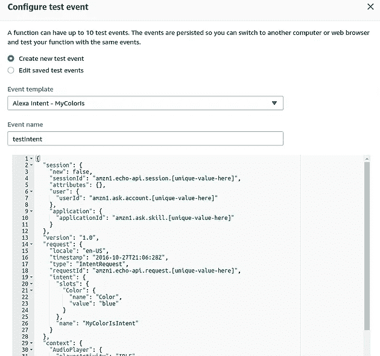

Figure 12 : Function test script

lightcontrol intent 的测试脚本应该如下所示。我们需要在测试脚本中为我们的插槽指定样本值。

```
{
  "session": {
    "new": **false**,
    "sessionId": "amzn1.echo-api.session.[unique-value-here]",
    "attributes": {},
    "user": {
      "userId": "amzn1.ask.account.[unique-value-here]"
    },
    "application": {
      "applicationId": "amzn1.ask.skill.[unique-value-here]"
    }
  },
  "version": "1.0",
  "request": {
    "locale": "en-US",
    "timestamp": "2016-10-27T21:06:28Z",
    "type": "IntentRequest",
    "requestId": "amzn1.echo-api.request.[unique-value-here]",
    "intent": {
      "slots": {
        "color": {
          "name": "color",
          "value": "red"
        },
        "lightstatus": {
          "name": "lightstatus",
          "value": "on"
        }
      },
      "name": "lightcontrol"
    }
  },
  "context": {
    "AudioPlayer": {
      "playerActivity": "IDLE"
    },
    "System": {
      "device": {
        "supportedInterfaces": {
          "AudioPlayer": {}
        }
      },
      "application": {
        "applicationId": "amzn1.ask.skill.[unique-value-here]"
      },
      "user": {
        "userId": "amzn1.ask.account.[unique-value-here]"
      }
    }
  }
}
```

您可以在执行结果窗口中获得如下测试结果和状态。

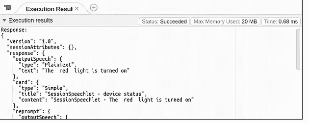

Figure 13 : Test results

太好了！现在我们的测试已经通过，作为下一步，我们需要链接 Lambda 函数和 Alexa 自定义技能，我们已经开发出来。

**链接 Lambda 函数和自定义技能**

要链接 Lambda 函数和 Alexa 自定义技能，请将 Lambda 函数的 ARN 值复制到剪贴板。

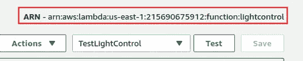

Figure 14 : Copy the ARN value

转到您的自定义技能，选择“端点”选项卡，然后选择“AWS Lambda ARN”。在“默认区域”部分输入 ARN 值，如下所示。


Figure 15 : Config the ARN in the custom skill

接下来，您需要复制技能 Id 并输入 Lambda 函数，如下所述。

在灯光控制功能中，添加触发器“Alexa 技能包”。

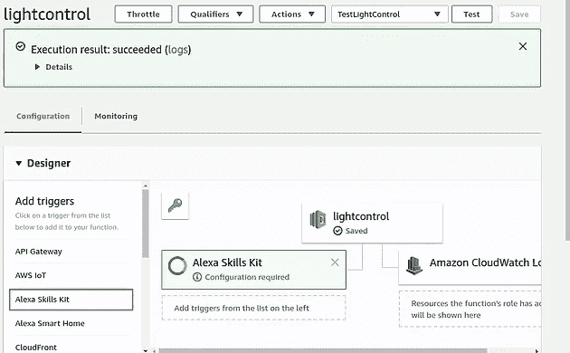

Figure 16 : Add the custom skill to Lambda function

转到 Alexa 技能工具包的配置部分，添加您的自定义技能的技能 ID。

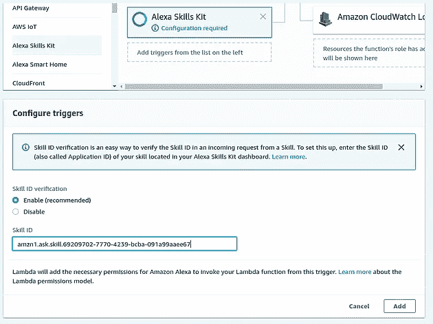

Figure 17 : Config the Skill Id

保存 Lambda 函数和自定义技能。

接下来，使用构建模型按钮构建自定义技能。

恭喜你！现在我们有了一个正确配置的自定义技能。接下来我们需要测试自定义技能本身！

**测试 Alexa 自定义技能**

为了测试这项自定义技能，请导航到控制台顶部的测试选项卡。启用此技能的测试。

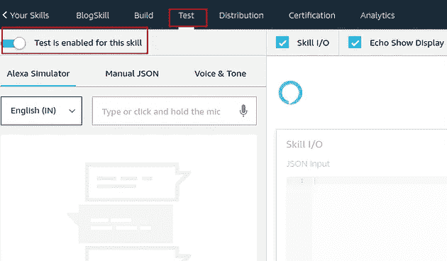

Figure 18 : Custom skill’s testing console

有两种方法可以测试我们的技能。

1.  通过声音
2.  2.通过文本

只需输入您为自己的技能指定的调用名称。除了语音输出，控制台还会为特定的测试输出 JSON 输入和输出。

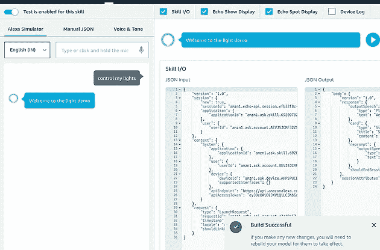

Figure 19 : Testing the invocation

接下来，你也可以测试你的意图。

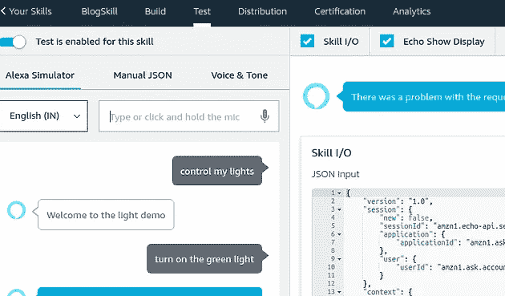

Figure 20 : Test the invocation

恭喜你们。

你做到了！

如果你拥有亚马逊 Echo Dot 或亚马逊 Alexa，这是一个用自己的声音测试你技能的好时机！:)

**总结**

正如我们所看到的，为 Amazon Echo 平台构建一个定制技能相当简单。Alexa 服务抽象掉了开发人员在使用语音界面时面临的无数传统复杂性，因为它管理着框架的高级语音识别和文本到语音方面。

开发人员可以利用 AWS Lambda、其他 AWS 托管选择(如 Elastic Beanstalk 或 EC2)来运行和自动扩展他们技能的后端原理，或者在 Alexa 平台可以通过 SSL 加密 HTTP 请求到达的任何地方运行和处理代码。

如果您有兴趣进一步探索这个示例技能的代码，这是一个很好的机会。亚马逊还为 Alexa 开发者提供了大量的教程和参考资料，以及创建交互模型、Lambda 函数和示例话语的演练。

> 加入 Coinmonks [电报频道](https://t.me/coincodecap)和 [Youtube 频道](https://www.youtube.com/c/coinmonks/videos)获取每日[加密新闻](http://coincodecap.com/)

## 另外，阅读

*   [复制交易](/coinmonks/top-10-crypto-copy-trading-platforms-for-beginners-d0c37c7d698c) | [加密税务软件](/coinmonks/crypto-tax-software-ed4b4810e338)
*   [网格交易](https://coincodecap.com/grid-trading) | [加密硬件钱包](/coinmonks/the-best-cryptocurrency-hardware-wallets-of-2020-e28b1c124069)
*   [密码电报信号](http://Top 4 Telegram Channels for Crypto Traders) | [密码交易机器人](/coinmonks/crypto-trading-bot-c2ffce8acb2a)
*   [最佳加密交易所](/coinmonks/crypto-exchange-dd2f9d6f3769) | [印度最佳加密交易所](/coinmonks/bitcoin-exchange-in-india-7f1fe79715c9)
*   [面向开发人员的最佳加密 API](/coinmonks/best-crypto-apis-for-developers-5efe3a597a9f)
*   最佳[密码借贷平台](/coinmonks/top-5-crypto-lending-platforms-in-2020-that-you-need-to-know-a1b675cec3fa)
*   [免费加密信号](/coinmonks/free-crypto-signals-48b25e61a8da) | [加密交易机器人](/coinmonks/crypto-trading-bot-c2ffce8acb2a)
*   杠杆代币的终极指南