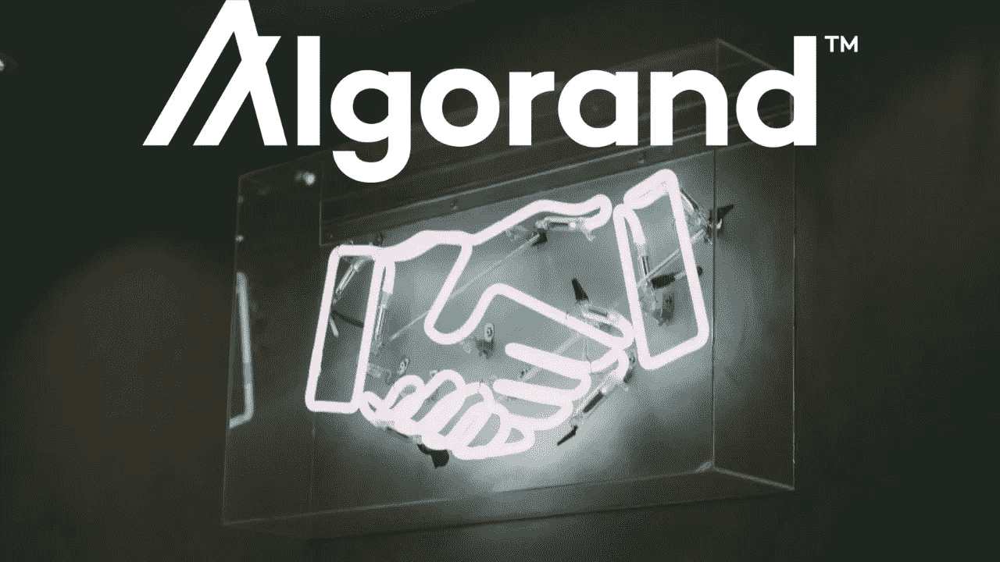

# 阿尔格兰德推出全球合作伙伴计划

> 原文：<https://medium.com/coinmonks/algorand-launched-global-partner-program-86e3ae5b9222?source=collection_archive---------4----------------------->

## 全球合作伙伴计划旨在加速全球区块链产品和服务的开发和采用。

# 什么是阿尔格兰德公司？

Algorand 是一个无许可[纯利害关系证明](https://community.algorand.org/blog/understanding-the-technicalities-behind-the-pure-proof-of-stake-protocol-algorand-uses/)区块链，由[希尔维奥·米卡利](https://en.wikipedia.org/wiki/Silvio_Micali)博士在 2017 年创建，旨在解决[区块链三难问题](https://toshitimes.com/what-is-the-blockchain-trilemma-security-vs-scalability-vs-decentralization/)(安全性、去中心化、可扩展性)。

阿尔格兰德区块链公司的目标是通过向 [finance 3.0](https://community.algorand.org/blog/finance-10-vs-finance-20-vs-finance-30-with-algorand/) 初创公司和创意提供平台、资金和指导，在阿尔格兰德区块链{ [Reference](https://community.algorand.org/blog/what-is-algorand-quick-guide-and-overview/) }上开发其产品和服务，从而引领无国界经济。

# 什么是全球合作伙伴计划？

正如我上面所说的，阿尔格兰德专注于引领无国界经济，因此它支持金融 3.0 初创公司在阿尔格兰德区块链建立他们的服务，阿尔格兰德推出了“阿尔格兰德亚洲加速器计划”和“阿尔格兰德亚洲加速器计划”，为这些初创公司和全球 idea 提供资金和指导。

继“阿格朗亚洲加速器计划”和“阿格朗亚洲加速器计划”取得成功后，现在阿格朗又推出了“全球合作伙伴计划”，以加快阿格朗区块链产品和服务在全球的开发和采用。

该项目将帮助您在区块链创立的创业公司或企业与您所在行业或不同行业的现有领导者建立合作伙伴关系，利用他们的渠道，以终端用户为中心，更快、更容易地将基于阿尔格兰德的产品推向市场。

如果您现有的服务是通过阿尔格兰德区块链公司创建的，那么在构建和交付基于阿尔格兰德的产品时，您将很容易获得独特的资源和支持。此外，您将有机会进入指数级增长的组织市场，寻找资源开发或采用基于 Algorand 的解决方案。

所有在阿尔格兰德合作伙伴计划中被接受的公司的最初名单都已经有了良好的用户基础和品牌知名度，所以当你年轻的创业公司将进行合作，可以对你的业务产生积极的影响时，你将被有经验的人包围以接受建议，最重要的是，这个计划减少了你接近其他成熟公司的时间和努力，将来会有更多的公司接受阿尔格兰德合作伙伴计划。

# 合作伙伴计划参与者

由于该计划现在处于初始阶段，因此只有 12 家公司像[应用区块链](https://appliedblockchain.com/)、[火箭洞察](http://www.rocketinsights.com/)、 [Mentat 创新](https://ment.at/)、[区块链意大利 io](https://blockchainitalia.io/) 等现在在阿尔格兰德合作伙伴计划中，阿尔格兰德本身可以通过该计划进行潜在的合作。

该计划中的所有公司都有相同的基础，即区块链科技，但他们的方法和地点不同，有些公司提供咨询、战略、软件帮助、数字金融支持、金融科技和区块链解决方案、支付和数字银行产品、人工智能、应用程序开发等。

名单中的所有公司都有优秀的团队在后台工作，有些是谷歌的前员工、博士、连续创业者等，但关键是你可以与 Algorand Inc .合作，在那里你可以为你的项目找到世界级的导师。

# 如何参与计划？

申请该计划有非常简单快捷的步骤，您需要您公司的电子邮件和您的法定姓名，然后访问此[合作伙伴页面](https://www.algorand.com/partners)，在这里您将找到所有列出的合作伙伴及其网站，并有一个简短的介绍，然后在他们介绍的下方，您将找到一个简短的表格，因此如果您为您的业务找到一个潜在的公司，请填写并提交相应的表格，如果您找到多个潜在的公司进行合作，请不要犹豫填写多个表格。

如果你想接近阿尔格兰德公司，那么只要一直向下滚动，你就会找到单独的表格，在那里你必须提供一些额外的数据，如你的国家细节，你对区块链的熟悉程度，以及写一些重要内容的信息。

最好的是，现在还没有接近这些公司的最后日期，所以花点时间来评估你的潜在合作伙伴，以建立一个强大的业务。

# 结论

阿尔格兰德公司不仅专注于创建自己的项目，还通过各种计划帮助其他企业，它已经通过提供种子资金和指导帮助了许多公司，现在是时候为这些公司提供营销和增长方面的帮助了，这些公司是通过阿尔格兰德区块链合作伙伴计划创建的，如果你可以想象，从长远来看，它将间接帮助阿尔格兰德区块链的采用。

> 作者详细信息:
> 
> 名字是吉坦德拉·纳伊克
> 
> 电子邮件-Jitencrackit2@gmail.com

## 另外，阅读

*   最好的[密码交易机器人](/coinmonks/crypto-trading-bot-c2ffce8acb2a)
*   [德里比特评论](/coinmonks/deribit-review-options-fees-apis-and-testnet-2ca16c4bbdb2) |选项、费用、API 和 Testnet
*   [FTX 密码交易所评论](/coinmonks/ftx-crypto-exchange-review-53664ac1198f)
*   最好的比特币[硬件钱包](/coinmonks/the-best-cryptocurrency-hardware-wallets-of-2020-e28b1c124069?source=friends_link&sk=324dd9ff8556ab578d71e7ad7658ad7c)
*   [加密复制交易平台](/coinmonks/top-10-crypto-copy-trading-platforms-for-beginners-d0c37c7d698c)
*   最好的[加密税务软件](/coinmonks/best-crypto-tax-tool-for-my-money-72d4b430816b)
*   [最佳加密交易平台](/coinmonks/the-best-crypto-trading-platforms-in-2020-the-definitive-guide-updated-c72f8b874555)
*   最佳[加密贷款平台](/coinmonks/top-5-crypto-lending-platforms-in-2020-that-you-need-to-know-a1b675cec3fa)
*   [莱杰 vs 特雷佐](/coinmonks/ledger-vs-trezor-best-hardware-wallet-to-secure-cryptocurrency-22c7a3fd391e)
*   [block fi vs Celsius](/coinmonks/blockfi-vs-celsius-vs-hodlnaut-8a1cc8c26630)vs Hodlnaut
*   Bitsgap 评论——一个轻松赚钱的加密交易机器人
*   为专业人士设计的加密交易机器人
*   [PrimeXBT 审查](/coinmonks/primexbt-review-88e0815be858) |杠杆交易、费用和交易
*   HaasOnline 评论享受九折优惠
*   Bitmex 保证金交易的白痴指南
*   [eToro 评论](/coinmonks/etoro-review-78807ddeb33c) |交易股票、密码、交易所交易基金、差价合约和商品
*   [Bitmex 高级保证金交易指南](/coinmonks/bitmex-advanced-margin-trading-guide-2270c195ce25?source=friends_link&sk=1d986cca731f5084b9a2db4a4bc4a7ad)
*   开发人员的最佳加密 API
*   [最佳区块链分析工具](https://bitquery.io/blog/best-blockchain-analysis-tools-and-software)
*   [加密套利](/coinmonks/crypto-arbitrage-guide-how-to-make-money-as-a-beginner-62bfe5c868f6)指南:新手如何赚钱
*   顶级[比特币节点](https://blog.coincodecap.com/bitcoin-node-solutions)提供商
*   最佳[加密制图工具](/coinmonks/what-are-the-best-charting-platforms-for-cryptocurrency-trading-85aade584d80)
*   了解比特币的[最佳书籍有哪些？](/coinmonks/what-are-the-best-books-to-learn-bitcoin-409aeb9aff4b)

> [直接在您的收件箱中获得最佳软件交易](https://coincodecap.com?utm_source=coinmonks)

