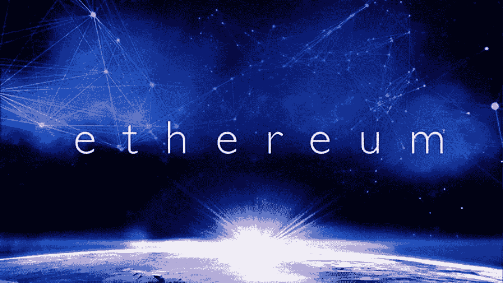

# 关于 ERC 令牌标准的一切

> 原文：<https://medium.com/coinmonks/all-about-erc-token-standards-9c759efdc791?source=collection_archive---------6----------------------->

## 关于 ERC 的热门文章-20，ERC-998，ERC-884，ERC-865，ERC-948，ERC-777

[source](https://unitimes.media/news/ethereum_erc-20_token_standard.html)

**Create Crypto Invoices**

[**Cryptofi —创建加密发票，跟踪您的加密支付**](https://cryptofi.co/)

[**使用 Coinmonks 作业门户**](https://coinmonks.com/) 查找加密作业

[***加入 Coinmonks 投稿人电报组。***](/coinmonks/coinnmonks-crypto-writers-telegram-group-f56b4621af0a)

[***捐投投僧***](/coinmonks/monks-need-your-help-7440418d67ec)

**Click to find blockchain Jobs**

## [查看最新的 ERC 故事](https://medium.com/coinmonks/erc/home)

## 什么是 ERC？

**ERC(以太坊征求意见稿)**是以太坊智能合约开发者使用的技术文档。他们定义了一套为以太坊生态系统实现令牌所需的规则。这些文档通常由开发人员创建，它们包含有关协议规范和合同描述的信息。在成为标准之前，ERC 必须通过 EIP(以太坊改进提案)进行修订、评论并被社区接受。实际上，ERC 只是 EIP 的一种特殊类型。ERC 是应用级的约定和标准，它们可以是不同的类型(令牌、注册名、URI 方案、库、包等)。).取自👇

[**解剖一个 ERC:一个详尽的调查**](/coinmonks/anatomy-of-an-erc-an-exhaustive-survey-8bc1a323b541) **由** [**阿方索·德拉罗查**](https://medium.com/u/68450c6af241?source=post_page-----9c759efdc791--------------------------------)

 [## 解剖 ERC:详尽的调查

### 与 Javier Casanova 合著(卫生部顾问)

medium.com](/coinmonks/anatomy-of-an-erc-an-exhaustive-survey-8bc1a323b541) 

[**密码组件——积木和应用**](/coinmonks/crypto-composables-building-blocks-and-applications-65902709298c) **作者** [**马特·洛克耶**](https://medium.com/u/9cb5f31cb9fa?source=post_page-----9c759efdc791--------------------------------)

 [## 加密组件—构建模块和应用

### 介绍以太坊的 ERC-998 可组合不可替换令牌标准的第一篇帖子获得了很多关注…

medium.com](/coinmonks/crypto-composables-building-blocks-and-applications-65902709298c) 

[**股权转让:引进 ERC-884**](/coinmonks/tokenising-shares-introducing-erc-884-cc491258e413) **由** [**戴夫萨格**](https://medium.com/u/855a3fdff0f?source=post_page-----9c759efdc791--------------------------------)

 [## 股权化:介绍 ERC-884

### ERC-884 是 ERC-20 兼容令牌，符合特拉华州参议院第 149 届大会第 69 号参议院法案。

medium.com](/coinmonks/tokenising-shares-introducing-erc-884-cc491258e413) 

[**ERC865:一款更加人性化的令牌**](/coinmonks/erc865-a-case-for-more-user-friendly-tokens-eb68e62a986)**by**[**Bhaskar**](https://medium.com/u/4c26368e93c2?source=post_page-----9c759efdc791--------------------------------)

 [## ERC865:更加用户友好的令牌

### 以太坊费用:

medium.com](/coinmonks/erc865-a-case-for-more-user-friendly-tokens-eb68e62a986) 

[**ERC-948 协议提案的可行性**](/coinmonks/the-viability-of-the-erc-948-protocol-proposal-1b33ce2bce25) **通过**[**Marko vid rih**](https://medium.com/u/9befa54837bd?source=post_page-----9c759efdc791--------------------------------)

 [## ERC-948 协议提案的可行性

### 已经建立了对可订阅令牌的经济激励，并且缺少协议来…

medium.com](/coinmonks/the-viability-of-the-erc-948-protocol-proposal-1b33ce2bce25) 

[**以太坊的 ERC-777 标准简介**](/coinmonks/an-introduction-to-ethereums-erc-777-standard-3cf2fb46b567) **作者** [**埃弗雷特**](https://medium.com/u/d6febafcdeac?source=post_page-----9c759efdc791--------------------------------)

 [## 以太坊的 ERC-777 标准介绍

### 随着最近 CryptoKitties 等著名 dApps 的推出，ERC-721 令牌受到了公司的关注…

medium.com](/coinmonks/an-introduction-to-ethereums-erc-777-standard-3cf2fb46b567) 

[**防未来 ERC20 令牌**](/coinmonks/future-proofing-erc20-tokens-7b8c27acedfb) **由** [**doc.ai**](https://medium.com/u/23bdabf45373?source=post_page-----9c759efdc791--------------------------------)

 [## 面向未来的 ERC20 令牌

### 作者:Neeraj Kashyap

medium.com](/coinmonks/future-proofing-erc20-tokens-7b8c27acedfb) 

> *如果你觉得这些故事有用，那么请关注我们的 Coinmonks 出版物，了解更多关于* [*以太坊*](https://medium.com/coinmonks/ethereum/home) *和 Erc 令牌的信息。*

[source](https://medium.com/coinmonks/erc/home)