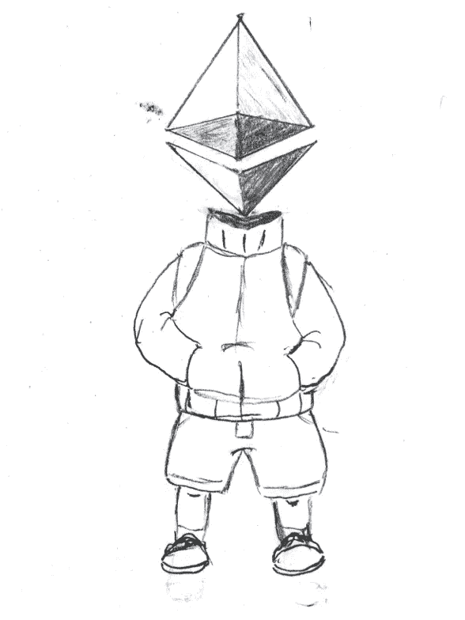

# 关于可靠性的一切—文章系列

> 原文：<https://medium.com/coinmonks/all-about-solidity-article-series-f57be7bf6746?source=collection_archive---------1----------------------->

欢迎来到**，这是一个*系列文章，旨在帮助智能合约开发者在[以太坊](https://ethereum.org/en/)或任何基于 EVM 的区块链之上构建更好的合约和应用。*

*这一系列文章涵盖了 [Solidity 智能契约语言](https://docs.soliditylang.org/en/latest/)的几个方面，比如地址、映射、字节、结构等等…*

*这个页面是文章系列的主要入口点。你会在下面找到所有文章的完整列表。*

*如果你喜欢这篇文章，并发现它们有用，请随时发表评论或鼓掌，给出任何反馈或报告错误。*

# *目录*

## *[关于 ABI 的一切](https://coinsbench.com/solidity-tutorial-all-about-abi-46da8b517e7)*

## *[所有关于地址的信息](https://jeancvllr.medium.com/solidity-tutorial-all-about-addresses-ffcdf7efc4e7)*

## *[关于数组的一切](https://jeancvllr.medium.com/solidity-tutorial-all-about-array-efdff4613694)*

## *[关于装配的一切](https://jeancvllr.medium.com/solidity-tutorial-all-about-assembly-5acdfefde05c)*

## *[所有关于字节](https://jeancvllr.medium.com/solidity-tutorial-all-about-bytes-9d88fdb22676)*

## *[所有关于评论](https://jeancvllr.medium.com/solidity-tutorial-all-about-comments-bc31c729975a)*

## *[关于条件句的一切](https://betterprogramming.pub/solidity-tutorial-all-about-conditionals-d13ba4866e9)*

## *[关于构造函数的一切](https://jeancvllr.medium.com/solidity-tutorial-all-about-constructors-46a10610336)*

## *[关于合同的一切](https://jeancvllr.medium.com/solidity-tutorial-all-about-contracts-e8e30bd1b289)*

## *[所有关于数据位置的信息](https://betterprogramming.pub/solidity-tutorial-all-about-data-locations-dabd33212471)*

*   *[**关于存储的一切**](https://betterprogramming.pub/all-about-solidity-data-locations-part-i-storage-e50604bfc1ad)*
*   *[**关于记忆的一切**](https://jeancvllr.medium.com/solidity-tutorial-all-about-memory-1e1696d71ee4)*
*   *[**所有关于 Calldata**](https://jeancvllr.medium.com/solidity-tutorial-all-about-calldata-aebbe998a5fc)*
*   *[**所有关于栈的**](https://betterprogramming.pub/solidity-tutorial-all-about-stack-c1ec6070fe60)*
*   *[**所有关于代码**](https://jeancvllr.medium.com/solidity-tutorial-all-about-code-10889b88632f)*

## *[关于枚举的一切](https://jeancvllr.medium.com/solidity-tutorial-all-about-enums-684adcc0b38e)*

## *[关于功能的一切](https://jeancvllr.medium.com/solidity-tutorial-all-about-functions-dba2ccb1e931)*

## *[关于进口的一切](https://jeancvllr.medium.com/solidity-tutorial-all-about-imports-c65110e41f3a)*

## *[关于接口的一切](https://jeancvllr.medium.com/solidity-tutorial-all-about-interfaces-f547d2869499)*

## *[关于图书馆的一切](https://jeancvllr.medium.com/solidity-tutorial-all-about-libraries-762e5a3692f9)*

## *[关于循环的一切](https://coinsbench.com/solidity-tutorial-all-about-loops-ebe2fd332e59)*

## *[关于映射的一切](/coinmonks/solidity-tutorial-all-about-mappings-29a12269ee14)*

## *[关于修改器的一切](https://jeancvllr.medium.com/solidity-tutorial-all-about-modifiers-a86cf81c14cb)*

## *[关于结构的一切](https://jeancvllr.medium.com/solidity-tutorial-all-about-structs-b3e7ca398b1e)*

## *[所有关于类型转换的内容](https://jeancvllr.medium.com/solidity-tutorial-all-about-conversion-661130eb8bec)*

> *享受你的阅读！*