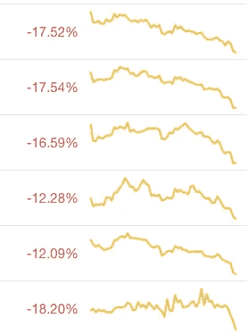

# 所有交易所都应该有稳定的货币(例如 USDC)和菲亚特(例如美元)对

> 原文：<https://medium.com/coinmonks/all-exchanges-should-have-stablecoin-ex-usdc-and-fiat-ex-usd-pairs-exclusively-94a82e8bdcf6?source=collection_archive---------5----------------------->

由于、、DAI 和 PAXOS 发行单位以相似的利率大量增加，交易所和所有 lit 市场应使用它们进行交易对，而不是/BTC 或/ETH

Alt-to-Alt 交易应该完全发生在柜台(OTC)交易台上，机构交易者在那里协商非标准交易，以节省时间和佣金。/BTC 和/ETH 交易对也应该成为非标准。

目前，加密资产的整个分类和“市值”指标被它们与/BTC 和/ETH 的主导配对所扭曲。这些资产的大部分估值随着比特币的价格成比例地动态变化，只是因为它们最后一笔匹配订单是在 BTC 定价的。其余的买价和卖价在 BTC 定价，做市商和算法在 BTC 进行清洗交易。

这可以在一夜之间改变。

Low liquidity assets merely correlated with bitcoin’s price

不仅 stablecoins 现在比 Tether 有更好的治理，他们也全部落户以太坊的区块链。对 Tether 缺乏信心阻碍了 Tether 交易对的增长，它有非常大的领先优势。系绳也是在比特币 OMNI 层发行的资产。这导致了漫长而令人沮丧的交易时间，因为比特币的交易安全性来自 10 分钟的大宗确认，而你需要 2-12 次大宗确认才能确认一笔 OMNI 交易。

以太坊的交易安全性来自 12 秒的块确认时间和一个有趣的叔叔/孤儿系统，当 12 秒的块产生可预测的区块链问题时。以太坊上发行的任何资产都继承了这种更快、更可预测的交易时间，并带来了更好的消费者用户体验。

比特币理论上有一个更快的第二层解决方案，称为闪电网络，随着 OMNI 协议的进一步发展，比特币上简单稳定的货币资产可能在未来再次变得比基于 ETH 的资产更有利。(但以太坊也有升级和第二层解决方案正在进行中，竞赛已经开始。)

、戴和帕克斯都使用以太坊。还有一个使用以太坊的系绳版本。

如果所有资产都以稳定的货币对或法定货币进行交易，我们将会看到一个更有效率的市场。即使在有效市场中存在波动的比特币配对，你也可能会看到其他资产的交易与其主要交易配对的波动相反，但鉴于缺乏估值指标和对这些资产的需求，市场不是有效的，只是维持比特币定价的现有出价。

一个更有效率的市场意味着一项资产的市场价格将保持在市场对它的估价。或者，我们也许能够看到集体意识中的风险承担和风险规避情绪在稳定的货币市场中发挥作用。

项目发行人应要求交易所关闭其 BTC 和瑞士联邦交易所市场。

分散的交易所和中继站应禁用其 ETH 市场，只允许 DAI 市场。

这些稳定债券的流动性和规模将很快跟进。截至本文撰写之时:

*   戴发行了价值 60，000，000 美元的单位
*   USDC 已经发行了 178，000，000 美元面值的债券
*   TUSD 已经发行了 199，000，000 美元面值的债券
*   PAXOS 已经发行了价值 1 美元的 168，000，000 单位

无系绳稳定硬币市场在短短 6 个月内从零增长到 605，000，000 美元，当交易所翻转时，您可以预期这一数字会增加。

好奇的问题变成了比特币和以太坊的需求会发生什么变化？人们不会用它来交易，他们只会用它来收取交易费用。在这种情况下，对以太坊的需求完全下降到交易费，因为即使是新项目也应该只接受戴或或其他稳定货币的资本。

戴本身将被一篮子其他稳定资产抵押，不仅仅是 ETH，而且很可能很少是 ETH。

这抹杀了近期比特币和以太坊的投机故事，维持了对这些商品的周期性需求。随着交易费用需求仅从稳定的硬币交易中增加，这些商品再次变得有价值，但这需要在这些网络上从未见过的需求水平，并且目前不被它们的区块链支持。

[在 Twitter 上关注我](https://twitter.com/1blockologist)

并在 [www.pareto.network](http://www.pareto.network) 加入我们的信息网进行更深入的分析

> [在您的收件箱中直接获得最佳软件交易](https://coincodecap.com/?utm_source=coinmonks)

[**Click to read today’s top story**](http://bit.ly/2G71Sp7)