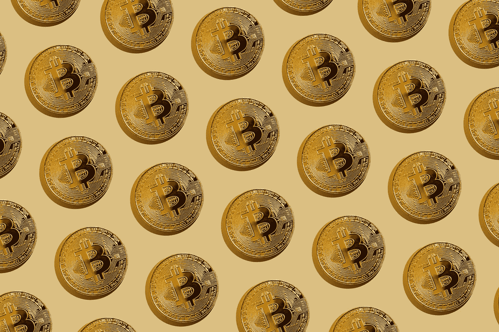

# 所有 Pionex 加密交易机器人解释

> 原文：<https://medium.com/coinmonks/all-pionex-crypto-trading-bots-explained-9c56d2f022bb?source=collection_archive---------0----------------------->

## Pionex 机器人概述和最简单的解释:网格机器人，杠杆网格机器人，再平衡机器人，DCA 机器人，Twap 机器人等。

Photo by [Jeremy Bezanger](https://unsplash.com/@jeremybezanger?utm_source=unsplash&utm_medium=referral&utm_content=creditCopyText) on [Unsplash](https://unsplash.com/s/photos/bitcoin?utm_source=unsplash&utm_medium=referral&utm_content=creditCopyText)

总的来说， [Pionex](https://www.pionex.com/en-US/sign/ref/siZFAJUz) 提供了 11 个免费的交易机器人来优化您的加密交易策略。当然，机器人的主要优势是全天候可用性。所以，机器人在你睡觉的时候工作，或者…