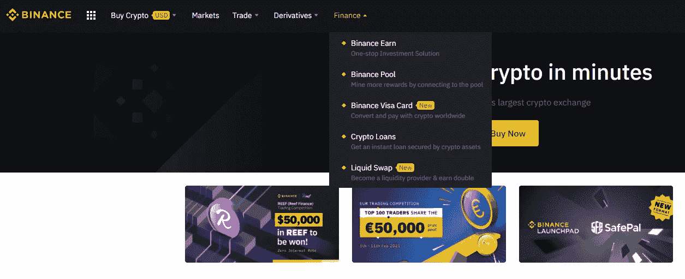
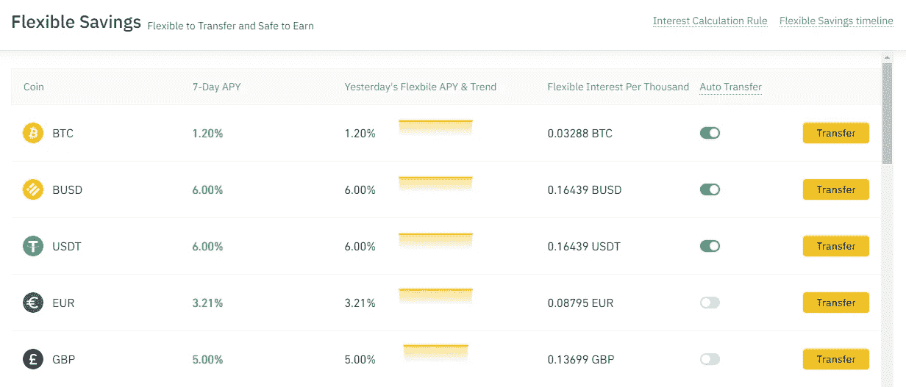
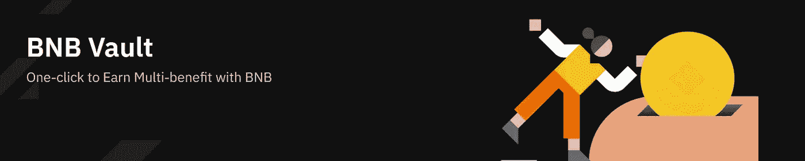
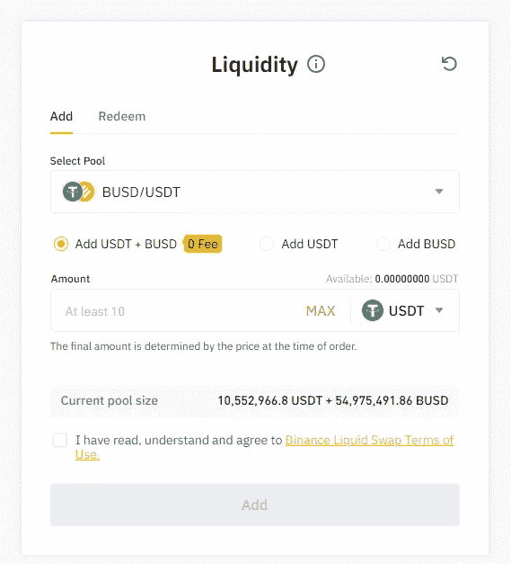
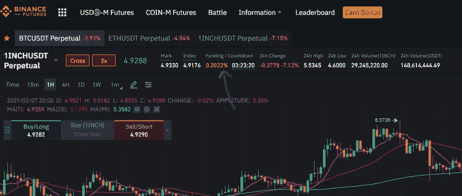

# 所有的无风险投资你都可以在币安上尝试，作为一个初学者(有什么风险)

> 原文：<https://medium.com/coinmonks/all-risk-free-investments-you-can-try-on-binance-as-a-beginner-and-whats-the-risk-dae6b40d9961?source=collection_archive---------0----------------------->

你想开一个加密交易账户。在谷歌搜索了一些之后，你注意到[【币安】](/coinmonks/binance-review-ee10d3bf3b6e)相当不错(事实上，按交易量计算，币安是世界上最大的加密交易所[，你想知道你是否应该购买并持有比特币。](https://blog.coincodecap.com/crypto-exchange)

良好的..2021 年，加密货币不仅仅是购买并持有。事实上，有许多无风险的投资，你只需拿着你的硬币就可以参与分散金融。问题是，出错的方式也有很多，尤其是对初学者来说。最常见的一种是，你可能[将你的 ERC 令牌(例如 ETH)发送到不同的网络](/grabityio/the-most-common-mistakes-deposit-to-a-wrong-address-fb7e71684fb8)，导致全部损失，并且永远无法再次找回硬币。

幸运的是，币安已经做出了巨大的努力，将最流行和最复杂的分散式金融应用程序移植到币安交易所，使其更安全，更易于许多初学者使用。

在这篇文章中，我将特别介绍你可以在币安交易所进行的最常见的无风险投资

*   投资简介
*   你如何参与
*   预期收益
*   为什么它们有意义
*   你可能会面临什么样的风险

> 我们推出了[副本交易服务](https://coincodecap.com/coincodecap-copy-trading)，请尝试。

# 目录

我从最容易到最难排列了第 3-7 项，尽管它们都是初学者友好的

1.  **无风险**的定义
2.  **币安赚简介**
3.  币安储蓄
4.  币安立桩
5.  币安金库
6.  流动性互换
7.  中性头寸套利

## **无风险的定义**

有两种级别的无风险，我将它们表述为美元级别的无风险和代币级别的无风险。

**美元级无风险**是正常投资者可能更喜欢的真正无风险回报。这仅仅意味着你的投资组合的美元总价值在整个投资过程中保持不变。除此之外，你将获得额外的利率回报。

**Token level risk free** 另一方面，意味着您的 Token(如比特币)总数在整个投资过程中保持不变。除此之外，你将获得额外的利率回报。

## **币安赚简介**

由于在币安有越来越多的投资选择，它们被整合在一个名为币安·欧文的地方，你可以在币安首页的金融标签下访问。

## **币安储蓄账户**

币安储蓄**支持美元级无风险和代币级无风险投资。**

币安储蓄可能是最容易理解的一个。您只需将您的代币存入币安储蓄，并按照网站上的说明每天获得固定利率。

**门户**:[https://www.binance.com/en/earn#flex-item](https://www.binance.com/en/earn#flex-item)
**回报**:稳定币 6%年息(如 USDT / BUSD) /比特币 1.2%年息

只需点击转账按钮，您就可以将代币转入储蓄账户，并且您将每天收到利息付款。另外，你可以随时把钱从储蓄账户转到活期账户。

如果你确定在一段固定的时间内(7/14/30 天)不会从你的储蓄账户中取出你的钱，你可以申请一个[固定储蓄](https://www.binance.com/en/savings#lending-fixeddeposits)。您仍然可以提前赎回，并随时将资金转回现货账户，但如果您选择这样做，您将失去您收到的所有利息支付。

**为什么有效？**

最明显的原因是，币安的许多交易者进行保证金交易，这意味着他们需要从其他用户那里借钱进行杠杆交易。币安有一个复杂的保证金制度，控制杠杆交易可能发生的最大损失，从而为借贷提供一个无风险的环境。

如果你觉得自己有闲钱，把它们存入币安储蓄银行总是不错的，并获得 6%的年利率，这是一个完美的美元级无风险回报。

**可能有什么风险？**

一个明显的风险是币安被黑/清算。这种风险适用于我在本文中介绍的每一种产品，所以我不再重复。

但是我想在这里强调的另一个可能的风险是稳定硬币令牌的合法性。

当你存美元到时，你需要把它兑换成元/戴元/元。这就是我们所说的稳定硬币，它总是与 1 美元挂钩。但是，如果监管机构决定介入并进行调查，他们可能无法收回同等金额的美元，并可能面临审计风险。

最近的运动包括试图规范 USDT 的稳定法案。如果该法案被批准，而泰瑟不能提供足够的证据证明他们持有美元，USDT 可能会变得一文不值。

## 币安立桩

币安赌注是**象征性的无风险投资。**

如果你打算长期持有代币(比如说 1-3 个月)，你一定要去币安赌注登记看看你的代币是否有资格被下注，并在此过程中获得更多同类的代币，这就是所谓的赌注凭证。

**门户**:[https://www.binance.com/en/pos](https://www.binance.com/en/pos)
**联邦理工学院**门户:[https://www.binance.com/en/eth2](https://www.binance.com/en/eth2)

**返回**:取决于你持有的令牌。对于 ETH，每年 10%..对于一些其他受欢迎的代币，如寿司和 1 英寸，他们提供 15-20%的年息

一旦你决定下注，你将开始收到与利息支付相同的令牌。您可以在任何时候提前赎回，但如果您选择这样做，您将失去您收到的所有利息支付。

**为什么有效？**

因为许多代币，按照设计，需要其他代币持有者来验证交易。利益证明(PoS)概念表明，一个人可以根据他或她持有的硬币数量来挖掘或验证大宗交易。这意味着矿工拥有的硬币越多，他或她就拥有越多的采矿权力。

然而，在币安境外下注通常需要用户执行多个智能合约才能开始，并且有最低下注要求。例如，ETH2.0 要求用户至少标上 32 ETH(作为验证器)。如果你的投资金额很小，这样做可能不可行，因为智能合约的交易费(乙醚气体)在牛市中往往很高。因此，使用币安股份可以节省大量的交易成本，并为用户提供一个无差错的环境来体验 PoS。

**可能有什么风险？**

具体到 ETH，当用户标记 ETH 时，币安会将其标记为 BETH。用户可以选择通过将 BETH 转换回 ETH 来提前赎回 ETH。然而，这样做会导致大约 5%的损失，所以你需要 100%确定你不会在 ETH2.0 之前赎回 staked ETH，ETA 是未知的。

对于其他代币，唯一的风险是你押下的代币的价格波动(可能在你的押下期结束之前，它们会跌至 0 美元，只是说…..)

## 币安金库

币安金库**是代币级别的无风险投资，**专门针对 BNB 持有者**。**

**门户**:[https://www.binance.com/en/bnbmining](https://www.binance.com/en/bnbmining)
**回报**:视情况而定，但 BNB 每年至少有 5%

根据官方常见问题，BNB 金库是一个 BNB 收益率聚合器。存款 BNB 意味着参与 Launchpool、Savings、Defi staking 和其他项目，同时获得奖励。

目前，BNB 储蓄提供 5%的年利率，所以它保证有 5%的年利率

> 什么是 BNB？BNB 是一种币安代币，你可以用来支付交易佣金，作为回报，币安会提供 25%的佣金折扣。BNB 真正酷的是，BNB·币安从交易佣金中获得的那部分会定期烧掉。这意味着随着时间的推移，BNB 的供应量将会减少。另一方面，随着越来越多的用户在币安上注册，需求也会随着时间的推移而增加。简单的经济学告诉我们，这可能会推动 BNB 价格直线上升。如果你相信币安的商业模式，你一定要持有一些 bnb。

**为什么有效？**

其他开发团队通常希望与币安合作来推广他们的项目。一种常见的方法是接受 BNB 来“挖掘”令牌，这就是所谓的 Launchpool。除此之外，我们还有 BNB 储蓄账户和 defi staking。结合所有不同类型的无风险投资，你可以用 BNB 做的被称为 BNB 金库。

**可能有什么风险？**

BNB 的价格波动。

launchpool 的回报可能低于预期，因为不是所有的加密项目都能成功。

## 流动性互换

流动性互换/流动性提供商，通常称为 LP，**支持美元级无风险和代币级无风险投资。**

**门户**:[https://www.binance.com/en/swap/liquidity](https://www.binance.com/en/swap/liquidity)
回报:BUSD/USDT 8%，BTC/WBTC 12%

币安流动性互换是一个自动做市商(AMM)，以促进加密货币交换。AMM 将赚取买卖差价和佣金收入，并将它们分配给流动性提供者。

例如，当您选择为 BUSD/USDT 对提供流动性时，每当其他用户交易 BUSD/USDT 时，他们的部分佣金将会分配给您！

要增加流动性，您只需持有该对令牌中的一个，并选择“添加 USDT”或“添加 BUSD”。币安将帮助您将 50%的持股转换为平衡持股对，并开始使用您的持股执行做市指令。

**为什么有效？**

在我看来，LP 可能是 2020 年去中心化金融中最令人兴奋的应用(2021 年仍然如此)。假设你想把 USDT 换成 BUSD(反之亦然)，或者把 BTC 换成 wBTC。这些是具有相同面值的令牌对，因此随着时间的推移具有固定的汇率。作为一个分散的有限合伙人意味着没有人需要依赖银行来做这样的外汇交易。你是外汇提供者，这不是很酷吗？

因此，币安开放了一些稳定的令牌对，作为用户成为交易平台上的做市商的一种方式。

**可能有什么风险？**

如果一种货币突然对另一种货币贬值，你将遭受暂时的损失。[你可以在这里阅读更多](https://academy.binance.com/en/articles/impermanent-loss-explained)。

## **空仓套利**

这不是币安提供的投资产品，而是提供**美元级无风险的交易策略。**

最常见的是基差交易。

在牛市中(在熊市中反之亦然)，建立基差交易仅仅意味着你在你的现货账户上建立一个多头头寸，并在期货合约上建立等量的空头头寸:

1.  用 USDT 买 1 个 BTC。
2.  开立 1 BTCUSDT 期货的空头头寸

这样做，用户可以从空头期货头寸中赚取利率收入，称为融资利率。简单来说，在牛市中，BTC 期货的价格通常高于现货价格。为了使期货价格下降并与现货价格趋同，币安(以及其他加密交易所)将提供一个利率，每当你持有短期期货头寸时，该利率每 8 小时支付一次。

如果你持有相同数量的多空头寸，你将建立一个中性头寸，赚取无风险资金利率。

[在币安期货交易平台](https://www.binance.com/en/futures/1INCH_USDT)，你可以在价格附近查询下一个融资利率。币安也在他们的网站上分享历史融资利率数据。

你可以从[币安官方博客](https://www.binance.com/en/blog/421499824684900458/Exploring-MarketNeutral-Strategies-in-CryptoDerivatives-)中阅读更多关于中性头寸交易策略的内容。

> 如果你对在币安开设账户感到兴奋，请考虑支持我，使用推荐 ID: **TPM4YQWA** ，或者简单地使用此链接:【https://www.binance.com/en/register?ref=TPM4YQWA】，注册一个新账户。这样，你将在每笔交易中获得 10%的佣金折扣。非常感谢！

> 加入 Coinmonks [电报频道](https://t.me/coincodecap)和 [Youtube 频道](https://www.youtube.com/c/coinmonks/videos)获取每日[加密新闻](http://coincodecap.com/)

## 另外，阅读

*   [密码电报信号](http://Top 4 Telegram Channels for Crypto Traders) | [密码交易机器人](/coinmonks/crypto-trading-bot-c2ffce8acb2a)
*   [复制交易](/coinmonks/top-10-crypto-copy-trading-platforms-for-beginners-d0c37c7d698c) | [加密税务软件](/coinmonks/crypto-tax-software-ed4b4810e338)
*   [网格交易](https://coincodecap.com/grid-trading) | [加密硬件钱包](/coinmonks/the-best-cryptocurrency-hardware-wallets-of-2020-e28b1c124069)
*   [加密交换](/coinmonks/crypto-exchange-dd2f9d6f3769) | [印度的加密应用](/coinmonks/buy-bitcoin-in-india-feb50ddfef94)
*   开发人员的最佳加密 API
*   最佳[加密贷款平台](/coinmonks/top-5-crypto-lending-platforms-in-2020-that-you-need-to-know-a1b675cec3fa)
*   [杠杆代币](/coinmonks/leveraged-token-3f5257808b22)终极指南
*   [从 WazirX 切换到 CoinDCX 的 5 个理由](https://coincodecap.com/reasons-to-switch-from-wazirx-to-coindcx)
*   [联合国硬币评论](https://coincodecap.com/unocoin-review) | [最佳加密赌注硬币](https://coincodecap.com/best-crypto-staking-coins)
*   如何使用 MetaMask Wallet 获得 KCC 地址？
*   [如何获得自己的。XYZ 领域？](https://coincodecap.com/xyz-domain)
*   [最佳加密交换平台](https://coincodecap.com/best-crypto-swap-platforms) | [最佳加密交易所](https://coincodecap.com/crypto-exchange)