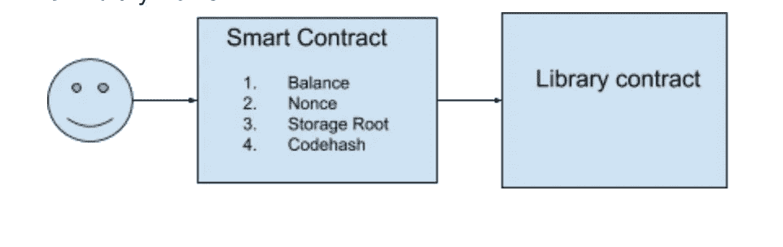

# 关于 solidity 中的库，您应该知道的一切

> 原文：<https://medium.com/coinmonks/all-you-should-know-about-libraries-in-solidity-dd8bc953eae7?source=collection_archive---------0----------------------->


Photo by [Iñaki del Olmo](https://unsplash.com/@inakihxz?utm_source=medium&utm_medium=referral) on [Unsplash](https://unsplash.com?utm_source=medium&utm_medium=referral)

在编写 Dapps 时，了解可靠的库是非常重要的。简而言之，库是一段可重用的代码，只需部署一次，就可以多次共享。

但是库不仅仅局限于可重用性，以太坊开发人员很少在其他领域使用库特性。这篇文章旨在从基础开始触及所有这些话题。

先说一个简单的数学运算库。下面描述的 SafeMath 库包含基本的算术运算，它将 2 个无符号整数作为输入，并返回算术运算结果。

> 理想情况下，库并不意味着改变契约状态，它应该只用于执行基于输入和返回结果的简单操作

在深入研究之前，让我们先了解一些先决条件，以便更好地理解:

1.  什么是可靠的合同？:从技术上讲，智能合约是 Dapp 的基本构件。在以太坊中，智能合约拥有类似外部用户帐户的地址，可用于与合约进行交互，如调用方法、发送以太等。每个合同都有以下四个属性:

*   Nonce:它是一个帐户触发的交易数量的计数。
*   Balance:这是一个数字，它告诉我们这个特定地址所能容纳的乙醚量
*   存储根:契约可以存储数据，它是存储来自该契约的数据的树根
*   Codehash:它是合同代码的散列值。

2.[**函数类型**](https://solidity.readthedocs.io/en/v0.4.24/types.html?highlight=pure%20view#function-types) **:** Solidity 有以下函数类型:

*   内部:这种类型的函数只能从契约内部调用
*   外部:这种类型的函数只能从契约外部调用
*   Public:这种类型的函数既可以在契约外部调用，也可以在契约内部调用。
*   纯:这种函数既不读也不写合同的存储。
*   视图:这种函数只能从存储器中读取，不能从存储器中写入。
*   Payable:一个契约函数只有在被标记为 payable 时才能接受 ether。

**图书馆如何运作？**



在区块链，交易可以改变智能合同的状态。合同中可能发生各种状态变化:

*   发送以太网:它将更新合同余额
*   更改合同中的数据:这将更改存储根。

> 每当用户向内部使用库协定的智能协定发送事务时，状态更改将发生在智能协定上，而不是在库协定中。这可以通过 EVM 的委托呼叫功能来实现”

[**委托呼叫:**](http://solidity.readthedocs.io/en/develop/introduction-to-smart-contracts.html?highlight=delegatecall#delegatecall-callcode-and-libraries)

转述自[固化文件](http://solidity.readthedocs.io/en/develop/introduction-to-smart-contracts.html?highlight=delegatecall#delegatecall-callcode-and-libraries):

*“delegate call”与消息调用相同，除了目标地址处的代码是在调用契约的上下文中执行的，并且* msg.sender *和* msg.value *不改变它们的值。*

*这意味着契约可以在运行时从不同的地址动态加载代码。存储、当前地址和余额仍然引用调用合同，只是代码取自被调用地址。”*

这个底层函数非常有用，因为它是实现库的基础。

**库的部署:**

库部署与常规智能合约部署略有不同。库部署有两种情况:

1.  **嵌入式库:**如果一个智能合约正在使用一个只有**内部函数**的库，那么 EVM 只需将库嵌入到合约中。它不使用委托调用来调用函数，而是简单地使用跳转语句(普通的方法调用)。在这种情况下，不需要单独部署库。
2.  **链接库:**另一方面，如果一个库包含**公共或外部函数**，那么这个库需要被部署。图书馆的部署将在区块链产生唯一的地址。此地址需要与呼叫合同关联。

让我们考虑一个简单的例子来理解链接库。

下面的代码片段显示了一个带有传递函数的 ERC20 契约。SafeMath 库中有两个方法“sub”和“add”用于传递函数，它们是**外部**。

有两个有趣的观察。

1.  SafeMath 库具有外部函数。

2.下面给出的字符串是编译 ERC20 契约后生成的字节码的一部分。此字节代码包含对安全数学 __ 安全数学 _____________________________ 的引用。这意味着在执行链接步骤之前，ERC20 的字节不能被部署。链接本质上意味着用地址替换字节码中的库引用。

0x 608060405234801561001057600080 FD 5b 5061034380610020600396000 f 30060806040526004361004157600357 c 01000000000000000000000000000000000000000000000000000000000000000000000000000000000000

**部署时如何链接库合同？**

1.  部署库:我已经在 ropsten 上部署了 SafeMath，它的地址是[0x 40189 FB 71 f 54 a3 ad 0370620 DFB 095382859 EB 095](https://ropsten.etherscan.io/address/0x40189fb71f54a3ad0370620dfb095382859eb095)
2.  将部署的库与合同链接。以下命令可用于将 SafeMath 库与 ERC20 合同链接。

*solc ERC 20 . sol-libraries " safe math:0x 40189 FB 71 f 54 a3 ad 0370620 DFB 095382859 EB 095 "-bin*

成功链接后，SafeMath 引用将从字节码中移除，契约准备好进行部署。

***‘使用 for’*库中:**

在 solidity **中用 X 代替 Y** 指令的方式，X 的库函数附加了 Y 类型。

例如，**为 uint256** 使用安全数学。

像 add、sub、mul 和 div 这样的 SafeMath 函数现在与类型 uint256 绑定在一起。

需要注意的一个条件是，库函数将接收被调用的对象作为其第一个参数

**例如:**上面提到的 ERC-20 合同。使用 for 指令相当于为 uint256 类型使用 for SafeMath。

```
**using** SafeMath **for uint256**;

**uint256** a = 10;
**uint256** b= 10;

**uint256** = a.add(b);
```

此处**添加**功能可从 SafeMath 获得。SafeMath 库函数与 uint256 绑定。

太好了！！！🙌

我希望，这篇文章能帮助你更好地理解图书馆。

快乐编码😇

[](http://demystifyblockchain.com/) [## 揭秘区块链|未来是去中心化的互联网

demystifyblockchain.com](http://demystifyblockchain.com/) 

[linkedin.com/in/jainsarvesh](https://www.linkedin.com/in/jainsarvesh/)medium.com/@sarvesh.sgsits[](/@sarvesh.sgsits)

> 加入 Coinmonks [电报频道](https://t.me/coincodecap)和 [Youtube 频道](https://www.youtube.com/c/coinmonks/videos)获取每日[加密新闻](http://coincodecap.com/)

## 另外，阅读

*   [复制交易](/coinmonks/top-10-crypto-copy-trading-platforms-for-beginners-d0c37c7d698c) | [加密税务软件](/coinmonks/crypto-tax-software-ed4b4810e338)
*   [网格交易](https://coincodecap.com/grid-trading) | [加密硬件钱包](/coinmonks/the-best-cryptocurrency-hardware-wallets-of-2020-e28b1c124069)
*   [密码电报信号](http://Top 4 Telegram Channels for Crypto Traders) | [密码交易机器人](/coinmonks/crypto-trading-bot-c2ffce8acb2a)
*   [最佳加密交易所](/coinmonks/crypto-exchange-dd2f9d6f3769) | [印度最佳加密交易所](/coinmonks/bitcoin-exchange-in-india-7f1fe79715c9)
*   [Bitget 回顾](https://coincodecap.com/bitget-review) | [双子星 vs BlockFi](https://coincodecap.com/gemini-vs-blockfi) | [OKEx 期货交易](https://coincodecap.com/okex-futures-trading)
*   [美国最佳加密交易机器人](https://coincodecap.com/crypto-trading-bots-in-the-us) | [经常性回顾](https://coincodecap.com/changelly-review)
*   [在印度利用加密套利赚取被动收入](https://coincodecap.com/crypto-arbitrage-in-india)
*   [霍比评论](https://coincodecap.com/huobi-review) | [OKEx 保证金交易](https://coincodecap.com/okex-margin-trading) | [期货交易](https://coincodecap.com/futures-trading)
*   [面向开发人员的最佳加密 API](/coinmonks/best-crypto-apis-for-developers-5efe3a597a9f)
*   最佳[密码借贷平台](/coinmonks/top-5-crypto-lending-platforms-in-2020-that-you-need-to-know-a1b675cec3fa)
*   [杠杆代币的终极指南](/coinmonks/leveraged-token-3f5257808b22)