# Allnodes:托管主节点、完整节点或堆栈的可信 PoS 服务提供商

> 原文：<https://medium.com/coinmonks/allnodes-a-trusted-pos-service-provider-to-host-masternodes-full-nodes-or-staking-a5143abd6460?source=collection_archive---------3----------------------->

## Allnodes 是一家非托管 PoS 基础设施和服务提供商，为其用户提供托管主节点、全节点和令牌的设施。

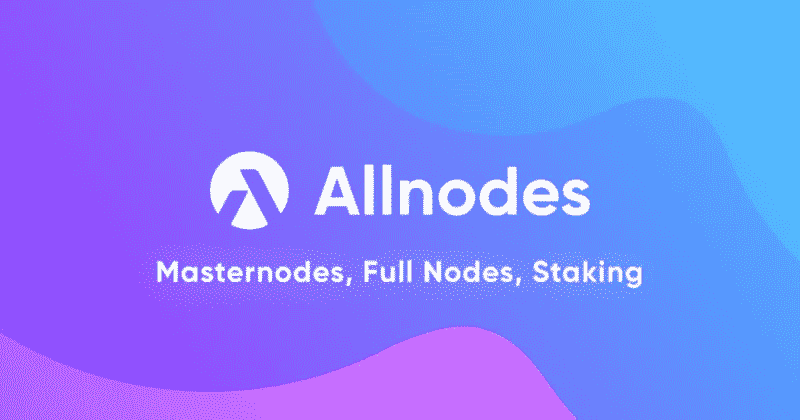

Allnodes 是一个以客户为中心、非托管、简单、可靠的平台，提供托管和打桩服务。用户可以使用 Allnodes 云服务来托管主节点和完整节点。它还允许用户下注他们的代币并获得奖励。该平台由目前市场上最可靠的 VPS 托管提供商之一提供支持。网络节点托管在[数字海洋](https://www.digitalocean.com/)和 [Linode](https://www.linode.com/) 服务器上，保证 99.90%的正常运行时间 SLA。它还获得了著名的 [2020 Masternode 社区奖](https://masternode.buzz/best-masternode-hosting-provider-2020-community-awards/)颁发的“最佳 Masternode 托管提供商”奖。

[Allnodes](https://www.allnodes.com/) 于 2017 年在加利福尼亚州洛杉矶成立，目前支持 14，062 个托管节点，总估值为 906，998，020 美元。

该平台提供 24/7 全天候备份和客户支持。它内置了官方 Telegram、Slack 和 Discord 机器人，为用户提供节点性能的更新。

**平台特性**

Allnodes 向其用户提供以下托管和托管服务:

*   **主节点**

设置主节点并获得有吸引力的奖励。用户可以使用多层监控系统，帮助他们进行备份并始终保持在线。

*   **完整节点**

Allnodes 在全球 15 个城市提供全面的节点服务。用户可以选择服务来建立一个[区块链](https://www.altcoinbuzz.io/tag/blockchain/)完整节点，提供快速、无限制的实时更新和最大运行时间。

*   **打桩**

Allnodes 提供各种代币的赌注服务，如[以太坊 2.0](https://ethereum.org/en/eth2/)(ETH)[卡尔达诺](https://cardano.org/)(ADA)[波尔卡多特](https://polkadot.network/)(DOT)[CRO](https://crypto.com/)，[雪崩](https://www.avalabs.org/)，[宇宙](https://cosmos.network/)，[符号](https://symbolplatform.com/)，[草间弥生](https://kusama.network/)，[图形](https://thegraph.com/)， [PIVX](https://pivx.org/?hl=en) 和[星云](https://nebulas.io/)[用户可以下注这些代币并获得诱人的奖励。其中一些代币的服务费为零。](https://nebulas.io/)

*   **地址监控**

用户可以监控他们的主节点和所支持令牌的任何地址的赌注回报。

*   **所有节点机器人**

内置机器人通过电报、不一致和松弛更新用户的节点性能。

**使用指南(打桩)**

要使用 Allnode 平台，请访问他们的网站。

登录页面如下所示。

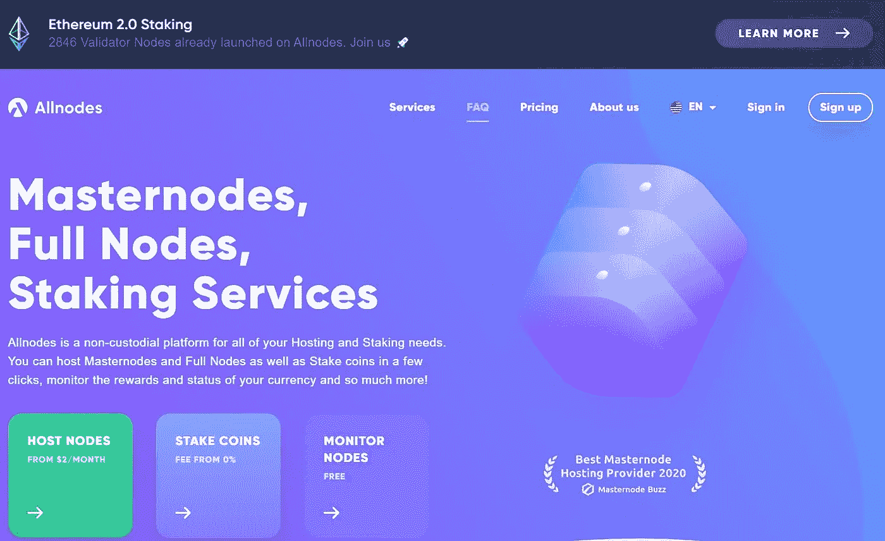

你可以很容易地在他们的主页上看到平台提供的服务列表。在本文中，我们将看到用户如何使用 Allnodes 标记他们的令牌。

要下注任何代币，单击**赌注硬币**选项卡。

**选择加密货币**

您可以看到支持的加密货币列表以及平台收取的服务费用。选择您希望在平台上下注的货币。

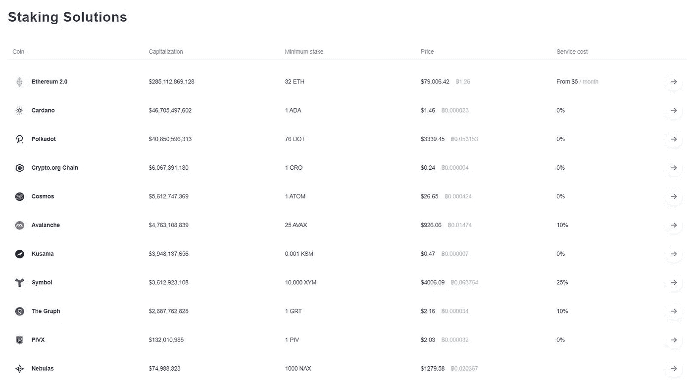

对于这篇文章，我们已经决定赌上我们的[卡达诺](https://www.altcoinbuzz.io/cryptocurrency-news/partnerships/cardanos-iohk-ethiopia-partner-over-blockchain-based-id-system/)令牌。

**选择钱包**

您可以将储存在以下任何钱包中的 Cardano (ADA)代币下注:

*   赖伊
*   分类帐(硬件钱包)
*   Trezor(硬件钱包)

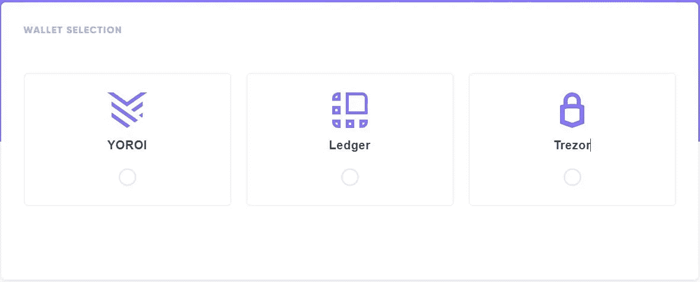

我们希望连接我们的 Cardano 本地钱包，即 YOROI 钱包。

选择此选项。

该页面将显示用户需要遵循的步骤的完整列表，以下注他们的令牌。

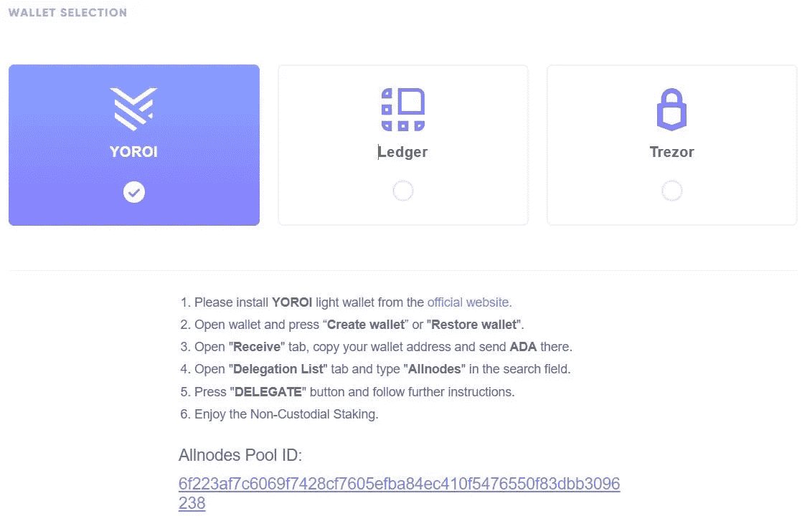

**安装 YOROI**

如果你是现有的 [Cardano](https://www.altcoinbuzz.io/cryptocurrency-news/blockchain-technology/iohk-completes-decentralization-of-cardano-block-production/) 用户并且使用 YOROI 钱包，那么你可以跳过钱包安装部分。可以直接转到委托步骤。

如果你是 Cardano 的新用户，那么你必须首先安装钱包应用程序。

点击上面网页中提到的链接，它会将你重定向到 YOROI [官方网站](https://yoroi-wallet.com/#/)。

点击**下载**按钮。该应用程序目前支持以下操作系统和浏览器:

*   铬
*   边缘
*   火狐浏览器
*   机器人
*   ios

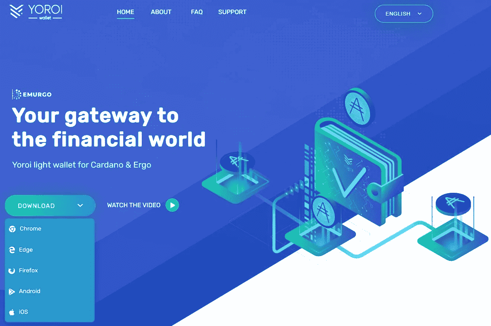

选择您想要的选项并下载应用程序。我们选择了 Google Chrome(浏览器扩展)，它会将我们重定向到这个[页面](https://chrome.google.com/webstore/detail/yoroi/ffnbelfdoeiohenkjibnmadjiehjhajb)。

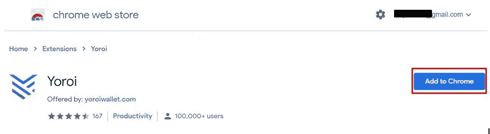

点击**添加到 Chrome** ，钱包应用图标将被添加到浏览器扩展中。

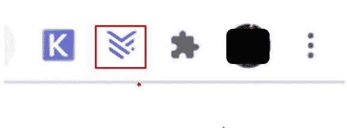

**设置钱包应用**

点击浏览器扩展上的 YOROI 图标来设置您的帐户。

安装向导将启动。它会将您重定向到该页面，并要求您选择语言。

接下来，应用程序将为您提供选择应用程序复杂性的选项。根据您的加密知识，选择您想要查看的[钱包](https://www.altcoinbuzz.io/tag/wallet/)设置类型。这一步非常重要。如果您是新用户，我们建议您从简单版本开始。这将隐藏所有不必要的复杂信息，您可能暂时不需要这些信息。您可以通过进入钱包设置选项卡从简单切换到高级。

所以现在，我们选择一个简单的钱包设置。

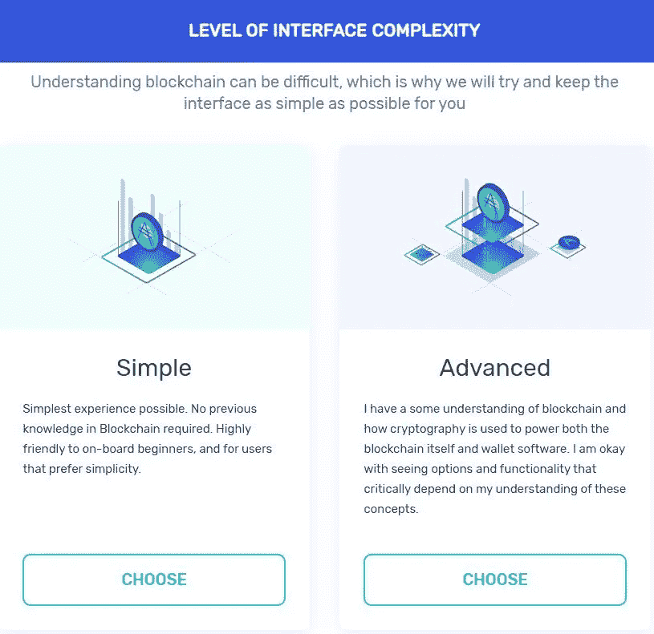

完成安装过程。安装应用程序后，它会为您提供四个钱包设置选项:

*   连接到硬件钱包
*   创建钱包
*   恢复钱包
*   从代达罗斯的钱包里转移资金到 YOROI

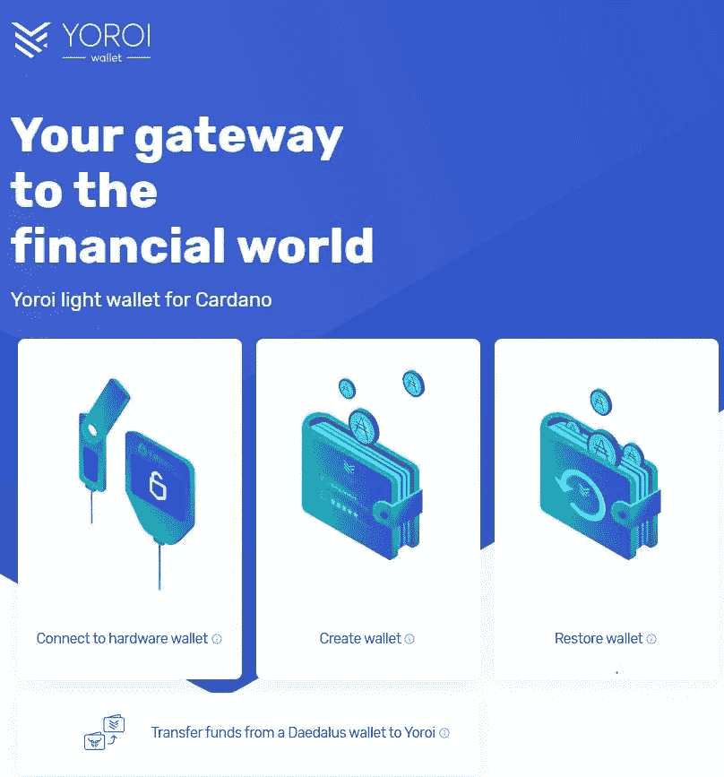

**创建钱包**

如果您是新用户，您可以选择此选项为您的卡达诺代币创建一个 new YOROI 钱包。

接下来，您需要选择区块链。YOROI 支持两个区块链:

*   卡尔达诺
*   因此

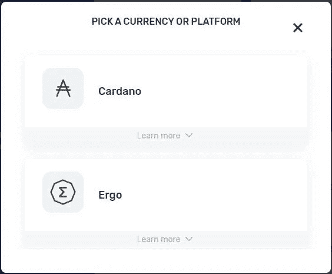

选择选项 1。

点击**创建钱包**选项。该应用程序将要求您提供钱包名称和密码，并显示您需要安全存储以备将来使用的备份短语。

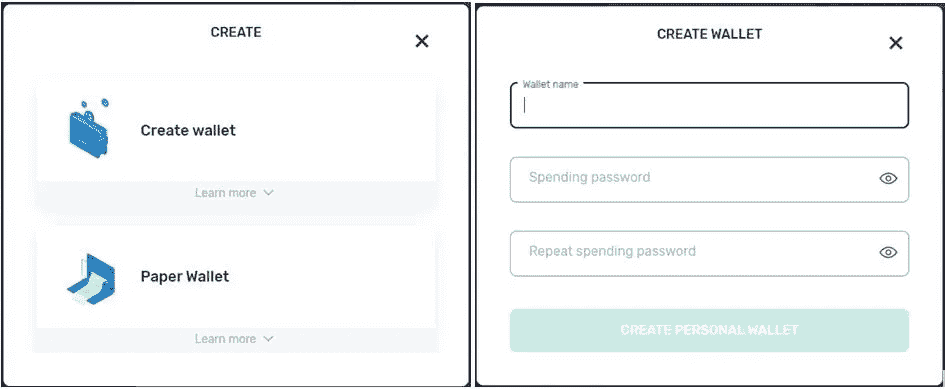

完成后，一个空白的 YOROI 钱包就成功创建了。

你现在可以看到下面的页面。

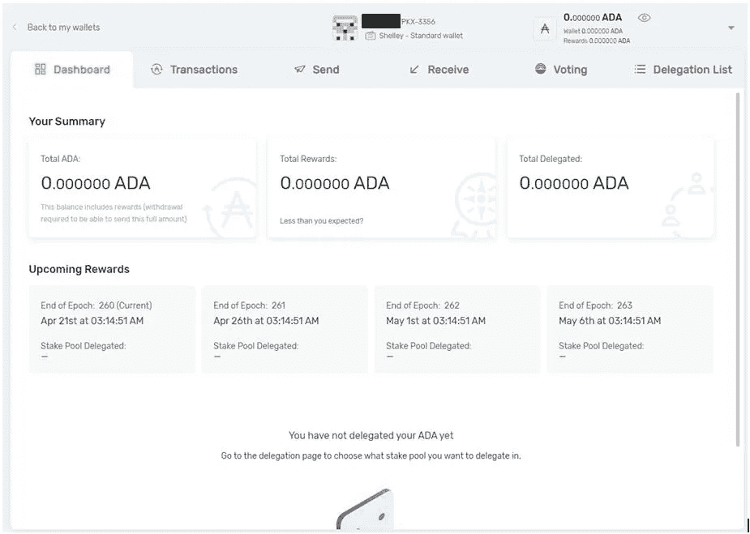

**转让爱达**

我们的兑换钱包里有一些 ADA，我们想把它们转到我们的 YOROI 钱包里。

要在您的 YOROI 钱包中接收 ADA 令牌，您需要获取公共地址。您可以从**接收**选项卡查看您的接收地址。

现在，登录到您的 exchange 帐户，并针对 ADA 令牌单击“取款”。

在**收件人地址**字段中输入您的收件人地址，并确认交易。

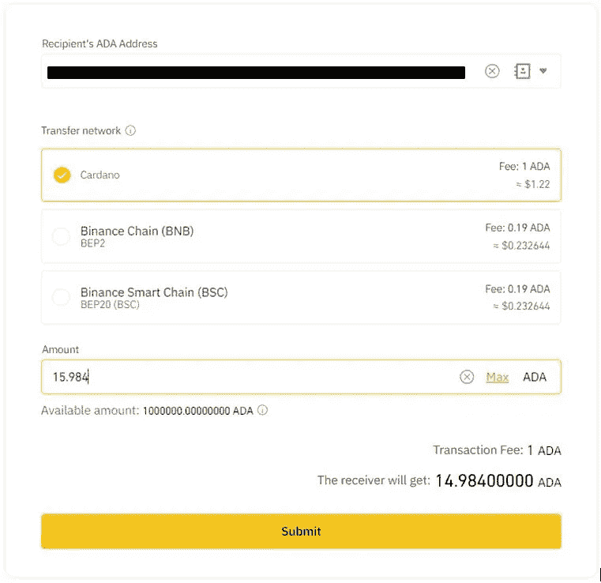

交易成功后，您可以在 YOROI 钱包中看到 ADA 令牌。

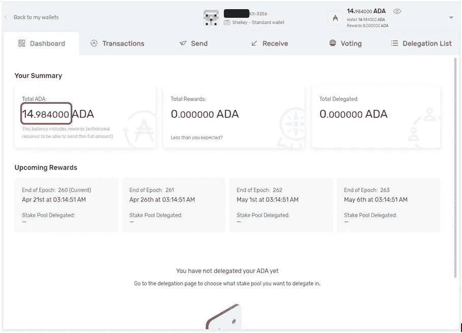

**代表团**

要下注您的代币，请前往 YOROI 钱包中的**授权列表**选项卡。您可以看到您可以在其中委派令牌的池列表。

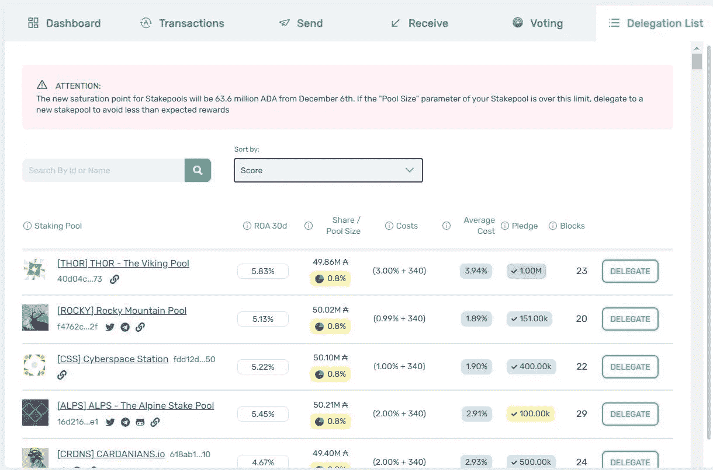

要通过 Allnodes 委托令牌，请按给定名称搜索并单击**委托**。

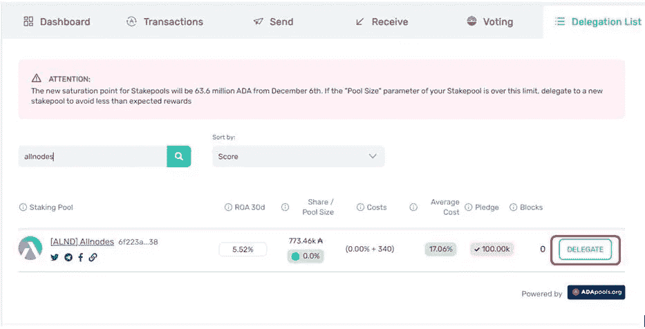

**重要提示:**委托前，请正确检查服务提供商的池 ID。你也可以从 [ADApools](https://adapools.org/) 网站确认泳池及其相应 ID 的真实性，该网站列出了 Cardano 所有泳池运营商的详细信息。

输入您希望下注的 ADA 代币数量。该应用程序将显示你的奖励，你会收到每个时代。

点击**委托**按钮确认流程。

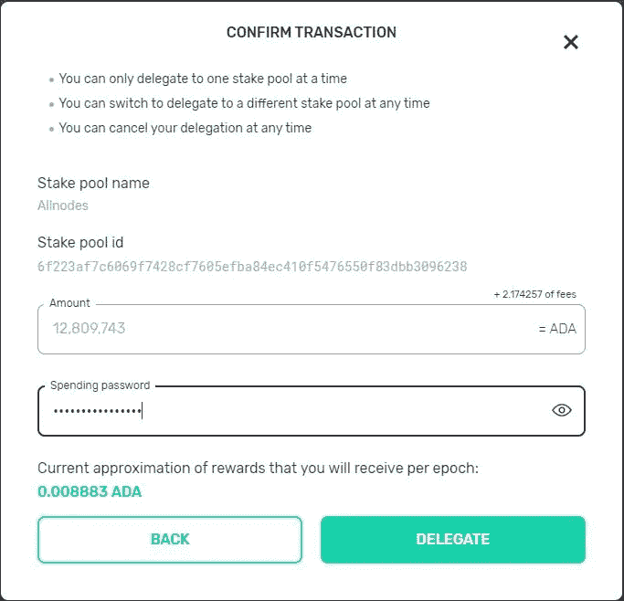

您可以从您的控制面板中查看您的委派令牌详细信息。

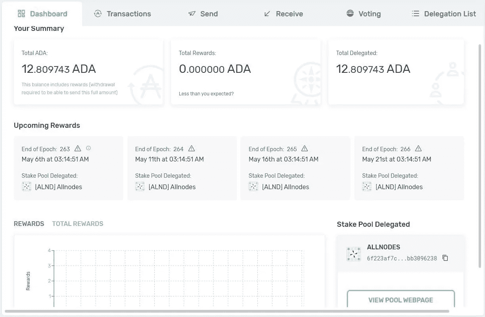

要获得有关 Allnodes 池操作符的更多详细信息，用户可以点击出现在他们钱包上的池 ID，或者在 [ADApools 页面](https://adapools.org/pool/6f223af7c6069f7428cf7605efba84ec410f5476550f83dbb3096238)上搜索池操作符。

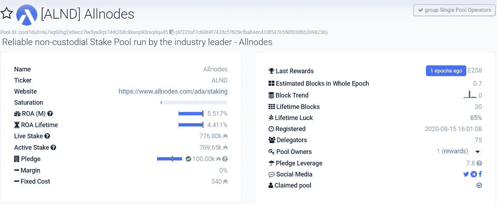

用户可以随时取消他们的委托或切换到不同的赌注池来委托他们的代币。

**社交场合**

[网站](https://www.allnodes.com/about)

[推特](https://twitter.com/allnodes)

[不和](https://discord.com/invite/TAvg3PS)

[电报](https://t.me/allnodes)

**结论**

Allnodes 旨在消除普通用户进入加密世界的财务、技术和基础设施障碍。用户现在不再需要担心硬件成本、互联网连接或深入的技术理解来运行节点。人们可以以非常低的成本使用容易、简单和自动化的节点托管服务。节点托管需要一点技术知识，但是 staking 非常简单容易，只需遵循几个步骤就可以完成。该平台对一些代币上的赌注设施收取零服务费。所有这些好处将有助于 Allnodes 成为领先的托管服务提供商，并随着更多用户加入区块链行业，增加其用户采用率。

**资源:** [所有节点](https://www.allnodes.com/)

**阅读更多:** [保险丝网络概述(FUSE)](/coinmonks/an-overview-of-the-fuse-network-fuse-679c1ff3422d)

***注:*** *本帖首发* [*此处*](https://www.altcoinbuzz.io/bitcoin-and-crypto-guide/allnodes-a-trusted-pos-service-provider-to-host-masternodes-full-nodes-or-staking/) *上*[***altcoinbuzz . io***](http://www.altcoinbuzz.io/)*。*

**通过我的推荐加入**

[Crypto.com](https://binance.com/en/register?ref=E8PCD3AF)——[币安](https://platinum.crypto.com/r/sut3pd9bzn)

跟我来吧

**👉** [推特](https://twitter.com/rumadas123)

**👉** [领英](https://www.linkedin.com/in/ruma-das-a1439320/)