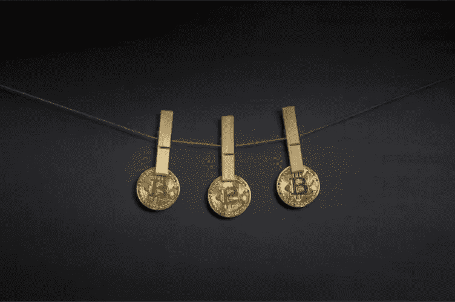

# 反洗钱和 KYC——来自战壕的故事

> 原文：<https://medium.com/coinmonks/alm-and-kyc-tales-from-the-trenches-fe051d209dd2?source=collection_archive---------10----------------------->

我经常被推荐。有些很好，有些很棒，有些很烂。我感谢他们所有人，不管怎样，我知道这都是为了好的方面:建立联系，想帮助客户，希望同时赚点钱。

据我所知，没有多少房地产经纪人在加密领域表现得如此活跃。不到 10 年，也许？我所说的主动，是指主动帮助买卖双方用 crypto 买卖房地产*，而不仅仅是观察市场和投资。事实上，我认为我将代理分为五类:*

1.不关心/不想交易/认为加密是骗局的代理人

2.刚刚加入加密潮流但对此一无所知的特工

3.对和*感兴趣的代理人希望*参与进来，但不确定如何参与

4.精通密码但从未做过交易的特工

5.完成加密到现金或加密到加密交易的代理

我接到很多来自第三类的电话。善意的，他们知道它不会很快消失，但可能有时间也可能没有时间来处理客户打电话说他们想用加密货币买卖。

对那些代理人，我说，保持推荐来，即使他们中的许多人并不像他们所说的那样。对于我们所有人来说，仍然有一个巨大的学习曲线，我马上就会谈到这一点，但我首先要分享一个最近的经历:

我从东部的一个大代理商那里得到了一个推荐，他给我寄来了一位加利福尼亚的女士，据说她有一吨硬币，准备购买。到目前为止，一切顺利。当我和她通电话时，我问了一些常见的基本问题:

1.你拿着哪些硬币？

2.您希望进行“全现金”交易还是混合交易？

3.你的价位是多少？

从这三个最初的问题，我可以判断他们是不是在胡扯，一个精明的加密投资者会立即表现出来。在这种情况下，这位女士告诉我，她持有 3600 万美元的 TBC，希望将其兑换成比特币，进行比特币对比特币或比特币对现金的购买，她的价位在洛杉矶县的某个地区，从 10 万美元到 100 万美元不等。

危险，威尔·罗宾逊！

我声明一下，现在有超过 1500 枚备用硬币。我大概知道 50 个。我从未听说过 TBC，当我问她在哪个交易所有 TBC 时，她不能告诉我。另外，你和我一样清楚，在阳光灿烂的社会里，一个人不可能花 10 万美元买一个纸箱。即使 30 万美元也不行。

我礼貌地退出了谈话，并说我会做一些研究，第二天再和她联系，尽管她很兴奋，但她说她会给我发一些关于硬币的视频(嗯，好吧)。然后我去了[coinmarketcap.com](https://coinmarketcap.com/currencies/tbcoin/)(任何关注硬币的人都必须去的地方)搜索 TBC。没什么。然后我搜索了“十亿硬币”(是的，这就是它的名字)，出于某种原因，它出现在谷歌 coinmarketcap.com 下，所以去数字。在 2016 年 4 月的鼎盛时期，它的价值略高于 4.00 美元，但现在价值 0.001 美元。在她的脑海中，她有 80 枚价值 3600 万美元的硬币，并准备购买她的第一套房子。劳迪。当我看她发来的视频时，我简直不敢相信自己的眼睛。有一个戴着耳塞、穿着背心的女人，坐在一栋有着俗气(而且很吵)喷泉的破公寓楼前，祝贺她的观众向财务自由迈出了新的一步。呕吐。谷歌先生毫不避讳地告诉我，这枚硬币完全是一个金字塔式的抽送骗局，专门捕食那些急于摆脱债务的人。我不忍心给她回电话告诉她她破产了，而是给中介打了电话让他们知道(软骨头？是的。)硬币是假的。一天的工作。

另一个有趣的例子:一个来自另一个国家的家伙在 LinkedIn 上找到我，说他有十亿美元的 DynamiCoin。酷毙了。看到它的市场如何以 1300 万美元封顶和变化，我仍然很好奇。他说他想买下贝弗利山所有的大酒店，一个接一个，而且是认真的。我去办。不是。下一次，开始小一点，K？

另一个最近的例子，另一个好心人问我是否会为比特币或任何更喜欢的货币宣传克罗地亚附近的一个岛屿，包括游艇(或者不包括，如果你喜欢的话)。我非常愿意帮忙，只要他们能证实房主的身份，并且这确实是一处有土地记录的合法房产。他们给我发了几十张漂亮的无人机照片，但当我坚持核实时，他们强调所有者非常坚决地保持匿名。我们来来回回谈了几次，但我的直觉告诉我不行。我绝不会帮助出售一个拥有游艇的兰多岛——据我所知，它属于爱发先生，这将比他们愿意给我的信息更多。

代理:我说的是做好你的功课。我们最不想做的事就是因为一些恐怖的洗钱事件丢掉我们的执照。了解你的客户。即使你不太确定，最好还是小心为上。或者打电话给我。如果我不知道，我知道谁知道。

我对这些悲伤而冗长的故事的全部观点是，我们很难审查常规买家，现在我们的任务是审查想要购买这种新加密产品的买家。不久的某一天，区块链技术将能够自动验证买家、卖家、房产等。并简化流程，但在此之前，*询问*。*提问*。如果您仍然想不起来，并且不知道该问什么其他问题，请发电子邮件至[piper@thecryptorealtygroup.com](mailto:piper@thecryptorealtygroup.com)。

# ❤️喜欢，分享，留下你的评论

如果你喜欢这篇文章，不要忘记喜欢，与你的朋友和同事分享，并在下面留下你对这篇文章的评论。
跟我来……