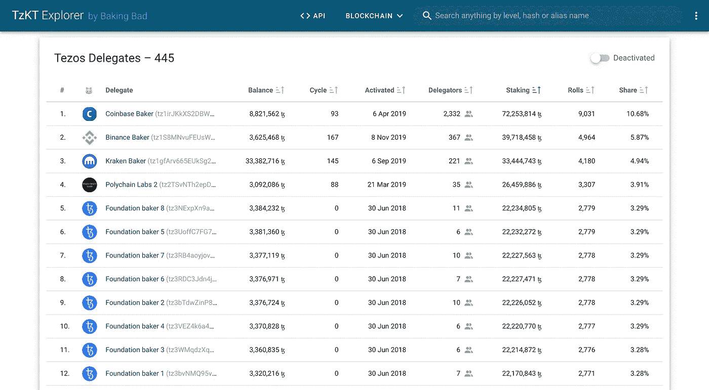
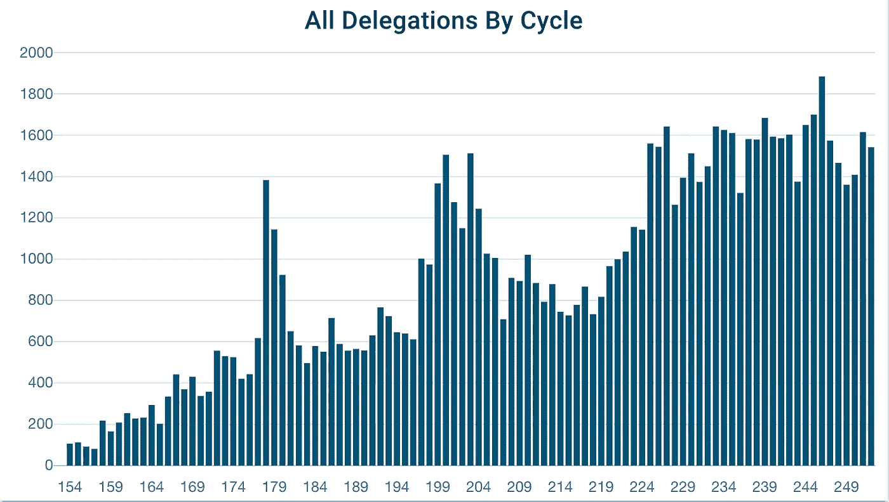
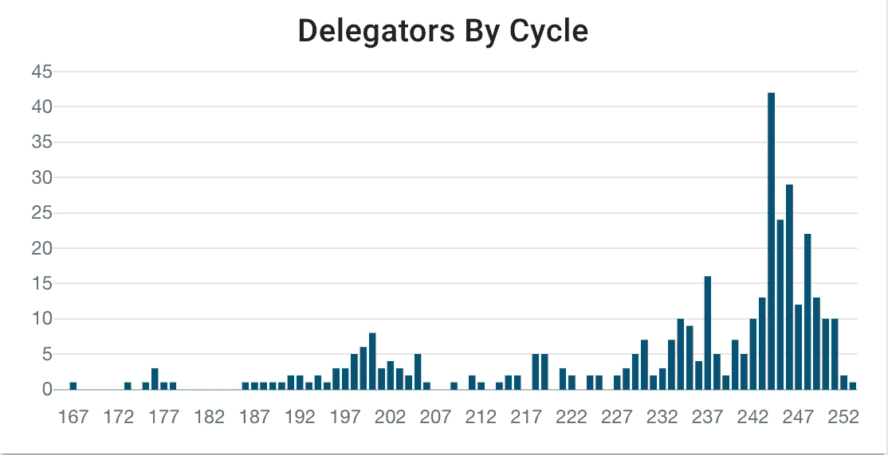
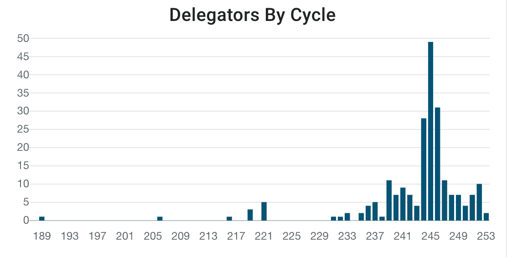

# 近千名 Tezos 用户直接授权给币安和北海巨妖，不会获得赌注奖励。

> 原文：<https://medium.com/coinmonks/almost-a-thousand-tezos-users-delegated-to-binance-and-kraken-directly-and-will-not-get-staking-325f91ebfa2a?source=collection_archive---------4----------------------->

泰佐斯·区块链以其特殊的**利害关系液体证据**共识算法而闻名。每个人都可以成为验证者(用 Tezos 的话来说——一个 ***面包师*** )，并通过授权获得额外的资金来维持网络。目前有超过 400 名 Tezos 面包师。

这种跑马圈地的模式也适用于交易所，如比特币基地、北海巨妖、币安，它们成了 Tezos 网络中最大的面包师。

为了参与交易所的赌注，你需要注册，通过 KYC，并在交易所实际存储资金。从技术上来说，没有什么可以阻止你从你的个人钱包里委托给任何一个面包师，包括交易所。大多数钱包不会警告交易所是托管服务，并允许用户从他们的个人钱包中无缝委托 Tezos。问题在于，那些从钱包里直接委托给交易所的用户永远不会收到他们的赌注奖励，因为他们没有把他们的资金存放在交易所里。

> 从他们的钱包**直接委托给交易所**的用户将永远不会收到**他们的赌注奖励，因为他们没有将他们的资金存储在交易所中。阅读我们关于[如何选择好的 Tezos 面包师](https://baking-bad.org/docs/where-to-stake-tezos)的说明**

最近，随着对 Tezos 和 Staking 的需求越来越大，代表团的人数大幅增加。

去年约有 670 名用户授权给币安·贝克([Tezos block explorer 上的币安授权者](https://tzkt.io/tz1S8MNvuFEUsWgjHvi3AxibRBf388NhT1q2/delegators))，其中 317 人已经将币安授权者更换为其他人。

北海巨妖·贝克得到了大约 288 个代表(北海巨妖代表在 Tezos block explorer 上骑自行车[)，其中只有 75 个离开了北海巨妖代表。](https://tzkt.io/tz1gfArv665EUkSg2ojMBzcbfwuPxAvqPvjo/delegators)

从技术上讲，Tezos Baker 不能取消用户委托，也不能以任何方式阻止用户委托。因此，用户自己应该监督他们委托给谁，面包师费用，付款时间表和自由空间，这取决于面包师自己的平衡。所有这些信息都是由第三方服务提供的，比如 Baking Bad。

赌注的势头越来越大——大约 80%的 Tezos 硬币都参与了赌注，没有一个赌注证明算法有这么高的比例。目前，Tezos 的市值超过 18 亿美元。因此，任何想要参与赌注过程并获得赌注奖励的人都应该认真对待这一点，并在社区或 [Tezos 网站](https://tezos.com/)上澄清所有问题。

欢迎您随时加入我们的[电报聊天](https://t.me/baking_bad_chat)。

Tezos 社区太神奇了！🙌🏻

*原载于 2020 年 7 月 14 日 https://baking-bad.org***。**

> *[直接在您的收件箱中获得最佳软件交易](https://coincodecap.com/?utm_source=coinmonks)*

**