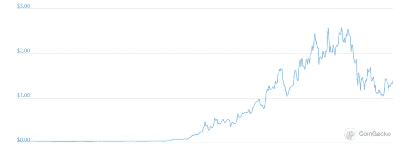
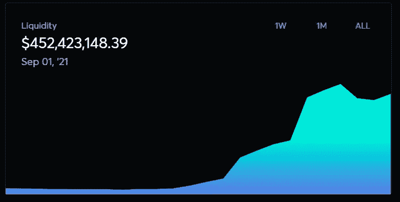
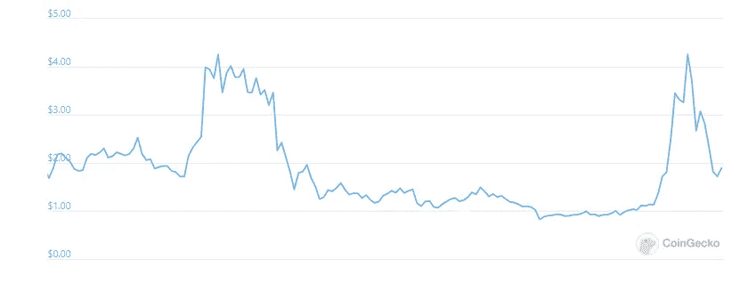
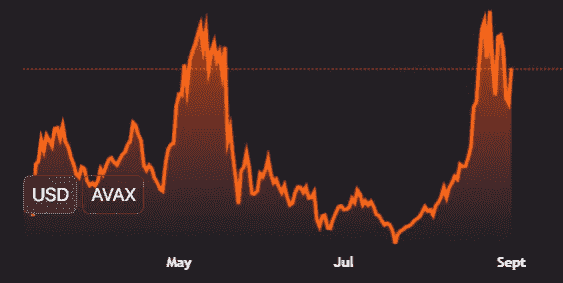
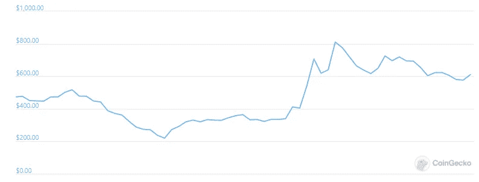
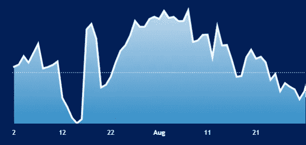
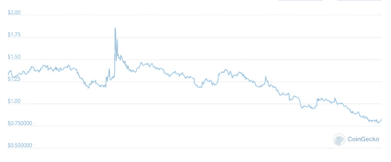
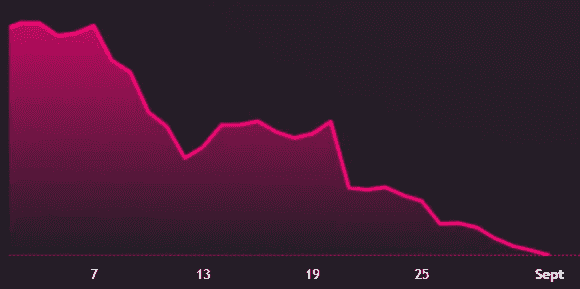

# 指数中的阿尔法:在 AVAX 上看乔 vs 巴布亚新几内亚

> 原文：<https://medium.com/coinmonks/alpha-in-dexes-a-look-at-joe-vs-png-on-avax-c40737cd7ae2?source=collection_archive---------0----------------------->

雪崩式的爆炸是一项壮举。在欢欣鼓舞中，真正引人注目的是 JOE 的崛起，这是一个新的 DEX(分散式交易所)，它超越了雪崩网络上的原始 DEX 穿山甲。乔在不到两周的时间里实现了火箭般的举动，达到了 2 亿美元的历史最高估值，这促使我最终做了一些挖掘，以解析市场如何评估指数，以及我们如何在未来挑选赢家。

我相信我能找到答案。

如果这项工作是以前做的，它会提供与乔一起登上火箭顶端的机会，它会提供是什么推动了价值的巨大飙升的清晰性。但是，不用担心，会有更多的机会。为了清楚地了解未来的类似情况，我把我学到的关于如何考虑和交易指数的知识进行了分解。

# 步骤 A1。了解 DEX 业务是如何运作的

当你交易资产时，DEX 从费用中赚钱。商业模式可以概括为:

收入=交易量*收取的费用

特别是在加密货币交易所，每笔交易的平均费用固定在 0.3%。如果你做 1000 美元的交易，费用是 3 美元。你可以在每个 DEX 网站的“文档”部分找到收取的具体费用。

上面的等式告诉我们，交易量越高，收入越多。所以一般来说，市场波动越大，对企业越有利。难的是知道在等式的“交易量”部分插入什么。

# 步骤 A2。理解滑点、流动性和 TVL

在踏入街上的一个水坑和踏入海洋之间，你会更扰乱哪一池水？水坑。你可以破坏一个水坑，但你几乎不能在海洋中留下凹痕。水池的深度是这两种情况的主要区别。

这个概念类似于指数中的“流动性”概念。DEX 提供给用户的资金越多，DEX 为你提供的服务就越好。这是因为，如果你在交易所用一种资产换另一种资产，除了手续费，你在“滑点成本”上的损失会更少。

滑点=你在指数中得到的最终价格和市场价格之间的差额

当你使用的交易所没有足够的这两种资产来促进顺利交易时，就会发生滑点，因此你将一种资产转换为另一种资产的决定实际上会影响该指数上资产的基础价格。

DEX 的流动性总价值被称为“锁定总价值”或 TVL。如果我用戴和交易，戴和的资金池就是这个资金池的了。合计所有不同的池，你有整个指数的 TVL。值得注意的是，每个流动性池都有 50-50 组成该池的两种代币，因此在戴-USDT 中，戴和 USDT 价值各占 50%。

作为用户，我们为什么关心 TVL？回答:我们在滑点费用上损失较少。

DEX 如何激励人们将代币存入流动性池？通过 1)向流动性提供商支付 DEX 费用，以及 2)作为额外奖励赠送免费代币。

指数的 TVL 越大→交易越平稳→用户的滑动成本越低→使用指数的人越多→交易量越大→收入越高→流动性提供者的费用越高→正反馈循环

现在，让我们看看为什么 TVL 是一个重要的指标。

# 步骤 B1。从寻找数据趋势开始

我看了很多很多东西，但我会向你展示一天结束时出现的模式:

乔·普莱斯图表(上)对 TVL(下)。峰值正好在 8 月 29 日

**穿山甲价格图(上)vs TVL(下):峰值恰好在 8 月 24 日和 5 月 11 日**

**快易购价格(上)和 TVL(下):波谷和波峰完全重合**

**DFYN 上个月价格(上图)与 TVL(下图):除了 1 天的短暂波动之外，两者一致**

你可以尝试任何指数，你会看到类似的趋势。

**有哪些外卖？**

看到德克斯的市值和 TVL 的走势之间如此清晰、几乎 1:1 的关系，我感到震惊。显然，市场正在根据 TVLs 赋予指数价值。

我感到震惊的一个原因是，我最初认为交易量对企业来说比 TVL 更重要(从根本上说，按照收入公式来看，它仍然如此)，所以我一开始就对 TVL 指标持怀疑态度。我更关注预测/跟踪日交易量，而不是 TVL，因为它们可能有很大的不同。

另一个令人震惊的原因是，DEXes 使用的一些令牌组学非常复杂。我的意思是，一些指数通过在自己的代币中提供惊人数量的奖励来吸引流动性，导致价格稀释，而一些指数要求代币保持锁定，等等。考虑到排放的供应量，一些公司每天会稀释 1%至 2%的市值。但是很明显，跟踪这些动态并不重要，这使得我们的交易更容易。对于那些问这是否重要的人，我的最佳答案是，是的，但程度较轻。想象一下，上面的图表会随着稀释度的降低而上移，随着稀释度的增加而下移，但是 TVL 的趋势应该还是很明显的。

直觉上，我认为这意味着市场认为 TVL 是成交量的一个*前向指标*,而不是成交量数字本身，后者是一个当前/后向指标。市场大概在说“更多 TVL →更少滑点→更多人会用这个 DEX→更多交易量→更多收益→更高市值”。

# 迈步 B2。挑剔 TVL

所以我们相信这完全是因为 TVL。但是 TVL 的市场价格几乎是立即变化的，超过了我们可以通过在每一个转折点买入/卖出来获利的范围。那么*我们如何保持领先？答案是，我们需要更进一步，正确预测 TVL 的增长。我将概述我对此的看法，然后以 JOE 和 PNG 为例。*

## B2.1 的基本驱动因素

TVL 可以由于以下变化而变化:1)存放的代币的价格变化 2)存放的代币的数量。

TVL =为流动性存放的代币数量*代币价格

**价格变化**
例如，如果有一个指数的 AVAX-USDT 池价值 100 万美元，那么你在 AVAX 和 USDT 中各有 50 万美元。如果每个 AVAX 值 50 美元，您将拥有 100，000 个 AVAX 代币，如果 USDT 值 1 美元，您将拥有 500，000 个 USDT 代币。

现在，假设您看到该池上涨了+$50k，并且 AVAX 的价格上涨了+10%。在这种情况下，简单地说，几乎整个池的价值都是由 AVAX 令牌的价格波动推高的，而不是由于存放的令牌数量。如果我是正确的，TVL 的上涨通常会提高指数的市场价值，这揭示了一个有趣的机制:

为流动性而存放的代币价格增加→TVL 增加→代币市值增加

我可以很有信心地说，这是指数对更广泛的市场(瑞士联邦理工学院、BTC 等)的价格变动高度敏感的一个主要原因。这也意味着，如果我们愿意，我们可以非常科学地计算一个指数的 TVL 对其流动性令牌价格波动的敏感度。在上面的例子中，对 AVAX 价格变动的敏感度为 40%(AVAX 变动 2%，TVL 指数变动 5%)。现在，我们至少可以解释为什么 DEXes 对更广泛的市场波动有如此高的敏感度，我们不会陷入说“TVL 一夜之间上涨了这么多”的陷阱当市场出现大范围反弹时。

**音量变化**

这是一个简单的道理——代币的存放量越大，TVL 的价值就越高。是什么驱使人们存放更多代币？这是 DEXes 之间的市场份额游戏。他们需要平衡以“免费”代币奖励的形式给予人们的激励，同时显示代币的真实效用，否则太多的代币被赠送并被接收者立即出售，从而将代币的价格稀释到 0 美元。简单地说，相对于同行给予的回报越高，指数吸引的流动性就越大。经常有很多关于稀释的谈论，最终只是分散注意力——在我看来，当你看一个 DEX 的代币市场份额并量化它在特定领域的增长潜力时，你就获得了“优势”。这就是 JOE 对 PNG 所做的，稍后我会展示。

想一想一个 DEX 能以差异化的方式吸引多少成交量，想一想市场份额。例如，如果有 1 亿 USDC 在整个雪崩生态系统中流通，一个 DEX 有 1000 万 USDC 作为流动性沉淀，增量爆炸式增长实际上可以来自 USDC 代币。一个聪明的团队将瞄准这个机会，为潜在的 USDC 存款人提供高额奖励，以获得市场份额。

## B2.1 如何监控 TVL 变化

我们需要跟踪数据，以确保我们的论文进展顺利。也许我们的论点是，DEX A 可以从生态系统中吸引 2 亿 TVL USDC 代币——我们需要知道饱和点何时到来，以预测何时不再持有投资头寸。一些 DEX Analytics 页面会向您显示具体存放了多少代币，以便您进行监控:

如上所述，TVL 是放入流动性池的资金总和。如果您点击 DEX Analytics 网站中的“分析→池”,您将看到每个池的 TVL 数据。例如，在 JOE 中，您可以看到截至今天 2021 年 9 月 2 日，AVAX-USDT.e 流动性池中有[8000 万美元。在穿山甲中，有 3300 万美元](https://analytics.traderjoexyz.com/)。乔的流动性池更深。

作为一个用户，你更愿意用哪个指数来交易你的 AVAX 和 USDT.e，或者相反？你会想用乔，因为他有更多的流动性，因此滑点更少。这为流动性提供者吸引了更多的费用(Joe 显示，在过去 24 小时内，这对组合的费用为 120 万美元，而巴布亚新几内亚为 5 万美元)，因此更多的 TVL 被吸引到这个池中，开始了反馈循环。

穿山甲对此并不陌生，因此提供了[高额的象征性奖励](https://app.pangolin.exchange/#/png/1)以将流动性引入该池，然后乔[做了同样的](https://www.traderjoexyz.com/#/farm)，但可以提供较少的奖励，因为该池中的交易量较高，产生的费用也较高，于是战争随之而来。

我们需要跟踪这场战争，看看是否一方或另一方提供了比另一方更大的激励，以激励 TVL 在他们之间足够大的摇摆。

[现在点击‘代币’](https://analytics.traderjoexyz.com/tokens)。这是一个很好的总结，有助于理解 DEX 对每个令牌的令牌价格变动有多敏感，或者了解在该 DEX 上提供哪些令牌进行交易。您可以看到，JOE 拥有 1.82 亿美元的 AVAX 代币(总计 4.72 亿美元，约占 40%)，而 PNG 拥有 1.43 亿美元(总计 2.98 亿美元，约占 50%)。这对于上述定价变化非常重要。AVAX 每上涨 1 美元，就意味着巴布亚新几内亚的 TVL 上涨更多，因此，通过购买巴布亚新几内亚，你需要知道，你在短期内对 AVAX 的价格有更高的敏感度。

我们还注意到了什么？最重要的观察，在我看来，是乔有 1.57 亿美元的稳定 coins (USDT +戴+ USDC)对巴新只有 2300 万美元。这是两个平台之间的定义细节，当我们看这个例子时，我将对此进行扩展。

# 步骤 c .引入市值/TVL 指标作为情绪走廊

所以我们现在可以识别和监控 DEX 的 TVL。我们需要能够将一个指数与另一个指数进行比较，以帮助我们了解一个指数是否受到市场的不公平喜爱或厌恶，因此我们引入了市值/TVL 指标:

市场价值=供给*代币的市场价格(哪个供给？稀释还是突出？无论你选择什么，保持一致，倾向于总供应量，但同时使用两者来确定任何需要进一步调查的差异)

TVL =锁定指数的总价值，如上所述

市场价值/TVL =根据市场地位将一个指数与另一个指数联系起来进行比较的指标。

指标越高，市场给予每单位 TVL 指数的回报越多，因此越受欢迎，反之亦然。

在传统的金融估值中，这些类型的指标有助于比较一项资产是“更便宜”还是“更贵”。它们非常有用，但前提是:1)数字是正确的；2)它们仅在正确的上下文中用于比较目的，而不是孤立地使用，因为如果你不了解背景/环境，孤立地使用没有多大意义。

更多的爱与更多的恨，谁来说什么是资产的公平？我们需要有足够的背景和经验来知道这些数字什么时候是不公平的，什么时候是过分的，来帮助指导我们利用它作为交易机会。我们不需要太科学，请允许我从今天开始给你举一个例子，我们可以通过跟踪市场新闻学到很多东西，并将其添加到我们的心理图书馆中:

今天，JOE 宣布了来自著名投资者的 500 万美元融资。乔的 TVL(驱动商业价值的基本指标)纹丝不动。全天稳定在 4.5 亿美元左右。乔的市值从宣布前的 1.62 亿美元上升到宣布后的 2.25 亿美元，因此市值/TVL 从 0.36 上升到 0.5。换句话说，更多的爱被给予。

孤立来看，这些数字意义不大。0.5 是好事吗？我不知道。但相对于它自己的历史数字(从 0.36 上升到 0.5)或竞争对手(巴布亚新几内亚现在是 0.25)，它确实有助于我们量化资产中的*相对*积极/消极情绪。我现在知道，在经济繁荣时期，0.5%对乔来说可能是合理的。如果有一天市值/tvl 达到 2.0，这可能表明乐观情绪或“可能不会变得更好”的危险区域。0.36 可能是平均值，或者在糟糕的时期是正确的数字吗？现在时局不好吗？构建上下文来找出答案！你甚至可以像专业人士一样，回头绘制一段时间内的市值/tvl 图，看看市场的爱与恨。这会给你未来使用的正确的走廊。

不要因为“市值/tvl 更便宜”而陷入偏爱某项资产的陷阱。我说的“便宜”是指市场不太喜欢它。就因为 PNG 0.25 vs JOE 0.5，PNG 就‘便宜’了吗？如果 PNG 历史上一直在 0.25 附近交易会怎样？这将向我们表明，今天对巴布亚新几内亚来说没有什么特别的。通过回溯测试建立上下文以获得信心。

巴布亚新几内亚不太受欢迎有一个明显的原因，而且它恰好是基本正确的(在我看来)，我将在下面解释。所以对我来说，这并没有让巴布亚新几内亚变得“更便宜”，因为“便宜”意味着我认为 T2 不正确地比 T3 便宜。

对于那些想通过告诉我这个指标是无用的和“炒作的加密交易”来反驳我的人，我先发制人地提供我的反驳，给你看上面的价格与 TVL 的图表，清楚地指出市场在评估指数中非常重要。事实上，你可以从代币的价格变动中科学地计算出 TVL 的百分比变化，并看到这在某些情况下也与市值变动有很好的相关性，这令人震惊。

如果你能赶在公告发布之前买入/卖出“炒作”，那就太好了。但这不是一个可以用来持续战胜市场的可重复的投资过程。为了反复获胜，并利用预测能力判断波峰和波谷，从长远来看，我已经确定了一个明确的战略，这是正确的 TVL 增长，并通过使用市值/tvl 指标监测情绪来补充。

持续监控→建立环境→等待令人愤怒的举动→识别它是否是根本的→如果不是就介入

# 通过查看 JOE vs PNG 将所有这些放在一起

JOE 和 PNG 是雪崩生态系统中争夺市场份额的两只 dex。很容易监控他们的数据，我已经链接了上面的页面。你可以看到，JOE 从 8 月 19 日的 2600 万美元涨到 9 月 2 日的 4.26 亿美元，而 PNG 从 2.78 亿美元涨到 2.98 亿美元。巴布亚新几内亚是如何失去其竞争优势和先发优势的？

让我们回到 8 月中旬，第一个关于雪崩的货币市场协议 BENQI 诞生的时候。BENQI 打开了资金流入雪崩生态系统的闸门，因为 BENQI 向用户提供免费代币存款*和借款*、ETH、、戴和 AVAX。对于任何想快速赚钱的 DeFi 用户来说，下面是一系列合乎逻辑的资金流动:

1.  动资金雪崩存款进本齐。
2.  本齐免费向、ETH、戴、和 AVAX 提供存款和贷款，因此他/她存款这些代币中的任何一个，赚钱，并以此为抵押贷款，赚取更多的奖励代币。
3.  贷款拿了怎么办？用于再次存入本齐以赚取更多的钱，或者可用于存入 DEX 中的流动性池以赚取更高的钱数(DEX 费用+ DEX 奖励代币)。
4.  如果用户借入了瑞士联邦储蓄银行或 BTC 或戴，他们需要在 DEX 上兑换该金额的 50%,才能存入流动性池以赚取费用。例如，将 100%的戴伊换成 50%的戴伊和 50%的 USDT，存入阿呆-USDT 流动性池。

仅仅基于上述资金的逻辑流动，我们就有了一个很好的论文起点。现在我们去看看哪个德克斯会赢。我们在找什么？更侧重于本齐提供的货币的指数。

我们今天发现的是，乔有 1.57 亿美元的稳定资本(USDT +戴+ USDC)，而巴布亚新几内亚只有 2300 万美元。乔现在的 ETH 甚至比 PNG 还多。那么，为什么会有人想在 PNG 而不是 JOE 上交易呢？滑点成本更高，因此用户可能更少，因此流动性提供者的交易费用也更低。巴布亚新几内亚显然存在结构性问题，较低的市值/总市值反映了这一点。JOE 决定将最广泛采用的代币注入雪崩系统，这使得 PNG 在雪崩生态系统中风险更高的代币中胜出，这些代币的市值更小，因此交易量也更小:QI (BENQI 的治理代币)、Penguin Finance 等。

在我看来，这是德克斯之间的一个关键区别，鉴于乔现在已经建立了护城河，我看不出这种情况为什么会改变。护城河就是上面讨论的正反馈回路。

那么，乔能去哪里呢？我们可以进行更详细的分析，但出于本文的目的，我们将保持简短:

1.  保持 tvl 不变，但改变市值/总市值:
    计算出乔在历史上达到的市值/tvl 的峰值，并将其应用于当前的 TVL，这就是乔可以合理兴奋的程度
2.  监控 TVL 的增长
    我每天监控本奇的[存款/贷款](https://app.benqi.fi/overview)，以给我一个资产如何进出雪崩的指示。你可以监视[雪崩桥](https://avascan.info/blockchain/c/bridge/0x50Ff3B278fCC70ec7A9465063d68029AB460eA04)，或者看[脱菲拉马](https://defillama.com/chain/Avalanche)。监控帮助我知道今天的起点或状态。

3.预测 TVL 增长

a.在价格方面，很明显，JOE 对我们需要了解的 AVAX 的价格非常敏感。我们可以在这一点上更加科学，但如果你正在寻求投资一个复合指数，这可能不是必要的。你需要市场份额(TVL 量)的增长，但要在价格波动上更加科学:
AVAX 每+1 美元(+2.3%)，我认为 TVL 增长约 400 万美元。将这 400 万美元乘以 0.3 倍的市值/tvl 平均值，你会得到约 100 万美元的完全稀释市值或+0.15%。因此，在当前价格下，平均每一美元的 AVAX 变动的敏感度为 0.15%/2% = 6%。

b.雪崩内部的市场份额:与巴布亚新几内亚相比，我认为这是乔的极限，除非新的资金进入雪崩生态系统。为什么？Joe 和 PNG 在他们的流动性池中已经有了相似的 AVAX 百分比，Joe 已经拥有了 Avalanche 上的大部分 stablecoin 流动性。乔也许可以开始从巴布亚新几内亚正在赢得的小盘股代币中吸走一些流动性，但这不会使局势发生太大变化。此外，Sushiswap 也将积极推出自己的份额。

c.然后，在更广泛的资金进入雪崩式生态系统的问题上，我的观察是，BENQI 存款/借款利率是一个重要驱动因素。给的免费钱越多，越多的钱被吸进 Avalanche，最终进入 Joe。本奇赠送的免费代币只值很多本奇价格够高。我的想法是，我们需要持续看到 9-10%的净 APY，以激励资金流入雪崩。流入的资金越多=流入 JOE 流动性池的可能性就越大。

很简单，目前有 20 亿的奔奇在雪崩。乔已经积累了 4.5 亿美元的 TVL。如果货币市场的回报变得更积极(AAVE 推出了高额回报或 BENQI price 扶摇直上，给予更高的回报)，再有 20 亿美元进来，也许 JOE 会再拿 5 亿美元(这里没有科学，只是猜测)。

总 TVL = 10 亿，乘以市值/tvl 在 0.5-0.7 倍的兴奋度下，我们可以得到 7 亿美元的市值或 7-10 美元的 JOE。

如果我使用完全稀释的供应，那么高峰时的市值/tvl 是 3.0 倍，乘以 10 亿美元，即 30 亿美元完全稀释的市值除以 0.5，约为 6 美元。这是一个起点——随着事情的发展，我会调整我的假设。

希望这是有见地的！这不是理财建议！

> 加入 [Coinmonks 电报频道](https://t.me/coincodecap)，了解加密交易和投资

## 另外，阅读

*   [尤霍德勒 vs 科恩洛安 vs 霍德诺特](/coinmonks/youhodler-vs-coinloan-vs-hodlnaut-b1050acde55a) | [隐蝠 vs 哈斯博特](https://blog.coincodecap.com/cryptohopper-vs-haasbot)
*   [币安 vs 北海巨妖](https://blog.coincodecap.com/binance-vs-kraken) | [美元成本平均交易机器人](https://blog.coincodecap.com/pionex-dca-bot)
*   [如何在印度购买比特币？](/coinmonks/buy-bitcoin-in-india-feb50ddfef94) | [WazirX 审核](/coinmonks/wazirx-review-5c811b074f5b) | [BitMEX 审核](https://blog.coincodecap.com/bitmex-review)
*   [比特币主根](https://blog.coincodecap.com/bitcoin-taproot) | [Bitso 评论](https://blog.coincodecap.com/bitso-review) | [排名前 6 的比特币信用卡](/coinmonks/bitcoin-credit-card-bc8ab6f377c6)
*   [双子座 vs 比特币基地](https://blog.coincodecap.com/gemini-vs-coinbase) | [比特币基地 vs 北海巨妖](https://blog.coincodecap.com/kraken-vs-coinbase) | [硬币罐 vs 硬币点](https://blog.coincodecap.com/coinspot-vs-coinjar)
*   [印度密码交易所](/coinmonks/bitcoin-exchange-in-india-7f1fe79715c9) | [比特币储蓄账户](/coinmonks/bitcoin-savings-account-e65b13f92451) | [Paxful 审核](/coinmonks/paxful-review-4daf2354ab70)
*   [杠杆代币](/coinmonks/leveraged-token-3f5257808b22) | [最佳加密货币交易所](/coinmonks/crypto-exchange-dd2f9d6f3769)|[excendex Review](/coinmonks/ascendex-review-53e829cf75fa)
*   [Godex.io 审核](/coinmonks/godex-io-review-7366086519fb) | [邀请审核](/coinmonks/invity-review-70f3030c0502) | [BitForex 审核](https://blog.coincodecap.com/bitforex-review) | [HitBTC 审核](/coinmonks/hitbtc-review-c5143c5d53c2)
*   [币安费](/coinmonks/binance-fees-8588ec17965) | [僵尸网络评论](/coinmonks/botcrypto-review-2021-build-your-own-trading-bot-coincodecap-6b8332d736c7)|[Crypto.com 另类投资](https://blog.coincodecap.com/crypto-com-alternatives)
*   [什么是交易信号？](https://blog.coincodecap.com/trading-signal) | [比特币 vs 比特币基地](https://blog.coincodecap.com/bitstamp-coinbase)
*   [盈利农民回顾](https://blog.coincodecap.com/profitfarmers-review) | [如何使用康沃尔交易机器人](https://blog.coincodecap.com/cornix-trading-bot)
*   [MXC 交易所评论](/coinmonks/mxc-exchange-review-3af0ec1cba8c) | [Pionex vs 币安](https://blog.coincodecap.com/pionex-vs-binance) | [Pionex 套利机器人](https://blog.coincodecap.com/pionex-arbitrage-bot)
*   [我在加密货币交易方面的经验](/coinmonks/my-experience-with-crypto-copy-trading-d6feb2ce3ac5) | [比特币基地评论](/coinmonks/coinbase-review-6ef4e0f56064)
*   [CoinFLEX 点评](https://blog.coincodecap.com/coinflex-review) | [AEX 交易所点评](https://blog.coincodecap.com/aex-exchange-review) | [UPbit 点评](https://blog.coincodecap.com/upbit-review)
*   [AscendEx 保证金交易](https://blog.coincodecap.com/ascendex-margin-trading) | [Bitfinex 赌注](https://blog.coincodecap.com/bitfinex-staking) | [bitFlyer 点评](https://blog.coincodecap.com/bitflyer-review)
*   [麻雀交换评论](https://blog.coincodecap.com/sparrow-exchange-review) | [纳什交换评论](https://blog.coincodecap.com/nash-exchange-review)
*   [加密货币储蓄账户](/coinmonks/cryptocurrency-savings-accounts-be3bc0feffbf) | [赌注加密](https://blog.coincodecap.com/staking-crypto) | [加密交易机器人](https://blog.coincodecap.com/best-crypto-trading-bots)
*   [BigONE 交易所评论](/coinmonks/bigone-exchange-review-64705d85a1d4) | [CEX。IO 审查](https://blog.coincodecap.com/cex-io-review) | [Swapzone 审查](/coinmonks/swapzone-review-crypto-exchange-data-aggregator-e0ad78e55ed7)
*   [最佳比特币保证金交易](/coinmonks/bitcoin-margin-trading-exchange-bcbfcbf7b8e3) | [比特币保证金交易](https://blog.coincodecap.com/bityard-margin-trading)
*   [加密保证金交易交易所](/coinmonks/crypto-margin-trading-exchanges-428b1f7ad108) | [赚取比特币](/coinmonks/earn-bitcoin-6e8bd3c592d9) | [Mudrex 投资](https://blog.coincodecap.com/mudrex-invest-review-the-best-way-to-invest-in-crypto)
*   [WazirX vs coin dcx vs bit bns](/coinmonks/wazirx-vs-coindcx-vs-bitbns-149f4f19a2f1)|[block fi vs coin loan vs Nexo](/coinmonks/blockfi-vs-coinloan-vs-nexo-cb624635230d)
*   [BlockFi 信用卡](https://blog.coincodecap.com/blockfi-credit-card) | [如何在币安购买比特币](https://blog.coincodecap.com/buy-bitcoin-binance)
*   [火币交易机器人](https://blog.coincodecap.com/huobi-trading-bot) | [如何购买 ADA](https://blog.coincodecap.com/buy-ada-cardano) | [Geco。一次复习](https://blog.coincodecap.com/geco-one-review)
*   [加密复制交易平台](/coinmonks/top-10-crypto-copy-trading-platforms-for-beginners-d0c37c7d698c) | [五大 BlockFi 替代方案](https://blog.coincodecap.com/blockfi-alternatives)
*   [CoinLoan 点评](https://blog.coincodecap.com/coinloan-review)|[Crypto.com 点评](/coinmonks/crypto-com-review-f143dca1f74c) | [火币保证金交易](/coinmonks/huobi-margin-trading-b3b06cdc1519)
*   [Bybit vs 币安](https://blog.coincodecap.com/bybit-binance-moonxbt)|[stealth x 回顾](/coinmonks/stealthex-review-396c67309988) | [Probit 回顾](https://blog.coincodecap.com/probit-review)
*   [顶级付费加密货币和区块链课程](https://blog.coincodecap.com/blockchain-courses)
*   [在美国如何使用 BitMEX？](https://blog.coincodecap.com/use-bitmex-in-usa) | [BitMEX 评论](https://blog.coincodecap.com/bitmex-review)
*   [最佳免费加密信号](https://blog.coincodecap.com/free-crypto-signals) | [YoBit 评论](/coinmonks/yobit-review-175464162c62) | [Bitbns 评论](/coinmonks/bitbns-review-38256a07e161)
*   [OKEx 审查](/coinmonks/okex-review-6b369304110f) | [Kucoin 交易机器人](/coinmonks/kucoin-trading-bot-automate-your-trades-8cf0ca2138e0) | [期货交易机器人](/coinmonks/futures-trading-bots-5a282ccee3f5)
*   [AscendEx Staking](https://blog.coincodecap.com/ascendex-staking)|[Bot Ocean Review](https://blog.coincodecap.com/bot-ocean-review)|[最佳比特币钱包](https://blog.coincodecap.com/bitcoin-wallets-india)
*   [霍比评论](https://blog.coincodecap.com/huobi-review) | [OKEx 保证金交易](https://blog.coincodecap.com/okex-margin-trading) | [期货交易](https://blog.coincodecap.com/futures-trading)
*   [比特币基地赌注](https://blog.coincodecap.com/coinbase-staking) | [热点评论](/coinmonks/hotbit-review-cd5bec41dafb) | [库币评论](https://blog.coincodecap.com/kucoin-review)
*   [最佳加密交易信号电报](/coinmonks/best-crypto-signals-telegram-5785cdbc4b2b) | [MoonXBT 评论](/coinmonks/moonxbt-review-6e4ab26d037)
*   [Coinswitch 俱吠罗评论](/coinmonks/coinswitch-kuber-review-1a8dc5c7a739) | [电网交易机器人](https://blog.coincodecap.com/grid-trading) | [比特币基地费用](/coinmonks/coinbase-fees-831e77d4f2c5)
*   [Bitget 回顾](https://blog.coincodecap.com/bitget-review)|[Gemini vs block fi](https://blog.coincodecap.com/gemini-vs-blockfi)|[OKEx 期货交易](https://blog.coincodecap.com/okex-futures-trading)
*   [OKEx vs KuCoin](https://blog.coincodecap.com/okex-kucoin) | [摄氏替代品](https://blog.coincodecap.com/celsius-alternatives) | [如何购买 VeChain](https://blog.coincodecap.com/buy-vechain)
*   [币安期货交易](https://blog.coincodecap.com/binance-futures-trading)|[3 commas vs Mudrex vs eToro](https://blog.coincodecap.com/mudrex-3commas-etoro)
*   [如何购买 Monero](https://blog.coincodecap.com/buy-monero) | [IDEX 评论](https://blog.coincodecap.com/idex-review) | [BitKan 交易机器人](https://blog.coincodecap.com/bitkan-trading-bot)
*   [币安 vs Bitstamp](https://blog.coincodecap.com/binance-vs-bitstamp) | [Bitpanda vs 比特币基地 vs Coinsbit](https://blog.coincodecap.com/bitpanda-coinbase-coinsbit)
*   [如何购买瑞波(XRP)](https://blog.coincodecap.com/buy-ripple-india) | [非洲最好的加密交易所](https://blog.coincodecap.com/crypto-exchange-africa)
*   [非洲最佳加密交易所](https://blog.coincodecap.com/crypto-exchange-africa) | [Hoo 交易所评论](https://blog.coincodecap.com/hoo-exchange-review)
*   [eToro vs robin hood](https://blog.coincodecap.com/etoro-robinhood)|[MoonXBT vs by bit vs Bityard](https://blog.coincodecap.com/bybit-bityard-moonxbt)
*   [Stormgain 回顾](https://blog.coincodecap.com/stormgain-review) | [Bexplus 回顾](https://blog.coincodecap.com/bexplus-review) | [币安 vs Bittrex](https://blog.coincodecap.com/binance-vs-bittrex)
*   [Bookmap 评论](https://blog.coincodecap.com/bookmap-review-2021-best-trading-software) | [美国 5 大最佳加密交易所](https://blog.coincodecap.com/crypto-exchange-usa)
*   [如何在 FTX 交易所交易期货](https://blog.coincodecap.com/ftx-futures-trading) | [OKEx vs 币安](https://blog.coincodecap.com/okex-vs-binance)
*   [如何在势不可挡的域名上购买域名？](https://blog.coincodecap.com/buy-domain-on-unstoppable-domains)
*   [印度的加密税](https://blog.coincodecap.com/crypto-tax-india) | [altFINS 审核](https://blog.coincodecap.com/altfins-review) | [Prokey 审核](/coinmonks/prokey-review-26611173c13c)
*   [区块链 vs 比特币基地](https://blog.coincodecap.com/blockfi-vs-coinbase) | [比特坎评论](https://blog.coincodecap.com/bitkan-review) | [币安评论](/coinmonks/binance-review-ee10d3bf3b6e)