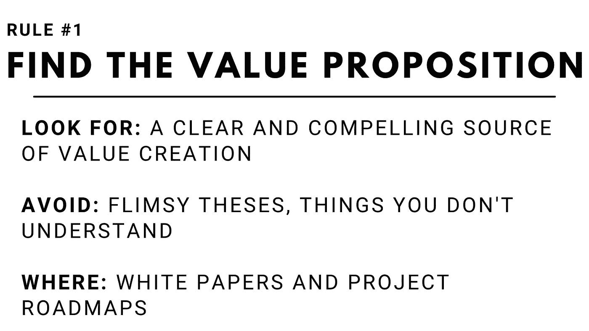
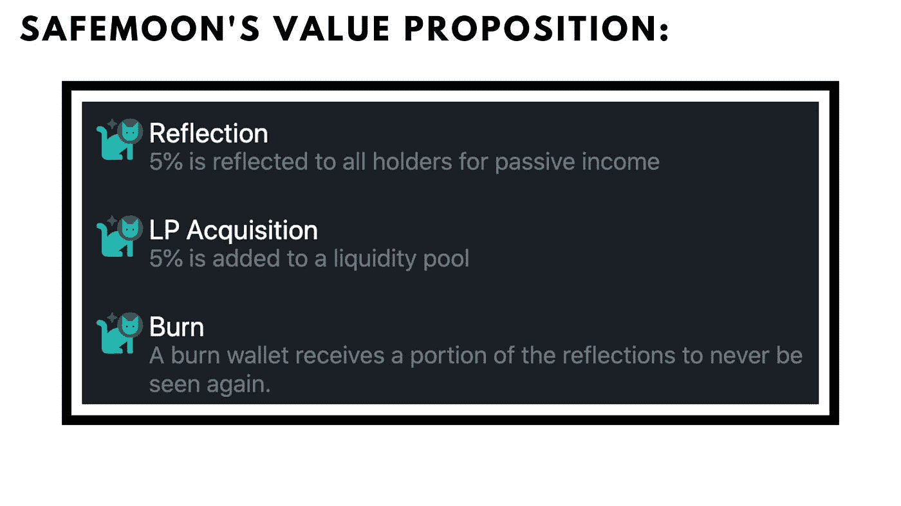
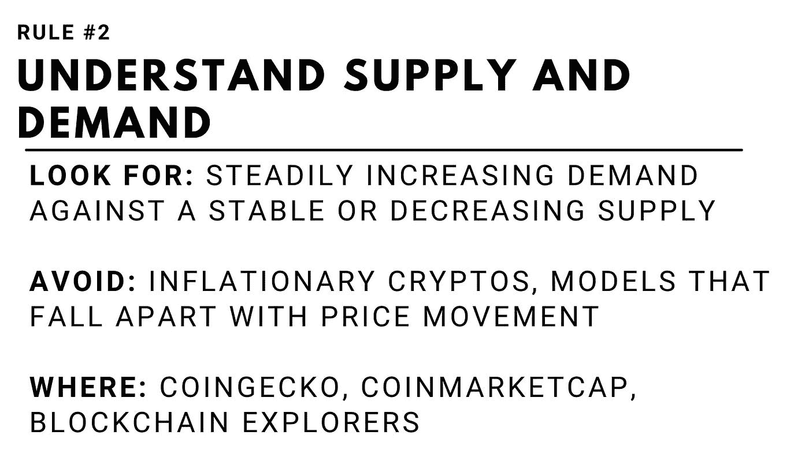
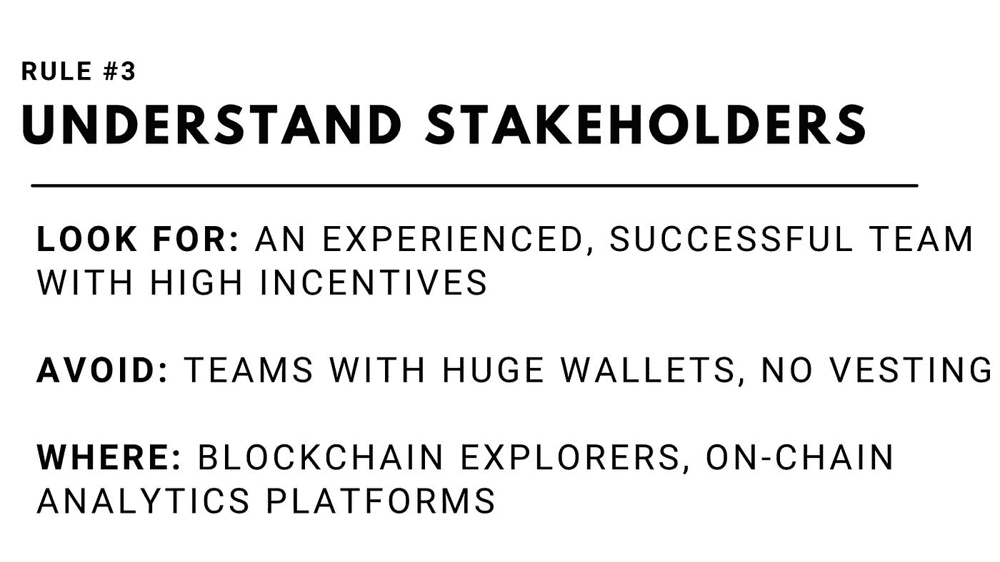

# Altcoin 基本面分析 101:如何避免输家，挑选赢家

> 原文：<https://medium.com/coinmonks/altcoin-fundamental-analysis-101-how-to-avoid-losers-and-pick-winners-67089f098d19?source=collection_archive---------3----------------------->

## 我的内容只有一小部分发表在媒体上。如果你想获得所有加密实用主义者的 altcoin 报告和投资分析，请在这里 *免费注册简讯* [*。*](http://cryptopragmatist.com/sign-up/)

**知识创造财富**

加密货币之所以能产生高收益，是因为它们还没有被很好地理解。

对加密货币最大的批评之一是这个行业是“投机性的”。怀疑论者说，加密投资者来这里只是为了赚钱。当然，许多看涨加密的人并不真正明白他们投资的是什么。

称那些人为投机者是公平的。

但是，你越能自学加密技术并亲自验证事实，你就越能理解加密货币背后的内在价值及其使用方式，投资加密货币的风险就越低。

如果你未经研究就把钱投入加密货币，你实际上是在赌博。但如果你投资加密货币，并花时间去理解它们，你的风险就会降低。

通过了解给定密码的基本原理，随着环境和市场的变化，您可以评估这些变化是否会影响该密码成功的几率。与此同时，你可以评估机会，并根据这些基本变化选择可能上涨的投资。

​

# 密码的普遍规律

早期仅仅知道和理解加密的人现在已经获得了数千亿美元的财富。虽然加密价格行为一直不稳定，但该行业自成立以来在两件事上一直保持一致:

1.  **懂加密货币的人得到了经济上的回报。**
2.  **在不了解的情况下投资加密货币的人受到了经济上的惩罚。**

如果每个人都明白加密是如何工作的，以及它改变世界的潜力，那么赚钱就会困难得多。市场会更有效率。

谢天谢地，我们提前到了派对。如果我们投入工作来学习和理解加密货币，我们可以创造出改变生活的财务回报的惊人机会。

​

# 替代硬币分析的三个规则

如果知识低效率允许我们为我们的投资组合创造超额回报，那么创造可靠 alpha(超额 ROI)的方法是建立一个可重复的过程，在这个过程中我们可以研究和理解加密货币。

基本面分析很难，但不需要特殊教育、独家信息，或者超天才级别的大脑。

> **在今天的市场条件下，任何半聪明的投资者都可以进行研究，让他们的加密货币投资组合产生高于平均水平的回报。**

在我担任 Altcoin Research 分析师期间，我建立了一个简单的基本框架，我通过这个框架对我研究的所有加密货币**进行基本的预测。**

虽然这个框架并不全面，但它是一个起点，将为您更好地理解加密货币奠定坚实的基础，从而做出更好的投资决策。我把它分成三条规则:三个你必须回答的问题。

如果你很好地掌握了这三条规则如何应用于你正在研究的替代货币，你就能为给定的加密货币做出明智的投资决策。

​

​

要理解加密货币，最重要的一点是它如何为用户提供价值。这通常可以被浓缩成几个单词或句子，但有时要理解起来会很棘手。

我们将看看几个最大的密码来寻找灵感:

*   **比特币:**“一种分散的数字货币，没有中央银行或单一管理员，可以在点对点网络上从一个用户发送到另一个用户，无需中介。”
*   **以太坊:**“一个具有智能合约功能的去中心化、开源的区块链。”
*   波尔卡多特:“一个连接、构建和托管区块链的区块链网络。”

相反，许多被认为是不良投资的密码没有价值

*   **Bitconnect:** Crypto 最著名的骗局，旨在**“**通过开源平台在比特币和加密货币生态系统中建立信任和声誉。”(那到底是什么意思？)
*   **Safemoon:** 当你开始钻研 Safemoon 的文档时，你会发现更多的是与他们的象征经济学(焚烧和再分配售出的 Safemoon)有关，而不是它希望为世界增加的价值。

如果你不能向你的妈妈/爸爸/亲戚解释这将如何为这个世界增加价值，这是一个信号，你需要做更多的研究和阅读。白皮书是加密的基础文档，在这方面非常有帮助，(查找“目标加密货币”+白皮书以找到它)，尽管它们可能非常密集。经常放在 crypto 官方网站上的项目路线图也很有帮助。

发掘你的好奇心，一头扎进你不懂的东西。现在不是为你没有得到的东西感到害羞或尴尬的时候，你将把你的血汗钱押上:Twitter、Reddit 和 Discord 都是你的朋友。

了解加密如何创造价值可以让您:

1.  建立一个为什么密码会升值的论点
2.  确定论文何时失效

这一价值主张将作为您其余研究的基础。

​

加密货币仅仅为世界增加价值是不够的:它必须有内在的激励机制，以促进需求增长超过供应。

​

**成功案例:**

比特币和以太坊都是加密货币的成功例子，它们创造了需求盖过供应的市场，从而导致价格升值。比特币通过创造一个坚实的货币政策基础(缓慢减少开采回报和上限供应)实现了这一壮举。

自从 [EIP-1559](https://consensys.net/blog/quorum/what-is-eip-1559-how-will-it-change-ethereum/) 硬分叉被激活以来，以太坊已经开始燃烧 Eth 令牌，在网络活动继续增加的同时创造了通缩供应，推动了需求。在 EIP-1559 之前，由于 DeFi 平台、NFT 铸币、点对点交易和网络上存在的其他代币的高网络活动，Eth 的供应仍然超过需求。交换代币 FTX 使用网络收益回购和焚烧代币，制造通货紧缩压力，理论上导致价格上涨。

**课程:**

供求压力失调的例子也很多。yield Farm/DeFi platform Iron Finance 于 2021 年 6 月 16 日发生了“银行挤兑”式的崩溃。崩溃的原因？供需管理不善。太多的本地农场令牌(泰坦)涌入市场，因为泰坦持有者没有足够的动力持有。

由于它被用作农场的抵押品，整个生态系统崩溃了。为了避免像钢铁金融投资者一样的命运，请确保您准确理解投资者为什么会选择购买、持有和出售代币。

白皮书是了解这些动态的一种方式，而简单地参与生态系统有助于您深入了解影响市场参与者的激励因素。

你也可以看看 CoinGecko 和 CoinMarketCap，看看一个给定的硬币有多少被开采了(以及有多少会被稀释)。锁定的总价值(TVL)向您显示在一个协议中有多少美元的给定资产是安全的，假设向您显示该协议可能产生多少收入以及玩家对该协议的持久性有多大信心。

​

以太坊为什么是这么强的投资？它不断因其缓慢的交易、高昂的费用以及先开发、后修复的方法而受到批评，它成功吸引了成千上万世界上最有才华的开发人员、营销人员、艺术家和社区建设者。尽管如此，它是替代硬币之王。

​

**团队**
每一个在以太坊或任何与以太坊相关的项目中工作的人都在为以太坊持有者创造价值。像 AAVE 这样的借贷平台，像 OpenSea 这样的 NFT 平台，以及像$MATIC 这样的二级(L2)生态系统都是建立在以太坊之上的。

建立在以太坊上的人们创造了网络效应，使得其他人想要在以太坊上建立他们的平台，这无限地带来了更多聪明、有才华的人。教训？努力了解谁在平台上工作，以及他们为什么在那里。

核心团队在区块链理工大学有很强的背景吗？你能观看采访或查看他们的社交媒体来了解他们吗？它们是透明易接近的还是神秘难懂的？所有这些都可以帮助我们更好地了解这个项目。

​

**团队激励**

我们还必须理解利益相关者的动机。最近，一些项目(我想到的是“分散土地”)受到了批评，因为授权已经结束，现在创始人可以获得所有曾经被锁定的代币。因为创始人不会获得任何有意义数量的新代币，而且该项目的市值约为 10 亿美元，所以创始人没有多少动力去努力开发。​

**鲸鱼钱包**

最后，我们应该看看鲸鱼钱包:谁是最大的持有者？为什么他们持有如此多的货币？他们的股份大到足以操纵供应吗？

Dogecoin 受到了很多批评:多亏了公共账目的奇迹，我们可以看到最大的鲸鱼拥有多少特定货币。[排名前 11 位的巨头鲸拥有总供应量的 47%左右，](https://bitinfocharts.com/top-100-richest-dogecoin-addresses.html) 这意味着如果他们愿意，他们可以轻易影响货币的价格。相比之下，顶级以太坊钱包仅占以太坊总供应量的 1.65%。很容易理解哪枚硬币更不容易被操纵。

团队信息可以在 Twitter 和官方项目网站的团队页面上找到。关于激励的信息通常在媒体上找到，而鲸鱼钱包的数据可以在区块链探险者和链上分析平台上找到。​

# 挑选获胜者

这个框架不是银弹，但它是一个简单的、可复制的理解加密货币的过程，可以在市场周期的任何一点应用，以大幅降低你选择哑弹的概率，同时增加你选择罕见的 1000 倍投资的概率。

[**点击这里**](http://cryptopragmatist.com/sign-up/) **每周从 Crypto Pragmatist 获取内容，绝对免费。**

> 加入 Coinmonks [电报频道](https://t.me/coincodecap)和 [Youtube 频道](https://www.youtube.com/c/coinmonks/videos)了解加密交易和投资

## 另外，阅读

*   [麻雀交换评论](https://blog.coincodecap.com/sparrow-exchange-review) | [纳什交换评论](https://blog.coincodecap.com/nash-exchange-review)
*   [支持卡审核](https://blog.coincodecap.com/uphold-card-review) | [信任钱包 vs 元掩码](https://blog.coincodecap.com/trust-wallet-vs-metamask)
*   [Exness 回顾](https://blog.coincodecap.com/exness-review)|[moon xbt Vs bit get Vs Bingbon](https://blog.coincodecap.com/bingbon-vs-bitget-vs-moonxbt)
*   [如何开始通过加密贷款赚取被动收入](https://blog.coincodecap.com/passive-income-crypto-lending)
*   [加密货币储蓄账户](/coinmonks/cryptocurrency-savings-accounts-be3bc0feffbf) | [加密交易机器人](https://blog.coincodecap.com/best-crypto-trading-bots)
*   [BigONE 交易所评论](/coinmonks/bigone-exchange-review-64705d85a1d4) | [CEX。IO 审查](https://blog.coincodecap.com/cex-io-review) | [交换区审查](/coinmonks/swapzone-review-crypto-exchange-data-aggregator-e0ad78e55ed7)
*   [最佳比特币保证金交易](/coinmonks/bitcoin-margin-trading-exchange-bcbfcbf7b8e3) | [比特币保证金交易](https://blog.coincodecap.com/bityard-margin-trading)
*   [加密保证金交易交易所](/coinmonks/crypto-margin-trading-exchanges-428b1f7ad108) | [赚取比特币](/coinmonks/earn-bitcoin-6e8bd3c592d9)
*   [WazirX vs CoinDCX vs bit bns](/coinmonks/wazirx-vs-coindcx-vs-bitbns-149f4f19a2f1)|[block fi vs coin loan vs Nexo](/coinmonks/blockfi-vs-coinloan-vs-nexo-cb624635230d)
*   [BlockFi 信用卡](https://blog.coincodecap.com/blockfi-credit-card) | [如何在币安购买比特币](https://blog.coincodecap.com/buy-bitcoin-binance)
*   [火币交易机器人](https://blog.coincodecap.com/huobi-trading-bot) | [如何购买 ADA](https://blog.coincodecap.com/buy-ada-cardano) | [Geco？一次回顾](https://blog.coincodecap.com/geco-one-review)
*   [加密副本交易平台](/coinmonks/top-10-crypto-copy-trading-platforms-for-beginners-d0c37c7d698c) | [五大 BlockFi 替代方案](https://blog.coincodecap.com/blockfi-alternatives)
*   [CoinLoan 审核](https://blog.coincodecap.com/coinloan-review)|[Crypto.com 审核](/coinmonks/crypto-com-review-f143dca1f74c) | [火币保证金交易](/coinmonks/huobi-margin-trading-b3b06cdc1519)
*   [Bybit vs 币安](https://blog.coincodecap.com/bybit-binance-moonxbt)|[stealth x 回顾](/coinmonks/stealthex-review-396c67309988) | [Probit 回顾](https://blog.coincodecap.com/probit-review)
*   [顶级付费加密货币和区块链课程](https://blog.coincodecap.com/blockchain-courses)
*   [在美国如何使用 BitMEX？](https://blog.coincodecap.com/use-bitmex-in-usa) | [BitMEX 评论](https://blog.coincodecap.com/bitmex-review)