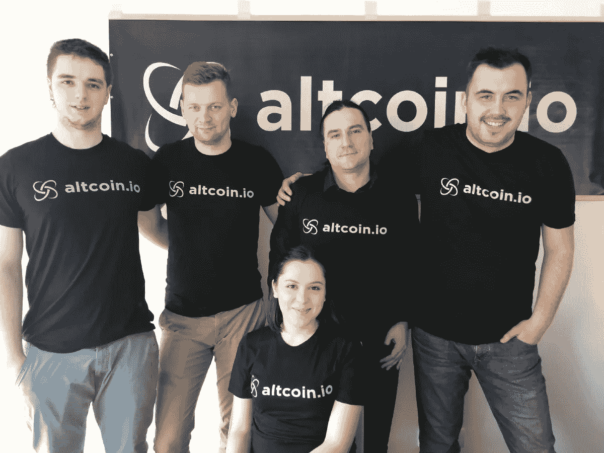
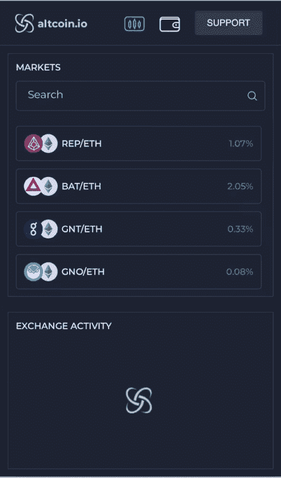
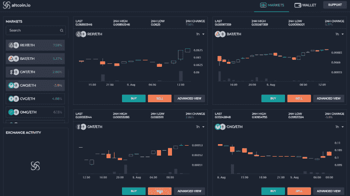

# Altcoin.io 访谈:一个由等离子体驱动的真正去中心化且安全的加密货币交易所

> 原文：<https://medium.com/coinmonks/altcoin-io-interview-a-truly-decentralized-secure-cryptocurrency-exchange-powered-by-plasma-699677f0e53?source=collection_archive---------6----------------------->

我正在寻求了解更多关于新的交易所和交易平台的信息。我决定多了解一下[*alt coin . io*](https://www.altcoin.io?kid=H02KJ)*。本次采访的答案由* ***安德鲁·加兹德基(Andrew Gazdecki)，Altcoin.io CEO*** *提供。*

The [Altcoin.io](https://www.altcoin.io?kid=H02KJ) Team

**你能简单描述一下什么是 Altcoin.io 吗？**

[Altcoin.io](https://www.altcoin.io?kid=H02KJ) 是一个点对点交易加密货币的平台，永远不会失去对代币的控制权。如果我们的服务出现故障或被黑客攻击，用户的令牌永远不会受到伤害。我们所做的只是把一个人和另一个人联系起来。我们从不承担持有用户令牌的保管风险，也无法控制它们。

**你是怎么想到创办 Altcoin.io 的？**

我在去年早些时候开始交易，被烧了几次，做了一些不好的交易，做了一些好的交易，但真的很喜欢这个社区的能量。我喜欢人们愿意分享和讨论想法的方式，以及 altcoin 技术出现的速度。我被迷住了。

但我很快发现了一个缺陷:我们信任的替代硬币的交换是集中的，这使得它们容易被盗。事实上，自 2011 年 6 月以来，已有约 40 家交易所遭到入侵，导致价值数十亿美元的硬币损失。

许多这样的交易所隐藏在阴影中，缺乏像客户服务这样的基本商业实践，除了帮助人们兑换替代硬币之外，几乎没有做什么。所以当事情出错时，你无能为力。

如果去中心化的数字货币是未来的趋势，那么我们为什么要把我们的替代硬币托付给中心化的交易所，而这些交易所是全世界黑客的明确目标？我们相信我们的资金存在于对数字窃贼来说简直是数字金矿的地方。

The [Altcoin.io](https://www.altcoin.io?kid=H02KJ) UI on Mobile

你能给我们介绍一下 Altcoin.io 团队吗？

我是 Andrew Gazdecki， [Altcoin.io 的首席执行官和创始人](https://www.altcoin.io?kid=H02KJ)我也是 Bizness Apps 的创始人，该公司在 Inc .杂志 2015 年 500 家发展最快的公司中排名第 91 位。我在圣地亚哥工作。

苏乐是我们的首席技术官和首席开发人员。他专门研究后端开发和区块链技术。每天，他领导着我们在波斯尼亚的工程团队 Djenad、Anto 和 Azra。

Fabian Vogelsteller 是 Altcoin.io 的技术顾问，他参与了许多开源项目，包括以太坊的 Mist 浏览器和以太坊钱包。他还提出了 ERC20 标准，开创了令牌交易的新时代，并为团队带来了丰富的技术专业知识和洞察力。

Fabian 加入了其他五名顾问，其中四名是活跃的加密货币交易商。这有助于支持我们的目标，即创建一个由交易者建立、为交易者服务的交易所。

**能否描述一下**[**altcoin . io**](https://www.altcoin.io?kid=H02KJ)**的愿景？**

我们的使命是将整个加密货币社区聚集在一起，创建一个透明、可信和诚实的市场。我们相信这将有助于将加密货币行业从目前的 2500-3000 亿美元的市值提升到数万亿美元的市值。

我们看看 CoinBase，这家交易所通过让购买比特币和其他一些数字资产(包括以太坊和莱特币)变得非常容易，在 2017 年创造了 10 亿美元的收入。CoinBase 为比特币所做的，我们也想为替代币所做。我们希望帮助人们安全、轻松地进行点对点交易，而无需将代币交给第三方。

The [Altcoin.io](https://www.altcoin.io?kid=H02KJ) UI

**[**alt coin . io**](https://www.altcoin.io?kid=H02KJ)**会给其用户带来什么价值？****

**此外，许多其他交易所缺乏在每一步都建立信任和理解的用户体验。对于更有经验的交易者来说，使用 Bittrex、Poloniex 或币安这样的交易所似乎相对容易，但对于那些刚刚进入市场的人来说，它们相当令人生畏。我们看到了引入交易所的巨大机会，首先，它是值得信赖的；第二，是安全的，永远不会保管你的代币；第三，提供轻松愉快的用户体验，支持团队随时为您提供帮助。**

**我们相信，我们不仅可以吸引经验丰富的交易者，还可以吸引刚刚进入市场、希望在比特币之外实现加密货币投资组合多元化的交易者。**

****它会以什么样的强度和特性带来这种价值？****

**在过去的几个月里，我们已经看到无数新的分散式交易所涌现出来，这是一件好事。最终，市场开始意识到集中交易的失败。**

**尽管他们的用户因被黑的资金损失了数十亿美元，但集中交易仍然主导着市场。要参与竞争并真正改善这个市场，dex 必须具备以下特征:**

**-即时无信任交易
-卓越的用户体验
-区块链互操作性
-流动性**

**我们最初追求原子互换和智能合约来解决无信任交易和区块链互操作性。虽然我们取得了一些成功，但原子交换无法提供良好的用户体验，原因有二:**

**-交易可能需要几分钟才能在区块链上确认。用户必须支付高额的区块链交易费。**

**这限制了交易量和流动性，并产生了令人沮丧的交易体验。社区需要安全性，但不能以牺牲交易速度为代价。因此，现在我们专注于使用类似血浆的侧链方法，建立一个即时和无信任的交易模型，提供惊人的用户体验。**

****alt coin . io 将如何区别于其他交易所？****

**是什么让 [Altcoin.io](https://www.altcoin.io?kid=H02KJ) 与其他去中心化交易所不同？可扩展性。目前，所有分散的交易所都存在不直观、缓慢、多步骤的用户体验，这导致用户采用率低和日交易量低。我们在 Altcoin.io 的目标是解决这些用户体验问题，并建立第一个可以真正与集中式交易所竞争的 DEX。在这里阅读更多。**

**你能告诉我们即将到来的重要发展吗？为什么它们很重要？**

**我们的第一个 mainnet 将于今年晚些时候推出。:)**

****

**The [Altcoin.io](https://www.altcoin.io?kid=H02KJ) Logo**

***感谢您的阅读。* [*在 Altcoin.io 免费注册*](https://www.altcoin.io?kid=H02KJ) *并为其 Mainnet 上线做好准备。如果你学习或喜欢这篇文章，请随意与他人分享。关注我的* [*推特*](https://twitter.com/Cryptonoobie) *和*[*YouTube*](http://youtube.com/catsir)*。***