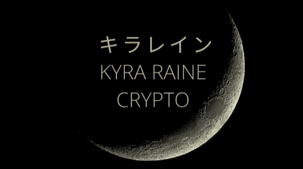

# Altcoin 赛季:错过了你的月球之旅？搭顺风车永远不会太晚

> 原文：<https://medium.com/coinmonks/altcoin-season-missed-your-trip-to-the-moon-its-never-too-late-to-hitch-a-ride-11a7d987b41?source=collection_archive---------6----------------------->

你有没有发现自己在幻想如果你在 2011 年投资了比特币会是什么样子？你的超级游艇上会有什么颜色的餐巾？你会开哪辆特斯拉去你的私人飞机？

你并不孤单。

Kyra Raine Cryrpto from [https://www.publish0x.com/psirenaraine](https://www.publish0x.com/psirenaraine)

数百万像你一样的梦想家被比特币的瘫痪所困扰。如果我告诉你有解药呢？你再也不用忍受怀疑的耻辱或 FOMO 变成无望的硬币。有一条更温和的疗愈之路可供所有寻求它的人使用。答案就在 altcoins 里面。

是的，在比特币基地等热门交易所，比特币“下面”的数百枚硬币都在等待星星排列。一旦一个积极的开发团队与有能力的投资者和忠诚的观众配对，altcoins 可以为每个参与者带来指数级的收益。

在前往月球的途中，你将有机会亲眼目睹加密货币对银河系的影响。像[外星世界](https://alienworlds.io/)这样的元诗句已经准备好向你展示一个基于智能契约的星际系统会是什么样子。

对于长期的密码爱好者来说，替代硬币似乎不是一个秘密策略。
我认为向 DeFi 的新老学生传播温和的提醒是很重要的。促进加密货币世界的安全旅行是去中心化金融系统成功和繁荣的必要条件。

因此，让我们在打包准备独立航行的时候分享我们的资源。

一路平安，
基拉·雷恩

【https://www.publish0x.com】最初发表于**。**

> *加入 Coinmonks [电报频道](https://t.me/coincodecap)和 [Youtube 频道](https://www.youtube.com/c/coinmonks/videos)了解加密交易和投资*

# *另外，阅读*

*   *[币安期货交易](https://coincodecap.com/binance-futures-trading)|[3 comas vs Mudrex vs eToro](https://coincodecap.com/mudrex-3commas-etoro)*
*   *[如何购买 Monero](https://coincodecap.com/buy-monero) | [IDEX 评论](https://coincodecap.com/idex-review) | [BitKan 交易机器人](https://coincodecap.com/bitkan-trading-bot)*
*   *[CoinDCX 评论](/coinmonks/coindcx-review-8444db3621a2) | [加密保证金交易交易所](https://coincodecap.com/crypto-margin-trading-exchanges)*
*   *[红狗赌场评论](https://coincodecap.com/red-dog-casino-review) | [Swyftx 评论](https://coincodecap.com/swyftx-review) | [CoinGate 评论](https://coincodecap.com/coingate-review)*
*   *[Bookmap 评论](https://coincodecap.com/bookmap-review-2021-best-trading-software) | [美国 5 大最佳加密交易所](https://coincodecap.com/crypto-exchange-usa)*