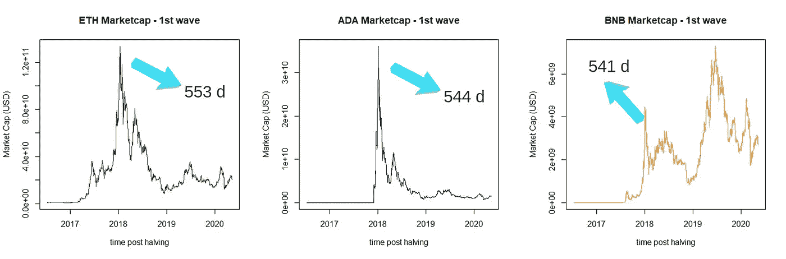
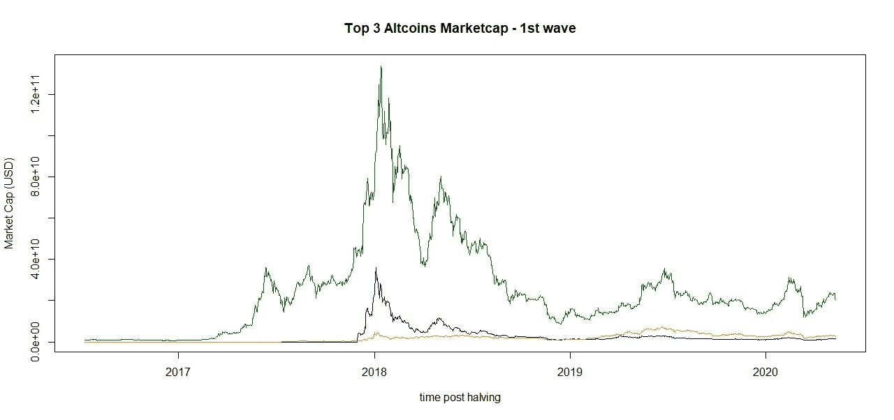
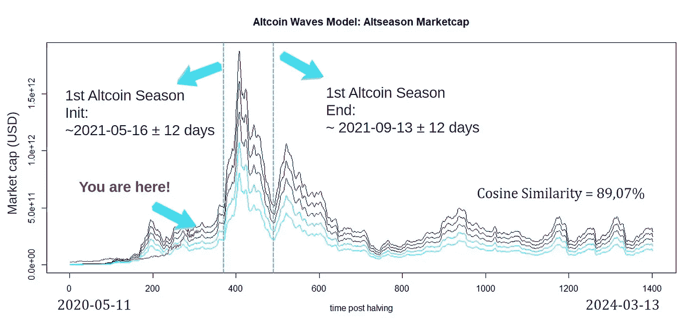
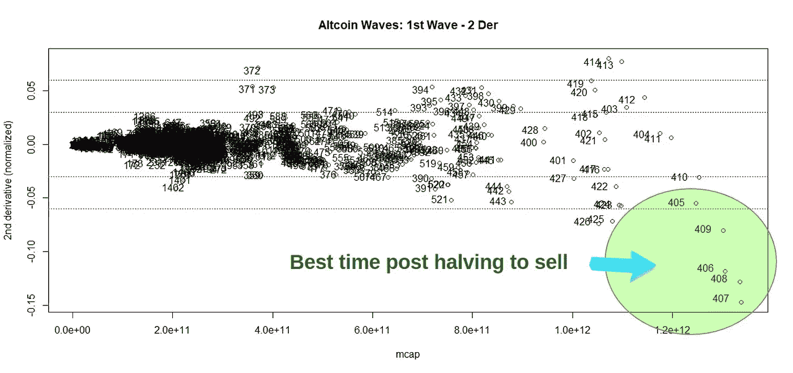

# altcoin Waves:altcoin 季节建模的线性组合

> 原文：<https://medium.com/coinmonks/altcoin-waves-a-linear-combination-for-altcoin-season-modeling-7c0b13bcabed?source=collection_archive---------1----------------------->

## **简介**

替代硬币季节是加密货币市场的一个不同周期，通常用于为专业交易者带来难以置信的收入。通常情况下，市场运动遵循从[比特币](https://blog.coincodecap.com/a-candid-explanation-of-bitcoin)季节到 Altcoin 季节[1]。

然而，初学者很难获得识别何时买卖代用币所需的复杂知识。

在这种情况下，基于线性组合开发了一个模型，使用三种最重要的替代硬币的市值和 R 统计平台的后续数据处理来预测替代硬币季节(2020-2023)。

## **Altcoin 波形数据处理**

另类硬币是非常年轻的硬币，“altcoins”。只有一波另类硬币，我对此不感兴趣。在某个时候，我想过放弃，但我的妻子告诉我永远不要放弃，说实话，这个模型甚至比*比特币波*【2】更不确定。打得好！让我们开始吧。

仅使用了一波(2016 年> 2020 年)的前 3 名替代硬币市值(以太坊- ETH、卡尔达诺-阿达和币安硬币- BNB)，如图 1 所示。

Figure 1\. Top 3 altcoins market cap — 1st altcoin wave.

数据价格摘自 Coinmetrics [3]，2016 年至 2021 年。仅考虑第一波，最大替代比特币市场上限日发生在比特币减半后 12 天(2016 年 7 月 9 日)，95%的信心水平。第二波 alt coin(2020–2021)用于测试模型。
使用 R 软件[4]和信号处理(signal) [5]、动态时间弯曲(dtw) [6]和潜在语义分析(lsa) [7]软件包进行数据导入、预处理和多变量程序。所有的数据处理都是使用 R 统计计算基金会的免费软件进行的。用 R！

## **Altcoin 波浪模型**

*Altcoin Waves* 模型提供了一个研究 altcoins 市场这种重要话题的机会，因为很多人买了 altcoins 然后坐等月亮，但实际上市场是波浪式发生的。基于*比特币波*假设，即通过将未来波近似为先前波的线性组合来预测下一波是可能的，建立了*替代比特币波*模型。
利用比特币第一波(2010 > 2012)通过*比特币波动*模型预测比特币第二波(2012 > 2016)，余弦相似度为 83.98%。通过这种方式，第一波 altcoin 浪潮由前 3 名 alt coin 市值的浪潮组合而成(图 2)。

Figure 2\. The 1st altcoin wave: ETH (green), ADA (blue), and BNB (orange)

图 3 显示了在当前场景(2021 年)中处理和预测的 *Altcoin Waves* 模型。模型因为抽样(就一个样本，原谅我这个，Berzelius)，没有提供其可靠性和有效性的证据，余弦相似度 89.07%。这是一个假说(*比特币波*)的假说(*比特币波*)。

Figure 3\. *Altcoin Waves* model (blue) and real data (red) projected in 2021.

最后，前一篇文章[8]中介绍的导数测试被用来寻找卖出的时间，如图 4 所示。

Figure 4\. All altcoins market cap vs 2nd derivative scaled (autoscaling).

来自图 4 的第一个重要信息是，在卖出的最佳时机，二阶导数是非常负的。换句话说，根据模型，预测在 2020 年 5 月减半后出售替代币的最佳时间将是 2021 年 6 月 8 日至 2021 年 7 月 7 日之间的某一天(可能的利润:在+450%至+1400%之间)，但这取决于*比特币波动*模型与比特币最高价格的日期相匹配。再一次，CZ 会说，这不是财务建议，这是一个简单的模型，也是检验这个假设的一个机会。

## **结论**

这里报告的脆弱模型根据以太坊、卡尔达诺和币安的比特币数据，提供了第三和第四个比特币减半的替代比特币季节的说明。通过学习这个主题，初学者和专业人士可以对 altcoins 市场有一个大致的了解。

如果您喜欢这些内容，请考虑以下建议:

BTC:BC 1 qljlmuwq 9 gyvn 7 uhvwwypsj 4x 8 hcetuzhw 9 quh 0

BNB:bnb 159am 7 huy 53mg 7 sygnklrtxkahkdk 2 qxzmnk 0 GW

BUSD:bnb 159am 7 huy 53mg 7 sygnklrtxkahkdk 2 qxzmnk 0 GW

## **致谢**

作者感谢、Hal Finney、Nick Szabo、赵昌鹏、Sabrina Moraes、Fernando Ulrich、André Fauth、Criptomaníacos 和 Vela Trader。

## **参考文献**

1. [Altcoin 季节——探索 Alt 季节和加密市场周期(ivanontech.com)](https://academy.ivanontech.com/blog/altcoin-season-exploring-alt-seasons-and-crypto-market-cycles)

2.[比特币浪潮:价格建模的线性组合| Edgar mora es | coin monks | 2021 年 3 月| Medium](/coinmonks/bitcoin-waves-a-linear-combination-for-price-modeling-2b89f72e552d)

3. [https://coinmetrics.io](https://coinmetrics.io)

4.[https://www.R-project.org/](https://www.R-project.org/)

5.[http://127 . 0 . 0 . 1:26406/library/signal/html/signal . package . html](http://127.0.0.1:26406/library/signal/html/signal.package.html)

6.[https://doi.org/10.1016/j.artmed.2008.11.007](https://doi.org/10.1016/j.artmed.2008.11.007)

7.[https://cran.r-project.org/web/packages/lsa/index.html](https://cran.r-project.org/web/packages/lsa/index.html)

8.[比特币阵容:价格支持模型的线性转换| Edgar mora es | coin monks | 2021 年 3 月| Medium](/coinmonks/bitcoin-lineup-a-linear-transformation-for-price-support-modeling-e513715b8288)

> 加入 Coinmonks [电报集团](https://t.me/joinchat/EPmjKpNYwRMsBI4p)，了解加密交易和投资

## 另外，阅读

*   [什么是融资融券交易](https://blog.coincodecap.com/margin-trading)
*   最好的[密码交易机器人](/coinmonks/crypto-trading-bot-c2ffce8acb2a) | [网格交易](https://blog.coincodecap.com/grid-trading)
*   [3 商业评论](/coinmonks/3commas-review-an-excellent-crypto-trading-bot-2020-1313a58bec92) | [Pionex 评论](/coinmonks/pionex-review-exchange-with-crypto-trading-bot-1e459d0191ea) | [Coinrule 评论](/coinmonks/coinrule-review-2021-a-beginner-friendly-crypto-trading-bot-daf0504848ba)
*   [AAX 交易所评论](/coinmonks/aax-exchange-review-2021-67c5ea09330c) | [德里比特评论](/coinmonks/deribit-review-options-fees-apis-and-testnet-2ca16c4bbdb2) | [FTX 交易所评论](/coinmonks/ftx-crypto-exchange-review-53664ac1198f)
*   [n ave 零点回顾](/coinmonks/ngrave-zero-review-c465cf8307fc) | [Phemex 回顾](/coinmonks/phemex-review-4cfba0b49e28) | [PrimeXBT 回顾](/coinmonks/primexbt-review-88e0815be858)
*   [Bybit Exchange 审查](/coinmonks/bybit-exchange-review-dbd570019b71) | [Bityard 审查](/coinmonks/bityard-review-7d104239be35) | [CoinSpot 审查](https://blog.coincodecap.com/coinspot-review)
*   [3 commas vs crypto hopper](/coinmonks/3commas-vs-pionex-vs-cryptohopper-best-crypto-bot-6a98d2baa203)|[赚取加密利息](/coinmonks/earn-crypto-interest-b10b810fdda3)
*   最好的比特币[硬件钱包](/coinmonks/the-best-cryptocurrency-hardware-wallets-of-2020-e28b1c124069?source=friends_link&sk=324dd9ff8556ab578d71e7ad7658ad7c) | [BitBox02 回顾](/coinmonks/bitbox02-review-your-swiss-bitcoin-hardware-wallet-c36c88fff29)
*   [莱杰 vs n rave](/coinmonks/ledger-vs-ngrave-zero-7e40f0c1d694)|[莱杰 nano s vs x](/coinmonks/ledger-nano-s-vs-x-battery-hardware-price-storage-59a6663fe3b0)
*   [加密复制交易平台](/coinmonks/top-10-crypto-copy-trading-platforms-for-beginners-d0c37c7d698c)
*   [CoinLoan 审查](/coinmonks/coinloan-review-18128b9badc4) | [YouHodler 审查](/coinmonks/youhodler-4-easy-ways-to-make-money-98969b9689f2) | [BlockFi 审查](/coinmonks/blockfi-review-53096053c097)
*   最好的[加密税务软件](/coinmonks/best-crypto-tax-tool-for-my-money-72d4b430816b) | [CoinTracking 评论](/coinmonks/cointracking-review-a-reliable-cryptocurrency-tax-software-5114e3eb5737)
*   最佳[加密借贷平台](/coinmonks/top-5-crypto-lending-platforms-in-2020-that-you-need-to-know-a1b675cec3fa) | [杠杆代币](/coinmonks/leveraged-token-3f5257808b22)
*   [block fi vs Celsius](/coinmonks/blockfi-vs-celsius-vs-hodlnaut-8a1cc8c26630)|[Hodlnaut Review](/coinmonks/hodlnaut-review-best-way-to-hodl-is-to-earn-interest-on-your-bitcoin-6658a8c19edf)
*   [Bitsgap 审查](/coinmonks/bitsgap-review-a-crypto-trading-bot-that-makes-easy-money-a5d88a336df2) | [Quadency 审查](/coinmonks/quadency-review-a-crypto-trading-automation-platform-3068eaa374e1) | [Bitbns 审查](/coinmonks/bitbns-review-38256a07e161)
*   [埃利帕尔泰坦评论](/coinmonks/ellipal-titan-review-85e9071dd029) | [赛克斯斯通评论](/coinmonks/secux-stone-hardware-wallet-review-15-discount-coupon-2020-7577032faa6e)
*   [本地比特币审核](/coinmonks/localbitcoins-review-6cc001c6ed56) | [加密货币储蓄账户](https://blog.coincodecap.com/cryptocurrency-savings-accounts)
*   最佳[区块链分析](https://bitquery.io/blog/best-blockchain-analysis-tools-and-software)工具| [赚比特币](/coinmonks/earn-bitcoin-6e8bd3c592d9)
*   [加密套利](/coinmonks/crypto-arbitrage-guide-how-to-make-money-as-a-beginner-62bfe5c868f6)指南| [如何做空比特币](/coinmonks/how-to-short-bitcoin-568a2d0b4ae5)
*   最佳[加密制图工具](/coinmonks/what-are-the-best-charting-platforms-for-cryptocurrency-trading-85aade584d80) | [最佳加密交易所](/coinmonks/crypto-exchange-dd2f9d6f3769)
*   [如何在印度购买比特币？](/coinmonks/buy-bitcoin-in-india-feb50ddfef94) | [WazirX 审查](/coinmonks/wazirx-review-5c811b074f5b)
*   [印度比特币交易所](/coinmonks/bitcoin-exchange-in-india-7f1fe79715c9) | [比特币储蓄账户](/coinmonks/bitcoin-savings-account-e65b13f92451)
*   [CoinDCX 评论](/coinmonks/coindcx-review-8444db3621a2) | [加密保证金交易交易所](https://blog.coincodecap.com/crypto-margin-trading-exchanges)

> [直接在您的收件箱中获得最佳软件交易](/coinmonks/newsletters/coinmonks)

