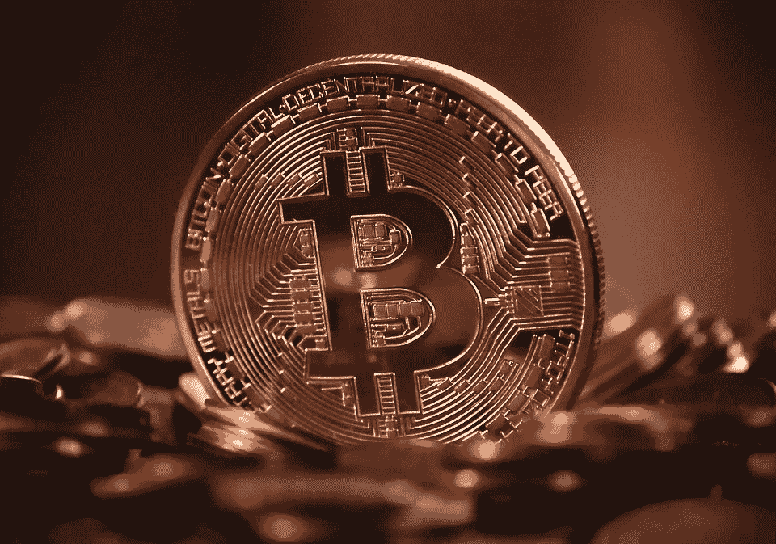

# 另类投资 101

> 原文：<https://medium.com/coinmonks/alternative-investing-101-df3e9ff3b61?source=collection_archive---------2----------------------->

## 另类投资是分散投资组合的好方法，通常回报率更高，与传统股票市场几乎没有关联

免责声明:这不是财务建议。我不是财务顾问，只是一个务实的人，写一个现实的世界。

CREDIT: Pixabay/geralt

对普通投资者来说，股票、债券和现金是最广为人知的资产类别。股票往往有点波动，正如我们在过去几年中看到的那样，可以根据一条推文上涨或下跌。债券通常是一种更安全的资产类别，但回报往往低得多，并根据联邦利率波动。现金就是现金，赚取很少甚至没有利息。今年现金很重要，但最终不是增加净资产的长期策略。想了解更多关于投资股票的信息，尤其是在疫情期间，可以看看我写的一篇[的文章](/illumination/what-a-global-pandemic-has-taught-me-about-investing-c65a0f66589d?sk=1008299bd64b82d0abec1011c37372b7)。

输入替代投资。另类投资是任何资产类别，不包括我上面列出的三种。另类投资(alts，forward)包括房地产、加密货币、P2P 贷款、公司债务和股权、葡萄酒、艺术品等等。低价竞标的好处是，它们很少与股市以及世界上正在发生的更大事件相关联。他们往往表现良好；通常在 9-20%之间，有几种选择。权衡之下，相当数量的另类投资只对合格投资者开放，低价竞标通常具有较高的相关风险。不过我认为，在过去几年里，低价竞标的风险水平已经显著降低，所有投资者都可以获得更多的低价竞标。

另类投资是分散投资组合的好方法。我 35 岁左右，我将投资组合的 20%用于另类投资。另外 70%投资于股票，10%投资于债券。我将另类投资集中在房地产、加密货币和公司债券(票据)上。我的目标是 9-13%的回报率，我一直看到这些回报，即使是在这个疫情。下面，我将提供更多关于我的一些顶级另类投资和投资平台的细节。

下文概述的替代投资包括公司债务、商业房地产、加密货币、葡萄酒和 P2P 贷款。并非所有的替代都是平等的，我将在您阅读各部分时强调利弊。

## 公司债务

公司债务，也称为债务融资，是指公司通过向投资者出售资产并在一段时间内带利息偿还来筹集资金。我最喜欢的一种公司债务叫做应付票据。票据最简单的定义是承诺向投资者支付利息。利息通常以每日、每月或每季度分期偿还，并立即或在指定的一段时间后开始。在商定的未来日期，本金也将返还。

CREDIT: Pexels/Andrea Piacquadio

[**Cadence**](https://withcadence.io/) 是我极力推荐的投资应付票据的平台。Cadence 只有几年历史，但他们有着令人印象深刻的记录。****记录包括 10%的 APR 和在撰写本文时只有 1.3%的违约率。就我个人而言，我今年的回报率是 11%,我的八张债券中没有一张违约。他们都按时足额还款了。Cadence 允许合格投资者众筹公司债务。被称为发起者的融资公司涵盖了从力量运动到移动设备、加密货币和软件应用的各个领域。发起人通常向多个地区的中小型企业发放贷款。Cadence 提供的利率比一般银行更有吸引力，在某些情况下，银行甚至可能不会向加密等行业提供贷款。票据本身是短期的，这是最大的卖点之一。在我看来，持续时间越短，风险越小。对于技术爱好者来说，Cadence 还利用区块链技术来存储交易数据。*关于我对加密货币的附加想法，查看一下我写的一篇* [*近期文章*](/coinmonks/why-you-should-care-about-bitcoin-84e630c2c494?sk=0004cc652a6fa53076374fef1dab2faf) *。我通常投资一至三个月的票据，年利率在 10%至 14%之间。为了确保足够的多样化，我实际上投资于每一个符合标准的笔记。每张钞票的最低投资额是 500 美元。Cadence 还利用了一个被称为荷兰式拍卖的简洁流程，该流程允许投资者设定 reach 票据的 APR。此外，投资认证流程非常简单，他们通过简单的自我验证流程来执行。最后，Cadence 不向投资者收取任何费用，这是一个巨大的卖点。费用只向发起者收取。*****

**我想简单解释一下为什么我更喜欢贷款给一家公司而不是一个人，你将在下一节读到更多。答案很简单；风险更小。如果你贷款给一个人，而这个人失业了，他们可以立即决定停止还款，而且也没什么办法。然而，公司通常有更多的现金可用，受到多个机构的监管，并且他们会有保险和保护，以防他们或他们的客户损失金钱。下面关于 P2P 贷款的部分记录了我的具体经历以及我为什么避开这个行业。**

## **点对点贷款**

**点对点(p2p)借贷类似于应付票据。不同的是，有了 p2p 借贷，一个人借给另一个人。接受钱的人需要定期向贷款人支付利息。通常情况下，定期付款每月进行一次。通常申请 p2p 贷款的人信用评分较低，可能与银行关系不佳，甚至有违约历史。他们那时甚至可能没有工作。由于风险更高，时间跨度更长，点对点贷款通常利率更高。利率从 10%到 35%不等，期限从三年到五年不等。向投资者呈现高回报潜力；然而，我的结果却大不相同。我的 p2p 借贷经历发生在过去的三年里，与业内最大的玩家之一 Lending Club 合作。**

****

**CREDIT: Pixabay/Tumisu**

**[**Lending Club**](http://www.lendingclub.com) 采用我上面描述的模式。他们还根据风险对贷款进行评级，所以理论上你可以更保守，或者更激进。不幸的是，我发现 Lending Club 的风险评估并不十分准确，此外还有其筛选流程，这在该公司今年的挣扎中发挥了很大作用。我采用了 Lending Club 认可的方法，投资了 100 种不同风险水平的贷款，但我也更保守一些。我很快了解到，寻求 p2p 贷款的人往往不可信。在我开始的 100 笔不同的贷款中，有三笔在头两个月内违约。在所有贷款完成日期结束时，有 11 个违约了，占我全部投资组合的 11%。此外，大多数违约贷款风险更高，利率也更高。这意味着我的平均回报率受到了更大的伤害。三年后，按照推荐的方法，我的回报率只有区区 5.5%。我没有打算为了这么低的回报率而将我的钱持有三年。像 Lending Club 这样的公司面临的部分挑战是，它的筛选过程过于自动化，让太多不合格的人进来。此外，如果一个人决定停止支付贷款，即使在第一次付款后，也不会发生任何事情。Lending Club 将尝试接触个人，但我几乎从未见过这种做法。典型的情况是，这只会对他们的信用评分产生负面影响。不幸的是，作为一名投资者，这对我没有任何帮助。快进到 2020 年，Lending Club 决定停止所有 p2p 贷款，转而专注于其银行业务。我的理解是他们有一系列的问题。人们停止还贷，投资者感到沮丧，并停止使用该平台。Lending Club 会进一步提高利率，这又会让潜在的贷款人更加不愿意贷款，这样的循环会持续足够长的时间，直到这项业务不再有意义。截至今年年底，Lending Club 将停止 p2p 借贷。这提醒我们，并不是所有的另类投资都能获得承诺的回报，也不是所有的另类投资都适合所有类型的人。对我来说，借钱给别人风险太大了。然而，也有一些其他的平台可用，如 Peerform，Upstart，Prosper，Funding Circle 和 payroll。**

## **房地产众筹**

**在我看来，房地产是最稳定、最有价值的另类投资。也是传统资产之外最广为人知的投资。房地产造就了许多百万富翁。房地产很少与股票市场相关，但正如我们在过去二十年中所看到的，即使是房地产市场也可能崩溃，损失大量价值。房地产投资有多种形式。可以是买，可以是改造，可以是卖。也可以是买和租。*请继续关注未来的一篇文章，这篇文章将讲述我在租赁房产方面的具体房地产投资经历。*也可以通过不同的投资工具和基金被动完成。但是，我最喜欢的房地产投资方式是通过被动房地产众筹。**

****

**CREDIT: Pixabay/nattanan23**

**[**Fundrise**](https://fundrise.com/) 是我最喜欢的横跨商业和住宅物业的被动房地产投资选项。对于投资者来说，Fundrise 使这一过程变得毫不费力，与自己主动拥有和管理相比，这是一个更方便的选择。Fundrise 允许投资者买入持有全美房地产的三只基金中的一只。他们使用众筹模式，所以你和其他几个投资者一起购买基金，你实际上并不拥有任何财产，这很好，责任更少。这三种不同的基金是通过债务、股权或两者的混合来融资的。股票有望获得更高的长期回报，而债券将有更稳定的收入流。Fundrise 收取 1%的管理费，也可以通过推荐去掉。现有基金的最大特点是它们持有大量房产。我投资了成长型(股票)基金，目前我拥有 129 处房产。大多数房产是公寓，但也有一些是商业建筑。Fundrise 允许你设置汽车投资，该平台还集成了 Mint 和个人资本，用于投资组合跟踪。Fundrise 的回报率高于平均水平，与股市的相关性很小，甚至没有。在过去的一年里，我的投资组合上涨了 8%,其中包括许多疫情带来的早期住房挑战。**从长期来看，我希望看到 12-14%的年回报率。**回报以升值和分红的形式，每季度支付一次。Fundrise 还提供税务表格，这很方便，但并不总是 alts 的标准。Fundrise 也为合格投资者提供了一个选项，允许个人选择自己的财产，但这一选项风险较高，他们报告的平均回报并不比他们提供的传统基金好多少。如果你是一个合格的投资者，我鼓励你看看 [CrowdStreet](https://www.crowdstreet.com/) ，它号称有更高的回报，也有可靠的记录。我个人建议每个投资者在他们的投资组合中持有一些房地产。这是历史上表现最好的资产类别之一，也是分散投资组合的绝佳方式。**

## **加密货币**

**加密货币是我最喜欢的替代资产。他们也是最危险的，这是有充分理由的。它们非常不稳定，容易被操纵和投机。然而，潜在的区块链技术有如此大的前景，我相信只有少数加密货币会在未来占据主导地位。正如我在之前的一篇文章中所写的，比特币是密码之王，也是市场其余部分的领头羊。**比特币目前的交易金额超过 2.2 万美元，仅今年就上涨了 200%。**买卖密码仍然是一个具有挑战性的过程，不是一般投资者能够理解的，尤其是当大多数平台不接受菲亚特(美元)时。比特币基地是少数几个已经想出如何将密码带给大众的平台之一。**

****

**CREDIT: Pixabay/MichaelWuensch**

**[**比特币基地**](http://www.coinbase.com) 被誉为密码领域的顶级平台。它提供最大货币的购买、出售和提取，并且允许用美元进行购买。他们也使这个过程变得非常容易，特别是对普通投资者来说。比特币基地收取的费用并不便宜，而且众所周知，他们经常停电，但这些挑战都被易用性所掩盖。比特币基地也提供交易报告，但不提供税单。自 2017 年初以来，我一直在投资 crypto，并不断买入更多股票，这已证明非常有利可图。我预计 crypto 将会有一个光明的未来，并且在未来几年将会继续购买更多。加密领域的监管仍然是一个空白，但是在我写这篇文章的时候，有很多工作正在进行。我希望看到比特币基地提高交易限额，提供税务文件，解决频繁的断电问题。总的来说，它仍然是购买 crypto 的最佳平台，如果你正在考虑这样做，我鼓励你在尝试任何其他平台之前先看看比特币基地。**

## **葡萄酒**

**葡萄酒是一种非常有趣的另类投资，我承认我对它了解不多，但在过去几年里，它已经成为一种新兴投资。葡萄酒与股市的相关性很小，在过去 15 年里，葡萄酒的表现要好得多，回报率为 14%。葡萄酒在一年中的任何时候都会被消费，在疫情或经济萧条时期，消费量会上升得更多。谈到投资葡萄酒，归根结底是随着时间的推移而升值。少数几个专门投资葡萄酒的平台之一叫做 Vinovest。**

****

**CREDIT: Pixabay/Vinotecarium**

**[**Vinovest**](https://www.vinovest.co/) 由一位名叫安东尼·张(Anthony Zhang)的企业家创立，他有着令人印象深刻的背景。*下面是一篇* [*伟大的阅读*](https://labusinessjournal.com/news/2020/dec/21/young-entrepreneur-anthony-zhang-not-slowed/) *关于安东尼和他的成功。* Vinovest 是一个允许投资者购买瓶装葡萄酒的平台。葡萄酒本身是通过精心策划的投资组合挑选的，这些投资组合由风险水平决定，保守、适度和激进。葡萄酒更好，更优雅，由品酒师大师挑选。挑选的葡萄酒类型是随着时间的推移会升值的。要真正从鉴赏中获益，大多数葡萄酒需要 10-30 年才能实现全部价值。Vinovest 的确有很多葡萄酒在短短几年内价值翻倍的成功故事。Vinovest 的最低投资额确实更高，为 1000 美元，但他们也允许自动投资。费用也很高，从 2.5%到 2.85%不等。Vinovest 最大的特点是，当你投资一种特定的葡萄酒或基金时，你实际上就拥有了这种葡萄酒。这意味着，如果你愿意，你可以把酒送给你喝。它确实是一种流动资产。这也意味着一旦葡萄酒升值到一定程度，就更难卖出去了。Vinovest 估计一笔交易需要 4 到 6 周才能完成。像艺术品一样，葡萄酒是一种相对较新的另类资产，有着良好的记录，是分散投资组合的绝佳方式。**

## **结论**

**显然，另类投资在每个投资者的投资组合中都有一席之地。这并不是要从股票和债券中拿走任何信贷，但正如我们在过去几十年中所学到的那样，分散投资非常重要。投资者有如此多的分散投资的机会，而且越来越多的机会可供普通投资者利用，只需很少的管理费用。另类投资，就像所有投资一样，应该以一定的风险和怀疑态度来管理，我总是说，永远不要投入超过你愿意损失的钱。这句话适用于任何资产。所有的另类投资都应该单独评估，并进行充分的研究。当我第一次调查 Cadence 和 Vinovest 时，我与两位首席执行官进行了交谈，以了解更多关于市场、他们的愿景和平台路线图的信息。做好你的尽职调查，挑选一些明智的投资，你会对你投资组合的结果感到惊喜。**

***疑问？评论？反馈？在****【trythepracticalworld@gmail.com】****联系我或者在* [*脸书*](https://www.facebook.com/thepracticalworld)*[*LinkedIn*](https://www.linkedin.com/company/the-practical-world)*[*Twitter*](https://twitter.com/WorldPractical)*和 insta gram(@ thepractical world)*****

> *****现实世界*****

## ****另外，阅读****

*   ****最好的[密码交易机器人](/coinmonks/crypto-trading-bot-c2ffce8acb2a)****
*   ****[3 商业评论](/coinmonks/3commas-review-an-excellent-crypto-trading-bot-2020-1313a58bec92)****
*   ****[Pionex 审查](/coinmonks/pionex-review-exchange-with-crypto-trading-bot-1e459d0191ea)****
*   ****[AAX 交易所评论](/coinmonks/aax-exchange-review-2021-67c5ea09330c) |推荐代码、交易费用、利弊****
*   ****[Deribit 审查](/coinmonks/deribit-review-options-fees-apis-and-testnet-2ca16c4bbdb2) |选项、费用、API 和 Testnet****
*   ****[FTX 密码交易所评论](/coinmonks/ftx-crypto-exchange-review-53664ac1198f)****
*   ****[n 零审核](/coinmonks/ngrave-zero-review-c465cf8307fc)****
*   ****[Bybit 交换评论](/coinmonks/bybit-exchange-review-dbd570019b71)****
*   ****[3Commas vs Cryptohopper](/coinmonks/cryptohopper-vs-3commas-vs-shrimpy-a2c16095b8fe)****
*   ****最好的比特币[硬件钱包](/coinmonks/the-best-cryptocurrency-hardware-wallets-of-2020-e28b1c124069?source=friends_link&sk=324dd9ff8556ab578d71e7ad7658ad7c)****
*   ****[密码本交易平台](/coinmonks/top-10-crypto-copy-trading-platforms-for-beginners-d0c37c7d698c)****
*   ****最佳 [monero 钱包](https://blog.coincodecap.com/best-monero-wallets)****
*   ****[莱杰纳米 s vs x](https://blog.coincodecap.com/ledger-nano-s-vs-x)****
*   ****[bits gap vs 3 commas vs quad ency](https://blog.coincodecap.com/bitsgap-3commas-quadency)****
*   ****最好的[加密税务软件](/coinmonks/best-crypto-tax-tool-for-my-money-72d4b430816b)****
*   ****[最佳加密交易平台](/coinmonks/the-best-crypto-trading-platforms-in-2020-the-definitive-guide-updated-c72f8b874555)****
*   ****最佳[加密贷款平台](/coinmonks/top-5-crypto-lending-platforms-in-2020-that-you-need-to-know-a1b675cec3fa)****
*   ****[莱杰纳米 S vs 特雷佐 1 vs 特雷佐 T vs 莱杰纳米 X](https://blog.coincodecap.com/ledger-nano-s-vs-trezor-one-ledger-nano-x-trezor-t)****
*   ****[block fi vs Celsius](/coinmonks/blockfi-vs-celsius-vs-hodlnaut-8a1cc8c26630)vs Hodlnaut****
*   ****Bitsgap 评论——一个轻松赚钱的加密交易机器人****
*   ****为专业人士设计的加密交易机器人****
*   ****[PrimeXBT 审查](/coinmonks/primexbt-review-88e0815be858) |杠杆交易、费用和交易****
*   ****[其他准备审核](https://blog.coincodecap.com/altrady-reivew)****
*   ****[埃利帕尔泰坦评论](/coinmonks/ellipal-titan-review-85e9071dd029)****
*   ****[赛克斯·斯通评论](https://blog.coincodecap.com/secux-stone-hardware-wallet-review)****
*   ****[BlockFi 评论](/coinmonks/blockfi-review-53096053c097) |赚取高达 8.6%的加密利息****
*   ****[Coinrule 评论](https://blog.coincodecap.com/coinrule-review-a-perfect-trading-bot)****
*   ****[最佳区块链分析工具](https://bitquery.io/blog/best-blockchain-analysis-tools-and-software)****
*   ****[加密套利](/coinmonks/crypto-arbitrage-guide-how-to-make-money-as-a-beginner-62bfe5c868f6)指南:新手如何赚钱****
*   ****最佳[加密制图工具](/coinmonks/what-are-the-best-charting-platforms-for-cryptocurrency-trading-85aade584d80)****
*   ****了解比特币的[最佳书籍有哪些？](/coinmonks/what-are-the-best-books-to-learn-bitcoin-409aeb9aff4b)****

> ****[直接在您的收件箱中获得最佳软件交易](/coinmonks/newsletters/coinmonks)****

********