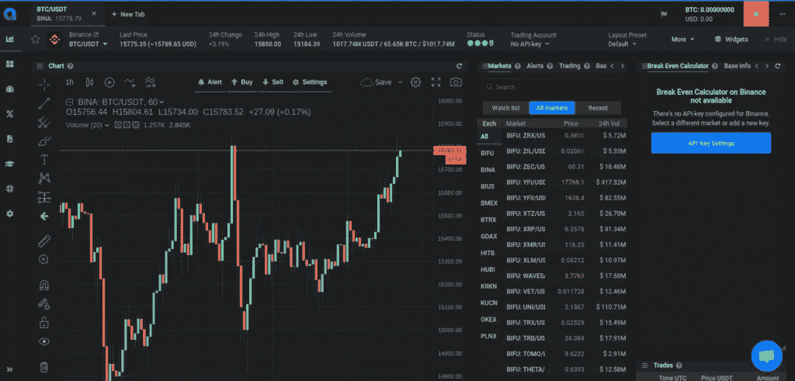

# altrady review——Coinigy 的强大替代品

> 原文：<https://medium.com/coinmonks/altrady-review-a-powerful-alternative-to-coinigy-coincodecap-8885d293e7a5?source=collection_archive---------2----------------------->

在这篇文章中，我们将回顾一下 [Altrady](https://blog.coincodecap.com/go/altrady) ，这是一家位于荷兰的软件公司，为专业的密码交易员提供交易终端。

其旗舰产品是 [Altrady](https://blog.coincodecap.com/go/altrady) 加密货币交易平台，这是一个基于订阅的软件，用户可以在[的多个加密交易所使用单一屏幕](https://blog.coincodecap.com/multi-exchange-crypto-trading-platforms-features)进行交易和管理资产。

我们试图通过获得其 pro 计划来使用该产品，以查看交易者的反馈是否真实——即 [Altrady](https://blog.coincodecap.com/go/altrady) 为其用户简化了加密货币交易。以下是我们发现的一些情况:

> *试用*[**Altrady**](https://app.altrady.com/?a=COINMONKS)*并使用优惠券代码* **COINMONKS** 获得 40%的折扣(年度计划)和 10%的折扣(月度计划)

## 易用性:看看 Altrady 的用户友好的交易界面

[Altrady](https://blog.coincodecap.com/go/altrady) 的交易界面简单易用。

我们向 Altrady 的首席设计师 Roman Ivanov 询问了他们的设计过程。他说，

> “你知道，我们只是遵循这样的设计原则:保持简单。自从 Benoist 和我开始构建密码库扫描器和 Altrady 以来，我们所希望的就是让交易者的交易变得简单易行。我们已经知道加密交易有多可怕。我们能够为这个行业做出的最起码的贡献是，通过引入简单易用的工具，让更多人享受到加密货币交易的好处，就像你在 Altrady 平台上可以找到的那些工具一样。”
> 
> *罗曼·伊万诺夫，Altrady 的首席设计师*

Roman 的说法似乎很有道理，因为在成功注册了 [Altrady](https://blog.coincodecap.com/go/altrady) 软件后，我们立即被带到了一个很酷的交易页面，该页面具有可定制的布局，具有以下功能:

## 多重外汇交易

有了 [Altrady 的多交易所交易终端](https://blog.coincodecap.com/go/altrady)的帮助，在不同交易所进行交易可以变得超级简单。您必须将您的 exchange 帐户整合到 Altrady，以便仅使用您的 Altrady 应用程序从不同的交易所进行交易。受支持的交易所包括币安、币安美国、币安期货、Bittrex、BitMEX、比特币基地 Pro、KuCoin、北海巨妖、OKEx、Poloniex、Huobi 和 HitBTC。

Altrady review: Trading terminal

## 深色或浅色主题

Altrady 的设计师似乎知道交易者有不同的个性——有些人喜欢黑暗的主题，而有些人喜欢保持光明。 [Altrady](https://blog.coincodecap.com/go/altrady) 允许你通过简单地调整布局设置来处理两种不同的主题——深色或浅色。此功能允许您根据当天的心情选择自己喜欢的设计。

## 个性化布局和可移动部件

交易页面的另一个令人喜欢的地方是它的可定制特性。您可以创建不同的布局并相应地保存它们。如果你用不同的策略交易，你也许可以为每种策略准备不同的布局。

## 轻松导航

Altrady 的交易页面非常容易浏览。相关信息被分组，供交易员检查他们监控市场、进行交易和跟踪加密货币所需的详细信息。

> *试用* [**Altrady**](https://app.altrady.com/?a=COINMONKS) *并使用优惠券代码* **COINMONKS** 获得 40%的折扣(年计划)和 10%的折扣(月计划)

## Altrady 评论:多个市场标签

交易界面必须设计得高效，以帮助日内交易者找到有利可图的市场。有了 Altrady 的市场标签，你可以很容易地选择硬币对，快速打开你喜欢的市场，从一个图表跳到另一个图表。

## 高清交互式图表

细节的可视化呈现会对用户表现产生重大影响。通过动态着色和视觉上清晰的图表信息，交易者理解市场信息会容易得多。 [Altrady](https://blog.coincodecap.com/go/altrady) 具有交互式[加密图表](/coinmonks/what-are-the-best-charting-platforms-for-cryptocurrency-trading-85aade584d80)功能，允许用户通过绘制模式和在动荡的加密市场中发现趋势来有效地解读市场走势。

Altrady review: Charts

## 高效的资产管理:Altrady 的自动投资组合解决方案

交易者经历的困难之一是资产管理。当你在交易所之间交易不同的硬币并投资多种加密货币时，要正确了解你资产的整体情况就变得很困难。 [Altrady](https://blog.coincodecap.com/go/altrady) 通过为用户提供自动[投资组合跟踪解决方案](https://blog.coincodecap.com/?s=portfolio)解决了这个问题，即使你的资产分散在不同的地方，这些解决方案也能帮助你监控它们的移动。

Altrady review: Portfolio management

## 盈亏平衡计算器

盈亏平衡计算器是一个很酷的小工具，可以在交易页面方便地访问。你可以使用盈亏平衡计算器来评估你在一个特定的硬币市场上是输是赢。这个小工具自动计算你的利润率和盈亏平衡点，所以你不必使用手动计算器或电子表格。使用盈亏平衡计算器中的信息来帮助你决定未来的交易行为。

Altrady review: Break-Even Calculator

## 自动同步和组织的投资组合管理器

如果我们比较目前市场上现有的[加密投资组合管理工具](https://blog.coincodecap.com/?s=portfolio)，那么 [Altrady](https://blog.coincodecap.com/go/altrady) 正在进行一场坚实的战斗。也许是因为开发者的交易背景，让他们把自己的交易经验和欲望转化为有用的技术。

[Altrady 投资组合管理器](https://blog.coincodecap.com/go/altrady)为那些[在多个交易所进行交易的人的资产跟踪问题提供了一个有效的解决方案。一旦 exchange 帐户整合到 Altrady 中，您的投资组合经理将自动在整合的 exchange 钱包中反映您所有资产的正确和更新信息。](https://blog.coincodecap.com/multi-exchange-crypto-trading-platforms-features)

我们必须说，Altrady 投资组合经理是真正值得称赞的——这是一个强大的工具，任何交易者都喜欢用它来跟踪和决策。因为它以一种有组织的方式呈现资产信息，它帮助你根据货币和交换位置知道你的硬币的分布。

## 轻松进行市场分析和交易评估:Altrady 的自动分析和监控工具

当被问及他自己使用[加密交易](https://blog.coincodecap.com/tag/trading)的经历时，Benoist 说:

> “市场很复杂，我们都知道。老实说，当我刚刚开始探索密码买卖的道路时，我经历过没有正确的市场分析工具的挑战。我曾经整天整夜地盯着加密图表的走势，希望找到正确的时间和正确的硬币对，最终给我带来利润。相信我；我知道在复杂的密码交易行业取得成功有多难。这正是我创办 Altrady 的原因——减轻这种复杂性，让每个人都更容易进入这个行业。”
> 
> *贝努瓦·克拉森，Altrady 的创始人*

听到 Benoist 的回应让我们意识到 [Altrady](https://blog.coincodecap.com/go/altrady) 不仅仅是为了商业而建造。Altrady 背后有一个极好的驱动力，它源于其创始人在密码交易领域的个人失败。

但是 Altrady 真的让加密市场监控和交易评估变得更容易了吗？

数以千计的加密货币市场、几个指标以及围绕加密世界的所有随机新闻，Altrady 如何帮助我们找到合适的硬币市场来考虑呢？

> *试用*[**Altrady**](https://app.altrady.com/?a=COINMONKS)*并使用优惠券代码* **COINMONKS** 获得 40%的折扣(年度计划)和 10%的折扣(月度计划)

## 密码基础扫描仪

如果软件产品被认为是家族成员，我们可以说 Crypto Base Scanner 是 Altrady 的兄弟姐妹。Benoist 和 Roman 甚至在向公众发布 Altrady 之前就开始了加密库扫描。

虽然交易者可以单独订阅 Crypto Base Scanner，但 Altrady 的 pro plan 用户可以免费使用该扫描仪，作为软件包的一部分。

这个软件非常适合扫描市场和分析价格历史的密码基础。它使用独特的算法来自动监控数以千计的加密市场。当价格水平从基础水平下降一定百分比时，它利用强大的技术发送即时通知。

我们已经听说了很多关于加密基础扫描器的好的交易者反馈，尤其是那些使用 QFL 或基础策略的交易者。这种加密市场扫描仪允许他们找到进入市场的好点，以获得稳定的利润。

Altrady review: Crypto base scanner and Quick Scanner

## 快速扫描仪

我们喜爱的 [Altrady](https://blog.coincodecap.com/go/altrady) 的独特工具之一是快速扫描仪。我们都知道，鲸鱼可以极大地扰乱密码市场，因为它们持有大量的特定硬币。他们的活动会立即影响其他交易者在加密交易游戏中的输赢。

那些订阅了 Altrady 的 pro 计划的用户可以使用快速扫描工具。利用这一点，当他们的算法追踪到市场价格快速大幅下跌时，你可以立即得到通知——这一举动可能是因为鲸鱼的活动而发生的。及时获得信息有助于你参与鲸鱼活动，并可能从中获利。

## 多个图表

虽然这个功能对应用程序来说相对较新，但我们可以说 Altrady 的多图表是市场上最好的。图表显示是高清晰度的，组织也是可定制的。

我们喜欢通过这个功能在一个屏幕上看到大量信息。我们不需要单独的交易监视器来监控我们观察列表中的市场动向，因为该应用程序已经允许这样做了。

**亦读:最佳加密** [**制图软件**](/coinmonks/what-are-the-best-charting-platforms-for-cryptocurrency-trading-85aade584d80) **和交易加密货币的工具**

## 贸易分析

我们已经和很多密码交易员谈过了。每当我们询问他们的交易表现时，大多数人都会说还行——这是一个没人能准确衡量的答案。如果我们问你同样的问题，你会怎么回答？

Altrady 的贸易分析帮助你找到这个问题的正确答案——不是为了采访或与他人分享，而是为了你自己。它帮助你评估你的交易表现，以便你能做出正确的决定。通过这个工具，你可以得到你所有交易的历史了解，分析过去的交易表现。

Altrady review: Trade Analytics

## 实时警报

实时警报对于交易者在加密交易领域的成功至关重要。我们不希望警报在几分钟后出现，因为这可能会影响我们的胜率。令人惊讶的是，Altrady 的加密警报是市场上最快的——它们准确、可靠、快速。

## 交易获利:Altrady 的交易解决方案

我们订阅交易平台的最终目的是获取利润。虽然许多软件开发公司承诺创新和便利，但归根结底，我们希望在交易中获得成功，从投资中获得最大回报，并从交易中获利。

Altrady 拥有[优秀的交易工具](/coinmonks/whats-the-best-crypto-trading-bot-in-2020-top-8-bitcoin-trading-bot-c16adeb13317)，帮助用户从加密交易中获得丰厚利润:

## 交易机器人集成

可以集成到 Altrady 中的交易机器人包括 ApexTrader、娜芙蒂蒂、Zignaly 和 CryptoPHP。使用这些机器人和 Altrady 的信号可以帮助您随时体验超级轻松的交易。它允许你参与市场，即使你在做其他事情。

## 不同的交易订单类型

Altrady 的交易终端为您提供了不同的下单选项，如市价单、限价单、限价止损单和阶梯订单。这些不同的订单类型可以帮助您对市场情况做出反应，并遵循您的适当策略。

> 试用 [Altrady](https://app.altrady.com/?a=COINMONKS) 并使用优惠券代码 COINMONKS 获得 40%的折扣(年度计划)和 10%的折扣(月度计划)

## 智能交易自动化

最近由 [Altrady](https://blog.coincodecap.com/go/altrady) 团队引入的一个新的交易功能是他们的智能交易自动化。目前，它只包括跟踪止损单和止盈单，以帮助用户实施[高级交易策略](https://blog.coincodecap.com/quadency-review-a-crypto-trading-automation-platform)。根据他们的路线图，更多的交易自动化解决方案仍在开发中，以使交易社区受益。你不兴奋吗？

似乎我们已经讨论了 Altrady [加密交易软件](/coinmonks/whats-the-best-crypto-trading-bot-in-2020-top-8-bitcoin-trading-bot-c16adeb13317)的很多特性。但是我们最喜欢的到底是什么呢？

老实说，选择偏好可能是不公平和不合理的，因为一个交易者永远不会用几个交易工具成功。但是为了这篇评论的缘故，让我们说 [Altrady](https://blog.coincodecap.com/go/altrady) 已经因为它的简单性和可靠性而俘获了我们的心。它有强大的信号和实时警报，在正确的时间给我们相关的加密信息。它的界面设计、交易终端和投资组合技术的结合证明对那些想成功交易的人非常有益。

Altrady review: trading strategies, methods

## Altrady 与其他加密交易平台

Altrady 承认他们不是加密交易软件行业的先锋。但是谁会在乎呢？毕竟，技术应该像浪潮一样持续下去，并影响他人的创新。

看来 [Altrady](https://blog.coincodecap.com/go/altrady) 最大的对手是 Coinigy。Coinigy 可以被认为是一个大品牌——在这种情况下是一个 Goliath，而 Altrady 将是你的 David。尽管 Altrady 起步很小，用户也很少，但 Altrady 软件似乎是一个强大的交易工具。

Altrady 战胜 Coinigy 的地方在于以下几个方面:

*   布局可定制性
*   自动位置跟踪器
*   自动盈亏平衡计算器
*   多种订单类型
*   交易所的贸易进口
*   Notes 小部件

我们不能准确地说哪个平台是最好的，因为我们都有自己的交易策略和独特的交易需求。

## 交易者需要知道的:关于 Altrady 的常见问题

**问题:【Altrady 有移动应用吗？**

**回答:**是的，Altrady 有一个手机应用程序，可以让你获得加密货币价格提醒。这款手机应用可以检查你的交易，监控你的投资组合。

**问题:**使用 Altrady 安全吗？

**回答:**是的，Altrady 使用复杂的加密技术来保护您的帐户。Altrady 无权动用你的资金。

**问题:【Altrady 有交易费吗？**

**回答:**不会，Altrady 不拿交易费。您给 Altrady 的唯一金额是您的订阅计划金额。

**问题:**Altrady 是否代表我进行交易？

**回答:**不是，交易指令是用户做的。您可以在 Altrady 交易终端上设置不同的订单类型——市价订单、限价订单、限价止损订单、阶梯订单、跟踪止损订单和止盈订单。

**问题:**Altrady 有交易佣金吗？

**回答:**不，Altrady 并没有从你的利润中获得任何佣金。Altrady 只收取您的订阅费。

**问题:**我可以使用 Altrady 进行多次交流吗？

**回答:**是的。将您的 exchange 帐户连接到 Altrady，轻松方便地进行交易。支持的交易所有币安、币安美国、币安期货、Bittrex、BitMEX、比特币基地 Pro、KuCoin、北海巨妖、OKEx、Poloniex、Huobi 和 HitBTC。

## Altrady 定价:你应该选择哪种方案？

你的计划的选择应该取决于你的需要。如果你只是对它们强大的信号感兴趣，那么就满足于每月 12.95€的最低订阅金额。这包括向受支持的[交易机器人](/coinmonks/whats-the-best-crypto-trading-bot-in-2020-top-8-bitcoin-trading-bot-c16adeb13317)发送信号。如果你想利用先进的功能，如信号，投资组合管理器，多交易所交易终端，移动应用程序和立场，那么你可以去€19.95 每月的交易计划。但如果你想获得 Altrady 应用程序的所有酷功能，我们强烈推荐€每月 29.95 美元的高级计划。这包括所有的交易计划功能，加上交易分析，基本扫描仪，快速扫描仪，和开发商的 API。

> *试用* [**Altrady**](https://app.altrady.com/?a=COINMONKS) *并使用优惠券代码* **COINMONKS** 获得 40%的折扣(年计划)和 10%的折扣(月计划)

## 总之:所有的交易功能，你可能也喜欢从 Altrady

**人性化界面:**

*   多重外汇交易
*   深色或浅色主题
*   个性化布局和可移动部件
*   轻松导航
*   多个市场标签
*   高清交互式图表

**资产跟踪解决方案:**

*   盈亏平衡计算器
*   自动投资组合管理器

**市场监控&交易评估变得简单:**

*   密码基础扫描仪
*   快速扫描仪
*   多个图表
*   贸易分析
*   实时警报

**交易解决方案:**

*   Bot 整合
*   不同的订单类型
*   智能交易自动化
*   多交易所交易终端

Altrady 加密交易平台确实是一个有用的创新，可以帮助全球数以千计的交易者。尽管远非完美，但作为一名加密交易员，订阅这款应用将是一项不错的投资。

我们只是希望增强他们的移动应用程序，允许使用智能手机在多个交易所进行加密交易。我们相信这已经在他们的路线图中了，但是如果他们能为了 Altrady 交易社区的利益加快开发速度，那就太棒了。

你可以自己试试 [Altrady](https://blog.coincodecap.com/go/altrady) ，看看你是否也会喜欢这个应用。他们有 14 天的免费试用订阅。别担心。他们承诺在没有风险或义务的情况下，不会在试用期内获取你的信用卡信息。

但是，我们怀疑你是否会不喜欢就结束试验。试着用几天，你可能会在你的交易之旅中发现另一个朋友。点击[此处](https://blog.coincodecap.com/go/altrady)免费试用。

Altrady review