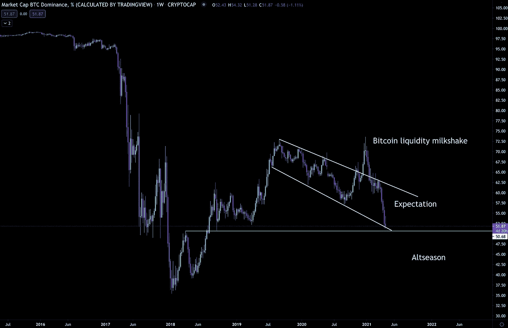
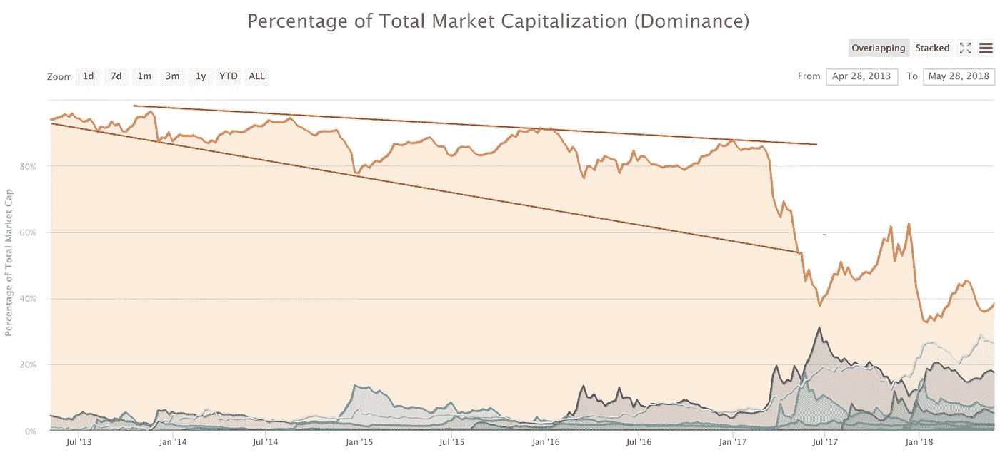
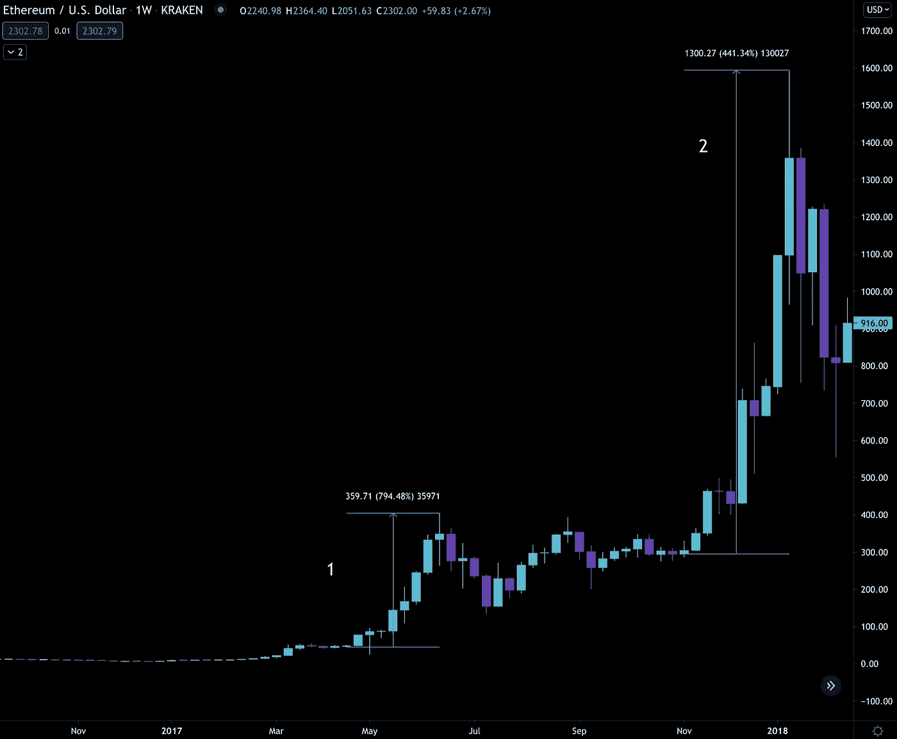

# 替代季节快到了

> 原文：<https://medium.com/coinmonks/altseason-is-near-609e6e768234?source=collection_archive---------1----------------------->

我开始相信我上瘾了。

我选择的内容是编写加密货币内容。

不到八个小时前，我在 Twitter 上写道，今天的问题不会发生。但出于某种原因，我在半夜醒来去找毒品。

我拒绝错过一天…尤其是在牛市中。

事情进展得太快了。我有十几篇文章和想法想发表出来，希望能对某些人有所帮助。

所以我在这里敲打键盘，希望我没有吵醒任何人。

现在，从技术上来说，每周一期的 ChainPulse 仍然推迟发行。

坦率地说，随着我的弟弟本杰明感到不适，我知道内容只会是表面水平。

有些人可能不这么认为，但是您从我们这里获得的洞察力需要一个团队。贾维斯实验室里没有人。我们一周 7 天，一天 24 小时不间断地相互反馈趋势、想法和任何市场发展。

更重要的是，本杰明是人工智能翻译。有时候我分不清另一条线上是机器还是本杰明。

因此，没有他的参与，我们就错过了我认为这个问题最重要的部分——链条脉冲部分。

这就是为什么我要推迟常规 ChainPulse 版本的原因。那会让人觉得是被迫的。正如许多交易者所知，当你在市场上强行推出某样东西时，它往往不会成功。

希望——祈祷本杰明有所好转——我们可以在接下来的几天里发布 ChainPulse 更新。

> 顺便提一下……贾维斯实验室有两个合伙人:本杰明和本·莉莉。我知道，这很令人困惑。
> 
> 但我提到这一点，因为许多人都给我(本莉莉)良好的祝愿。
> 
> 虽然我希望在不久的将来保持良好状态，但本杰明是拥有 COVID 的人。通过这样说，本杰明收到了错误发给我的每一个祝福。坦率地说，我很欣赏这种混淆，因为我对我们的读者的支持感到震惊。你们真是不可思议。谢谢大家！

与此同时，我想偶然发现前几天发表在 CoinTelegraph 上的一张图表。你可以在下面看到。

这是我们本周的图表。

现在，在我们与 CoinTelegraph 的[采访中，我们提到，“我们认为替代硬币季节是让人们感到惊讶的市场运动，或者至少让交易者重新思考什么是正常的。”](https://cointelegraph.com/news/are-we-there-yet-here-s-why-one-analyst-says-its-not-altcoin-season)

现在我们陷入了我所说的预期趋势。自 2020 年前开始的加密牛市开始以来，我们就一直处于这种状态。

在牛市中，资本流回空间。随着更多的资本流入，更多的资本进一步向风险曲线移动。

这很正常。我们可以通过比特币主导地位的下降看到这一点。

这告诉我，我们还没有到赛季交替的时候。投资者还没有挤进加密行业的最小市值机会。

当这种情况发生时，我们将重新考虑什么是正常的。

这种情况不会发生，除非我们跌破上图中的下降趋势漏斗。

现在，从历史的角度来说…就像之前发生的事情一样…当我们这样做的时候，事情开始变得有点模糊。

我们只经历过一次换季。根据 CoinMarketCap 的图表，我们可以看到当我的思维开始变得模糊时我的意思是什么。

在我解释原因之前，先看看下面的图表。

在 2017 年 12 月 altcoins 真正疯掉之前，比特币的统治地位在 2017 年年中打破了一个类似的漏斗。

这是否暗示了两个 altseasons 的可能性？？？哇，放松点……是吗？

不，我不是说我们会看到两个交替季。

相反，我真正揭示的是，上一次我们打破了与我上面列出的类似的预期，价格疯了。

有多疯狂？

这是一张 ETH/USD 的图表，显示了预期中的两次突破。

第一次突破更高导致近 800%的回报，而第二次，超过 400%。

我认为这些类型的“效果”打破了常规。当你站在正确的一边时，这些交易可能是不可思议的财富积累之举。现在，我看到一个替代赛季的潜力开始形成

但是要明白，高收益也会带来高损失。这种类型的交易最好限于现货，并合理的头寸规模。

明白了。

你的脉搏在加密，

本·莉莉

附注——我们来自贾维斯实验室和 ChainPulse 的团队通过我们名为 Espresso 的时事通讯发布免费的每日内容。[到这里订阅](https://jarvislabs.substack.com/welcome)。

> 加入 Coinmonks [电报集团](https://t.me/joinchat/PmKOYQ9NNKZlZGNl)，了解加密交易和投资

## 另外，阅读

*   最好的[加密交易机器人](/coinmonks/crypto-trading-bot-c2ffce8acb2a) | [网格交易机器人](https://blog.coincodecap.com/grid-trading)
*   [加密复制交易平台](/coinmonks/top-10-crypto-copy-trading-platforms-for-beginners-d0c37c7d698c) | [如何在 WazirX 上购买比特币](/coinmonks/buy-bitcoin-on-wazirx-2d12b7989af1)
*   [CoinLoan 审核](/coinmonks/coinloan-review-18128b9badc4)|[Crypto.com 审核](/coinmonks/crypto-com-review-f143dca1f74c) | [火币保证金交易](/coinmonks/huobi-margin-trading-b3b06cdc1519)
*   [尤霍德勒 vs 考尼洛 vs 霍德诺特](/coinmonks/youhodler-vs-coinloan-vs-hodlnaut-b1050acde55a) | [Cryptohopper vs 哈斯博特](https://blog.coincodecap.com/cryptohopper-vs-haasbot)
*   [杠杆代币](/coinmonks/leveraged-token-3f5257808b22) | [最佳密码交易所](/coinmonks/crypto-exchange-dd2f9d6f3769) | [Paxful 点评](/coinmonks/paxful-review-4daf2354ab70)
*   [加密套利](/coinmonks/crypto-arbitrage-guide-how-to-make-money-as-a-beginner-62bfe5c868f6)指南| [如何做空比特币](/coinmonks/how-to-short-bitcoin-568a2d0b4ae5) | [1xBit 回顾](https://blog.coincodecap.com/1xbit-review)
*   [如何在印度购买比特币？](/coinmonks/buy-bitcoin-in-india-feb50ddfef94) | [WazirX 审核](/coinmonks/wazirx-review-5c811b074f5b) | [BitMEX 审核](https://blog.coincodecap.com/bitmex-review)
*   [印度比特币交易所](/coinmonks/bitcoin-exchange-in-india-7f1fe79715c9) | [比特币储蓄账户](/coinmonks/bitcoin-savings-account-e65b13f92451)
*   [币安收费](/coinmonks/binance-fees-8588ec17965) | [Botcrypto 审查](/coinmonks/botcrypto-review-2021-build-your-own-trading-bot-coincodecap-6b8332d736c7) | [Hotbit 审查](/coinmonks/hotbit-review-cd5bec41dafb) | [KuCoin 审查](https://blog.coincodecap.com/kucoin-review)
*   [我的密码交易经验](/coinmonks/my-experience-with-crypto-copy-trading-d6feb2ce3ac5) | [购买硬币评论](https://blog.coincodecap.com/buycoins-review)
*   [逐位融资融券交易](/coinmonks/bybit-margin-trading-e5071676244e) | [币安融资融券交易](/coinmonks/binance-margin-trading-c9eb5e9d2116) | [超位审核](/coinmonks/overbit-review-9446ed4f2188)
*   [加密货币储蓄账户](/coinmonks/cryptocurrency-savings-accounts-be3bc0feffbf) | [YoBit 审查](/coinmonks/yobit-review-175464162c62) | [Bitbns 审查](/coinmonks/bitbns-review-38256a07e161)
*   [Botsfolio vs nap bots vs Mudrex](/coinmonks/botsfolio-vs-napbots-vs-mudrex-c81344970c02)|[gate . io 交流回顾](/coinmonks/gate-io-exchange-review-61bf87b7078f)
*   [最佳比特币保证金交易](/coinmonks/bitcoin-margin-trading-exchange-bcbfcbf7b8e3) | [萝莉点评](/coinmonks/lolli-review-e6ddc7895ad8) | [比特币保证金交易](https://blog.coincodecap.com/bityard-margin-trading)
*   [创造并出售你的第一个 NFT](https://blog.coincodecap.com/create-nft) | [本地比特币评论](/coinmonks/localbitcoins-review-6cc001c6ed56)
*   [加密保证金交易交易所](/coinmonks/crypto-margin-trading-exchanges-428b1f7ad108) | [赚取比特币](/coinmonks/earn-bitcoin-6e8bd3c592d9) | [Mudrex 投资](https://blog.coincodecap.com/mudrex-invest-review-the-best-way-to-invest-in-crypto)
*   [如何在印度购买以太坊？](https://blog.coincodecap.com/buy-ethereum-in-india) | [如何在币安购买比特币](https://blog.coincodecap.com/buy-bitcoin-binance)
*   [顶级付费加密货币和区块链课程](https://blog.coincodecap.com/blockchain-courses) | [币安评论](/coinmonks/binance-review-ee10d3bf3b6e)
*   [MXC 交易所评论](/coinmonks/mxc-exchange-review-3af0ec1cba8c) | [Pionex vs 币安](https://blog.coincodecap.com/pionex-vs-binance) | [Pionex 套利机器人](https://blog.coincodecap.com/pionex-arbitrage-bot)
*   [在美国如何使用 BitMEX？](https://blog.coincodecap.com/use-bitmex-in-usa) | [BitMEX 评论](https://blog.coincodecap.com/bitmex-review)