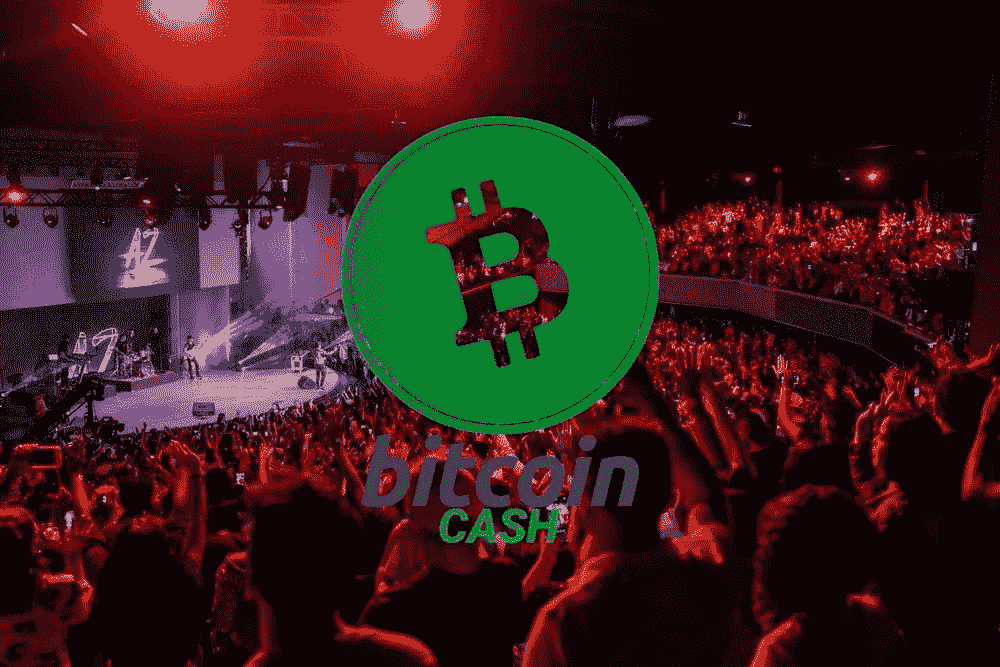
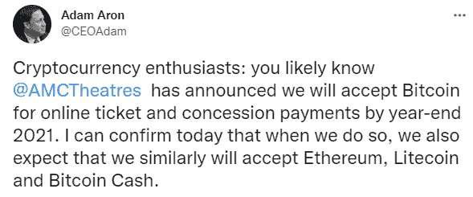

# AMC 影院宣布比特币现金作为支付方式

> 原文：<https://medium.com/coinmonks/amc-theaters-announced-bitcoin-cash-as-a-payment-method-348a943836b4?source=collection_archive---------4----------------------->

AMC 今天宣布，到今年年底，它将在其影院采用四种加密货币作为门票支付方式。

这些支付选项包括比特币现金、BTC、以太坊和莱特币。因为 BTC 和联邦理工学院的支付要求极高的费用，某种第三方可能正在考虑之中。

与此同时，比特币现金可以在不需要第三方的情况下被接受，这可能会为任何企业节省大量费用。

*Source:* [*Twitter*](https://twitter.com/CEOAdam/status/1438298684266098688)

# 比特币现金(至少)是排名前四的加密货币

昨天，Interactive Brokers 宣布了其加密交易平台，现在与以太坊、BTC 和 LTC 一起提供比特币现金交易。

AMC 是另一家采用加密货币的顶级公司，这次不是出于投资目的，而是作为一种支付方式。

虽然 AMC 将使用的服务细节很少，但比特币现金通过与非保管钱包一起被用作支付来证明其实力将是完美的。

比特币现金提供即时、无感觉的交易，这是其他三家区块链网络所不具备的。比特币现金是链上伸缩的比特币。事实证明，BTC 和瑞士联邦理工学院效率低下，收费高昂，网络堵塞。

我们的投资基金的策略中包括比特币现金，并拒绝了目前市值高于 BCH 的其他十种加密货币。

当任何公司或金融机构选择其将采用的加密货币时，比特币现金是优先选择。我们已经看到灰度、贝宝、SBI 和摩根大通，以及更多选择比特币现金作为优先选择的公司。

比特币现金一直是所有采用加密的机构和公司的前四大选择，但加密货币市场的行为是非理性的，应该以更高的价格对比特币现金进行估值。

也许加密交易所也与此有关，因为一些顶级交易所(北海巨妖、比特币基地)需要 15 次确认才能释放用户账户上的资金。

# 最后

比特币现金已经是一个巨大的品牌，一旦它在市场上恢复领先地位，我们会注意到它的知名度在上升。目前，它仍然处于每年长期积累区，但随着更多的发展和更多的 SmartBCH 侧链的采用，将会有关于价格的奇迹。

AMC 的最新消息是比特币现金采用的又一重要步骤。尽管我怀疑有哪家资产管理公司会因为区块链效率而采用 BTC 或瑞士联邦理工学院。

甚至莱特币在所有连锁指标上都落后，比如交易速度和费用。比特币现金是所有这些选项中速度最快的，交易费用也很低。企业可以接受它的支付方式，不需要中介，它的表现就像任何人对数字支付方式的期望一样。

值得注意的是，BTC 和 ETH 都不是支付方式。它们可以用于集中保管钱包下的支付，也许是贝宝。BTC 和瑞士联邦理工学院将收取 3-50 美元的费用，这使得 BTC 和瑞士联邦理工学院的持有者无法在拥挤的时候去电影院。这只是 AMC 需要考虑的事情，以防它决定使用的服务被发现成本高昂且效率低下。

**跟我上:***●*[*read cash*](https://read.cash/@Pantera)*●*[*noise cash*](https://noise.cash/u/Pantera99)*●*[*Medium*](/@panterabch)*●*[*Hive*](https://hive.blog/@pantera1)*●*[*steem it*](https://steemit.com/@pantera1)*●*

***如果你喜欢这篇文章，别忘了订阅并点赞！***

*最初发布于*[*https://read . cash*](https://read.cash/@Pantera/amc-theaters-announced-bitcoin-cash-as-a-payment-method-1136eed0)*。*

> 加入 Coinmonks [电报频道](https://t.me/coincodecap)和 [Youtube 频道](https://www.youtube.com/channel/UCbyDhTbOiKh2iUMKBi4-4Zg)了解加密交易和投资

## 另外，阅读

*   [尤霍德勒 vs 考尼洛 vs 霍德诺特](/coinmonks/youhodler-vs-coinloan-vs-hodlnaut-b1050acde55a) | [Cryptohopper vs 哈斯博特](https://blog.coincodecap.com/cryptohopper-vs-haasbot)
*   [币安 vs 北海巨妖](https://blog.coincodecap.com/binance-vs-kraken) | [美元成本平均交易机器人](https://blog.coincodecap.com/pionex-dca-bot)
*   [如何在印度购买比特币？](/coinmonks/buy-bitcoin-in-india-feb50ddfef94) | [WazirX 评论](/coinmonks/wazirx-review-5c811b074f5b) | [BitMEX 评论](https://blog.coincodecap.com/bitmex-review)
*   [比特币主根](https://blog.coincodecap.com/bitcoin-taproot) | [Bitso 点评](https://blog.coincodecap.com/bitso-review) | [排名前 6 的比特币信用卡](/coinmonks/bitcoin-credit-card-bc8ab6f377c6)
*   [最佳免费加密信号](https://blog.coincodecap.com/free-crypto-signals) | [YoBit 评论](/coinmonks/yobit-review-175464162c62) | [Bitbns 评论](/coinmonks/bitbns-review-38256a07e161)
*   [OKEx 回顾](/coinmonks/okex-review-6b369304110f) | [Kucoin 交易机器人](/coinmonks/kucoin-trading-bot-automate-your-trades-8cf0ca2138e0) | [期货交易机器人](/coinmonks/futures-trading-bots-5a282ccee3f5)
*   [最佳比特币保证金交易](/coinmonks/bitcoin-margin-trading-exchange-bcbfcbf7b8e3) | [比特币保证金交易](https://blog.coincodecap.com/bityard-margin-trading)