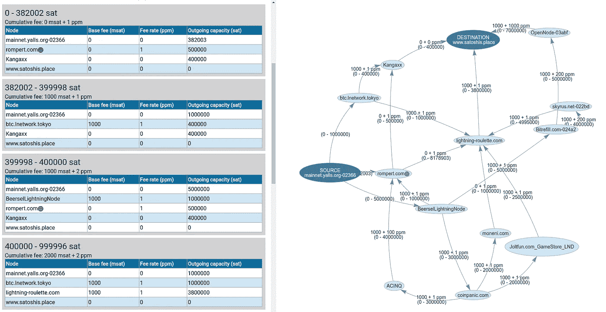

# 闪电网络中与金额无关的支付路由

> 原文：<https://medium.com/coinmonks/amount-independent-payment-routing-in-lightning-networks-6409201ff5ed?source=collection_archive---------2----------------------->

## 针对所有支付金额的高效路径查找

[*https://beeldbank.rws.nl,*](https://beeldbank.rws.nl,) *Rijkswaterstaat / Harry van Reeken*

本文假设熟悉比特币和闪电网络。

在当前的 Lightning 实现中，查找路线的过程总是针对特定的支付金额来执行。举个例子:找出爱丽丝向查理支付 1000 satoshis 的最低成本路线。

要定期付款，这正是所需要的。

对于其他目的，在不假设任何特定支付金额的情况下导出一组最优路线可能更有用。例如:

*   评估节点的当前开放通道集的值。
*   开拓新渠道的决策支持。
*   重新平衡决策。
*   多路径支付的路径选择(AMP)。

本文描述了一种与金额无关的支付路由算法。

在当前的闪电网络中，除了你自己的信道之外的信道的准确容量是未知的。在本文的剩余部分，假设容量是准确的。

在进入算法的细节之前，我们将首先解释复合费用和复合容量的概念。

## 复合费用

复合费用被定义为支付给路由的所有中间跳的总费用。它可以被看作是一种“虚拟”费用，如果要删除所有中间跳，则需要向目标节点支付该费用。按照 Lightning 中当前的费用结构，可以将复合费用表示为基本费用和费率，与单个节点收取的费用相同。

假设查理最终得到了报酬，得到了一只小智。从 Alice 到 Charlie 的这条路线的复合费用为:

*   戴夫转发金额 a 给查理的费用= 5 + 10% * a。
*   鲍勃转发金额的费用(a +戴夫的费用)给戴夫= 3 + 20% * (a + 5 + 10% * a) = 4 + 22% * a。

这使得复合费用为 Charlie 所得金额的 9 + 32%。

## 复合容量

类似于复合费用，可以计算路线的复合容量。这被定义为最终节点可以接收的最大数量，考虑了沿途的信道容量和传送费用所需的额外容量。

对于上面的例子:

*   爱丽丝最多可以给鲍勃 200 个小智。
*   如果 Bob 转发给 Dave，他将收取转发金额的 3+20%。他与 Dave 的频道最多能传送 40 个 sat。费用是 11 先令。Bob 期望 Alice 总共有 51 个 sat。Alice-Bob 信道可以传送这个。爱丽丝最多可以给戴夫 40 分。
*   戴夫向查理收取 5+10%的转寄费。如果他收到他能收到的最大值，40 sat，他将首先减去他的转会费。这个预算允许他转发的最大值是(40–5)/(1+10%)= 31.8 sat。这笔钱可以通过他的渠道转给查理。爱丽丝最多能给查理 31.8 分。

这使得这条航线的复合容量为 31.8 sat。

## 路径寻找

路径寻找算法的一个常见元素是*边缘松弛*。这需要更新到节点的最低成本路径。它是 Dijkstra 算法(用于 lnd)和 Bellman-Ford 算法(用于 c-lightning)的一部分。闪电的成本通常是到目前为止累积的总费用加上时间锁定的罚款。该成本值是一个单一的数字，并且只与一个特定的付款金额相关。

边缘放宽的概念可以扩展到支付金额范围。

基本思想是，对于每个节点，保存一个包含支付范围、复合费用、复合容量和返回源节点的路径(在正向路由的情况下)的表。

然后，放松被定义为将新的范围/费用/容量条目添加到表中，并删除在最后一次添加后变得无用的所有条目。可能是新添加的条目被立即删除。但是也可能是一个或多个现有条目被删除或者根本没有删除。

例如，当添加了提供高达 2000 sat 的 5+8%费用的新路径时，描述提供高达 1000 sat 的 10+10%费用的路径的条目将从表中删除。但是，如果新的路径是 12+15%的费用，高达 3000 sat，则两者都将留在表中。根据数量的不同，它们中的任何一个都可能是最佳的。

如果对于特定金额但范围较窄的新条目，复合费用较低，此过程还会导致拆分现有条目。

对于执行迭代松弛的实际驾驶循环，Dijkstra 似乎不太适合。它需要一个节点的定义，该节点可以以其优先级队列的最低成本到达。如果每个节点都有一个路径表，那么自然就不能定义最低成本。它可以通过使用范围内任何数量的最低成本来工作，但是这没有被调查。

取而代之的是贝尔曼-福特。由于它的|nodes| * |edges|复杂性，它比 Dijkstra 慢得多，但实际上运行时间可以通过基于 Lightning 中的最大跳数限制迭代次数来控制。这是目前的二十跳。遍历并放松所有边 20 次，将得到最多 20 跳的最短路径。

贝尔曼-福特的另一个优势是它可以处理负边缘权重。目前，负权重很可能不会出现在闪电中，但在未来可能会出现。促进重新平衡网络的特定路由可能是有用的。

在常规支付途径中，搜索是(或应该)反向执行的。该过程从目标收到的金额开始，向来源推进，累计成本并检查通道容量。

这里描述的与数量无关的算法既可以实现为向后搜索，也可以实现为向前搜索，因为我们不需要特定的数量。

决定搜索方向要看目的。如果需要从源到所有目标进行分析，向前搜索可以在一次运行中获得所有结果。如果需要从所有来源到特定目标的分析，则需要反向变化。

当算法完成时，目标节点处的路径表包含对于所有支付金额到该节点的最低费用路线。

## 最小金额和时间锁定增量

缺少的渠道策略参数是最低支付金额(min htlc)和时间锁定增量。两者都是相关的，但现在被排除在外。该算法可以扩展到考虑这些参数，而不需要大的改变。

## 例子

下面的算法输出截图显示，对于从 382002 到 399998 sat 的任何支付金额，作为单次支付的最小成本路径是通过 btc.lnetwork.tokyo 和 Kangaxx 节点。

该图显示了任何路由中涉及的节点和通道。这是向所选目的地支付任何金额所需的全部内容。

注意，这没有考虑到信道容量可能不准确、节点可能停机、费用没有更新等等。实际上，路由过程可能需要重复多次，因为一些路由会失败，这可能导致使用不在该图中的节点和信道。

## 多路径路由

与金额无关的路由的用途之一是用于计算多路径支付。继续阅读[具体费用多路径路由](/p/b0e662c79819)。