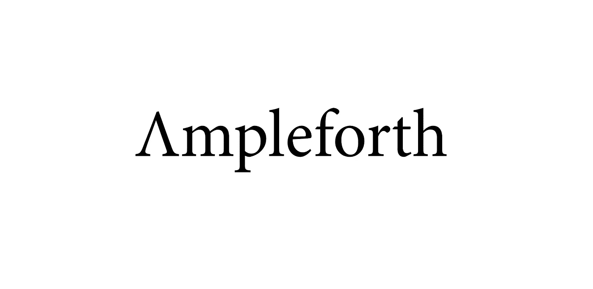

# 安普尔福思是迪菲的新宠:我们开始吧

> 原文：<https://medium.com/coinmonks/ampleforth-is-defis-new-darling-let-s-dive-in-a9519f1e382c?source=collection_archive---------3----------------------->

## 只要考虑到某些风险，Ampleforth 是由供应驱动的，而不是由价格驱动的，这使它成为一个潜在的革命性交易机会。

[Image Credit to the Ampleforth Team](https://www.ampleforth.org/)

安普尔福思。

最近，它成了 T2 的新宠，尤其是由于它在 T4 独特的经济模式。简而言之，虽然所有其他加密货币都是价格驱动的，但 Ampleforth 是供应驱动的。因为这是一个革命性的特性，我决定通过下面的简短讨论来分享我的想法。

# 什么是安普尔福思，它来自哪里？

安普尔福思，或“AMPL”，是一种像比特币一样的数字商品。然而，与比特币不同的是，它没有固定的供应，其价格也不受需求波动的影响。

相反，它的供应对需求做出反应。

要理解这是如何让“ [AMPL](https://coinmarketcap.com/currencies/ampleforth/) ”加密货币成为一种新的、改进的货币形式，熟悉 AMPL 试图成为什么样的货币是很重要的。

过去，全球主要货币都是由黄金支持的。然而，金本位制的问题在于，它使其支持的货币遭受严重的通货紧缩。因为通货紧缩意味着价格下降和购买力增加，很容易认为它总是一件积极的事情，但事实并非如此。

通常情况下，随着通货紧缩的持续，雇主提供的工资会越来越低。与此相关的是，他们也经常引入招聘冻结。这两种情况的发生是因为价格下降意味着收入下降。

似乎这还不够，随着人们看到价格下跌，他们往往会推迟支出，这反过来又会进一步推动通缩。

此外，尽管价格、工资和就业机会随着通缩而变化，但债务保持不变。这迫使任何组织或个人削减开支，这增加了已经提到的所有问题。

如果某个特定经济体的通货紧缩足够严重，相关政府通常会采取所谓的“T0”量化宽松政策(T1)，这意味着它会购买债券、股票和其他资产，以提高它们的价格，降低持有它们的收益。最终，量化宽松，或“QE”，应该说服人们开始消费而不是储蓄，尽管它有自己的风险，比如让人们和企业相信 T2 可以承担更多的债务。

有鉴于此，安普尔福思被创造出来，成为一种更好的货币形式，能够抵御通货紧缩和通货膨胀。

## **安普尔福思是如何抵御通货紧缩的？**

安普尔福思是抗通缩的，因为像法定货币一样，它的供应可以增加，以防止持续通缩。与法定货币不同，这种增加是通过算法实现的，即使用计算机代码(智能合约)。

## **ample forth 是如何抗通胀的？**

这个简单一点。由于它是一种加密货币，所有与其供应相关的移动都是由其代码完成的，而不是由任何类型的中央机构完成的。

想想比特币，除了它的供应被设计成不稳定的，所以它的价格不那么稳定。

# 【Ampleforth 有哪些风险？

安普尔福思不是一个稳定的硬币。直到它的市值大到足以被认为已经达到“平衡”，安普尔福思将像今天一样保持不稳定。因此，就目前而言，正如其团队所指出的，它主要用于对冲其他加密货币的波动，因为它与这些货币不相关。

这是因为 Ampleforth 为高度同质的投资领域带来了多样性。大多数加密货币的价格要么随着比特币或更传统的资产而波动，Ampleforth 是第一个真正不波动的加密货币。因此，通过持有比特币，交易者可以通过远离比特币的价格波动来最小化他们的总体风险。

## **供给变化呢？**

总的来说，Ampleforth 的主要风险是其供应会根据需求每天增加或减少。

"*当货币交易高于其价格目标时，它会增加供应，如果交易低于其价格目标，它会减少供应。*——安普尔福思的联合创始人[布兰登艾尔斯](https://www.youtube.com/watch?v=Upe-AbDrXhE)。

根据美国消费者价格指数的数据，它决定了自己的价格目标。根据 Iles 的说法，这背后的关键思想是，一个 AMPL 给出了一个长期稳定的购买力水平。总体而言，这意味着 AMPL 的理想价格由其智能合约决定，智能合约可以与 CPI 和加密货币交易所的数据“对话”。

目前，AMPL 的价格目标是[【1.009】美元](https://www.ampleforth.org/dashboard/)，这意味着其供应将继续每天调整一次，直到达到该点(均衡)。

因为 Ampleforth 是一个早期项目，只有一年的时间，所以看看它需要多长时间以及其他项目将它作为交易对/支付机制将会很有趣。就目前而言，把它看作是一种真正独特的资产，整体而言，它与传统或加密市场的走势无关。

如果这篇文章有一个关键的收获，那就是这最终会改变，随着越来越多的用户蜂拥而至，Ampleforth 将花更多的时间在平衡上。

现在，我们将踩刹车，因为我计划在 Ampleforth 的下一篇文章中更深入地探讨其经济学。感谢您的阅读，同时如果您想了解更多关于 Ampleforth 的信息，请查看该团队的教育门户网站[这里](https://www.ampleforth.org/basics/)。还有，记住如果你喜欢我的内容，让我知道。最后，我的大部分空闲时间都花在了我的时事通讯上，这是完全免费的，关注的是元宇宙的崛起如何改善每个人的生活。[此处短接](https://www.getrevue.co/profile/blockdemiclab)。

*免责声明:这些都不是财务建议。自 2016 年以来，我一直在研究和工作 crypto，我的目标只是教育人们各种项目的利弊。此外，我是一名学生，就像我们所有人一样。因此，随着我对项目了解的越来越多，我对项目的想法也会随着时间自然发展。*

> [直接在您的收件箱中获得最佳软件交易](https://coincodecap.com/?utm_source=coinmonks)

