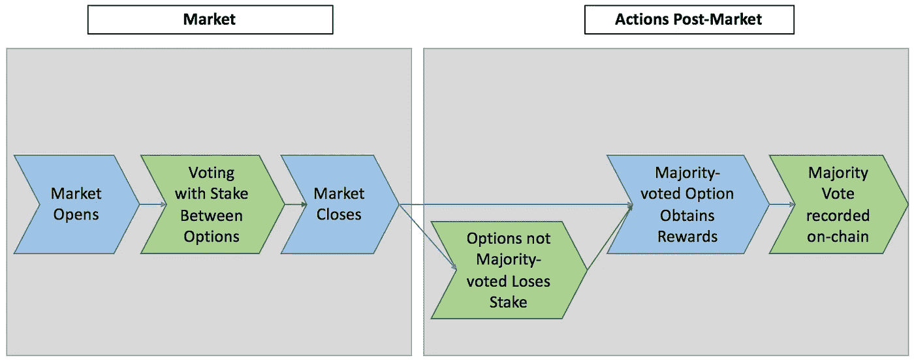
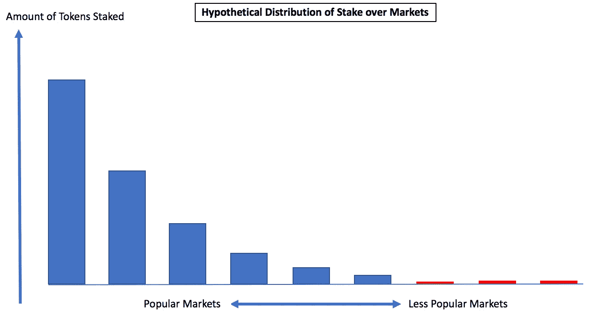

# 多市场区块链投票系统分析

> 原文：<https://medium.com/coinmonks/an-analysis-of-multiple-market-blockchain-voting-systems-9c7e7c463324?source=collection_archive---------6----------------------->

## 注意:这是为了可读性而重写的。我不建议阅读原文，但你可以在这里找到它

***Tl；dr:使用多市场投票系统(如 Augur)的项目将在这些市场之间分配投票。分裂将是不均衡的，投票权较少的市场容易受到廉价攻击。***

## **简介**

许多区块链项目使用在线投票系统。一些项目将它们作为协议的核心部分(预测市场，如 Augur、Gnosis 等)，其他项目将它们用于其他目的，如治理。链上投票系统允许协议以分散的方式获得链外真相。

一个区块链投票系统通常包括:一个包含一些期权的“市场”,用户用代币作为赌注投票给期权。当市场关闭时，拥有最多股份的期权被记录为真实值。在投票系统的简单实现中，如果参与者最终投了多数票，他们会得到奖励，否则他们会受到惩罚并失去他们的股份。下图 1 显示了一个概述:

Fig 1: Process for the generic on-chain voting system

这些系统在理论上是可行的，因为真实选项是一个谢林点。一个理性的选民必须为真相投票，因为“其他人可能也会为真相投票”。这种行为在个人层面上有积极的影响——投票和赌注会聚集到真相上。分散协议能够以分散的方式获得链外真相。

## 理论在实践？

在单一市场的体系中，经济理论告诉我们，这是一个好的设计。然而，多个市场同时运行，从投票者的角度来看，每个市场中的一个谢林点会产生多个谢林点。如果在每个市场中为正确的选项投票都提供了同等的回报，选民将遵循“阻力最小的路径”行为，这很可能是“在我看到的第一个结算市场中，押上我所有的令牌来验证一个微不足道的真理”。

“But whats my motivation?” — your dApp users

这种行为最终导致了市场上代币的扭曲。一个直观的例子是，大多数人愿意证实德国队在 2018 年世界杯上 0 比 2 输给了韩国队，但很少有人愿意证实喀山鲁宾 U21 队 1 比 2 输给了阿森纳图拉 U21 队。比其他市场需要更多时间和精力的市场将会受到更少的关注和重视。

Fig 3: A good guess of how it’ll skew will be according to Pareto Principle —80% of stake will concentrate in 20% of markets. Red markets have lower volume and might be susceptible to an attack.

随着多个市场的剧烈倾斜，较小的市场可能容易受到攻击。一个聪明的攻击者会通过在最后一分钟验证一个谎言来进行攻击，并有足够的赌注使他获得 51%的多数。较小的市场受到的关注较少，也不太可能发现最后一分钟的攻击。

幸运的是，链上投票系统对 51%的攻击有解决方案——将协议的状态分叉成一个挫败攻击者努力的状态。当攻击使用大约 51%的令牌供应时，这种方法非常有效，但是当不对称很严重时，攻击者能够在协议分叉之前兑现他的令牌。

最后，攻击可能不仅仅是为了金钱回报，当协议不得不冻结/转移注意力/分叉时，会产生巨大的工时成本，这是廉价悲伤的潜在途径。

一些可能的解决方案和想法:

1.  匿名投票。想法:攻击者仍然可以基于历史数据进行攻击，尽管期望值较低(如果 *x* 类型的市场历史上平均押有 *y* 个令牌，最多押有 *z* 个令牌，用 *z+ε* 个令牌进行攻击会产生期望值 *(y+z+ε)/(z+ε)* 用于某些 *ε* )。
2.  在市场关闭后，授予代币之前，为市场添加一个结算期。想法:在理性行动者的正常操作下，大部分股份被锁定(在工作令牌系统中，为奖励而优化的令牌持有者需要最小化持有未锁定令牌的时间)。最终，通用协议级别的 51%攻击被大大降低了成本，因为它现在是“51%未冻结股份攻击”。抵御较小的攻击使得协议更容易受到较大的攻击。也就是说，这种权衡可能是值得的。
3.  激励对较小市场的关注。重新安排赌注者可以查看/下注的市场，为较小市场的验证者提供更大的回报。思想:肯定会有助于改善注意力的分布，但会改善股权的分布吗？
4.  允许在每个市场中最多下注 x 个代币。想法:51%攻击的动力被改变了，但可能仍然是对原始系统的改进。

## 结论

区块链投票系统很重要，因为它们是区块链获得链外真相的一种方式，我认为它们是加密货币时代的核心加密经济原语(与 TCR 一起)，就像单向函数是密码学的核心原语一样。这些原语允许区块链以分散的方式访问更大的真实数据集，增加了 dApp 经济可以提供的效用。我很乐意看到这方面的更多讨论和分析——如果有人对探索这一概念感兴趣，请随时联系我们:)

> [在您的收件箱中直接获得最佳软件交易](https://coincodecap.com/?utm_source=coinmonks)

