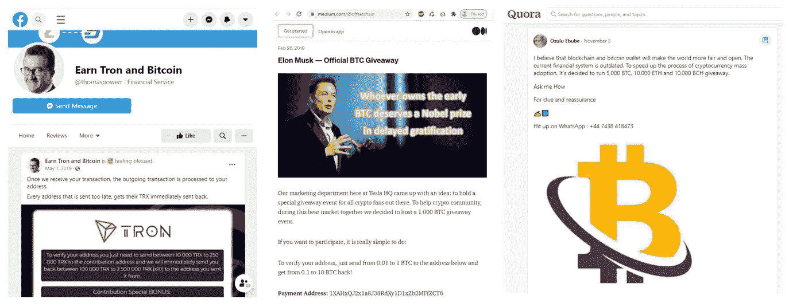
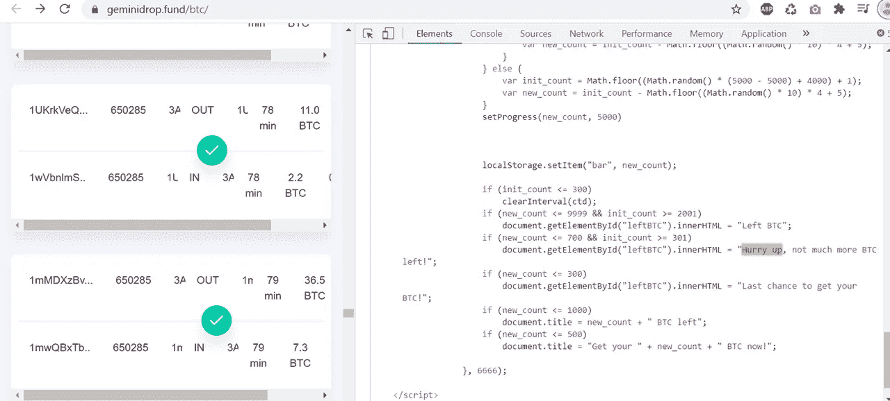
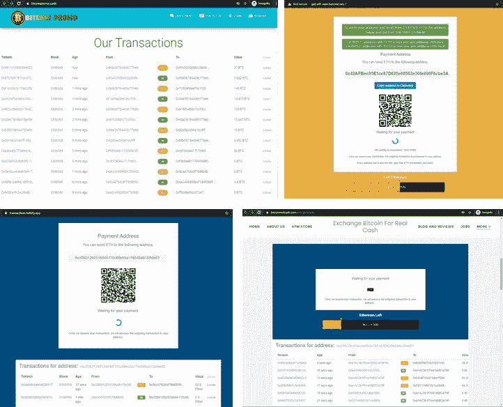

# 精心策划的加密货币骗局

> 原文：<https://medium.com/coinmonks/an-elaborate-cryptocurrency-scam-82d2001704c4?source=collection_archive---------3----------------------->

## The Verge 最近重访了“伟大的 Twitter 黑客”，其中高调的 Twitter 账户被用来发布比特币骗局。

[https://www.theverge.com/22163643/twitter-hack-bitcoin-scam-july-2020-elon-musk](https://www.theverge.com/22163643/twitter-hack-bitcoin-scam-july-2020-elon-musk)

然而，一个快速的在线搜索显示，这些**诈骗信息并不局限于 Twitter** ，在脸书邮报、媒体文章和 Quora 答案上也很普遍。

Scam messages spotted on Facebook, Medium and Quora. Scams also target Altcoins such as Tron

最近，越来越多的人看到 **YouTube 直播视频**推送这些诈骗短信。Bitcoin.com 报告称，看到一些视频使用查马斯·帕利哈皮蒂亚和埃隆·马斯克的名字，诱使观众发送比特币。

[https://news.bitcoin.com/btc-giveaway-scam-chamath-palihapitiya-elon-musk-not-giving-away-bitcoin/](https://news.bitcoin.com/btc-giveaway-scam-chamath-palihapitiya-elon-musk-not-giving-away-bitcoin/)

这些现场视频在**有着很高的收视率** ( >万次观看)，并且是从拥有**大用户数** ( > 100k)的频道发布的。我很好奇这些视频是如何获得如此高的关注度的。

# 伟大的 T̶w̶i̶t̶t̶e̶r̶ YouTube 黑客？

通过两种方法，我意识到这些实际上是合法的 YouTube 频道被黑客入侵，接管并发布这些诈骗视频。

***方法 1:寻找原始 YouTube 频道的残余***

***方法二:观察收购 YouTube 频道，正好***

我发现最令人担忧的是**原来的频道所有者可能不知道他们的账户被接管了**。这两个渠道至今依然活跃。

[Taken on 3rd Jan 2021] Screenshots of channel after the hack, a return to normalcy

# 骗局策略

Scam Video include a link to the scam website: Geminidrop.fund

所以让我们看看当不知情的观众点击 YouTube 视频中的网站时会发生什么…

他们将被要求向 BTC 的一个地址发送一些比特币，作为回报，他们将获得 5 倍的奖金。此外，还有一个表格显示了过去的交易，即许多人已经提交了一些 BTC，并获得了 5 倍的奖金。

但是看一下源代码就会发现这些都是硬编码的，以欺骗合法交易。寄件人的地址和 BTC 值是随机生成的，并定期刷新，给人一种许多其他人已经成功发送并收到奖金的错觉。

JavaScript code showing that the transactions were false and hardcoded

虽然大多数骗局没有成功获得任何加密货币，但也有一些收到了 BTC。

This scam address received a total of 1.237 BTC

由于比特币分类账是公开的，我们可以追踪交易。下图显示了简化的部分交易网络。我们可以看到*红色* Geminidrop.fund 的地址把 1.237 的 BTC 全部发到另一个地址(*黑色* bc1qz)。这个*黑*地址也从另一个地址(*绿* 1WoodNZh)收到了 0.855 BTC。

对绿色 WoodNZh 地址的搜索显示，它来自另一个诈骗 YouTube 视频，该视频使用了对凯西·伍德的采访。

[https://checkbitcoinaddress.com/bitcoin/1WoodNZhYQ2Lv51XwTmz89Ykro2kms5tx?source=abuse](https://checkbitcoinaddress.com/bitcoin/1WoodNZhYQ2Lv51XwTmz89Ykro2kms5tx?source=abuse)

因此， *Black* bc1qz 地址很可能正在整理来自几个 YouTube 骗局的收入，并且已经收到了超过 10 个 BTC。

# 识别骗子具有挑战性

WHOIS 信息通常不可靠，无法确定骗子的来源。尽管域名信息指向伯利兹和俄罗斯，但需要注意的是**注册人可能不会提供准确的信息**。

让我们看看网页的源代码，看看能否找到它们的出处。这里，我们采用了 JavaScript 代码片段中的一个短语:“快点，BTC 没剩多少了！”在谷歌上搜索了一下。

这导致一个俄罗斯自由职业者网站(【https://freelance.habr.com/】T2)上发布了一个任务，其中有一个样本 JavaScript 代码片段**与诈骗网站上的代码**惊人地相似。

Post content is google-translated to English. Similar code snippet spotted.

左边的图表显示了他在[https://freelance.habr.com/](https://freelance.habr.com/)的个人资料，对他的作品集进行反向图片搜索显示了另一个俄罗斯自由职业者网站([https://www.weblancer.net/)](https://www.weblancer.net/)上的另一个个人资料，也有相同的作品集。

# 这种 YouTube Hack +骗局有多普遍？

随着比特币不断打破历史最高纪录，人们对比特币的兴趣正在重新点燃，越来越多的新加密货币持有者可能会陷入这种骗局。当 **YouTube 将这些诈骗视频排在首位**时，这并没有什么帮助(可能是因为它们 a̶r̶e̶是真正合法的渠道)。

A search for ‘bitcoin’ on YouTube LIVE videos shows that the top 2 results are scam videos from hacked channels. Try it out for yourself, using search phrase such as: invest, elon, trading, crypto. Filter video by LIVE

骗子们还利用高调的活动来提高他们视频的点击率。

Top: Hacked channel changes name to spoof SpaceX, and was online during one of SpaceX Live Launch. | Bottom: Hacked channel featuring Ripple CEO, after the recent announcement of SEC charges.

此外，骗子很容易编造诈骗网页。在诈骗网站上，人们有时可以找到由**网站复制程序**自动添加的代码注释。这些程序被用来下载一个网页批发，为重新上传到另一个领域以后。

Top: Source code of scam website geminidrop.fund with comments showing that the code originated from a previous scam site (eth-fond.info) | Bottom: code archive of scam website with generated comments from a web copier software: [https://forum.bitcoin.com/bitcoin-discussion/beware-fake-segwit2x-scam-site-fake-bitcoin-gold-scam-site-steal-bitcoin-ethereum-private-key-promise-bitcoin-cash-t64141.html](https://forum.bitcoin.com/bitcoin-discussion/beware-fake-segwit2x-scam-site-fake-bitcoin-gold-scam-site-steal-bitcoin-ethereum-private-key-promise-bitcoin-cash-t64141.html)

Copy-pasted sites with similar source codes

# 结束语句

谷歌索引这些诈骗网站。由于这些网站经常使用相同的结构和关键字，识别并在搜索引擎结果页面上降低它们的等级对谷歌来说似乎是可行的。

为了识别被黑的频道和诈骗视频，YouTube 可能会根据以下内容执行一系列规则库过滤:

1.  频道和个人资料图片是否突然改变？
2.  除了新发布的直播视频，过去的视频都被摘牌了吗？
3.  视频 OCR 内容或描述是否与任何通常暗示高诈骗概率的关键字相匹配？
4.  发布的内容或评论的语言是否发生了变化？
5.  现场视频的观众统计与过去的视频有很大不同吗？

最后，调查这些骗子是如何获得 YouTube 频道的至关重要。

感谢您的阅读。