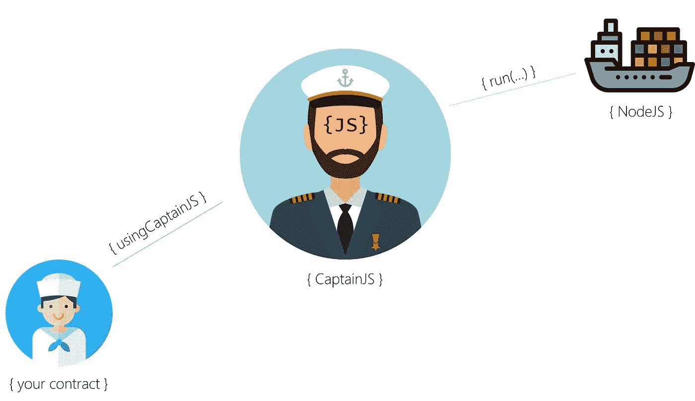

# #ScriptIt:一个以太坊节点 oracle，直接从 Solidity 执行 JavaScript

> 原文：<https://medium.com/coinmonks/an-ethereum-nodejs-oracle-that-executes-javascript-from-solidity-931c0dc58536?source=collection_archive---------2----------------------->

外面有太多以太坊神谕了。奥拉基泽是最著名的一个。但是我的项目需要一个更简单、更直接的 oracle。因此，我创建了自己的一个:我只是想直接从以太坊的实体中调用 JavaScript。我只是想# ScriptIt 而不是更多。

# 它是如何工作的

以太坊神谕叫做 *CaptainJS* 。它等待您的 JavaScript 请求，并在 NodeJS 容器中执行它们。如果你的契约`is usingCaptainJS`
那么你可以利用回调和 JavaScript 执行功能。

船长需要一些预算来转移你的结果或收回你的合同。该预算(天然气*天然气价格)将转移到 CaptainJS 核心合同，并将用于调用您的合同。



# 简单的回调{use.case.1}

在某些情况下，有必要建立一种机制来收回合同。例如，一个基金会每年向特定的人撤回其预算。但坚固不能自称。

因此使用 CaptainJS 从**T5 扩展并开始编码…**

使用一个唯一的整数 **jobId** 来标识您的回调。调用***RingShipsBell***用足够的气体，并接收方法 *RingRing* 中的回调。就是这样。

为了确保 ***RingRing*** 只会被船长本人而不是海盗调用，在其声明中添加***onlyCaptainsOrdersAllowed***。

```
pragma solidity ^0.4.25;import "https://github.com/CaptainJavaScript/Solidity/usingCaptainJS.sol"; contract SimpleCallback is **usingCaptainJS** { uint constant CALLBACK_ID = 3; function CallbackExample() public {
      **RingShipsBell**(
           CALLBACK_ID, */* give the job a unique ID */* 60 * 24, */* 24 hours */* 45000, */* gas budget for callback */* DEFAULT_GAS_PRICE */* use default gas price */* );
   } function **RingRing**(uint UniqueIdentifier) external onlyCaptainsOrdersAllowed {
      if(UniqueIdentifier == CALLBACK_ID) {
         */* this will be executed 24 hours after CallbackExample 
          * was invoked
          */* }
   }}
```

# 只需使用 Mathjs {use.case.2}

现在让我们看一个简单的 JavaScript 作业。JavaScript 的 *mathjs* 库有多个有用的函数，比如*厘米到英寸的转换*。

为了使用这个库，你需要调用 ***Run*** 函数，并提交将厘米转换成英寸所需的 JavaScript 代码。

您要提交的 JavaScript 代码必须按照以下方式编写:

```
module.exports = function(CaptainJSIn) { /* here goes your code */ }
```

CaptainJS 将通过调用默认函数来调用容器中的代码。 *CaptainJSIn* 将包含您对 JavaScript 函数的输入。然后 CaptainJS 会返回你代码的结果。如果您的 JavaScript 代码成功:将调用 *CaptainsResult* 。返回的结果总是一个*字符串*。

如果您的 JavaScript 代码不成功*或*其结果不能被发送回来(它失败了*或*没有足够的气体*或*无论发生什么)，那么 *CaptainsError* 将被调用。

为了确保 *CaptainsResult* 和 *CaptainsError* 都只由船长本人而不是海盗调用，在其声明中添加了*only captains orders allowed*。

运行时间片持续时间为 10 秒，包括所有必需的 npm 模块的下载和安装。目前最多有 6 个运行时间片。

以下是完整的代码片段:

```
contract SeamansExamples is usingCaptainJS {
    ...
    uint constant CENTIMETER_JOB = 1; function CentimeterToInchExample(string **Centimeter**) public {
        ***Run***(
            CENTIMETER_JOB,  /* give the job a unique ID */
            /* JavaScript code I want to execute: */
            "*module.exports = function(CaptainJSIn) { var math = require('mathjs'); return math.eval(CaptainJSIn + ' cm to inch'); }*", 
            **Centimeter**, /* Input parameter which will result in CaptainJSIn (see above) */
            "mathjs",  /* Nodejs libraries we need */
            3, /* we need a maximum of 3 runtime slices */
            DEFAULT_GAS_UNITS, /* use default gas units */ 
            DEFAULT_GAS_PRICE /* we will transfer the default gas price for return */
        );    
    } function **CaptainsResult**(uint UniqueJobIdentifier, string Result) external onlyCaptainsOrdersAllowed {
        if(UniqueJobIdentifier == CENTIMETER_JOB) {
            // OK. It worked and we got a result
            ...
        }
    }

    function **CaptainsError**(uint UniqueJobIdentifier, string Error) external onlyCaptainsOrdersAllowed {
       if(UniqueJobIdentifier == CENTIMETER_JOB) {
            // OK. It didn't work :-/
        }
    }}
```

# 调用 WolframAlpha {use.case.3}等外部资源

如果你想调用外部资源，比如 WolframAlpha，也很容易。让我们问问 WolframAlpha 对法国这样的国家有什么了解。因此，你可以像在第二个用例中一样设计你的代码。

要查询 WolframAlpha，您可以使用 JavaScript 的 *axios* 库。默认函数必须是 *async* ，这样你就可以在调用 *axios.get(…)* 时等待结果。 *axios* 将返回一个 JSON 对象，但我们需要将其展平为一个*字符串*:

```
module.exports = async function(CaptainJSIn) { 
    const axios = require('axios');
    const WAlpha = await axios.get('http://www.wolframalpha.com/queryrecognizer/query.jsp?appid=DEMO&mode=Default&i=' + CaptainJSIn + '&output=json');          
    return JSON.stringify(WAlpha.data);
}
```

同样，CaptainJS 将通过调用这个默认函数来调用容器中的代码。 *CaptainJSIn* 将包含您的输入，如*“法兰西”*。

同样，如果您的 JavaScript 代码成功，将调用 *CaptainsResult* 。否则 *CaptainsError* 将被调用。

因为 Solidity 有时是一种蹩脚的编程语言，所以你会使用一个非常昂贵的 *concat* 函数来提高你的 JavaScript 代码的可读性。

下面是完整的代码片段。

```
contract SeamansExamples is usingCaptainJS {
    ...
    uint constant WOLFRAMALPHA_JOB = 2;

    function WolframAlphaExample(string Country) public {
        Run(
            WOLFRAMALPHA_JOB, /* give the job a unique ID */            
            concat ( /* JavaScript code I want to execute: */
                "module.exports = async function(CaptainJSIn) { ",
                "   const axios = require('axios'); ",
                "   const WAlpha = await axios.get('http://www.wolframalpha.com/queryrecognizer/query.jsp?appid=DEMO&mode=Default&i=' + CaptainJSIn + '&output=json'); ",          
                "   return JSON.stringify(WAlpha.data); ",
                "}"
            ),
            Country, /* Input parameter which will result in CaptainJSIn (see above) */
            "axios", /* Nodejs libraries we need */
            3, /* we need a maximum of 3 runtime slices */
            200000, /* use 200,000 gas units */
            DEFAULT_GAS_PRICE /* use default gas price */
        );    
    }

    ...
}
```

# 请求 JSON、XML/XPath 或 HTML/jQuery {use.case.4}

典型的 oracle 请求是简单的 JSON、XML/XPath 或 HTML/jQuery 请求。最新版本已经预定义了查询，而不是编写一个完整的 JavaScript 代码来完成查询。

要调用一个简单的查询，只需使用 *Run* 方法，就像您在前面两个用例中所做的一样。但是不要提交 JavaScript 代码，而是发送一个带有 *html:* 、 *xml:* 或 *json:* 前缀的 URL。*运行*方法的输入参数是一个 *JSON* 、 *XPath* 或 *jQuery* 表达式。通常 1 个运行时间片就足够了。

如果您的 JavaScript 代码成功:将调用 *CaptainsResult* 。否则 *CaptainsError* 将被调用。

*(客户端库现在包含了一个测试模块，用于检查您的代码是否有效——在您提交给区块链之前)*

```
function HTMLqueryExample() public {
        Run(
            HTML_QUERY_EXAMPLE,  /* give the job a unique ID */
            /* url needs to start with html: */
            "html:http://www.amazon.co.uk/gp/product/1118531647",
            /* Input parameter is the jQuery. Result will be stored in QUERY_RESULT variable */ 
            "$('span.inlineBlock-display span.a-color-price').each(function(i, element) {var el = $(this); QUERY_RESULT = el.text(); })", 
            "",  /* no modules required */
            1, /* queries are fast */
            DEFAULT_GAS_UNITS, /* use default gas units */ 
            DEFAULT_GAS_PRICE /* we will transfer the default gas price for return */
        );    
    }

    function JSONqueryExample() public {
        Run(
            JSON_QUERY_EXAMPLE,  /* give the job a unique ID */
            /* url needs to start with json: */
            "json:https://api.kraken.com/0/public/Ticker?pair=ETHUSD",
            /* Input parameter is the JSON path */ 
            "result.XETHZUSD.a[0]", 
            "",  /* no modules required */
            1, /* queries are fast */
            DEFAULT_GAS_UNITS, /* use default gas units */ 
            DEFAULT_GAS_PRICE /* we will transfer the default gas price for return */
        );    
    }
```

# 加密您的数据{use.case.5}

对于那些喜欢加密存储在区块链的数据的海员，我在最新版本中添加了一个加密模块。这允许您将加密数据发送到船长的 NodeJS 容器。在那里它将被解密和执行。*(字符串结果不会被加密发回)*

例如，您想在交易发生后发送邮件，那么您可以使用 *nodemailer* ，登录您的邮件帐户并发送邮件。在这种情况下，您的代码将类似于以下代码:

```
module.exports = async function(CaptainJSIn) { 
    var nodemailer = require("nodemailer");
    var transport = nodemailer.createTransport({
        host: "smtp-mail.outlook.com", // hostname
        secureConnection: false, // TLS requires secureConnection to be false
        port: 587, // port for secure SMTP
        tls: {
        ciphers:'SSLv3'
        },
        auth: {
            user: "myaddress@outlook.com",
            pass: "mysecretpassword"
        }
    });
    var mailOptions = {
        to: 'donald.trum@whitehouse.gov', // list of receivers
        subject: "you're fired", // Subject line
        text: "Dear Donald, ..."
    };

    // send mail with defined transport object
    transport.sendMail(mailOptions, function(error, info){});
}
```

这个故事的坏的一面是，你的帐户细节将被存储在你的代码中。而这些账户的详细信息将会永远保存在以太坊的区块链中。那很糟糕。但是还有希望！

在客户端库中，我添加了[https://github . com/captain JavaScript/Seaman-Client/blob/master/captain js-encryption . js](https://github.com/CaptainJavaScript/Seaman-Client/blob/master/CaptainJS-Encryption.js)，帮助您在将数据包含在合同中之前对其进行加密:

*   只需简单地将你的模块添加到像 *MailSample.js* 这样的文件中
*   使用 *CaptainJS-Encryption.js* 中的 *EncryptFile* 加密文件
*   将加密代码添加到您的合同中

加密您的代码:

```
var ENC = require("./CaptainJS-Encryption.js");
async function RUN() { 
    await ENC.EncryptFile(false, "MailSample.js", "EncryptedMailSample.txt", 
        () => { console.log("Success!"); },
        (ERROR) => { console.log(ERROR); }
    );
}
RUN();
```

并将您的加密代码添加到基于可靠性的合同中:

```
function HTMLqueryExample() public {
    Run(
        ENCRYPTED_MAIL_EXAMPLE,
        "crypt:8366268bd167a9f8318f99c71d0f489d0372b545735c2e10303c47bad2507e933171f72f...",
        "", 
        "",  
        1,
        DEFAULT_GAS_UNITS,  
        DEFAULT_GAS_PRICE 
    );    
}
```

船长永远不会读你的代码！它只是在一个新的容器中执行。换句话说:如果你加密你的数据，那么它将保持加密状态，直到它在一个容器中被执行(并且容器将在执行后消失)。加密使用船长合同的公钥/私钥。尽管船长可以出于私人目的读取你的加密数据，但他不会这么做。这是承诺，也是信任的证明。

就是这样！:-)

更新@[https://twitter.com/captainjs_v2](https://twitter.com/captainjs_v2)

坚固性代码@[https://github.com/CaptainJavaScript/Solidity](https://github.com/CaptainJavaScript/Solidity)

客户端测试代码@[https://github.com/CaptainJavaScript/Seaman-Client](https://github.com/CaptainJavaScript/Seaman-Client)

> [直接在您的收件箱中获得最佳软件交易](https://coincodecap.com/?utm_source=coinmonks)

[](https://coincodecap.com/?utm_source=coinmonks)[](http://bit.ly/2G71Sp7)