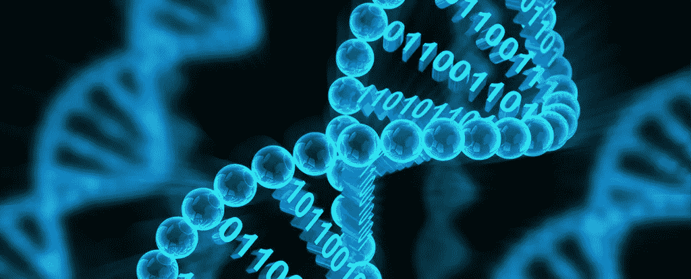
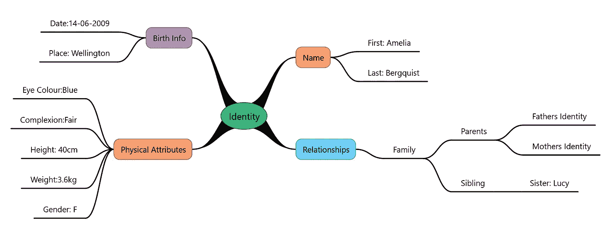
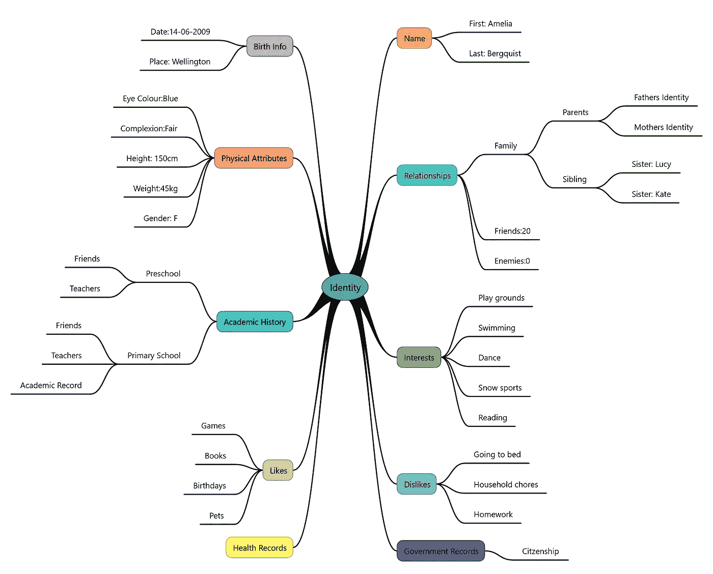
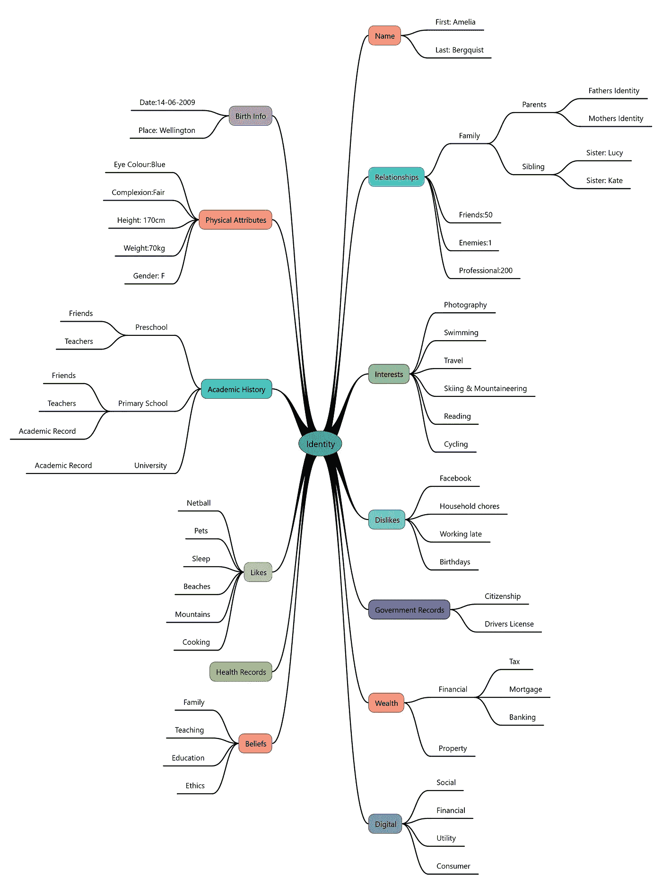

# 身份问题——第三部分

> 原文：<https://medium.com/coinmonks/an-identity-problem-part-3-defining-digital-identity-73b61ee08506?source=collection_archive---------7----------------------->

## 用数据定义数字身份

这是数字身份系列文章的一部分。对于那些正在追赶的人，你可能想从第一部分**开始。**

**

*数字身份不是一个简单的定义话题。如果你问一群人什么是身份，你通常会得到和有多少人一样多的答案。但是我们都有一种内在的自我意识，一种“自我”。我们凭直觉知道什么时候使用我们的身份是对的，什么时候是侵犯。简单的字典术语，如“某人是谁”可能开始得很好。但是，当我们在快速发展的数字生态系统中考虑身份时，沙子开始根据视角和使用情况发生变化，使得笔直简单的道路变得不那么明显。*

**

*鉴于我们生活在一个风云变幻的世界，从一系列的角度来看待身份是有意义的，目的是为了将来证明它。身份当然不是一个一维的问题。它涉及我们的数据，它在社会环境中意味着什么，它如何与信任相关，以及身份对其他物理实体意味着什么。*

*这篇文章从我认为有用的三个定义中的一个开始。*

## *定义 1:我们是我们的数据*

*简单地说，数字身份可以纯粹通过数据的透镜来观察。它表达了我们的数字身份是随着时间积累的关于我们的信息的概念。它与我们的历史、经历、成就和互动有关。*

> *"数字身份是属于一个实体的信息的总和."*

*这是一个合理的数字身份的机械视图，它是描述一个实体的个人属性的集合。*

*通常，从不使用数字身份数据集的全部知识。只有数字身份信息的子集通常用于确定信任，并因此定义允许所有者参与的风险级别。虽然现有的数字身份属性集非常庞大，但它们可以大致分为三类*

*   **固有属性* **—** 实体固有的属性，不通过与外部实体的关系来定义。例如年龄、出生地、指纹*
*   **累积属性* **—** 随着时间的推移收集或发展的属性。这些属性可能会在一个实体的整个生命周期中多次改变或演变。例如学习成绩、健康记录、财产所有权、财务状况*
*   **赋予属性***——**依附于实体，但与其内在本质无关的属性。这些属性可以改变，并且通常反映了该实体与其他实体的关系。例如第三方资料(如信用记录、社交图)、雇主 id、电子邮件地址。*

## *数字身份的数据点*

*为了说明上述定义的使用，给出了一些例子。它们代表了个人生活中的“数据点”。这些示例对与个人相关联的一组数字身份信息进行采样，其中一些是固有的、累积的或分配的。*

***—出生时的身份信息***

*在出生时，你有一个身份信息的初始基础集。出生时，你获得一份出生证明，记录你的出生事件和你的父母。在这一阶段，婴儿身份最丰富的组成部分是他们与父母的关系，他们的身份可以有效地在父母名下表达。当穿越边境时，婴儿传统上习惯于“用父母的护照旅行”。*

**

*— **小时候的身份信息***

*随着个体的成长，他们的身份信息集也在扩大。以下是学龄学生的身份示例。*

**

*信息图开始繁荣，同时保留核心信息。人际关系的圈子越来越大。建立学术、健康和政府记录。喜欢，兴趣，不喜欢都是既定的。*

*— **成年后的身份信息***

*下图说明了代表身份的信息集是如何随时间变化的。喜欢变成不喜欢。一个 5 岁的孩子喜欢生日聚会，不喜欢睡觉，当你 45 岁的时候，情况正好相反。兴趣来来去去，游乐场被成人的追求、运动和爱好所取代。关系会改变、扩张和收缩。财产和财富记录累积。*

**

## *我们声称的信息的滑动窗口*

*从上面的快照可以清楚地看出，我们的身份信息在不断发展。想象一个滑动的时间窗口，它提供了我们信息的视角。通过在时间尺度上左右滑动窗口，身份信息会不断变化。*

*身份信息是一个丰富的动态集合。我们为自己身份“声称”的信息在时间线上是相当可变的。*

*你今天是谁，只是因为我们的行为和事件而引导你明天是谁。*

## *数字身份和用户*

*数字身份的概念出现在上面的信息图表中。当关于我们自己的身份信息蓬勃发展时，一个数字等价物也开始增长。可以说它可能出现在出生时的第一张图中。然而，虽然我们的身份和数字身份相辅相成，但它们并不相同。我们的身份关系形成了一个非常丰富的网络，而我们的数字身份代表了我们信息的子集或指针。*

*数字身份是指向我们物理身份的指针，这一概念导致它被用作凭证。*

*凭证是关于数字自我的特殊数据。虽然它只是关于我们的数字身份的一个非常小的信息片段，但是它被用来在一定程度上提供信任，即凭证的呈现证明了拥有者的身份。就像钥匙是打开汽车的凭证一样，当我们在线交易时，密码、生物特征或令牌中的一次性密码也是打开我们身份的凭证。*

*重要的是要意识到密码不是我们的身份。我们的身份比简单的密码丰富得多。*

## *身份盗窃——真的吗？*

*那么什么是“身份盗窃”呢？让我们想一想非法获取个人证书的一些后果。哪些被视为“身份盗窃”？*

*1.“有人利用我的信息使用假护照”:是的——这是身份盗窃。
2。“有人窃取了我的谷歌账户密码，并正在访问我的 gmail”:是的——身份盗窃，但可能没有我的护照那么糟糕。
3。“有人发现了我的钥匙，还偷了我的车！”不，那只是偷车。不是吗？*

*前两种无疑是我们所知的“身份盗窃”。但最后一种只是我们所知道的“偷车”。但以上所述都是窃取某种形式的自我凭证的结果。而且钥匙(证件)和车还是我的。“身份盗窃”这个概念是不是有点混乱？*

*考虑属于一个身份的信息的完整图形。窃取和歪曲整个集合是不可能或不可行的。无论以何种方式(例如密码凭证)来解锁身份，总会有更多的项目可用于验证身份属于谁。*

*假设有人盗用了你的名字，你的详细地址，伪造了你的驾照。然而，他们不能窃取你所有的深层信息，因为它完全是关于你的。想想你的关系中的信息图表，他们的关系，等等，以及他们所有已知的身份。*

*如果有人偷了你的驾照，他们将不能走进你的家，亲吻你的妻子，问你的孩子在学校怎么样，给你的兄弟打电话，和你的妻子一起吃晚饭，上床睡觉。我敢打赌有人会说些什么。个人之间的信任和关系形成了一套非常强大的身份。*

*窃取护照或密码不是身份盗窃，它实际上只是“凭证欺诈”——谎称提交者属于另一组身份信息。完全的身份盗窃是不可能的。*

## *总结定义 1:我们是我们的数据*

> *"数字身份是属于一个实体的信息的总和."*

*虽然这是一个相对机械的定义，但它提供了一些关于我们对自己信息的动态本质的有用见解。它在变化，在丰富。凭据只是其中的一个小方面，窃取凭据实际上只是凭据欺诈，我们不要被“身份盗窃”冲昏头脑。*

*[*接下来—第四部分—定义身份—语境为王……*](/@bergquistr/an-identity-problem-part-4-8d32631f46ad)*