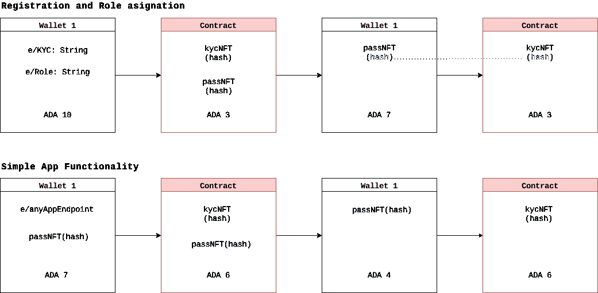

# 基于 KYC 的分散式通行证和角色系统。—卡尔达诺普路托斯智能合约。

> 原文：<https://medium.com/coinmonks/an-identity-verification-and-role-assignment-system-for-cardano-smart-contracts-5a13dcb1e4c1?source=collection_archive---------7----------------------->

创建去中心化应用程序的主要挑战之一是确定谁是合法的参与者，谁是外部代理，因为这对于 Dapp(需要去中心化 KYC 的应用程序)的安全和正常运行是必要的。

例如，应用程序需要根据用户的角色和 KYC 身份验证执行 Dapp 功能的地址是否有权执行该功能。它不是将一个身份链接到一个地址，而是以通行证的形式链接到一个 NFT。无论钱包地址如何，任何操作都将链接到合同中包含的 KYC。

对于这些情况，如果代理想要使用 NFT 形式的通行证来执行功能，该通行证包含链接到内部散列的散列，该内部散列链接到只有合同才能拥有的 kycNFT，则合同将能够验证该通行证先前已经在同一合同中生成。

希望获得通行证的潜在新 Dapp 用户必须通过 KYC 身份识别流程，然后合同将创建两个 NFT，一个保留在合同中(kycNFT)。另一个是新 Dapp 用户的 passNFT。

要运行 Dapp 功能，代理必须拥有有效的 NFT 通行证。

问

NFT 通行证仅在注册和角色分配过程中有效。

⇔问

一旦契约验证了执行功能的必要条件，它就执行动作，并在稍后返回 passNFT。

注册和角色分配过程必须消耗 ADA 值，以避免在创建通行证时滥用。如果将 passNFT 从一个地址传递到另一个地址以尝试取消该 pass 的源链接，则它将始终保持与连接它和 kycNFT 实体的散列的链接。
隐私级别由决定执行注册和角色分配流程的人决定，具体取决于他希望建立的数据，以产生他希望向他人反映的信任。

## 也阅读

 [## 最佳加密交易所| 2021 年十大加密货币交易所

### ICON _ PLACEHOLDEREstimated 预计阅读时间:28 分钟加密货币交易所的加密交易需要知识…

blog.coincodecap.com](https://blog.coincodecap.com/crypto-exchange)  [## 2021 年 10 大最佳加密贷款平台| CoinCodeCap

### 当谈到加密货币贷款时，大量因素等同于良好的收入状况。此外，借款的一部分…

blog.coincodecap.com](https://blog.coincodecap.com/crypto-lending)  [## 2021 年最佳免费加密交易机器人

### 2021 年币安、比特币基地、库币和其他密码交易所的最佳密码交易机器人。四进制，位间隙…

medium.com](/coinmonks/crypto-trading-bot-c2ffce8acb2a)  [## 最佳 4 个加密交易信号电报通道

### 这是乏味的找到正确的加密交易信号提供商。因此，在本文中，我们将讨论最好的…

medium.com](/coinmonks/best-crypto-signals-telegram-5785cdbc4b2b)