# 在 Hyperledger Fabric v2.1 上使用 ExpressJS 在您的自定义网络中实施 REST API

> 原文：<https://medium.com/coinmonks/an-implementation-of-a-rest-api-to-your-custom-network-with-expressjs-node-js-ff156a0c2c0d?source=collection_archive---------0----------------------->


在这个故事中，我们将通过使用 ExpressJS 实现 REST API 来扩展我们现有的 Fabric 网络。Hyperledger Composer 通过它包含的`composer-rest-server`帮助我们为业务网络生成 REST API。但自 2019 年 8 月 29 日以来，它已被弃用，因此我们需要另一种方法来为我们的自定义结构网络创建 REST API。

ExpressJS 框架是 Node.js 的快速、自以为是且极简的 web 框架，我们可以快速轻松地实现 HTTP 请求和路由操作。

[](/coinmonks/create-a-custom-network-and-deploy-your-own-chaincode-with-hyperledger-fabric-v2-1-6c689cf1b7cd) [## 使用 Hyperledger Fabric v2.1 创建自定义网络并部署您自己的链码

### 在本案例中，我们将创建一个自定义网络，并使用 Hyperledger Fabric v2.1 部署一个示例链码。

medium.com](/coinmonks/create-a-custom-network-and-deploy-your-own-chaincode-with-hyperledger-fabric-v2-1-6c689cf1b7cd) 

因为我们将引用上面文章中实现的内容，所以我们需要确定；

*   Fabric network ( `burakcan-network`)已经调出，
*   链码(`be.go`)已经部署到我们的渠道(`channeldemo`)，
*   同行(`orderer.burakcan-network.com:7050`、`peer0.be1.burakcan-network.com:7051`、`peer0.be2.burakcan-network.com:7051`)已加入频道。
*   链码的初始化方法(`InitLedger`)已被调用

在开始实现 REST API 之前。

> 在这里，我们应该对`docker-compose-cli.yaml`文件进行修改，并在其中添加以下行。

> 之后，当我们用`docker-compose-cli.yaml`文件打开网络时，`hyperledger/fabric-ca`图像将在`localhost:7054`上工作。

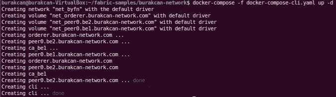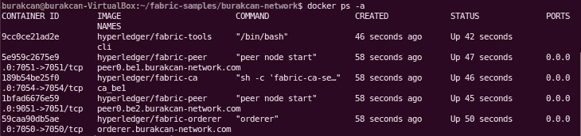

# 安装应用程序依赖项

如果我们已经完成了上面的步骤，我们可以开始安装应用程序依赖项，它们是:

*   `express`，启动 ExpressJS 框架
*   `grpc`和`fabric-client`
*   `fabric-network`，使用身份、钱包、网关连接通道，提交交易，等待 REST API 中的通知。
*   `fabric-ca-client`，向用户各自的证书颁发机构注册用户，在 wallet 文件夹中生成有效身份。

我们为 REST API 应用程序创建了一个文件夹，比如网络根目录下的`burakcan-network/javascript`文件夹。

```
mkdir javascript
cd javascript
```

然后，我们将通过执行`npm init`命令为我们的应用程序创建`package.json`文件，您可以遵循从[到这里](http://expressjs.com/en/starter/installing.html)的所有步骤来创建它。创建了`package.json`文件后，我们安装 ExpressJS。

```
npm init
npm install express --save
```

现在，我们通过执行以下命令来安装我上面提到的依赖项。

```
rm -rf node_modules
npm ci
npm install grpc@1.24.2 --unsafe-perm --save
npm install fabric-ca-client@2.1.0 --unsafe-perm --save
npm install fabric-client@1.4.8 --unsafe-perm --save
npm install fabric-network@2.1.0 --unsafe-perm --save
```

如果您正确安装了所有的依赖项，您的 package.json 应该如下所示，您可以看到您安装的依赖项(安装后, `— save`标记保存依赖项)。

就这样，我们安装了所有的依赖项，我们可以创建连接配置文件，注册管理员，并注册用户。

# 创建连接配置文件

为了正确地从我们将在接下来的步骤中创建的`server.js`、`enrollAdmin.js`和`registerUser.js`文件连接到光纤网络，我们应该在根`burakcan-network`目录下创建`connection-be1.yaml`和`connection-be1.json`文件，并复制以下行。

现在，我们将使用它们。

# 注册管理员用户

当我们创建网络并为其生成私钥、公钥和 X.509 证书时，我们为证书颁发机构(CA)创建了 admin 用户。因此，我们将在`burakcan-network/javascript`目录下创建`enrollAdmin.js`文件，并复制以下文件。

然后执行以下命令

```
node enrollAdmin.js
```

如果运行正常，它会创建一个`wallet`文件夹，并将 CA admin 的凭证作为`admin.id`存储在该文件夹中，因此您应该会看到下面的消息。

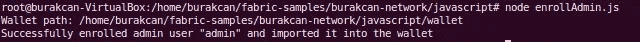

# 注册应用程序用户

我们需要创建将与网络交互的应用程序用户。因此，我们将在`burakcan-network/javascript`目录下创建`registerUser.js`文件，并复制以下文件。

然后执行以下命令

```
node registerUser.js
```

如果它工作正常，它将应用程序用户的凭证作为`appUser.id`存储在这个文件夹中，因此您应该会看到下面的消息。


注册管理员和用户后，您的`wallet`文件夹有 2 个凭证文件。

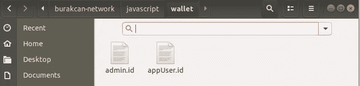

# 创建 API 服务器

这就是 ExpressJS 涉及到 to 的点。下图描述了我们正在努力构建的东西。我们向在`http://localhost:8080`上使用 ExpressJS 开发的 API 服务器发送 HTTP 请求，API 服务器通过使用我们在前面步骤中创建的连接配置文件和钱包连接到我们的 Hyperledger 结构网络。

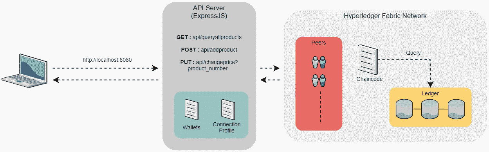

这就是为什么我们将在`burakcan-network/javascript`目录下创建`server.js`作为 API 服务器，并复制下面的文件。在`server.js`文件中，我们使用 HTTP 方法定义了 3 个端点，以连接到 Hyperledger Fabric 网络，并使用连接配置文件和钱包调用感兴趣的 chaincode 方法；

*   `**GET** api/queryallproducts`退回所有产品
*   `**POST** api/queryallproducts`添加新产品并在正文中获取细节
*   `**PUT** api/changeprice/product_number` 用正文中指定的价格更新已经给出`product_number`的产品价格

此外，我们定义了我们将使用的主机和端口，如本文件中的`http://localhost:8080`。我们在`server.js`中复制以下内容

在创建了`server.js`文件之后，我们用下面的命令运行 API 服务器。

```
node server.js
```

我们应该会看到下面在`server.js`文件中定义的消息。


就这样，通过使用已定义的端点向`http://localhost:8080`发出 HTTP 请求就可以了。

# 通过 REST API 与网络交互

我们将使用 Postman 检查下面的所有端点，并在浏览器上检查。

*   `**GET** http://localhost:8080/api/queryallproduct`没有往体内填充任何东西。

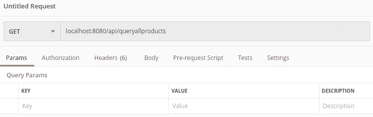

我们得到下面的结果。

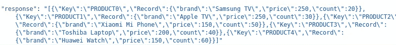

此外，我们可以通过输入 URL 在浏览器上进行检查，我们应该会得到下面的结果。

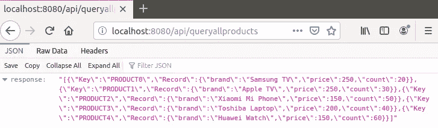

*   `**POST** http://localhost:8080/api/addproduct`用我们想要添加的新产品记录填充主体。

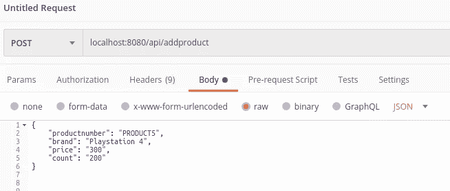

如果我们在浏览器上查看，就能看到新的记录。

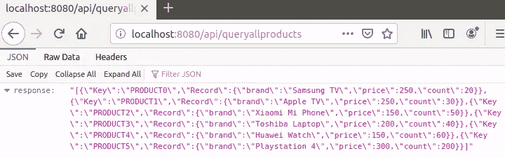

*   `**PUT** http://localhost:8080/api/changeprice/?product_number`用我们想要更新的新价格填充正文。

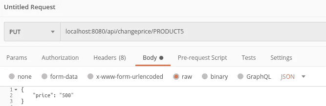

如果我们在浏览器上查看，我们可以看到产品编号为`PRODUCT5`的产品的新价格。

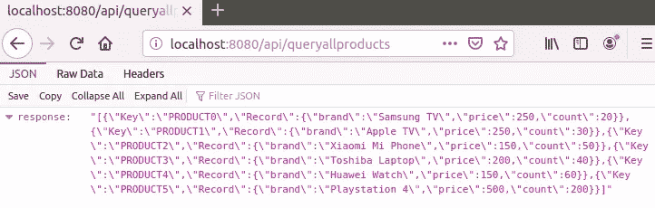

此外，我们可以检查终端上的新情况，该终端用于通过`peer0.be1.burakcan-network.com:7051`或`peer0.be2.burakcan-network.com:7051`对等方连接到 CLI。如您所见，产品编号为`PRODUCT5`的产品显示了新价格。

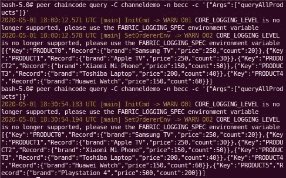

因此，我们完成了连接到我们定制的 Hyperledger 结构网络的 API 服务器应用程序。

> [在您的收件箱中直接获得最佳软件交易](https://coincodecap.com/?utm_source=coinmonks)

[](https://coincodecap.com/?utm_source=coinmonks)