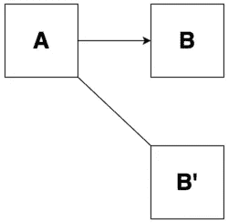
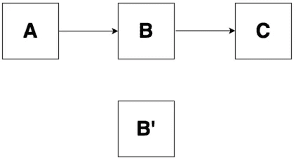
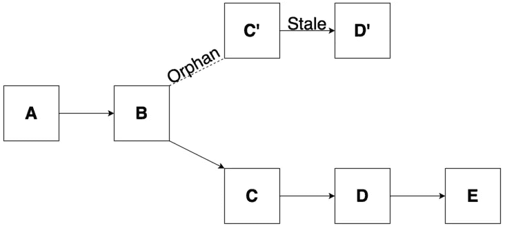

# 深入了解孤立区块

> 原文：<https://medium.com/coinmonks/an-in-depth-look-at-orphan-blocks-45baeaca9d28?source=collection_archive---------0----------------------->

Photo by [Tadeusz Lakota](https://unsplash.com/@tadekl?utm_source=unsplash&utm_medium=referral&utm_content=creditCopyText)

虽然我的兴趣主要在于以太坊和其他“图灵全集”区块链，但[以太坊](https://blog.coincodecap.com/tag/ethereum/)建立在许多最初源于[比特币](https://blog.coincodecap.com/tag/bitcoin/)的概念之上，因此与它有许多相似之处。

在本帖中，我们将看看[比特币](https://blog.coincodecap.com/tag/bitcoin/)中的“孤儿块”。在很大程度上，所有利用工作证明(PoW)算法的区块链都与我下面描述的类似。

在比特币中，有一个概念被称为“最长的链获胜”。这意味着具有最大累积功率的链将是网络接受的有效或“主”链。该规则的存在是为了防止个人或个人群体超越集体网络(除非所述群体代表该网络的 50%以上)。因为 PoW 算法需要大量的计算，因此需要大量的能量，所以对于恶意参与者来说，试图维持最长的链是非常困难和昂贵的。

> **亦读:** [**比特币挖矿如何运作？**](https://blog.coincodecap.com/how-bitcoin-mining-work/)

最长的链通常是包含最多块的链，但是如果链具有相同数量的块，则它将是具有更多集合功率的链(通过对困难求和)。应该注意的是，术语“最长链胜出”可能经常有点误导，因为它暗示在单个网络中可能存在多个独立的竞争链(除非我们指的是测试网，但它们不竞争)。相反，应该认为在一个链中可以采用多条路径，并且期望节点跟随具有最大功率的路径。

但是我所说的这些路径是什么意思呢？我们经常会遇到这样的情况，网络中出现意想不到的分歧或“分叉”。

在使用 PoW 算法的区块链，当网络上的两个矿工在相似的时间解决 PoW 难题时，会发生意外分叉。当这些矿工宣布他们有一个到网络其余部分的“获胜”块(传播)时，由于延迟，这不是瞬时的。

> 在所有节点能够意识到新挖掘的块之前，总是需要一些时间。

例如，假设两个矿工几乎同时解决了力量难题。我们将把这些街区称为 B and B 的。两个矿工都将把他们的“获胜”块传播给他们最近的邻居，他们将依次重复这个过程。这种情况会一直发生，直到整个网络都知道这个新块。如果一个数据块到达整个网络需要 10 秒钟(这不是实际需要的时间),并且两个矿工都在地球的另一端，则在传播 5 秒钟时，我们将有一个拆分的网络(假设延迟在整个网络中保持不变)。

一半的网络现在相信以块 B 为头的链是正确的链，而另一半相信 B’是正确的链。

这显然是个问题，因为…

为了纠正这个问题，在整个网络意识到两个 B and B 之后，它们将把它们首先看到的块保持在它们链的顶端，但是也将它们其次看到的块链接到它们的父块(紧接在 B and B 之前的块)，作为参考。

Node representing B as the head of their main chain while keeping reference to B’.

在此之后，挖掘节点立即开始挖掘下一个块的过程，比赛开始。根据矿工，下一个块将被添加到带有块 B 的链或带有块 B '的链中。

对于这个例子，让我们假设一个以 B 为获胜区块的矿工开采下一个区块 C。他们现在将 C 添加到他们的链中(使其成为最长的链),并将其传播到网络的其余部分。除非有另一个分叉，否则在接收到 C 时，在其主链的头部具有块 B '的节点将接受具有块 B(C 是头部)的路径，因为它现在是最长的链。

Regardless of whether nodes had B or B’ at their head, they will all abandon B’ once C is added on top of B

B '事务然后被返回到 mempool，B '被丢弃并被唾弃，使其成为孤儿，令 B '的矿工沮丧的是，他们失去了开采该区块的奖励。

**这就是比特币区块间隔设为 10 分钟的原因**。中本聪认为这是快速(足够)确认时间和低分叉概率之间的最佳点，因此世界上的孤儿较少，这总是一件好事。

*为了更好地可视化和更深入地了解这一点，请访问 GitHub 上 Andreas Antonopoulos 的“* [*【掌握比特币*](https://github.com/bitcoinbook/bitcoinbook/blob/develop/ch10.asciidoc) *”的第 10 章。*

更新:

最近我注意到，围绕着*孤儿*块和*陈旧*块之间的区别有很多混淆。我想用这一节来阐明两者的不同含义。

1.  ****陈旧块是在孤立块之上挖掘的块。****

****

**Miners of both the orphan and the stale block will not be rewarded for their efforts even though they both provided a valid PoW.**

**需要注意的是，上面描述的情况不会发生在比特币中，因为一旦它被挖掘出来并传播给它们，整个网络都会选择跟随 D。**

**2.孤立块实际上是陈旧块。**

**有些人会说，我在这篇文章中使用的术语“孤儿块”应该被称为陈旧块。**

**3.**旧块是在找到有效 PoW 后正在处理的块。****

**一个名为“[比特币来源](https://btcvsltc.blogspot.com/)”的网站已经很好地总结了这一点(我不再相信它仍然存在)，所以我将包括他们的定义。**

***“在任何一秒钟，一个障碍都可能被“解决”。“这意味着世界上在那个区块上工作的每个人都必须停下来，重新开始他们的工作。在该点之后继续工作被称为在“陈旧块”上工作，因为它是旧数据和旧事务。***

**4.**孤立块是指没有“父”的块。****

**这就是第二点的原因。有些人认为，孤儿块应该只指“没有父块”的块。**

**因为比特币是一个广泛分布的网络，一些节点可以知道其他节点不知道的区块。如果一个节点接收到一个块，并且不知道它的父节点，它们就不能验证它，所以它们必须向网络中的对等节点询问这个信息。在他们收到这个信息之前，这个块被认为是一个*孤立块。***

**然而，这些类型的孤儿在 v0.10 之后不再存在于比特币中，因为节点下载块的方式发生了变化。**

> **[直接在您的收件箱中获得最佳软件交易](https://coincodecap.com/?utm_source=coinmonks)**

********