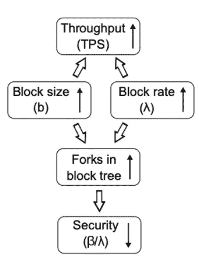
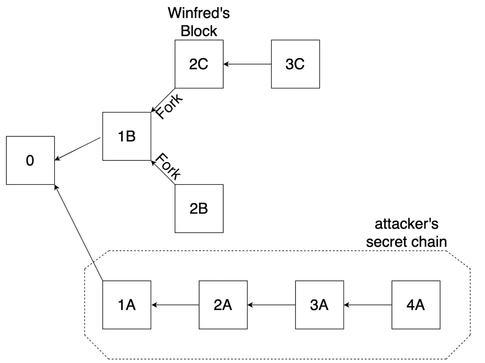

# 深入了解 GHOST 协议:第 1 部分——最长链规则在哪里失效

> 原文：<https://medium.com/coinmonks/an-in-depth-look-at-the-ghost-protocol-part-1-where-the-longest-chain-rule-breaks-down-628b1aaf76fc?source=collection_archive---------2----------------------->

Photo by [Jackson Simmer](https://unsplash.com/@simmerdownjpg?utm_source=unsplash&utm_medium=referral&utm_content=creditCopyText)

*TL；DR-最长链规则不适用于高吞吐量的区块链，因为它会导致过多的分叉，最终导致网络浪费和安全风险。*

这是研究 GHOST 协议的两部分系列文章的第一部分。如果你还没有机会通读我的上两篇帖子，也不熟悉什么是大叔和孤儿街区，我强烈建议你先去看看。分别是《[深度透视孤儿积木](/coinmonks/an-in-depth-look-at-orphan-blocks-45baeaca9d28)》和《[为什么要爱叔叔(积木)](/@ChristopherDKSanders/why-we-should-love-our-uncle-blocks-7eba65ba413e)》。

说了这么多，让我们开始吧。

在撰写本文时，以太坊目前号称平均只有 13 秒(相比之下，比特币为 10 分钟)。为了实现这一巨大的改进，以太坊网络不得不放弃“最长链”规则，转而支持所谓的“最贪婪的重观测子树”或幽灵协议。这就引出了一个问题:

Good question.

在 Yonatan Sompolinsky 和 Aviv Zohar(GHOST protocol 的创建者)的论文“[保障比特币的高速交易处理](https://eprint.iacr.org/2013/881.pdf)”中，他们讨论了与高吞吐量[区块链](https://blog.coincodecap.com/tag/blockchain/)相关的两个主要问题，使用“最长链”规则达成共识；更多的浪费和更少的安全。

第一个问题非常直观。如果块时间减少(或块大小增加)，由于延迟问题，分叉将更频繁地发生，这反过来会导致网络中更多的浪费。

第二个问题有点复杂，因此占据了我文章的大部分。因此，为了解释它，我将拿出我的一个方便的例子(是的，这是参考蓝色的线索)。

好吧，假设 Winfred 是[比特币网络](https://blog.coincodecap.com/a-candid-explanation-of-bitcoin/)中的诚实挖矿节点。他有一个小型的 ASIC 采矿设备，他在他妈妈的地下室里生产出了相当不错的大麻。

Nice.

我在上面简单地提到了它们，但是更明确地说，网络有三种方法可以增加其区块链的吞吐量。

1.  **减少封锁时间。**
2.  **增加块大小。**
3.  **双管齐下。**

现在让我们假设有一天比特币网络进行了投票，他们决定选择第三个，两者兼而有之，这符合比特币的最佳利益，因为规模。

嗯，太好了！比特币最大的批评刚刚被完全抹去。看起来这宝贝要去月球了！

最重要的是，就在那一周，Winfred 的小钻机恰好赢得了下一个街区！即使有一个分支，下一个块也在他的上面结束，因此被认为是主链。他很有钱！现在他妈妈可以住在他的地下室了。

但与此同时，诺索霍耐特先生每晚都在为这一刻祈祷。他经营着一个相当大的采矿设备，但还没有大到可以开采整个网络。然而，随着这些新的更大、更快的数据块的出现，这种情况即将改变。

就在我们的朋友 Winfred 为区块链增加下一个区块时，Notsohonest 先生自己也开采了几个区块，但问题是，他没有向其他节点宣布这一点。通过这样做，他试图用他的私人网络超越/超越公共网络(记住比特币的最长链规则)。

在本地专用网络上工作，相对于你所在的公共网络，给他带来了巨大的优势。在他的本地网络中，他的优势在于不需要处理公共网络所面临的延迟问题。他还有一个额外的好处，就是在没有冲突的情况下更有效地延长他的链条，因为他不会生产叉子。

正如我们上面提到的，因为网络天真地投票增加块大小和减少块时间以加快整个链，公共网络将变得非常低效，因为它求解 PoW 算法非常快，但传播非常慢，最终导致许多许多分叉，以天文数字的方式展现他的优势。

A visual representation of tradeoffs in Bitcoin taken from [Secure High-Rate Transaction Processing in Bitcoin](https://eprint.iacr.org/2013/881.pdf). As block size and block rate are increased, fork rate increases and security decreases

**他现在只需要以前杂凑率的一小部分就能超过网络。**因此，当他最终看到一个分叉试图被解决(导致主链的增长速度短暂放缓)时，他会利用这段时间“跑”出网络，创建最长的链。一旦他成功地做到了这一点，他将最终向其余的节点宣布。

因此，即使我们示例中的分叉以有利于 Winfred 的方式得到解决，解决该分叉所需的*时间*以及较大块固有的较慢传播给了 Notsohonest 先生足够的时间来超越网络。

A simplified visual from [Secure High-Rate Transaction Processing in Bitcoin](https://eprint.iacr.org/2013/881.pdf) that represents how an attacker can take advantage of a fork in the network by mining on a private network.

该网络现在将路径到 Notsohonest 先生的链(最长的链)，Winfred 将失去他的采矿奖励，他一生的最后积蓄将耗尽在他的新货币绿色蓝宝的每月付款上，明天将是他的 40 岁生日，妈妈不会烘烤。

这是两部分系列的第一部分。在第二部分中，我们将看看 GHOST 协议是如何解决“最长链”问题的，并研究以太坊对它的实现。

> [直接在您的收件箱中获得最佳软件交易](https://coincodecap.com/?utm_source=coinmonks)

