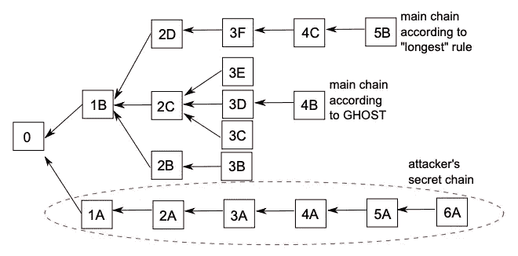
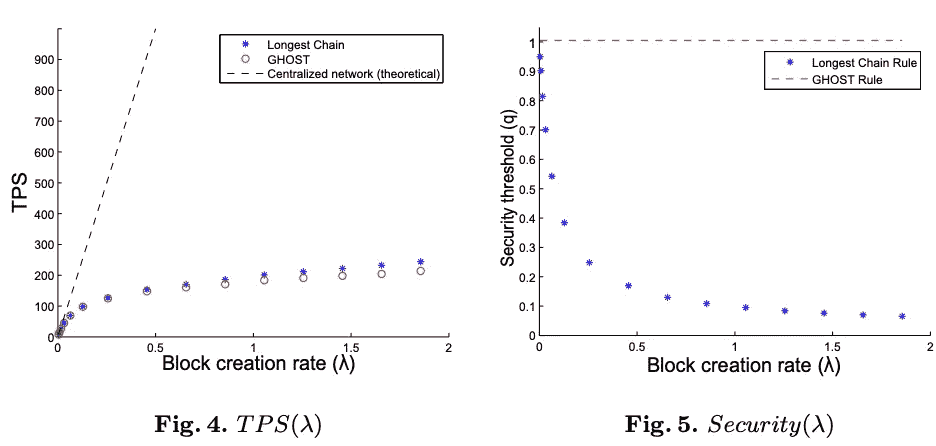
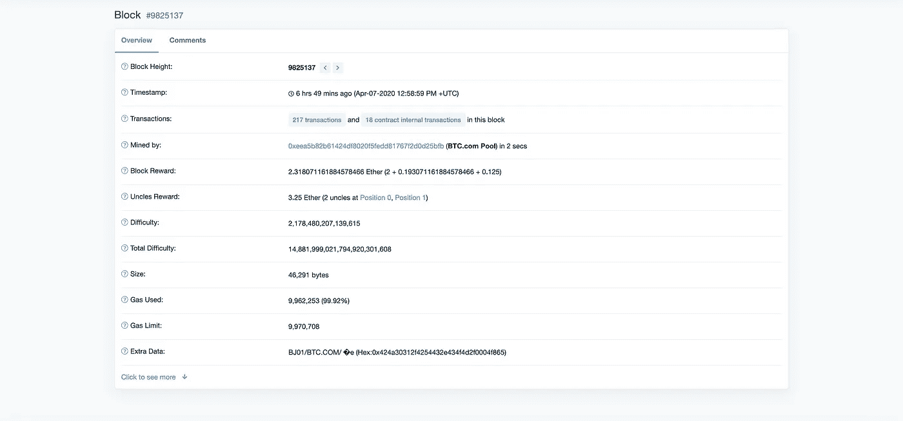

# 深入了解 GHOST 协议:第 2 部分-GHOST 如何工作

> 原文：<https://medium.com/coinmonks/an-in-depth-look-at-the-ghost-protocol-part-2-how-ghost-works-50e49edf7a52?source=collection_archive---------1----------------------->

Photo by [Toa Heftiba](https://unsplash.com/@heftiba?utm_source=unsplash&utm_medium=referral&utm_content=creditCopyText)

在本系列第一部分 *的* [*中，我们研究了为什么最长链规则在高吞吐量区块链(低安全性/高损耗)中失败。在第 2 部分中，我们将看看 GHOST 协议如何解决这个问题，以及*](/@ChristopherDKSanders/an-in-depth-look-at-the-ghost-protocol-part-1-where-the-longest-chain-rule-breaks-down-628b1aaf76fc) [*以太坊*](https://blog.coincodecap.com/tag/ethereum/) *如何选择实现它。*

在他们的论文中，Yonatan Sompolinsky 和 Aviv Zohar 提出，节点应该遵循“最重”的链，而不是遵循“最长”的链。

Taken from [Secure High-Rate Transaction Processing in Bitcoin](https://eprint.iacr.org/2013/881.pdf). The attacker in this image would overtake a blockchain using the longest chain rule but not one using the GHOST rule.

通过使用这种方法，攻击者不再能够简单地超越网络。如上图所示，在 GHOST 中，**在确定整体 PoW 时，所有块**都被考虑在内。

> 这确保了即使吞吐量增加，安全风险也保持不变。

Taken from [Secure High-Rate Transaction Processing in Bitcoin](https://eprint.iacr.org/2013/881.pdf). In Fig. 4 and 5 we see even as block creation rate increases, security remains constant for blockchains using GHOST rule.

太好了！现在我们来看看以太坊选择如何实现这个协议。在他的[白皮书](https://github.com/ethereum/wiki/wiki/White-Paper#modified-ghost-implementation)中，Vitalik Buterin 提到了 GHOST 协议为以太坊解决的三个问题:

1.  **安全漏洞**
2.  **损耗**
3.  **集权**

前两个我们应该已经非常了解了。这是我想花点时间讨论的第三个话题。为什么高吞吐量的区块链会导致网络更加集中化？白皮书是这样描述的:

> 如果挖掘者 A 是具有 30%散列能力的挖掘池，而 B 具有 10%散列能力，则 A 将有 70%的时间产生陈旧块的风险(因为 A 的另外 30%的时间产生最后的块，因此将立即获得挖掘数据)，而 B 将有 90%的时间产生陈旧块的风险。因此，如果块间隔足够短，使得旧速率足够高，则 A 将仅仅由于其大小而实质上更有效。”

换句话说，在“最长链”模型中，随着吞吐量的增加，大型矿池将有一个成比例增长的开端来解决对他们有利的分叉，因此给他们更多的网络控制**。**

以太坊的集中化是通过将 Sompolinsky 和 Zohar 的协议“进一步”(如白皮书所述)奖励生产大叔块的矿工来打击的，否定了网络传播问题。奖励基于以下计算:

**([uncleHeightNumber+8-block height number]* reward/8)**

这种计算允许 7 级叔叔块。链条上每多一个叔叔，回报也是递减的。这样做的原因是为了简化奖励计算，并消除在叔叔链上持续采矿的激励，这造成了安全风险。

让我们来看看这个公式的实际实现。[街区高度 9825137](https://etherscan.io/block/9825137) 包括高处的两位大叔 [9825135](https://etherscan.io/uncle/0xaa5f9158fe26ccba4b9d8de1e1e8a751e5c71334db7fcbf08c8db71df68c214e) 和 [9825136](https://etherscan.io/uncle/0x3eb97f69944dfa21139e9e93bc48bf2b1ab5b29e5935d311d3b93f7fa869f3bd) 。如果我们把这三个高度和当前的格挡奖励 2 代入公式(试试看！)，我们最后会给两位大叔分别 1.5 和 1.75 以太的奖励。9825137 区块的矿工也将获得 3.125%的区块奖励，作为包括 2 个叔叔的奖励。

Block #9825137 taken from [etherscan](https://etherscan.io/). Notice that it includes both rewards for Uncle heights 9825135 and 9825136.

应该注意的是，大叔链很少会延伸超过 1 或 2 个街区，因为矿工会在主链上采矿时获得更多奖励(记住大叔奖励会迅速减少)。事实上，为了找到上面的例子，我不得不在 etherscan 上深入研究了 75 页！

GHOST 协议允许以太坊获得大约每秒 20 笔交易的吞吐量(考虑到适当的确认数量)。虽然这是对比特币每秒 7 次交易的重大改进，但它远远达不到与集中式系统竞争所需的吞吐量。

也就是说，[以太坊](https://blog.coincodecap.com/tag/ethereum/)将在不久的将来切换到 Casper 协议，这是对 GHOST(因此得名)的一种改进，利用利益证明和分片，希望在不牺牲安全性或分散性的情况下加快其网络速度，尽管确切日期尚未公布，但估计将在 2021 年发布。

这是我解释 GHOST 协议如何工作的系列文章的第 2 部分。

> [直接在您的收件箱中获得最佳软件交易](https://coincodecap.com/?utm_source=coinmonks)

