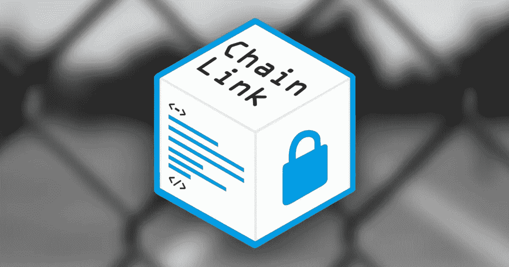

# 深入了解链接令牌

> 原文：<https://medium.com/coinmonks/an-in-depth-look-at-the-link-token-7d92662b6819?source=collection_archive---------0----------------------->

在这篇文章中，我将深入探讨 Chainlink 网络的 staking 机制以及为什么需要 LINK token。

> *注意:如果你不熟悉 Chainlink，请务必先浏览一下我以前的文章:“* [*Chainlink:基本面分析*](https://link.medium.com/tdilTMoEH0) *”。*

开始之前，我们需要了解一些关键术语:

*   **区块链本质上非常安全，分布式** …