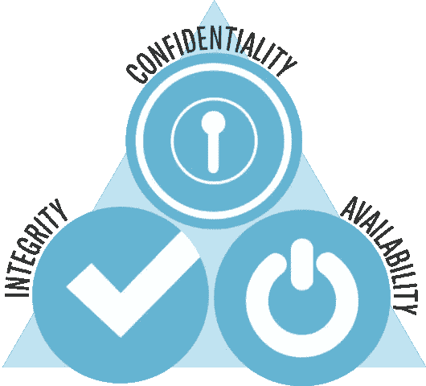

# 洞察数字隐私和安全资源

> 原文：<https://medium.com/coinmonks/an-insight-to-digital-privacy-and-security-resources-401ded4a5ad6?source=collection_archive---------0----------------------->

# 什么是安全？

简而言之，这是关于保护。早些时候，我们有物理安全来保护我们在物理世界中的宝贵资产。但是，当我们更多地走向网络世界时，我们需要一套新的软件和工具来保护我们的数据和隐私。

安全的三大支柱是:

CIA triad

*   **保密性—** 重点保护“**读**操作。您不希望未经授权的人阅读您的机密信息，例如，您的信用卡号、密码或工资总额。
*   **完整性—** 这主要是保护“**写**操作。你不希望未经授权的人修改你的数据。例如，你不希望有人未经你的允许就从你的银行账户里取钱。
*   **可用性—** 这意味着系统和数据在您需要时总是可访问的。例如，网上银行系统或网上购物网站应该一直开着。

# 今天可用的强大工具包

**Mozilla 的** [互联网健康报告](https://internethealthreport.org)或[在线隐私与安全简报(PDF)](https://assets.mozilla.net/pdf/IHPbriefs_Online_Privacy_March_2017.pdf) 。

 [## 健康的互联网是安全和隐私的

### 只有当我们相信互联网是一个安全的地方——去探索、交易、联系和创造，它才能保持健康。

www.mozilla.org](https://www.mozilla.org/en-US/internet-health/privacy-security/) 

我的影子帮助你掌控你的数据。
什么是数字阴影？看 [**这个**](https://myshadow.org/media/video/what-is-a-digital-shadow.mp4) 就明白了。

 [## 我和我的影子

### MyShadow.org 提供了切实可行的方法来收回你的网上隐私。

myshadow.org](https://myshadow.org/train) 

**电子前沿基金会(EFF)** 。捍卫数字隐私、言论自由和创新的领先非营利组织。

 [## 电子前沿基金会

### 在数字世界捍卫你的权利

www.eff.org](https://www.eff.org/) 

**监视自卫。**为更安全的在线交流提供提示、工具和操作方法。我们是电子前沿基金会，一个独立的非营利组织，致力于保护在线隐私近三十年。

 [## 监视自卫

### 提高在线通信安全性的技巧、工具和操作方法

ssd.eff.org](https://ssd.eff.org/) 

**安全教育伴侣。**面向数字安全教育者的免费资源。SEC 是一个向朋友和邻居教授数字安全的资源。

 [## 安全教育指南

### “安全教育伙伴”是一种资源，供人们向朋友和邻居教授数字安全知识。

sec.eff.org](https://sec.eff.org/) 

**隐私獾。**隐私獾自动学习屏蔽隐形追踪器。

 [## 隐私獾

### 安装隐私獾和启用不跟踪

www.eff.org](https://www.eff.org/privacybadger) 

**Tor 项目。**我们认为每个人都应该能够隐私地探索互联网。我们通过免费和开源的匿名和隐私技术促进人权和保护您的在线隐私，支持其无限制的可用性和使用，并促进其科学和流行的理解。

 [## Tor 项目|隐私与自由在线

### 保护自己免受跟踪和监视。规避审查。

www.torproject.org](https://www.torproject.org/) 

**防御排毒**。运行数字安全课程的一步一步的惊人指南。本课程是为纽约市的女性防御和排毒活动而设计的，旨在教导数字女性如何在网上保护自己。该课程可以适应任何地方的妇女。

 [## 保卫:妇女隐私和安全讲习班

### 安全问题测试是一种模拟，旨在展示共享个人信息是多么容易。

thimbleprojects.org](https://thimbleprojects.org/amira/283780/#overview) 

Mozilla 隐私工具包讲义。

**数据安全交换。**民间社会组织面临许多不同的威胁。我们将他们与数字安全提供商联系起来提供帮助。

 [## DSX

### 保护美国公民社会免受数字攻击

www.digitalsecurityexchange.org](https://www.digitalsecurityexchange.org/) 

**说出来&保持安全(r):** 保护自己免受网上骚扰的指南

 [## 大声说出来&保持安全(r):

### 保护自己免受网上骚扰的指南？没有时间阅读全部内容…

onlinesafety.feministfrequency.com](https://onlinesafety.feministfrequency.com/en/) 

**盒子里的安全** —数字安全工具和策略。该工具包中的策略指南涵盖了基本原则，包括如何更安全地使用社交媒体和手机的建议。工具指南提供了分步说明，帮助您安装、配置和使用一些重要的数字安全软件和服务。

 [## 盒子里的安全-数字安全工具和策略

### 盒子里的安全-数字安全工具和策略

盒子里的安全-数字安全工具和 tacticssecurityinabox.org](https://securityinabox.org/en/) 

**Accessnow。** Access Now 捍卫并扩展了全球面临风险的用户的数字权利。通过结合直接的技术支持、全面的政策参与、全球宣传、草根赠款和 RightsCon 等会议，我们为数字时代的人权而战。

 [## 不要慌！下载“数字安全一瞥”

### 我们在 GitHub 上分享了整个项目。随时评论，叉，或联系我们那里！美国大选和…

www.accessnow.org](https://www.accessnow.org/first-look-at-digital-security/) 

**数据排毒锦囊:**改变习惯，减少数据痕迹的小步骤。数据排毒工具包是一个为期 8 天的分步指南，介绍如何减少在线数据痕迹。每一天都有不同的关注点——从清理你的应用程序，到社交媒体，再到你的手机连接——通知你数据流程，指导你做一些你可以做的改变，并在每天结束时给你一个小挑战。

 [## 数据排毒工具包

### 下载数据排毒工具包，开始清理您的数字生活！

tacticaltech.org](https://tacticaltech.org/news/data-detox-kit/) 

**开放 Web 应用安全项目(OWASP)** 是一个全球性的非营利性慈善组织，致力于提高软件的安全性。我们的使命是让软件安全[可见](https://www.owasp.org/index.php/Category:OWASP_Video)，以便为全球的个人、公司、大学、政府机构和其他组织提供公正、实用的 AppSec 信息。

 [## OWASP

### 全球有成千上万活跃的维基用户审查网站的变化，以帮助确保质量。如果…

www.owasp.org](https://www.owasp.org/index.php/Main_Page) 

**主板。引导你第一次培训的实用清单。你想教人们关于 infosec、opsec 以及如何保持在线安全吗？这里是开始的地方。**

 [## 如何领导数字安全研讨会

### 在 Motherboard，我们不仅仅喜欢谈论安全性，我们还希望向您展示如何让社会变得更加安全

motherboard.vice.com](https://motherboard.vice.com/en_us/article/4xby8g/how-to-give-a-digital-security-training) 

# 值得一读的文章

**如何确保你的家庭住址不容易在网上查到**

 [## 如何确保你真实的家庭住址不容易在网上找到

### 本周，我在 Twitter 上偶然发现了这个帖子。我惊呆了。在这本书里，一个(理所当然地)关心的公民…

www.autostraddle.com](https://www.autostraddle.com/how-to-make-sure-your-honest-to-god-actual-home-address-isnt-easily-available-online-365455/) 

[**什么是 Doxing，如何防止其发生**](https://crashoverridenetwork.tumblr.com/post/108387569412/preventing-doxing)

 [## 那么 Doxxing 到底是什么？- ProPublica

### 还记得 Gamergate 吗？或者当杀死狮子塞西尔的牙医的身份被公布的时候？或者那个男人是…

www.propublica.org](https://www.propublica.org/article/so-what-the-hell-is-doxxing) 

**如何在不给出电话号码的情况下使用信号**

 [## 如何在不给出电话号码的情况下使用信号

### 就在几年前，发送加密信息还是一项挑战。刚开始，你必须花几个小时跟踪…

theintercept.com](https://theintercept.com/2017/09/28/signal-tutorial-second-phone-number/) 

**不喜欢在网上被跟踪？5 分钟内免费设置一个 VPN**

 [## 如何在 10 分钟内免费建立一个 VPN(以及为什么你迫切需要一个)

### “计算机让你比任何其他发明更快地犯更多的错误，除了手枪和……

medium.freecodecamp.org](https://medium.freecodecamp.org/how-to-set-up-a-vpn-in-5-minutes-for-free-and-why-you-urgently-need-one-d5cdba361907) 

**女性网络安全 DIY 指南**

 [## DIY 女权主义网络安全

### 你随意的互联网浏览为任何能看到你在做什么的人提供了一个个人数据的宝库…

hackblossom.org](https://hackblossom.org/cybersecurity/) 

**网络钓鱼没有 Phun 以下是如何抵御诱饵**

 [## 网络钓鱼不是 Phun 以下是如何抵制诱饵

### 通过 Shutterstock 的特征图像。您可能已经听说了本周的大规模网络钓鱼骗局。一些恶意的人类…

www.autostraddle.com](https://www.autostraddle.com/phishings-no-phun-heres-how-to-resist-the-bait-378342/) 

**平等实验室隐私+安全课程指南**

 [## 课程-平等实验室

### 本课程由合格的彩色数字安全培训师共同开发，他们在以下领域有丰富的工作经验

www.equalitylabs.org](https://www.equalitylabs.org/curriculum/) 

[**如何用匿名邮箱和一次性手机运行流氓政府推特账户**](https://www.theguardian.com/global-development/poverty-matters/2011/aug/04/digital-technology-development-tool)

 [## 如何使用匿名电子邮件地址和一次性手机运行一个流氓政府推特账户

### 在这个练习中，我决定选择一个极具争议的政治话题:事实。我相信我们所知道的…

theintercept.com](https://theintercept.com/2017/02/20/how-to-run-a-rogue-government-twitter-account-with-an-anonymous-email-address-and-a-burner-phone/) 

[**遇险记者:保护你的数字生活**](http://www.cjfe.org/journalists_in_distress_securing_your_digital_life)

 [## 公民自由团体谴责特朗普政府对朱利安·阿桑奇的起诉

### 虽然对朱利安·阿桑奇的指控集中在试图破解密码上，但这一企图并不是…

自由新闻](https://freedom.press/news/civil-liberties-groups-condemn-trump-admins-indictment-julian-assange/) 

[**数字安全入门**](https://blog.witness.org/2016/11/getting-started-digital-security/)

 [## 每个信号用户都应该知道的安全提示

### iPhone 和 Android 有几十个消息应用程序，但有一个特别突出…

theintercept.com](https://theintercept.com/2016/07/02/security-tips-every-signal-user-should-know/) 

**认真加密您的笔记本电脑**

 [## 认真加密您的笔记本电脑

### 一次又一次，人们被告知有一个显而易见的方法来减轻各种各样的隐私威胁，从大众…

theintercept.com](https://theintercept.com/2015/04/27/encrypting-laptop-like-mean/) 

[**米卡·李的作品《截击》**](https://theintercept.com/staff/micah-lee/) **。**

 [## 施耐尔谈安全

### 思科 Talos 安全部门的研究人员周三透露，一个名为海龟的黑客组织…

www.schneier.com](https://www.schneier.com/) 

# **免费专业资源、会议、播客和网络研讨会**

> **会议:**
> 
> [OWASP 海畔](https://www.owaspseasides.com/)
> [OWASP 全球 app sec](https://telaviv.appsecglobal.org/)
> [DEFCO](https://defcon.org/)
> [HOPE](https://hope.net/)
> [Toor Camp](http://toorcamp.toorcon.net/)
> [cyber sec 峰会](https://cybersummitusa.com/2017-boston/)
> [ENIGM](https://www.usenix.org/conference/enigma2017#main%5C)
> [cyber sec Manchester](https://infosec-conferences.com/events-in-2019/cyber-security-manchester/)
> 
> [RSA Conf](https://www.rsaconference.com/events/us19)
> [HITB sec](https://conference.hitb.org/)
> 
> **播客:**
> 
> [*SANS 每日风暴广播*](https://isc.sans.edu/podcast.html#stormcast)[*加密程序安全播客*](http://crypto-gram.libsyn.com/)[*最讨厌的人*](https://www.youtube.com/channel/UCjr2bPAyPV7t35MvcgT3W8Q)[*赛博网*](https://www.thecyberwire.com/podcasts/)[*高风险业务*](http://risky.biz/netcasts/risky-business)
> 
> **资源和网络研讨会:**
> 
> [道德黑客](https://ethicalhacker.net/)
> [光明谈](https://www.brighttalk.com/topic/cyber-security/)
> [FOIA 供稿](https://twitter.com/foiafeed)
> [Cybrary](https://www.cybrary.it/)
> [自由追踪者](https://pressfreedomtracker.us/)
> [have](https://guardianproject.github.io/haven/)
> [安全掉落](https://securedrop.org/)
> [常识](https://www.commonsense.org/education/digital-citizenship/privacy-and-security)
> [网络智慧](http://www.cyberwise.org/)

Futurism: How to protect your online identity

 [## 什么是威胁建模？

### Motherboard 的 Lorenzo Franceschi-Bicchierai 解释了什么是威胁建模，以及它如何让您和您的数据…

video.vice.com](https://video.vice.com/en_us/video/motherboard-hacking-week-what-is-threat-modeling/5a0b2378177dd428d3222d68?ref=motherboard)  [## 确保新闻安全

### 每个新闻网站都应该是安全的。

securethe.news](https://securethe.news/)  [## 信息安全资源信息安全培训和信息安全资源

### Infosec 提供的 IT 安全培训和资源

Infosecresources.infosecinstitute.com IT 安全培训和资源](https://resources.infosecinstitute.com/) 

感谢阅读。如果还有什么要补充的，请平我 [@Kai Iyer](https://www.linkedin.com/in/anoop-krishnan47/) 。

> [在您的收件箱中直接获得最佳软件交易](https://coincodecap.com/?utm_source=coinmonks)

