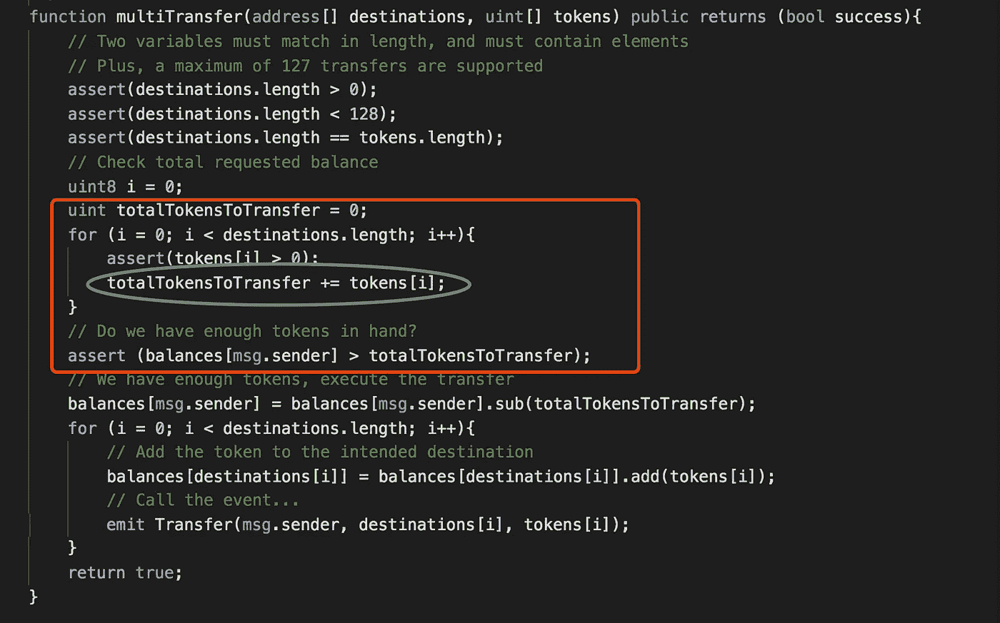
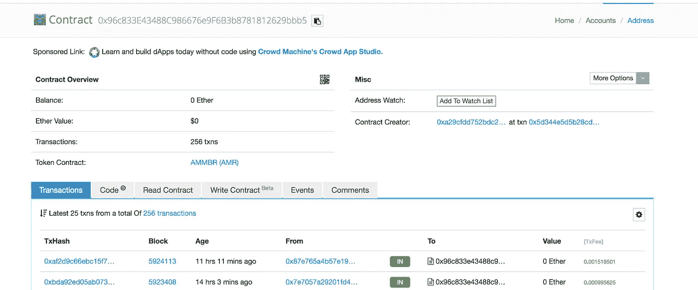
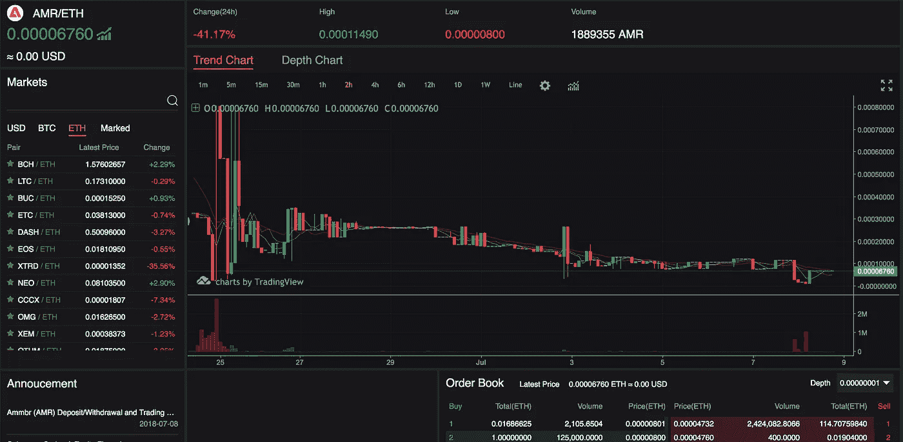

# ambr(AMR)漏洞检查

> 原文：<https://medium.com/coinmonks/an-inspection-on-ammbr-amr-bug-a53b4050d52?source=collection_archive---------9----------------------->

2018 年 7 月 8 日，疾速追杀安全实验室披露了 [AMMBR(AMR)](https://ammbr.com/) 合约中的高风险交易。它包含一个整数溢出漏洞，黑客可以通过调用 batchTransfer()来利用该漏洞，从而无限制地传输令牌。

SECBIT 团队审查源代码后发现，该问题与之前的 [BEC 令牌问题](https://blog.csdn.net/Secbit/article/details/80045167)[【1】](#f895)并行。`multiTransfer()`中一个名为`totalTokensToTransfer`的变量代表转出的代币总数，它是通过对所有`tokens[i]`求和计算出来的，契约检查余额是否超过`totalTokensToTransfer`。

multiTransfer function

乍看起来，这个功能在检查`msg.sender`的余额时似乎没问题。然而，`tokens[i]`的总和可能太大而导致`totalTokensToTransfer`中的溢出。如果这个值溢出到一个比`balances[msg.sender]`小的值，黑客可以绕过检查，转移出比余额更多的令牌。

AMR 是几天前部署的，有近 300 笔在线交易。最近一次转移发生在 7 月 8 日。

Transactions

这种象征性合约已经在一些交易所推出，并且仍然有效。

AMR on exchange

该问题已在由 [SECBIT 和合作伙伴](/loopring-protocol/token-contract-risk-list-a-joint-open-source-project-by-loopring-secbit-85df8fff55e1)[【3】](#7905)维护的[带有受影响令牌的 ERC20 智能合约中的漏洞集合中进行了索引。我们会不断更新有问题的代币合同信息。](https://github.com/sec-bit/awesome-buggy-erc20-tokens)

SECBIT 团队警告，开发团队和交易所应立即采取措施进行修补，令牌持有者也应保持警惕。部署令牌合约时，请在审查、测试和评估代码时格外小心。如果需要，寻求专业审计团队的帮助，以消除[推进](#f895)中的风险。

# 参考

[1]在 BeautyChain(BEC)的智能合同中发现一个灾难性漏洞[https://medium . com/sec bit-media/A-disastery-Vulnerability-Found-in-Smart-Contracts-of-beauty chain-bec-DBF 24 ddbc 30 e](/secbit-media/a-disastrous-vulnerability-found-in-smart-contracts-of-beautychain-bec-dbf24ddbc30e)

[2]受影响令牌的 ERC20 智能合约中的一系列漏洞【https://github.com/sec-bit/awesome-buggy-erc20-tokens

[3] Token 合约风险清单——loop ring & sec bit[联合开源项目 https://medium . com/loop ring-protocol/Token-Contract-Risk-List-A-Joint-Open-Source-Project-By loop ring-sec bit-85 df 8 fff 55 e 1](/loopring-protocol/token-contract-risk-list-a-joint-open-source-project-by-loopring-secbit-85df8fff55e1)

以上所有数据来自 SECBIT，如有兴趣请发邮件至 [info@secbit.io](mailto:info@secbit.io) 。

[***sec bit***](https://secbit.io)*由一群加密货币爱好者创立。我们正在研究智能合同安全、智能合同形式验证、加密协议、编译、合同分析、博弈论和加密经济学。*