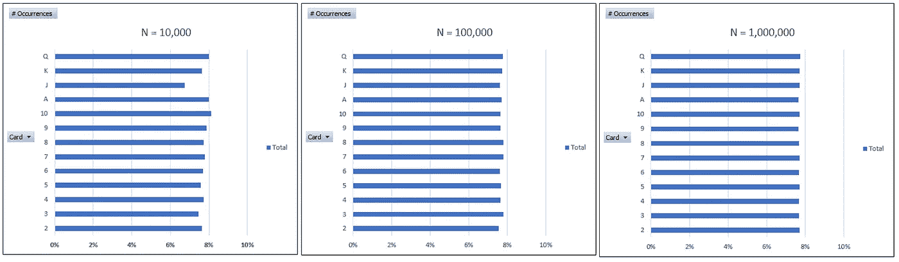
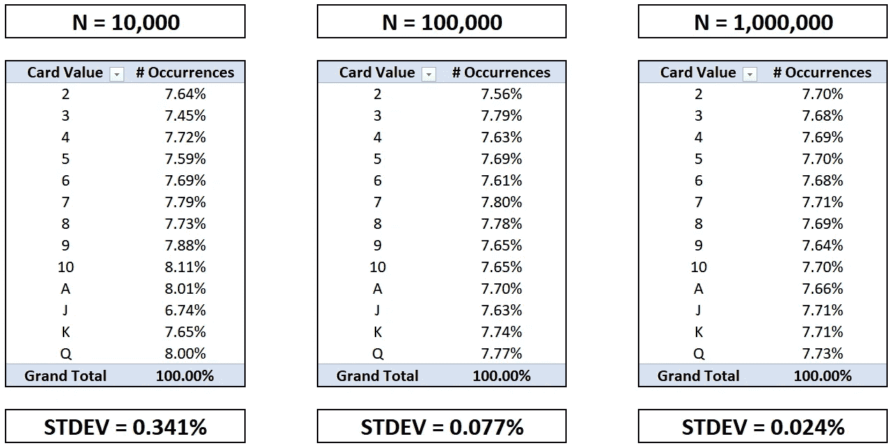

# 区块链介绍:加密赌场和体育博彩

> 原文：<https://medium.com/coinmonks/an-intro-to-blockchain-crypto-casinos-sportsbooks-b1fa583c5527?source=collection_archive---------1----------------------->

# 介绍

除了“*人工智能”*之外，在主题演讲和筹款活动中听到的最常被滥用和最少被理解的术语必须是“ ***【区块链】*** *”。*

也许这是有充分理由的。这是一项引人注目的技术，具有广泛的应用，其中之一是部署文克莱沃斯双胞胎的*加密货币，如 ***比特币*** ，以及许多 21 岁的兰博基尼司机的名气。区块链也是一个特别微妙和复杂的概念，需要真正掌握，这正是我们在这次讨论中需要的。*

*你可能听说过甚至玩过“区块链体彩”或“比特币赌场”需要说明的是，这些不是接受加密货币作为转移资金方法的运营商，而是实际上建立在这种叫做区块链的东西上的运营商。附带说一句，他们倾向于接受比特币，有时也接受其他加密货币，但这是它们被命名的方式所附带的。*

*为了正确理解在 iGaming 世界中部署区块链的好处和局限性，我们需要确保正确理解区块链到底是什么，以及为什么它在众多不同的行业中被如此频繁地谈论。最终，区块链只不过是一种存储数据的好方法，但我们会努力做得更好。*

****警告:前方过度简化****

# *区块链基础知识*

*通常，当人们说起区块链时，我们会听到他们提到一个**不变的账本。通过分解这个术语并使用几个例子，我们对这项技术的运作方式有了如此多的了解，这令人难以置信。***

*   *****分布式***——同时存储在多个地方**
*   *****不可变—*** 无法更改**
*   *****分类账—*** 对事件的记录，通常具有财务性质**

**因此，这些人所说的是，区块链是一种获取(数字)记录的方式，然后在不同的位置存储它的多个副本，因此即使成功地更改其中一个副本也不会损害我们的记录保存能力。**

**想象一下，你的电脑上保存了一张对你来说非常有价值的照片。如果你想绝对确定你总是可以访问它，你可以考虑在外部硬盘上备份它，或者上传到 Dropbox 或 Google Drive。如果你非常担心图像丢失，你可以选择在你的手机上保存一份拷贝，并通过电子邮件发送给你的朋友，这样他们也可以在自己的手机上保存一份拷贝。**

**如果照片被盗，你可能不仅会难过，而且如果它被以任何方式改变，以至于它不再是同一个图像。如果你真的有妄想症，你可能会选择将图像的副本保存到一个 USB 驱动器，并将其存储在一个保险箱中。如果你是一名为美国中央情报局工作的双重间谍，担心一名老练的民族国家演员会试图侵入你的电脑，在你认出他们之前，用数字技术将他们训练有素的狙击手的脸从图像背景中删除，你可能会选择在数百个不同的 USB 驱动器上保存副本，并将它们分散在世界各地的保险箱中。**

**您正在存储的信息的 ***分散化*** 正是存储信息的安全性来源。换句话说，不存在可以危及信息安全的单一攻击点，因此黑客需要付出巨大而协调的努力才能成功修改所有照片。如果他们只改变一个，甚至几个，大多数将保持原始图像和狙击手的脸完好无损。**

**或许用一个过于简单的比喻来说，区块链实际上是这一过程的数字表现和实现。**

# **信任和公平的作用**

**任何曾经在网上赌场玩过的人，尤其是以不受监管的方式经营的赌场，可能都熟悉这样一种潜在的怀疑，即他们正被以数字方式发放旨在使其总损失最大化的确切纸牌序列。也许你在网上玩过 21 点，在 11 对 4 的情况下下了双倍的注，结果庄家只出了 6 张 21。**

**如果我们怀疑某个特定的在线赌场存在这种欺诈行为，我们可能会要求查看他们保存的数字记录，以反映所发纸牌的历史。由于一副标准牌包含 13 种牌值(2、3、4、5、6、7、8、9、10、J、Q、K、A)中的每一种牌值，因此可以预期在任何足够大的样本量上分发的牌的分布是均匀的。换句话说，在玩了足够多的 21 点手牌后发出的牌中，1/13 (~7.69%)应该是杰克，另外~7.69%应该是皇后，以此类推。**

**通过运行一个简单的模拟，我们可以看到大数定律的效果，我们处理 10，000 张牌并计算频率分布，然后对 100，000 张和 1，000，000 张牌进行同样的处理。**

****

**乍一看，当绘制我们的结果时，似乎增加样本量实际上是增加了结果的可变性。然而，这只是因为每个图表中的 x 轴都被故意操纵成这样，试图促使人们更仔细地查看呈现给他们的统计数据。**

**当我们在每个图表的轴上使用适当的缩放比例时，我们可以看到我们预期的趋势…**

****

**…在大约 7.69%的标记处叠加一条红色虚线进一步说明了这一点…**

****

**…以表格形式查看数据并比较标准偏差也是如此…**

****

**为此，如果您要审核您怀疑有不法行为的在线赌场交易的历史 21 点牌局，并发现在足够长的时间内，国王和 a 的出现频率仅为 2.00%，您现在将有一个更强有力的理由来反对他们。当然，还有更复杂但可识别的不均衡类型可以用基本的统计方法来揭示。**

**但是，如果审计显示的结果与预期的分布完全一致，那么您可能会想，这个在线赌场，唯一有权访问这些数据并能够验证其有效性的一方，是否可能在提交审计之前，追溯性地更改了显示发牌的分类帐。**

**尤其是在与在不受监管的市场中运营的外国实体打交道时，信任可能是一个重大问题。我们可以很快意识到信任是生活过程中最重要的一个方面，尤其是那些由公司提供的。**

## **信任在传统银行业中的作用**

**当你把 100 美元存入你的大通支票账户时，你可以立即查看你的余额，发现它实际上比以前多了 100 美元。但是，*怎么知道*第二天余额还会在这个水平呢？难道不会有人黑进大通的服务器，把 10 美元转到他们自己的账户上，然后修改记录，让你的新余额只增加 90 美元吗？毕竟，除了数字分类账中的一个条目，在反映其他账户余额的许多其他条目中，你的支票账户余额是多少？如果拥有如此黑客技能和倾向的人有时间和动机，他们可以将 10 美元的差异分散到你所有的历史交易中，使其很难追踪，更不用说证明了。**

**你通常不担心这个的真正原因源于*的信任*。你可以相信大通已经:**

*   **强大的网络安全协议和充足的资源专门用于保护客户资金**
*   **联邦存款保险公司(FDIC)的一份保单，为您的余额投保高达 250，000 美元的盗窃险**
*   **遵守银行法规、遵守法律并为客户提供安慰的经济激励，以便他们能够留住这些客户并继续获得新业务**

**在缺乏这种信任的情况下，通过在不同的位置分发记录的副本来使分类账或数字记录变得不可改变的区块链机制是非常有价值的。**

## **交易对手风险**

**然而，当我们把自己的血汗钱交给他人保管时，还有另一种类型的风险值得我们关注。当我们需要提取资金时，我们如何知道交易另一方的个人或实体将是可操作的和有财务偿付能力的？在投资领域， ***交易对手风险*** 代表交易对手违约的可能性。**

**假设您对一个 10 年内不会解决的事件下了赌注(例如，“纽约喷气机队—超过 1.5 个超级碗冠军—接下来的 10 个赛季”)。你一开始就不得不冒险存入你的金额。鉴于喷气机队只赢得过一次超级碗(半个世纪前)，并且似乎有浪费他们遇到的每一点天赋和机会的诀窍，这可能是一个长期赌注，也许支付的赔率远远超过+10000 (100:1)。在+10000 的赔率下，25 美元的赌注将赢得 2500 美元。然而，这笔款项在未来 10 年内不会支付。如果与此同时，其他客户在博彩上取得了令人难以置信的成功，体育博彩被禁止，或者像全球流感一样的疫情关闭了经济，那么您下注的运营商，您的 ***交易对手*** 可能会在您的赌注评分时破产，使您无法在您获胜的情况下收取您应得的资金。**

**我们可以想象，押注于 2024 年 11 月 14 日之前在月球上建立 10 人基地的赌客可能已经有类似的担忧了…**

****

**Source: [Pinnacle](https://www.pinnacle.com/en/entertainment/space/matchups)**

**…就像那些在 2025 年 1 月 1 日之前地球是平的这一命题上下注近 50，000 美元来赢得 100 美元的人一样…**

****

**Source: [Pinnacle](https://www.pinnacle.com/en/entertainment/space/matchups)**

**但是，我们跑题了…**

**在一个充满随机不确定性的未来，更不用说糟糕的决策，我们怎么能相信一家体育博彩公司仍然愿意并有能力支付我们的奖金呢？在任何金融交易中，当交易悬而未决时，我们如何保护我们的资金？**

**任何曾经购买过房子的人都可能熟悉 ***托管*** 的概念，在这种情况下，买家的资金被置于第三方的托管之下，直到满足特定条件。**

**这一概念已经被易贝和 StubHub 这样的网站现代化和改造，以加强在他们平台上发生的交易的完整性。例如，在易贝，买家的资金通常被保存在一个名副其实的数字托管账户中，直到卖家上传的跟踪号码被标记为“已交付”，才会(通过 PayPal)发放给卖家**

****

**在 StubHub 上，买家的资金通常不会发放给卖家(也是通过 PayPal)，直到卖家上传了一个包含所售门票的. pdf 文件。当通过 Ticketmaster 购买原始门票时，通常会有一个与易贝用户流类似的验证过程。**

**毫无疑问，这些都是很棒的特性，但仍然不是最理想的。例如，可以通过简单地上传包含无价值物品的包裹的跟踪号来绕过易贝系统，该包裹被递送到中标者的地址。**

**StubHub 系统可以通过向买家发送门票，然后打印这些相同的门票(具有相同的条形码)并在买家到达之前输入事件来颠覆。此外，在这两种情况下，第三方(在这种情况下，贝宝)需要在生态系统中发挥作用。情况几乎总是如此，尤其是支付处理通常是外包或白标功能。**

## **确保支付长期赌注**

**我们如何利用这个概念来确保我们十年后在纽约喷气机队超级碗比赛中获得报酬？如果我们的交易对手必须将他们的资金放入一个数字托管账户，该账户将在他们自己解散后继续存在，我们就不必担心破产。但是，我们仍然担心获得资金。想象一下，如果我们采用数字托管工具，并在预定义事件发生前自动将资金转移到各方的机制上。从视觉上看，我们的自动执行的数字托管交易机制可能如下所示:**

****

**让我们梳理一下这里发生了什么:**

*   **鲍勃想赌 25 美元，赌纽约喷气机队在未来 10 个赛季赢得 1.5 个以上的超级碗。他会把那 25 美元存入一个数字托管账户。**
*   **鲍勃的对手 DraftKings 提出了+10000 的赔率，这意味着如果喷气机队从现在到 2030 赛季奇迹般地赢得 2 场或更多超级碗，鲍勃将赢得 2500.00 美元。DraftKings 会将 2，500.00 美元存入数字托管帐户，这样 Bob 就可以确定，如果他赢得了赌注，这笔资金将是可用的。**
*   **添加了一小段代码，指示帐户在合同到期后，根据喷气机队在此期间赢得的超级碗比赛次数，将资金转移到 Bob 或 DraftKings。**

**幸运的是，我们不必从头开始创建这种自动执行的数字托管交易机制，因为它已经存在，并被称为 ***智能合约*** 。**

## **智能合同**

**当然，上面的“代码”过于简单，几乎不能作为伪代码。此外，它没有提到用来核实潜在事件结果的信息来源。像超级碗这样的大型活动通常会被报道有相同的确切结果，不管我们引用什么来源。**

**然而，在能见度较低的情况下玩的游戏可能更难核实，特别是当寻求的细节变得越来越细时。在当前的全球疫情中，许多人一直在赌白俄罗斯的曲棍球和尼加拉瓜的足球，通常依赖于带有延迟记分牌的外国网站来跟踪比赛的进展，并确保赌注得到适当的评级。甚至美国许多最大的体育媒体有时，至少是暂时地，报道不正确的分数。事实上，一名 Reddit 用户最近显示，他能够通过使用 Twitter 发布虚假的比赛实况和截断的比分，操纵 NCAA 篮球赛上半场比分的报道。**

**当计算机将自动执行影响人类生活的指令时，重要的是这样做的内置逻辑不会导致意想不到的结果或被利用的机会。区块链世界的人们用“ ***代码就是法律*** ”这句话来描述这样一个事实:一旦启动，一个自动化的过程将不会屈服于除了它自己的编程之外的任何东西。**

**有一个经典的笑话意在传达这一点:**

> ***一个程序员去杂货店，他的妻子告诉他，“买一加仑牛奶，如果有鸡蛋，就买一打。”于是程序员去了，买了所有的东西，开车回他家。到达后，他的妻子生气地问他，“你为什么买了 13 加仑的牛奶？”程序员说，“有鸡蛋！”***

**这与我们的讨论相关，因为体育博彩中区块链的使用案例通常依赖于一个验证事件结果和解决争议的流程。**

**那些寻求在体育博彩领域部署智能合约的人正在考虑的一个选项是，使用一个基本的区块链概念，并在结果受到挑战的情况下，让用户社区投票。例如，如果你和我都是利用智能合约的点对点博彩交易所的参与者，并且我们对我们的赌注所基于的事件的结果有不同意见，则交易所的其他用户可以被要求投票，多数人可以做出裁决。**

**在寻找用于争议仲裁的真相或“神谕”的来源时，可能会出现许多其他微妙的复杂情况，但数字托管结构的当前实现所提供的漏洞更容易被资源有限的不老练的行为者利用。**

# ****关于加密货币的一句话****

**所以，我们已经谈论区块链有一段时间了，但还没有触及 ***比特币*** 和 ***加密货币*** 的话题。**

**加密货币只是区块链可以实现的众多方式之一，比特币也只是存在的众多加密货币之一。**

**换句话说，区块链是支撑包括比特币在内的所有加密货币的结构。具体来说，它扮演分类账的角色，记录所有货币持有者的所有交易(以及余额)。比特币和区块链被认为是如此不可分割的原因之一是，区块链是由一个名叫中本聪的神秘人(或者一群人)发明的，专门用作比特币加密货币的公共交易账本。**

*****如果你对比特币和加密货币作为价值转移手段的可行性的深入讨论不感兴趣，请随意向下滚动到标题为“结束语”的部分*****

# **关于比特币的一句话**

**术语有时会令人困惑，特别是因为比特币加密货币(BTC)是建立在比特币区块链上的，就像以太坊加密货币(ETH)是建立在以太坊区块链上的一样。以太坊是比特币的第一个替代品，并通过支持智能合约和去中心化应用程序(DApps)而脱颖而出。大约有 3000 种其他加密货币在流通，尽管它们并不都有自己的专用区块链。例如，FunFair 是一个由以太坊智能合约支持的分散式游戏平台，它有自己的令牌(FUN)。截至本文撰写之时，流通中的所有加密货币的总市值约为 1750 亿美元。**

> **使用前缀*“crypto-”*是因为特定货币的网络内的交易被记录和验证的过程，并由此永久地印在分布式不可变分类账上，涉及从代码破解或**加密**领域借用的数学计算。**

## **货币的特征**

**关于加密货币是否真的是货币的替代品，一场有趣的辩论一直在持续。亚里士多德曾著名地概括了四个关键特征，为了让价值手段充当“货币”，所有这些特征都需要得到满足。**

1.  **耐用的——它必须经得起时间的考验。**
2.  ****便携式** —它必须易于移动，并且相对于其尺寸/重量而言，能够容纳大量的价值。**
3.  ****可分割的** —它应该很容易分解成更小的部分(并重新组装)，而不会破坏其基本特性。**
4.  ****内在价值** —它本身应该是有价值的，其价值完全独立于任何其他物体。**

**然而，这些标准是 2000 多年前制定的。今天的世界已经大不相同了，在某些方面，社会对货币体系的要求也发生了变化。**

**现代技术带来的流动性的增加使得像支票账户和支票簿这样的发明成为必要。开支票可以让银行客户将巨额金额直接从他们的账户转移到商家或供应商的账户，通常是为了换取商品或服务，而不必太担心盗窃和安全问题。由于一张支票的内在价值只相当于其印刷纸张的成本，因此丢失一张支票相对来说无关紧要。给银行打个电话，那张支票就会被取消，基本上不会造成任何损失。然而，只要一支笔，人们就可以用同一张支票将数百万美元转移到别处。**

**仔细想想，即使是通常被认为是最纯粹的“金钱”形式的现金，也没有多少内在价值。事实上，一张 100 美元的钞票只比一张 1 美元的钞票更值钱，因为每个拥有它的人都相信下一个人会像他们一样珍惜它。此外，大多数货币都有其发行国政府的“完全信任和信用”支持，这有助于增强人们对使用该货币转移价值的能力的信心。**

> **其作为法定货币的价值并非源于内在价值，而是源于政府的充分信任和信用的一组货币被称为法定货币。**

**根据圣路易斯联邦储备银行的说法，为了让一个系统被认为是今天的“货币”，实际上必须满足六个特征。我们很快注意到，前三个与亚里士多德提出的相同，其他三个取代了他对内在价值的要求。**

1.  ****耐用**——它必须经得起时间的考验。**
2.  ****便携**——它必须易于移动，并且相对于它的尺寸/重量来说，能够容纳大量的价值。**
3.  ****可分割的** —它应该很容易分解成更小的部分(并重新组装)，而不会破坏它的基本特性。**
4.  ****统一** —相同名称的单位在性质上应该大致相同，因此可以互换。**
5.  ****稀缺** —单位必须有有限的供应以保持价值。**
6.  ****可接受的** —单位必须被普遍接受为转移价值的工具。**

**比特币作为货币的理由似乎非常有说服力。2010 年 5 月 22 日，拉兹洛·汉耶茨(Laszlo Hanyecz)成功支付了 10000 个比特币，购买了两份外卖的棒约翰披萨。这一天后来被称为*比特币披萨日*。按照目前的价格，这两个披萨目前的价值为 6310 万美元。当比特币的价格在 2017 年 12 月 17 日达到最高点时，它们的价值为 1.978 亿美元。**

**我们可以快速让比特币通过圣路易斯联邦储备银行的所有六项测试:**

1.  ****持久**——比特币是价值的虚拟表示，不会被摧毁，尽管对它们的访问可能会丢失。**
2.  ****便携**——比特币几乎没有重量，可以在小到一张纸的东西上携带几乎无限的价值。**
3.  ****可分割的**——虽然一美元、欧元或英镑可以被分割成 100 个单位，但根据设计，一枚比特币可以被分割成一亿(100，000，000)个单位。**
4.  **统一——比特币是完全统一的，尽管关于它的可替代性还有争议。**
5.  ****稀缺** —比特币使用数学方法将总供应量限制在 2100 万枚(目前约有 1800 万枚 BTC 在流通)**
6.  ****可接受的** —交易所、用户友好的移动应用、比特币自动取款机和其他技术现象的兴起，以及社会政治因素，使得比特币成为世界上最被接受的货币之一。**

**对美元或黄金进行类似的练习可能会揭示一些关于加密货币作为货币真正替代品的辩论的观点。**

**加密现象经常被描绘成非法活动和黑暗网络交易的同义词或平行词。然而，底层技术基础设施本身并不违法或邪恶。事实上，一些政府和央行已经开始讨论在日常操作中操作区块链和加密货币的可能性。**

**下图显示了中央银行加密货币如何成为由垄断实体提供的价值的分散虚拟表示，以及与其他形式的价值交换相比如何。**

****

**Source: [St. Louis Fed](https://research.stlouisfed.org/publications/review/2018/02/13/the-case-for-central-bank-electronic-money-and-the-non-case-for-central-bank-cryptocurrencies)**

## ****加密货币现实****

**加密货币可以提供匿名等功能，这有好有坏，有时两者兼而有之。也就是说，存储密码财富的数字钱包的安全性取决于那些持有访问它们所需密钥的人。**

**在不涉及不必要的技术的情况下，维护比特币钱包安全的最重要方面通常涉及我们如何保护我们的密码。账户本身通常被认为是无法破解的，除非有人获得了我们的“私钥”正因为如此，人们不遗余力地以安全的方式存储密码。不仅如此，他们还经常使用尽可能多种字符的超长密码。据报道，有些人甚至把密码写在一张纸上，把它剪成许多小块，然后把每一块放进不同州不同银行的保险箱里。**

**尽管如此，据估计，由于密码或私钥放错地方，20%的比特币价值将永久丢失。截至本文撰写之时，比特币的价值将超过 200 亿美元。其原因与比特币钱包的潜在安全性直接相关——没有密码，几乎不可能访问。**

> **人们经常使用短语“*”来描述在从未连接到互联网的设备上保存私钥的过程，以便最大限度地防止恶意行为者。***

***生态系统的这个方面引发了许多有趣的故事，其中加密基金或交易所的所有者神秘失踪，以及所有管理下的资产，再也没有人看到或听到过他们的消息。***

# *****关闭思路*****

***我们在讨论开始时指出，区块链赌场或体育博彩不仅仅接受加密货币存款。相反，它实际上是建立在区块链之上的。现在我们已经介绍了一些关键概念，我们可以了解市场上有哪些应用，以及可能存在哪些限制。具体来说，我们可以首先检查与 ***可证明公平性*** 相关的内容，然后检查与 ***智能合约*** 相关的内容。***

## ***可证明的公平性***

***在线赌场非常适合雇佣区块链来帮助顾客确信游戏没有被操纵。事实上，有些人已经这样做了。***

***传统的体育博彩并没有明显受益于可证明的公平性的概念。然而，运营商生态系统中的 DFS 竞赛和抽奖功能可能会。***

## ***智能合同***

***从增值的角度来看，在网上赌场使用智能合约对用户来说很有吸引力。然而，这些操作可能是资本密集型的。我们可以举轮盘赌旋转的例子来说明这一点。***

******

***在上面的轮盘赌桌上，我们看到各种 1 美元、5 美元和 10 美元的赌注被放在桌上。假设每一个单独的芯片都是由不同的客户根据以下支付方式放置的:***

*   ***红色/黑色— 1:1***
*   ***奇数/偶数— 1:1***
*   ***列— 2:1***
*   ***第三，2:1***
*   ***四向角— 9:1***
*   ***双向分离— 18:1***
*   ***单个数字— 36:1***

***我们可以看到总共有以下每种筹码面额…***

*   ***蓝色(1 美元)— 10 英镑***
*   ***黄色(5 美元)— 14***
*   ***灰色(10 美元)— 12***

***…也就是说，总共有 200 美元被赌上了。***

***假设*黑-2* 上来。收益会是多少？***

*   ***数字 2 上的黄色 5 美元筹码将支付 36:1——180 美元***
*   ***黑方的五个蓝筹股将支付 1:1 到 5 美元***

***总共需要支付 185 美元。幸运的是，桌上只有价值 10 美元的筹码与赢得赌注有关，这意味着赌场实际上有 190 美元可以用来支付赢得的 185 美元，剩下 5 美元的利润。***

***然而，想象一下，我们希望对每一笔下注都使用全额资助、数字托管的智能合约。在特定号码上每下 10 美元的赌注将需要代表操作者存入 360 美元。事实上，我们上面使用的假设的芯片布局，需要 0 美元的额外现金才能以传统的方式运作，将需要一笔巨大的**2716**美元存款到各种智能合约中，仅仅是为了获得同样的 5 美元利润。***

*   ***36:1 = 1，368 美元***
*   ***18:1 = 918 美元时的 51 美元拆分***
*   ***9:1 = 325 美元的拐角处 36 美元***
*   ***三分之一时 25 美元@ 2:1 = 50 美元***
*   ***在 2:1 = 10 的列上$5***
*   ***35 美元红/黑@ 1:1 = 35 美元***
*   ***奇数时 10 美元@ 1:1 = 10 美元***

***固定赔率的体育博彩也是如此。你可以在这里阅读更多关于博彩经济学[的内容，但你可能还记得，这些经营者通过激励给定市场的任何一方下注的风险最小化比例来赚钱，因此利润尽可能接近保证。](/@lloyddanzig/bookmaking-economics-8710d25a42a5)***

******

***在上面的例子中，体彩不需要额外的现金来处理赌注。这是因为，无论比赛结果如何，都有足够的损失来支付获胜者应得的报酬。***

***相反，如果运营商试图以我们描述的方式使用智能合约，他们需要支付 290 美元，所有这些都可能有 0 美元的利润。这将是在 Alice 赢的情况下存入智能合同的$190，以及在 Bob 赢的情况下存入智能合同的$100。***

***然而，对于点对点(P2P)博彩交易所和平台来说，智能合约非常有用。这是因为投注者已经提供了所有的现金，并相互交易。任何资本要求都会降临到用户身上，而不是运营商身上，运营商只是寻求流动性和交易量的最大化。在 P2P 环境下，智能合约允许有保证的即时支付，这可能是与不提供此类功能的运营商的主要区别点。***

## ***结论***

***区块链是一种快速新兴的技术，在各行各业都有广泛的应用，其中只有一项是加密货币的部署。区块链提供增强的安全性和更快的支付处理，以及透明度和去中心化，所有这些都可以增加在线游戏行业的价值。重要的是，在决定某项技术对任何特定的风险投资是否有意义时，不仅要了解它的优势，还要了解它的局限性。***

> ***[在您的收件箱中直接获得最佳软件交易](https://coincodecap.com/?utm_source=coinmonks)***

******