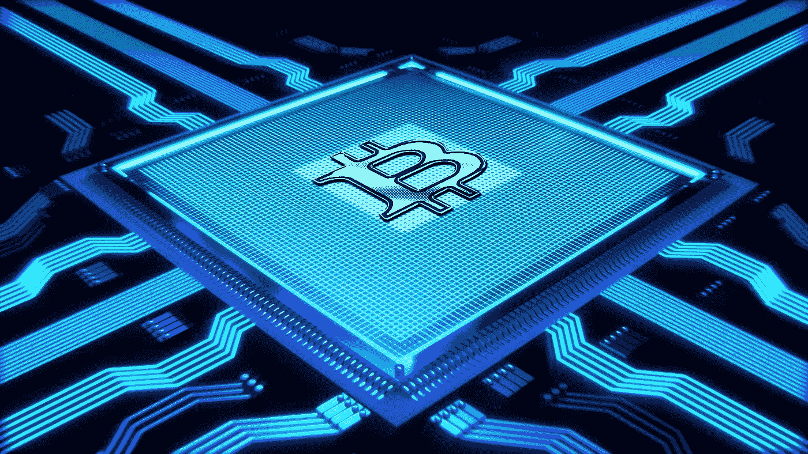

# 比特币主根介绍指南

> 原文：<https://medium.com/coinmonks/an-introduction-guide-on-bitcoin-taproot-7a8e0f06af8e?source=collection_archive---------2----------------------->

## 在分析了 Schnorr 数字签名的 BIP 之后，是时候更好地理解 BIP 主根是如何工作的，以及为什么它对比特币的隐私如此感兴趣了

经过多年的等待和多次测试，比特币协议的决定性**更新终于到来，这…**